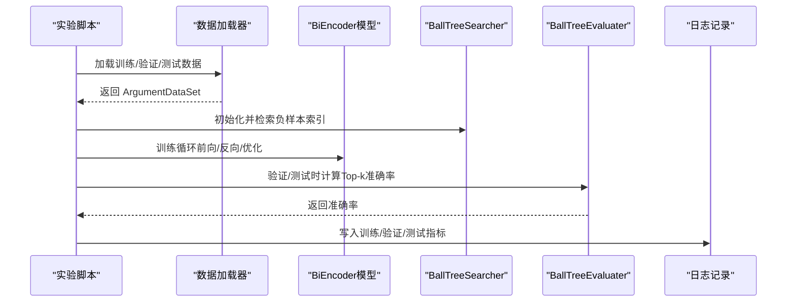
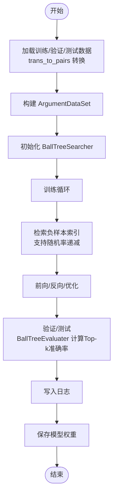
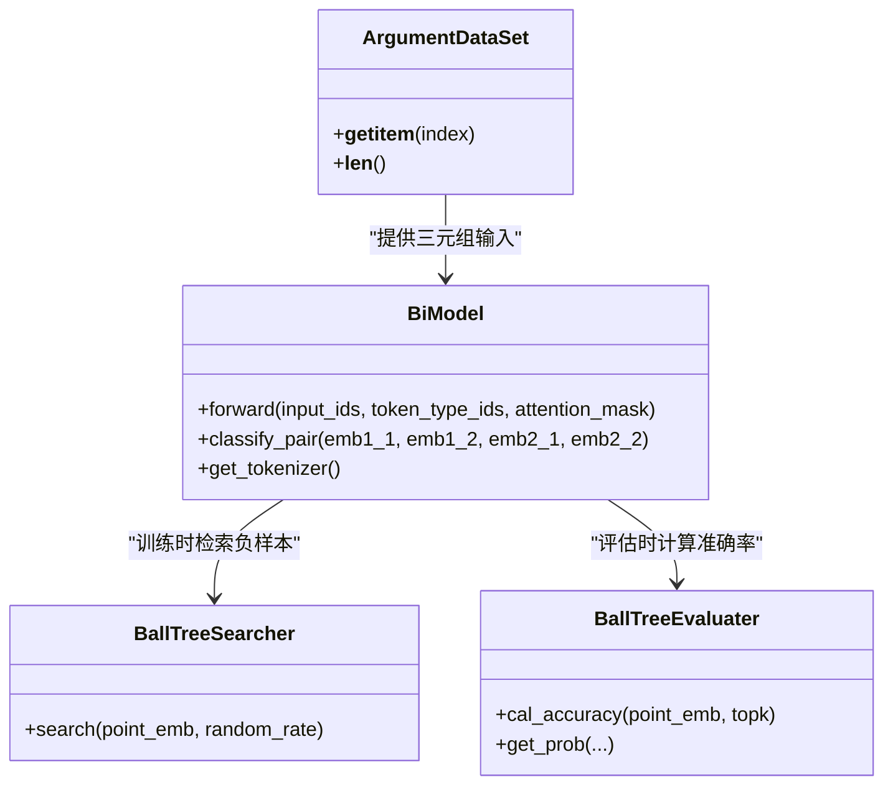
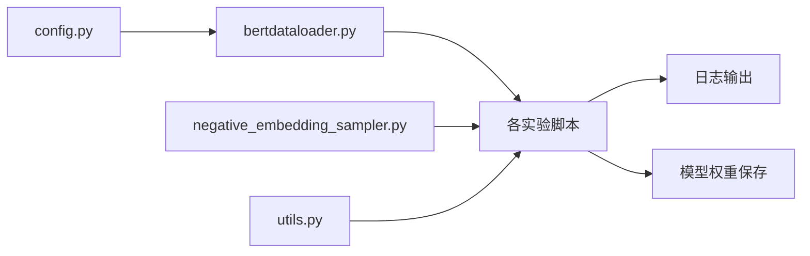

# 实验目录结构

<cite>
**本文引用的文件**
- [bert/biencoder_firststage_experiment/biencoder_embedding_classification_concanated_together_random.py](file://bert/biencoder_firststage_experiment/biencoder_embedding_classification_concanated_together_random.py)
- [bert/biencoder_second_stage_experiment/biencoder_embedding_classification_with_layernorm.py](file://bert/biencoder_second_stage_experiment/biencoder_embedding_classification_with_layernorm.py)
- [bert/biencoder/biencoder_embedding_classification_concanated_together.py](file://bert/biencoder/biencoder_embedding_classification_concanated_together.py)
- [bert/model_structure_with_different_decreased_random_rate/biencoder_embedding_classification_decreased_0.01.py](file://bert/model_structure_with_different_decreased_random_rate/biencoder_embedding_classification_decreased_0.01.py)
- [bert/model_structure_with_different_decreased_random_rate_2/biencoder_embedding_classification_decreased_0.01.py](file://bert/model_structure_with_different_decreased_random_rate_2/biencoder_embedding_classification_decreased_0.01.py)
- [bert/model_structure_with_different_norm_activation/biencoder_embedding_classification_concanated_together.py](file://bert/model_structure_with_different_norm_activation/biencoder_embedding_classification_concanated_together.py)
- [bert/model_structure_with_different_norm_activation/biencoder_embedding_classification_only_cls.py](file://bert/model_structure_with_different_norm_activation/biencoder_embedding_classification_only_cls.py)
- [bert/model_structure_with_different_norm_activation/biencoder_embedding_classification_only_embedding.py](file://bert/model_structure_with_different_norm_activation/biencoder_embedding_classification_only_embedding.py)
- [bert/bertdataloader.py](file://bert/bertdataloader.py)
- [bert/negative_embedding_sampler.py](file://bert/negative_embedding_sampler.py)
- [config.py](file://config.py)
- [utils.py](file://utils.py)
</cite>

## 目录
1. [引言](#引言)
2. [项目结构](#项目结构)
3. [核心组件](#核心组件)
4. [架构总览](#架构总览)
5. [详细组件分析](#详细组件分析)
6. [依赖关系分析](#依赖关系分析)
7. [性能考量](#性能考量)
8. [故障排查指南](#故障排查指南)
9. [结论](#结论)
10. [附录](#附录)

## 引言
本文件系统性解析项目中的实验目录组织逻辑，重点说明两阶段训练流程（first stage 与 second stage）如何通过独立脚本实现，并以“文件系统即实验管理”的方式组织消融实验（model_structure_* 系列）。我们将从架构、数据流、处理逻辑、集成点、错误处理与性能特性等维度展开，帮助读者快速理解并复现实验。

## 项目结构
项目采用“按功能与阶段划分”的目录组织方式：
- 基础模型实现位于 bert/biencoder/
- 两阶段训练实验分别位于 bert/biencoder_firststage_experiment/ 与 bert/biencoder_second_stage_experiment/
- 消融实验以 model_structure_* 系列目录组织，按变量隔离拆分不同配置
- 数据加载与采样在 bert/ 下的 bertdataloader.py 与 negative_embedding_sampler.py 中实现
- 全局路径配置在 config.py 中集中定义

```mermaid
graph TB
subgraph "第一阶段实验"
F1["concatenated_together_random.py"]
F2["concatenated_together_without_random.py"]
F3["only_cls_random.py"]
F4["only_cls_without_random.py"]
F5["only_embedding_random.py"]
F6["only_embedding_without_random.py"]
end
subgraph "第二阶段实验"
S1["with_layernorm.py"]
S2["with_layernorm_relu.py"]
S3["with_relu.py"]
S4["without_layernorm.py"]
S5["without_relu.py"]
end
subgraph "基础模型"
B1["biencoder_embedding_classification_concanated_together.py"]
end
subgraph "消融实验"
M1["different_decreased_random_rate/*"]
M2["different_norm_activation/*"]
M3["different_decreased_random_rate_2/*"]
M4["different_decreased_random_rate_2_concatenated_together/*"]
M5["different_decreased_random_rate_2_only_cls/*"]
end
F1 --> B1
F2 --> B1
S1 --> B1
S2 --> B1
M1 --> B1
M2 --> B1
M3 --> B1
M4 --> B1
M5 --> B1
```

图表来源
- [bert/biencoder_firststage_experiment/biencoder_embedding_classification_concanated_together_random.py](file://bert/biencoder_firststage_experiment/biencoder_embedding_classification_concanated_together_random.py#L1-L285)
- [bert/biencoder_second_stage_experiment/biencoder_embedding_classification_with_layernorm.py](file://bert/biencoder_second_stage_experiment/biencoder_embedding_classification_with_layernorm.py#L1-L280)
- [bert/biencoder/biencoder_embedding_classification_concanated_together.py](file://bert/biencoder/biencoder_embedding_classification_concanated_together.py#L1-L280)
- [bert/model_structure_with_different_decreased_random_rate/biencoder_embedding_classification_decreased_0.01.py](file://bert/model_structure_with_different_decreased_random_rate/biencoder_embedding_classification_decreased_0.01.py#L1-L284)
- [bert/model_structure_with_different_norm_activation/biencoder_embedding_classification_concanated_together.py](file://bert/model_structure_with_different_norm_activation/biencoder_embedding_classification_concanated_together.py#L1-L284)

章节来源
- [bert/bertdataloader.py](file://bert/bertdataloader.py#L1-L44)
- [bert/negative_embedding_sampler.py](file://bert/negative_embedding_sampler.py#L1-L92)
- [config.py](file://config.py#L1-L11)

## 核心组件
- 数据加载与配对
  - trans_to_pairs 将按领域/标题/立场/轮次聚合的数据转换为“点-反方”配对
  - ArgumentDataSet 提供三元组（点文本、反方文本、负文本）的 Dataset 接口
- 负样本检索与评估
  - BallTreeSearcher 基于球树检索负样本索引，支持按比例随机替换策略
  - BallTreeEvaluater 使用训练好的分类器计算 Top-k 准确率
- 训练与日志
  - 各实验脚本内含完整的训练循环、损失函数组合、GPU 并行与权重保存
  - 日志统一通过 utils.logger 写入文件

章节来源
- [bert/bertdataloader.py](file://bert/bertdataloader.py#L1-L44)
- [bert/negative_embedding_sampler.py](file://bert/negative_embedding_sampler.py#L1-L92)
- [utils.py](file://utils.py#L297-L304)

## 架构总览
两阶段训练流程通过“文件系统即实验管理”的方式实现：
- 第一阶段：固定合并策略（concatenated_together），探索不同随机负样本比例与是否使用随机替换
- 第二阶段：在第一阶段基础上，调整归一化/激活等结构元素，观察其对分类性能的影响
- 消融实验：以 model_structure_* 系列目录按变量隔离，独立运行，便于对比与复现

图表来源
- [bert/biencoder_firststage_experiment/biencoder_embedding_classification_concanated_together_random.py](file://bert/biencoder_firststage_experiment/biencoder_embedding_classification_concanated_together_random.py#L1-L285)
- [bert/biencoder_second_stage_experiment/biencoder_embedding_classification_with_layernorm.py](file://bert/biencoder_second_stage_experiment/biencoder_embedding_classification_with_layernorm.py#L1-L280)
- [bert/bertdataloader.py](file://bert/bertdataloader.py#L1-L44)
- [bert/negative_embedding_sampler.py](file://bert/negative_embedding_sampler.py#L1-L92)
- [utils.py](file://utils.py#L297-L304)

## 详细组件分析

### 两阶段训练流程
- 第一阶段（biencoder_firststage_experiment）
  - 目标：在固定合并策略下，探索不同随机负样本比例与是否使用随机替换
  - 关键差异：通过 BallTreeSearcher 的 random_rate 参数动态调整负样本选择比例；部分脚本在训练后半段逐步降低该比例
  - 示例脚本路径
    - [第一阶段-拼接+随机负样本](file://bert/biencoder_firststage_experiment/biencoder_embedding_classification_concanated_together_random.py#L1-L285)
    - [第一阶段-拼接+无随机负样本](file://bert/biencoder_firststage_experiment/biencoder_embedding_classification_concanated_together_without_random.py#L1-L285)
    - [第一阶段-仅CLS+随机负样本](file://bert/biencoder_firststage_experiment/biencoder_embedding_classification_only_cls_random.py#L1-L285)
    - [第一阶段-仅Embedding+随机负样本](file://bert/biencoder_firststage_experiment/biencoder_embedding_classification_only_embedding_random.py#L1-L285)

- 第二阶段（biencoder_second_stage_experiment）
  - 目标：在第一阶段基础上，调整归一化/激活等结构元素，观察其对分类性能的影响
  - 关键差异：在 BiModel 的合并层前后增加 LayerNorm/ReLU 等结构变化
  - 示例脚本路径
    - [第二阶段-带LayerNorm](file://bert/biencoder_second_stage_experiment/biencoder_embedding_classification_with_layernorm.py#L1-L280)
    - [第二阶段-带LayerNorm+ReLU](file://bert/biencoder_second_stage_experiment/biencoder_embedding_classification_with_layernorm_relu.py#L1-L280)
    - [第二阶段-带ReLU](file://bert/biencoder_second_stage_experiment/biencoder_embedding_classification_with_relu.py#L1-L280)

- 基础模型参考
  - [基础拼接模型](file://bert/biencoder/biencoder_embedding_classification_concanated_together.py#L1-L280)

章节来源
- [bert/biencoder_firststage_experiment/biencoder_embedding_classification_concanated_together_random.py](file://bert/biencoder_firststage_experiment/biencoder_embedding_classification_concanated_together_random.py#L1-L285)
- [bert/biencoder_second_stage_experiment/biencoder_embedding_classification_with_layernorm.py](file://bert/biencoder_second_stage_experiment/biencoder_embedding_classification_with_layernorm.py#L1-L280)
- [bert/biencoder/biencoder_embedding_classification_concanated_together.py](file://bert/biencoder/biencoder_embedding_classification_concanated_together.py#L1-L280)

### 消融实验设计（model_structure_* 系列）
- 不同随机率递减（decreased_random_rate）
  - 通过在训练过程中逐步降低 random_rate，观察负样本选择策略对收敛与泛化的影响
  - 示例脚本路径
    - [递减0.01的随机率](file://bert/model_structure_with_different_decreased_random_rate/biencoder_embedding_classification_decreased_0.01.py#L1-L284)
    - [递减0.01的随机率（版本2）](file://bert/model_structure_with_different_decreased_random_rate_2/biencoder_embedding_classification_decreased_0.01.py#L1-L286)

- 不同归一化/激活（norm_activation）
  - 对比不同合并策略（拼接、仅CLS、仅Embedding）在不同归一化/激活设置下的表现
  - 示例脚本路径
    - [拼接+归一化/激活](file://bert/model_structure_with_different_norm_activation/biencoder_embedding_classification_concanated_together.py#L1-L284)
    - [仅CLS+归一化/激活](file://bert/model_structure_with_different_norm_activation/biencoder_embedding_classification_only_cls.py#L1-L285)
    - [仅Embedding+归一化/激活](file://bert/model_structure_with_different_norm_activation/biencoder_embedding_classification_only_embedding.py#L1-L284)

- 变量隔离原则
  - 每个脚本只改变一个或少数几个关键超参（如 random_rate、归一化/激活），其余保持一致，确保可比性与可复现性

章节来源
- [bert/model_structure_with_different_decreased_random_rate/biencoder_embedding_classification_decreased_0.01.py](file://bert/model_structure_with_different_decreased_random_rate/biencoder_embedding_classification_decreased_0.01.py#L1-L284)
- [bert/model_structure_with_different_decreased_random_rate_2/biencoder_embedding_classification_decreased_0.01.py](file://bert/model_structure_with_different_decreased_random_rate_2/biencoder_embedding_classification_decreased_0.01.py#L1-L286)
- [bert/model_structure_with_different_norm_activation/biencoder_embedding_classification_concanated_together.py](file://bert/model_structure_with_different_norm_activation/biencoder_embedding_classification_concanated_together.py#L1-L284)
- [bert/model_structure_with_different_norm_activation/biencoder_embedding_classification_only_cls.py](file://bert/model_structure_with_different_norm_activation/biencoder_embedding_classification_only_cls.py#L1-L285)
- [bert/model_structure_with_different_norm_activation/biencoder_embedding_classification_only_embedding.py](file://bert/model_structure_with_different_norm_activation/biencoder_embedding_classification_only_embedding.py#L1-L284)

### 数据加载与负样本采样流程
- 数据准备
  - trans_to_pairs 将原始对话数据转换为“点-反方”配对，形成三元组（点、反方、负文本）
  - ArgumentDataSet 提供标准 PyTorch Dataset 接口，支持 DataLoader 批量迭代
- 负样本采样
  - BallTreeSearcher 基于点/反方嵌入构建球树，按规则检索负样本索引；支持按比例随机替换
  - BallTreeEvaluater 在验证/测试阶段计算 Top-k 准确率，并通过 softmax 获取正样本概率

图表来源
- [bert/bertdataloader.py](file://bert/bertdataloader.py#L1-L44)
- [bert/negative_embedding_sampler.py](file://bert/negative_embedding_sampler.py#L1-L92)
- [utils.py](file://utils.py#L297-L304)

章节来源
- [bert/bertdataloader.py](file://bert/bertdataloader.py#L1-L44)
- [bert/negative_embedding_sampler.py](file://bert/negative_embedding_sampler.py#L1-L92)
- [utils.py](file://utils.py#L297-L304)

### 类与模块关系图

图表来源
- [bert/biencoder_firststage_experiment/biencoder_embedding_classification_concanated_together_random.py](file://bert/biencoder_firststage_experiment/biencoder_embedding_classification_concanated_together_random.py#L1-L285)
- [bert/negative_embedding_sampler.py](file://bert/negative_embedding_sampler.py#L1-L92)
- [bert/bertdataloader.py](file://bert/bertdataloader.py#L1-L44)

## 依赖关系分析
- 外部依赖
  - Transformers/BERT、PyTorch、BallTree（sklearn）、NumPy、Pandas、TQDM
- 内部依赖
  - config.py 提供训练/验证/测试数据路径
  - bertdataloader.py 定义数据转换与 Dataset
  - negative_embedding_sampler.py 提供负样本检索与评估
  - utils.py 提供日志写入与数据分组/切分工具

图表来源
- [config.py](file://config.py#L1-L11)
- [bert/bertdataloader.py](file://bert/bertdataloader.py#L1-L44)
- [bert/negative_embedding_sampler.py](file://bert/negative_embedding_sampler.py#L1-L92)
- [utils.py](file://utils.py#L297-L304)

章节来源
- [config.py](file://config.py#L1-L11)
- [bert/bertdataloader.py](file://bert/bertdataloader.py#L1-L44)
- [bert/negative_embedding_sampler.py](file://bert/negative_embedding_sampler.py#L1-L92)
- [utils.py](file://utils.py#L297-L304)

## 性能考量
- GPU 并行：多数脚本使用 DataParallel 在多 GPU 上并行训练，提升吞吐
- 负样本检索：BallTree 查询复杂度与嵌入维度、样本规模相关，建议合理设置 k 值与 leaf_size
- 训练稳定性：组合损失包含三元组损失与交叉熵，注意学习率与批次大小的平衡
- 评估效率：BallTreeEvaluater 在验证/测试阶段进行 Top-k 查询，建议缓存嵌入以减少重复计算

## 故障排查指南
- 数据路径问题
  - 确认 config.py 中 training_dir/validation_dir/test_dir 指向正确目录
  - 章节来源
    - [config.py](file://config.py#L1-L11)
- 负样本检索异常
  - 检查 trans_to_pairs 是否成功生成配对；确认 negative_text 列已填充
  - 章节来源
    - [bert/bertdataloader.py](file://bert/bertdataloader.py#L1-L44)
- 训练不收敛或震荡
  - 调整学习率、检查随机率递减策略是否过激
  - 章节来源
    - [bert/biencoder_firststage_experiment/biencoder_embedding_classification_concanated_together_random.py](file://bert/biencoder_firststage_experiment/biencoder_embedding_classification_concanated_together_random.py#L1-L285)
- 评估指标异常
  - 确认 BallTreeEvaluater 的合并层调用与 softmax 输出一致
  - 章节来源
    - [bert/negative_embedding_sampler.py](file://bert/negative_embedding_sampler.py#L1-L92)

## 结论
该实验体系通过“文件系统即实验管理”的方式，实现了高度透明且可复现的两阶段训练与消融实验。每个脚本聚焦单一变量或少数变量，配合独立的日志与权重保存，便于快速对比与追踪。尽管存在元数据缺失与结果追踪困难等挑战，但通过规范化的目录命名与版本控制策略，仍可有效提升实验可维护性与可扩展性。

## 附录
- 目录命名与版本控制最佳实践
  - 以语义清晰的前缀区分阶段与变量（如 firststage、second_stage、different_*、model_structure_*）
  - 在脚本文件名中显式标注关键超参（如 _decreased_0.01、_with_layernorm、_only_cls）
  - 为每次实验创建独立子目录，存放日志与权重，避免覆盖
  - 使用版本控制的分支或标签管理不同实验版本，保留提交信息与变更摘要
  - 统一日志格式与指标命名，便于后续批量统计与可视化