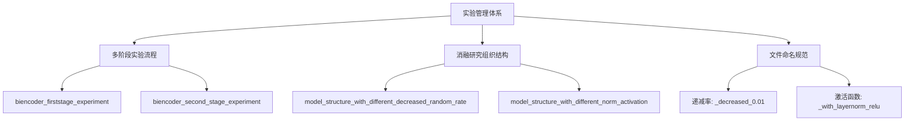
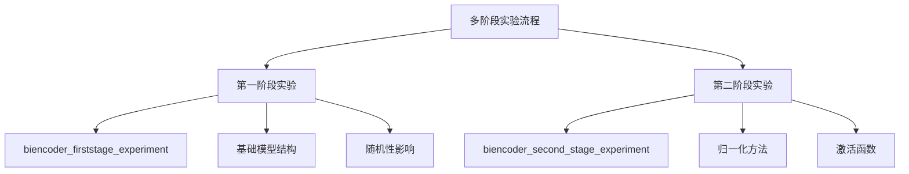
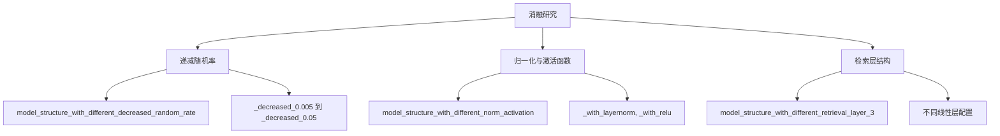

# 实验管理体系

<cite>
**本文档中引用的文件**   
- [README.md](file://README.md)
- [biencoder_embedding_classification_concanated_together_random.py](file://bert/biencoder_firststage_experiment/biencoder_embedding_classification_concanated_together_random.py)
- [biencoder_embedding_classification_with_layernorm_relu.py](file://bert/biencoder_second_stage_experiment/biencoder_embedding_classification_with_layernorm_relu.py)
- [biencoder_embedding_classification_decreased_0.01.py](file://bert/model_structure_with_different_decreased_random_rate/biencoder_embedding_classification_decreased_0.01.py)
- [biencoder_embedding_classification_concanated_together.py](file://bert/model_structure_with_different_norm_activation/biencoder_embedding_classification_concanated_together.py)
- [biencoder_embedding_classification_decreased_0.01.py](file://bert/model_structure_with_different_decreased_random_rate_2/biencoder_embedding_classification_decreased_0.01.py)
- [biencoder_embedding_classification_decreased_0.01.py](file://bert/model_structure_with_different_decreased_random_rate_2_concatenated_together/biencoder_embedding_classification_decreased_0.01.py)
- [biencoder_embedding_classification_decreased_0.01.py](file://bert/model_structure_with_different_decreased_random_rate_2_only_cls/biencoder_embedding_classification_decreased_0.01.py)
- [biencoder_embedding_classification_without_classification.py](file://bert/model_structure_just_retrieval_classication_fixed_bert_5/biencoder_embedding_classification_without_classification.py)
- [extract_accuracy.py](file://bert/logs/extract_accuracy.py)
- [config.py](file://config.py)
</cite>

## 目录
1. [引言](#引言)
2. [实验管理体系概览](#实验管理体系概览)
3. [多阶段实验流程](#多阶段实验流程)
4. [消融研究组织结构](#消融研究组织结构)
5. [文件命名规范解析](#文件命名规范解析)
6. [文件结构的优劣势分析](#文件结构的优劣势分析)
7. [最佳实践建议](#最佳实践建议)
8. [结论](#结论)

## 引言

本项目通过精心设计的文件命名和目录结构，实现了一套系统化的实验管理体系。该体系支持A/B测试和消融研究，通过扁平化的文件组织方式，使得实验的复现和管理变得简单直接。项目主要通过在`bert`目录下的多个子目录来组织不同类型的实验，每个子目录包含一组相关的实验文件。这些文件通过命名来编码实验的关键参数，如模型结构、激活函数、归一化方法等。这种设计使得研究人员可以快速识别和比较不同实验的配置，而无需深入代码细节。

**Section sources**
- [README.md](file://README.md)

## 实验管理体系概览

项目的实验管理体系主要由三个核心部分构成：多阶段实验流程、消融研究组织结构和文件命名规范。多阶段实验流程通过`biencoder_firststage_experiment`和`biencoder_second_stage_experiment`目录实现，支持分阶段的实验设计。消融研究通过一系列以`model_structure_with_`开头的目录组织，每个目录针对一个特定的变量进行系统性研究。文件命名规范则通过下划线分隔的后缀来编码实验的关键参数，如`_decreased_0.01`表示递减随机率为0.01，`_with_layernorm_relu`表示启用了LayerNorm和ReLU。这种扁平化的文件结构虽然缺乏元数据管理，但极大地简化了实验的复现过程。

**Diagram sources **
- [biencoder_firststage_experiment](file://bert/biencoder_firststage_experiment)
- [biencoder_second_stage_experiment](file://bert/biencoder_second_stage_experiment)
- [model_structure_with_different_decreased_random_rate](file://bert/model_structure_with_different_decreased_random_rate)
- [model_structure_with_different_norm_activation](file://bert/model_structure_with_different_norm_activation)

**Section sources**
- [biencoder_firststage_experiment](file://bert/biencoder_firststage_experiment)
- [biencoder_second_stage_experiment](file://bert/biencoder_second_stage_experiment)
- [model_structure_with_different_decreased_random_rate](file://bert/model_structure_with_different_decreased_random_rate)
- [model_structure_with_different_norm_activation](file://bert/model_structure_with_different_norm_activation)

## 多阶段实验流程

项目的多阶段实验流程通过`biencoder_firststage_experiment`和`biencoder_second_stage_experiment`两个目录实现。第一阶段实验（`biencoder_firststage_experiment`）主要关注基础模型结构和随机性的影响，包含如`biencoder_embedding_classification_concanated_together_random.py`、`biencoder_embedding_classification_only_cls_random.py`等文件。这些文件通过`_random`、`_without_random`等后缀区分是否使用随机性。第二阶段实验（`biencoder_second_stage_experiment`）则在第一阶段的基础上，进一步研究归一化和激活函数的影响，包含如`biencoder_embedding_classification_with_layernorm.py`、`biencoder_embedding_classification_with_relu.py`等文件。这种分阶段的设计使得实验可以逐步深入，从基础结构到具体实现细节。

**Diagram sources **
- [biencoder_firststage_experiment](file://bert/biencoder_firststage_experiment)
- [biencoder_second_stage_experiment](file://bert/biencoder_second_stage_experiment)

**Section sources**
- [biencoder_firststage_experiment](file://bert/biencoder_firststage_experiment)
- [biencoder_second_stage_experiment](file://bert/biencoder_second_stage_experiment)

## 消融研究组织结构

消融研究通过一系列以`model_structure_with_`开头的目录组织，每个目录针对一个特定的变量进行系统性研究。例如，`model_structure_with_different_decreased_random_rate`目录研究递减随机率的影响，包含从`_decreased_0.005`到`_decreased_0.05`的多个实验文件。`model_structure_with_different_norm_activation`目录则研究归一化和激活函数的影响，包含`_with_layernorm`、`_with_relu`等变体。这种组织方式使得研究人员可以轻松地比较不同参数对模型性能的影响，从而进行有效的消融分析。

**Diagram sources **
- [model_structure_with_different_decreased_random_rate](file://bert/model_structure_with_different_decreased_random_rate)
- [model_structure_with_different_norm_activation](file://bert/model_structure_with_different_norm_activation)
- [model_structure_with_different_retrieval_layer_3](file://bert/model_structure_with_different_retrieval_layer_3)

**Section sources**
- [model_structure_with_different_decreased_random_rate](file://bert/model_structure_with_different_decreased_random_rate)
- [model_structure_with_different_norm_activation](file://bert/model_structure_with_different_norm_activation)
- [model_structure_with_different_retrieval_layer_3](file://bert/model_structure_with_different_retrieval_layer_3)

## 文件命名规范解析

文件命名规范是本项目实验管理体系的核心。通过下划线分隔的后缀，文件名编码了实验的关键参数。例如，`_decreased_0.01`表示递减随机率为0.01，`_with_layernorm_relu`表示启用了LayerNorm和ReLU。这种命名方式使得实验配置一目了然，无需查看代码即可了解实验的基本设置。此外，文件名还反映了模型结构，如`concanated_together`表示特征拼接方式，`only_cls`表示仅使用CLS向量。这种规范化的命名方式极大地提高了实验的可读性和可管理性。

**Section sources**
- [biencoder_embedding_classification_concanated_together_random.py](file://bert/biencoder_firststage_experiment/biencoder_embedding_classification_concanated_together_random.py)
- [biencoder_embedding_classification_with_layernorm_relu.py](file://bert/biencoder_second_stage_experiment/biencoder_embedding_classification_with_layernorm_relu.py)
- [biencoder_embedding_classification_decreased_0.01.py](file://bert/model_structure_with_different_decreased_random_rate/biencoder_embedding_classification_decreased_0.01.py)

## 文件结构的优劣势分析

这种扁平化的文件结构具有显著的优势和劣势。优势在于易于复现，研究人员只需复制相应的文件并修改少量参数即可启动新实验，大大降低了实验的门槛。此外，文件命名规范使得实验配置一目了然，便于快速比较不同实验的结果。然而，这种结构也存在明显的劣势，主要是缺乏元数据管理。所有实验配置都分散在文件名和代码中，没有集中的元数据记录，使得大规模实验的管理和追踪变得困难。此外，随着实验数量的增加，文件数量会迅速膨胀，可能导致目录混乱。

**Section sources**
- [biencoder_firststage_experiment](file://bert/biencoder_firststage_experiment)
- [biencoder_second_stage_experiment](file://bert/biencoder_second_stage_experiment)
- [model_structure_with_different_decreased_random_rate](file://bert/model_structure_with_different_decreased_random_rate)

## 最佳实践建议

为了有效利用本项目的实验管理体系，建议遵循以下最佳实践：首先，在设计新实验时，应严格遵循现有的文件命名规范，确保新文件名能够准确反映实验配置。其次，在组织目录时，应根据实验类型创建新的`model_structure_with_`目录，保持组织结构的清晰。在对比不同实验结果时，建议使用`extract_accuracy.py`等脚本自动化提取和可视化结果，提高分析效率。最后，虽然当前体系缺乏元数据管理，但建议在项目文档中维护一个实验日志，记录每个实验的目的、配置和关键结果，以弥补这一不足。

**Section sources**
- [extract_accuracy.py](file://bert/logs/extract_accuracy.py)
- [config.py](file://config.py)

## 结论

本项目的实验管理体系通过创新的文件命名和目录结构，实现了高效的A/B测试和消融研究。多阶段实验流程和系统化的消融研究组织结构使得实验设计和分析变得系统化和可管理。文件命名规范作为核心机制，使得实验配置一目了然，极大地提高了实验的可读性和可复现性。尽管存在缺乏元数据管理的劣势，但通过遵循最佳实践，研究人员可以充分利用这一体系的优势，高效地进行模型研究和优化。