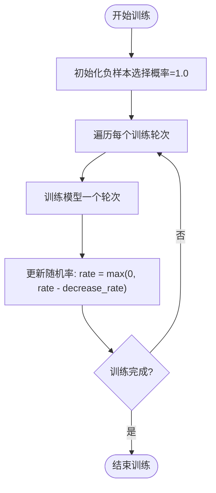
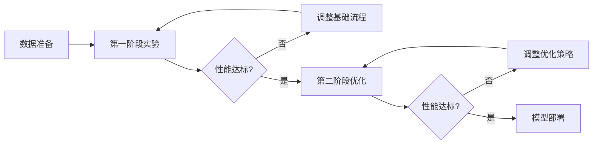
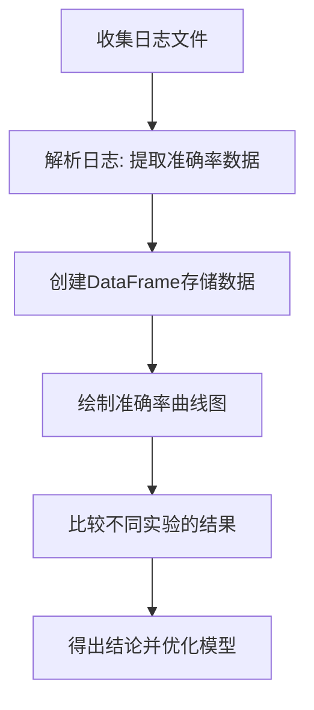

# 实验类型与设计

<cite>
**本文档引用的文件**   
- [biencoder_embedding_classification_concanated_together_random.py](file://bert/biencoder_firststage_experiment/biencoder_embedding_classification_concanated_together_random.py)
- [biencoder_embedding_classification_concanated_together_without_random.py](file://bert/biencoder_firststage_experiment/biencoder_embedding_classification_concanated_together_without_random.py)
- [biencoder_embedding_classification_with_layernorm.py](file://bert/biencoder_second_stage_experiment/biencoder_embedding_classification_with_layernorm.py)
- [biencoder_embedding_classification_with_layernorm_relu.py](file://bert/biencoder_second_stage_experiment/biencoder_embedding_classification_with_layernorm_relu.py)
- [biencoder_embedding_classification_decreased_0.01.py](file://bert/model_structure_with_different_decreased_random_rate/biencoder_embedding_classification_decreased_0.01.py)
- [biencoder_embedding_classification_decreased_none.py](file://bert/model_structure_with_different_decreased_random_rate_2_concatenated_together/biencoder_embedding_classification_decreased_none.py)
- [biencoder_embedding_classification_concanated_together.py](file://bert/model_structure_with_different_norm_activation/biencoder_embedding_classification_concanated_together.py)
- [extract_accuracy.py](file://bert/logs/extract_accuracy.py)
- [bertdataloader.py](file://bert/bertdataloader.py)
- [config.py](file://config.py)
</cite>

## 目录
1. [第一阶段实验](#第一阶段实验)
2. [第二阶段实验](#第二阶段实验)
3. [递减随机率实验](#递减随机率实验)
4. [归一化/激活函数实验](#归一化激活函数实验)
5. [多阶段实验流程](#多阶段实验流程)
6. [新实验设计框架](#新实验设计框架)
7. [结果分析方法](#结果分析方法)

## 第一阶段实验

第一阶段实验（firststage）主要用于验证基础模型流程的正确性和可行性。该阶段的实验文件位于 `bert/biencoder_firststage_experiment/` 目录下，通过对比不同负样本生成策略对模型性能的影响，验证模型的基本训练流程。

在第一阶段实验中，通过控制变量法进行对比分析。例如，在 `biencoder_embedding_classification_concanated_together_random.py` 和 `biencoder_embedding_classification_concanated_together_without_random.py` 两个文件中，主要区别在于负样本的选择策略：前者使用随机选择的负样本，而后者使用基于相似度搜索的负样本。这种设计允许研究人员评估不同负样本选择策略对模型性能的影响。

**Section sources**
- [biencoder_embedding_classification_concanated_together_random.py](file://bert/biencoder_firststage_experiment/biencoder_embedding_classification_concanated_together_random.py#L1-L285)
- [biencoder_embedding_classification_concanated_together_without_random.py](file://bert/biencoder_firststage_experiment/biencoder_embedding_classification_concanated_together_without_random.py#L1-L284)

## 第二阶段实验

第二阶段实验（secondstage）在第一阶段验证基础流程的基础上，进一步优化模型性能。该阶段的实验文件位于 `bert/biencoder_second_stage_experiment/` 目录下，重点关注模型结构的改进和超参数的优化。

第二阶段实验通过引入更复杂的模型结构和训练策略来提升性能。例如，在 `biencoder_embedding_classification_with_layernorm.py` 文件中，研究了LayerNorm层对模型性能的影响。这些实验通常在第一阶段确定的基础架构上进行微调，以探索性能提升的可能性。

**Section sources**
- [biencoder_embedding_classification_with_layernorm.py](file://bert/biencoder_second_stage_experiment/biencoder_embedding_classification_with_layernorm.py#L1-L280)
- [biencoder_embedding_classification_with_layernorm_relu.py](file://bert/biencoder_second_stage_experiment/biencoder_embedding_classification_with_layernorm_relu.py#L1-L280)

## 递减随机率实验

递减随机率实验（decreased_random_rate）旨在研究在训练过程中动态调整负样本选择策略对模型性能的影响。该实验系列位于 `bert/model_structure_with_different_decreased_random_rate*` 目录下。

在递减随机率实验中，通过在训练过程中逐步降低随机选择负样本的概率来优化模型性能。具体实现中，`decrease_rate` 参数控制了随机率的递减速度。例如，在 `biencoder_embedding_classification_decreased_0.01.py` 文件中，每轮训练后随机率减少0.01，直到达到零。这种方法允许模型在训练初期利用随机性探索更广泛的可能性，而在后期专注于更精确的相似度匹配。

**Diagram sources **
- [biencoder_embedding_classification_decreased_0.01.py](file://bert/model_structure_with_different_decreased_random_rate/biencoder_embedding_classification_decreased_0.01.py#L22-L205)
- [biencoder_embedding_classification_decreased_none.py](file://bert/model_structure_with_different_decreased_random_rate_2_concatenated_together/biencoder_embedding_classification_decreased_none.py#L22-L205)

## 归一化/激活函数实验

归一化/激活函数实验（norm_activation）是一种消融研究，旨在评估不同归一化和激活函数组合对模型性能的影响。该实验系列位于 `bert/model_structure_with_different_norm_activation/` 目录下。

在这些实验中，通过固定其他所有参数，仅调整LayerNorm和ReLU的开关状态来研究它们的独立影响。例如，可以比较以下四种配置：
1. 无LayerNorm，无ReLU
2. 有LayerNorm，无ReLU
3. 无LayerNorm，有ReLU
4. 有LayerNorm，有ReLU

这种控制变量的方法有助于理解每个组件对整体性能的贡献，为模型优化提供指导。

**Section sources**
- [biencoder_embedding_classification_concanated_together.py](file://bert/model_structure_with_different_norm_activation/biencoder_embedding_classification_concanated_together.py#L1-L284)

## 多阶段实验流程

多阶段实验通过分步训练的方式提升模型性能。整个流程分为两个主要阶段：

1. **第一阶段**：验证基础流程，确定合适的负样本选择策略和基本模型架构。
2. **第二阶段**：在第一阶段的基础上进行优化，包括引入归一化层、调整激活函数、优化超参数等。

这种分步方法的优势在于：
- 降低了实验复杂度，使每个阶段的目标更加明确
- 便于问题排查和性能分析
- 可以在每个阶段积累经验，为下一阶段提供指导

**Diagram sources **
- [biencoder_embedding_classification_concanated_together_random.py](file://bert/biencoder_firststage_experiment/biencoder_embedding_classification_concanated_together_random.py#L1-L285)
- [biencoder_embedding_classification_with_layernorm.py](file://bert/biencoder_second_stage_experiment/biencoder_embedding_classification_with_layernorm.py#L1-L280)

## 新实验设计框架

设计新实验的框架建议如下：

1. **确定变量**：明确要研究的变量，如学习率、批量大小、模型结构等。
2. **复制模板**：从现有实验文件中复制一个合适的模板。
3. **命名文件**：按照项目命名规范为新实验文件命名。
4. **运行对比**：运行新实验并与基线进行对比。

例如，要设计一个新的归一化实验，可以：
1. 复制 `biencoder_embedding_classification_concanated_together.py` 文件
2. 修改文件名为 `biencoder_embedding_classification_concanated_together_with_batchnorm.py`
3. 在模型定义中添加BatchNorm层
4. 保持其他参数不变，运行实验并记录结果

**Section sources**
- [biencoder_embedding_classification_concanated_together.py](file://bert/model_structure_with_different_norm_activation/biencoder_embedding_classification_concanated_together.py#L1-L284)

## 结果分析方法

利用 `extract_accuracy.py` 脚本分析不同实验的结果差异。该脚本从日志文件中提取训练、验证和测试集的准确率，并生成可视化图表。

分析流程如下：
1. 运行实验并保存日志文件
2. 使用 `extract_accuracy.py` 脚本处理日志文件
3. 比较不同实验的准确率曲线
4. 根据结果调整实验设计

**Diagram sources **
- [extract_accuracy.py](file://bert/logs/extract_accuracy.py#L1-L26)