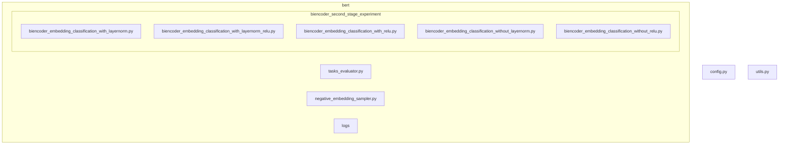
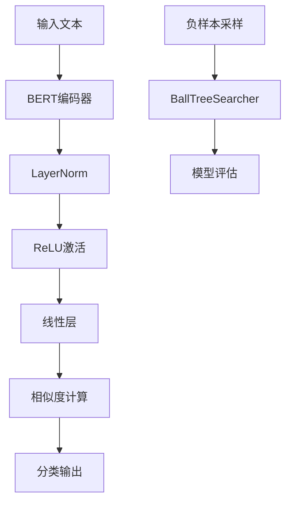
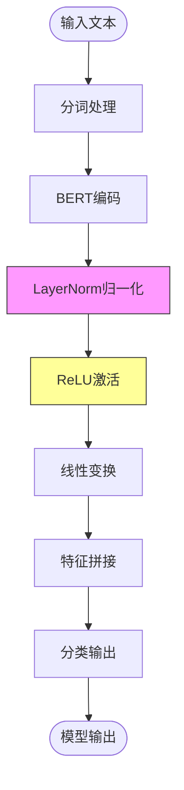
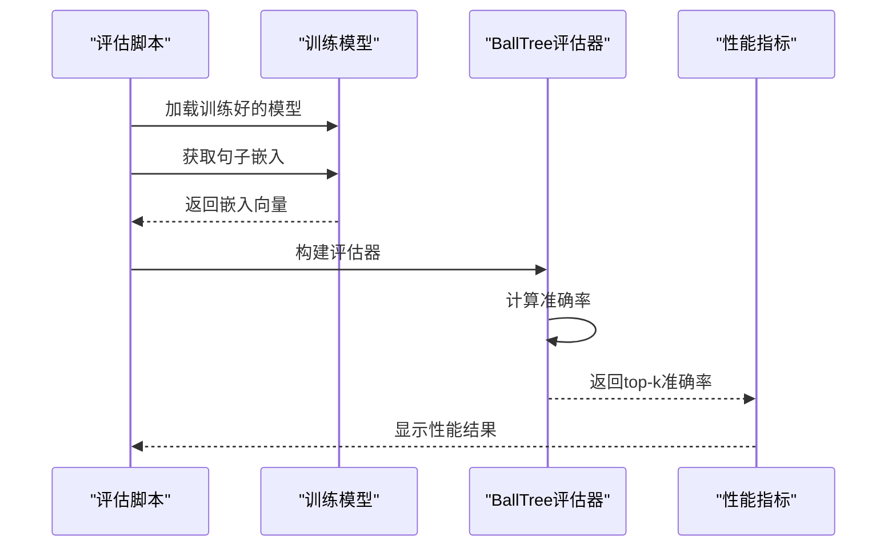
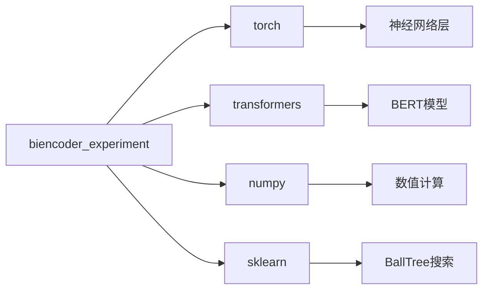

# 归一化与激活函数实验

<cite>
**本文档引用的文件**  
- [biencoder_embedding_classification_with_layernorm.py](file://bert/biencoder_second_stage_experiment/biencoder_embedding_classification_with_layernorm.py)
- [biencoder_embedding_classification_with_layernorm_relu.py](file://bert/biencoder_second_stage_experiment/biencoder_embedding_classification_with_layernorm_relu.py)
- [biencoder_embedding_classification_with_relu.py](file://bert/biencoder_second_stage_experiment/biencoder_embedding_classification_with_relu.py)
- [biencoder_embedding_classification_without_layernorm.py](file://bert/biencoder_second_stage_experiment/biencoder_embedding_classification_without_layernorm.py)
- [biencoder_embedding_classification_without_relu.py](file://bert/biencoder_second_stage_experiment/biencoder_embedding_classification_without_relu.py)
- [tasks_evaluator.py](file://bert/tasks_evaluator.py)
- [extract_accuracy.py](file://bert/logs/extract_accuracy.py)
- [negative_embedding_sampler.py](file://bert/negative_embedding_sampler.py)
- [utils.py](file://utils.py)
- [config.py](file://config.py)
</cite>

## 目录
1. [引言](#引言)
2. [项目结构](#项目结构)
3. [核心组件](#核心组件)
4. [架构概述](#架构概述)
5. [详细组件分析](#详细组件分析)
6. [依赖分析](#依赖分析)
7. [性能考量](#性能考量)
8. [故障排除指南](#故障排除指南)
9. [结论](#结论)

## 引言
本实验旨在通过消融研究方法，系统评估LayerNorm和ReLU激活函数在双编码器模型中的独立贡献。通过在`biencoder_second_stage_experiment`目录下的一系列配置文件中开关这些组件，研究人员能够精确测量每个组件对模型性能的影响。该方法通过固定所有其他参数，仅改变归一化和激活函数的配置，从而实现对模型内部机制的深入理解。实验结果通过`tasks_evaluator.py`脚本在多个任务上进行评估，并使用日志分析工具量化性能差异。

## 项目结构
项目结构显示了多个实验配置，特别是在`bert/biencoder_second_stage_experiment`目录下，存在一系列命名明确的Python文件，用于测试不同的归一化和激活函数组合。这些文件包括启用和禁用LayerNorm及ReLU的配置，形成了一个完整的消融研究框架。

**图示来源**  
- [biencoder_second_stage_experiment](file://bert/biencoder_second_stage_experiment)
- [tasks_evaluator.py](file://bert/tasks_evaluator.py)
- [config.py](file://config.py)

**本节来源**  
- [biencoder_second_stage_experiment](file://bert/biencoder_second_stage_experiment)
- [config.py](file://config.py)

## 核心组件
核心组件包括双编码器模型架构、归一化层、激活函数以及用于评估的工具脚本。这些组件在多个实验配置文件中被系统地启用和禁用，以评估其对模型性能的独立影响。模型基于BERT架构，通过`BertModel.from_pretrained('bert-base-uncased')`初始化，并包含用于相似度计算和分类的线性层。

**本节来源**  
- [biencoder_embedding_classification_with_layernorm.py](file://bert/biencoder_second_stage_experiment/biencoder_embedding_classification_with_layernorm.py#L48-L78)
- [biencoder_embedding_classification_with_relu.py](file://bert/biencoder_second_stage_experiment/biencoder_embedding_classification_with_relu.py#L48-L78)

## 架构概述
系统采用双编码器架构，其中两个BERT模型共享参数，用于编码论点和反论点。模型输出通过线性层进行相似度计算和分类。消融实验通过在不同配置文件中修改网络定义来实现，测试LayerNorm和ReLU的有无对性能的影响。

**图示来源**  
- [biencoder_embedding_classification_with_layernorm_relu.py](file://bert/biencoder_second_stage_experiment/biencoder_embedding_classification_with_layernorm_relu.py#L48-L78)
- [negative_embedding_sampler.py](file://bert/negative_embedding_sampler.py#L13-L47)

## 详细组件分析

### 模型配置分析
消融实验通过五个关键配置文件实现，系统地测试了LayerNorm和ReLU的组合效果：

1. **仅启用LayerNorm**: `biencoder_embedding_classification_with_layernorm.py`
2. **同时启用LayerNorm和ReLU**: `biencoder_embedding_classification_with_layernorm_relu.py`
3. **仅启用ReLU**: `biencoder_embedding_classification_with_relu.py`
4. **禁用LayerNorm**: `biencoder_embedding_classification_without_layernorm.py`
5. **禁用ReLU**: `biencoder_embedding_classification_without_relu.py`

这些配置文件的唯一区别在于归一化和激活函数的实现，其他所有参数保持不变，确保了实验的公平性。

#### 前向传播流程

**图示来源**  
- [biencoder_embedding_classification_with_layernorm_relu.py](file://bert/biencoder_second_stage_experiment/biencoder_embedding_classification_with_layernorm_relu.py#L59-L61)
- [biencoder_embedding_classification_with_relu.py](file://bert/biencoder_second_stage_experiment/biencoder_embedding_classification_with_relu.py#L59-L61)

**本节来源**  
- [biencoder_embedding_classification_with_layernorm.py](file://bert/biencoder_second_stage_experiment/biencoder_embedding_classification_with_layernorm.py)
- [biencoder_embedding_classification_with_layernorm_relu.py](file://bert/biencoder_second_stage_experiment/biencoder_embedding_classification_with_layernorm_relu.py)
- [biencoder_embedding_classification_with_relu.py](file://bert/biencoder_second_stage_experiment/biencoder_embedding_classification_with_relu.py)
- [biencoder_embedding_classification_without_layernorm.py](file://bert/biencoder_second_stage_experiment/biencoder_embedding_classification_without_layernorm.py)
- [biencoder_embedding_classification_without_relu.py](file://bert/biencoder_second_stage_experiment/biencoder_embedding_classification_without_relu.py)

### 评估系统分析
评估系统由`tasks_evaluator.py`和日志分析工具组成，用于在多个任务上测试模型性能。

#### 评估流程

**图示来源**  
- [tasks_evaluator.py](file://bert/tasks_evaluator.py#L10-L19)
- [negative_embedding_sampler.py](file://bert/negative_embedding_sampler.py#L48-L78)

**本节来源**  
- [tasks_evaluator.py](file://bert/tasks_evaluator.py)
- [negative_embedding_sampler.py](file://bert/negative_embedding_sampler.py)

## 依赖分析
项目依赖关系清晰，主要依赖PyTorch、Transformers库和NumPy。消融实验的各个配置文件共享相同的依赖，确保了实验环境的一致性。

**图示来源**  
- [biencoder_embedding_classification_with_layernorm.py](file://bert/biencoder_second_stage_experiment/biencoder_embedding_classification_with_layernorm.py#L4-L6)
- [negative_embedding_sampler.py](file://bert/negative_embedding_sampler.py#L6)

**本节来源**  
- [biencoder_embedding_classification_with_layernorm.py](file://bert/biencoder_second_stage_experiment/biencoder_embedding_classification_with_layernorm.py#L3-L18)
- [negative_embedding_sampler.py](file://bert/negative_embedding_sampler.py#L1-L6)

## 性能考量
消融实验的设计考虑了多个性能因素：
- **计算效率**: LayerNorm和ReLU的添加会影响前向传播速度
- **内存使用**: 不同配置的内存占用可能不同
- **收敛速度**: 归一化和激活函数可能影响训练收敛
- **最终性能**: 通过top-k准确率量化各组件的贡献

实验通过200个训练周期和定期评估来监控性能变化，确保结果的可靠性。

## 故障排除指南
当进行消融实验时，可能遇到以下问题：

1. **性能下降**: 如果移除LayerNorm或ReLU导致性能显著下降，检查学习率是否需要调整
2. **训练不稳定**: 缺少归一化可能导致梯度爆炸，尝试降低学习率
3. **过拟合**: 监控训练集和验证集的准确率差异，使用早停策略
4. **评估不一致**: 确保所有实验使用相同的随机种子和数据分割

日志文件位于`bert/logs/`目录下，可通过`extract_accuracy.py`脚本进行可视化分析。

**本节来源**  
- [extract_accuracy.py](file://bert/logs/extract_accuracy.py)
- [biencoder_embedding_classification_with_layernorm.py](file://bert/biencoder_second_stage_experiment/biencoder_embedding_classification_with_layernorm.py#L147-L277)

## 结论
归一化与激活函数消融实验提供了一种系统的方法来理解深度学习模型中各个组件的贡献。通过在`biencoder_second_stage_experiment`目录下的精心设计的配置文件，研究人员能够精确评估LayerNorm和ReLU的独立影响。这种实验方法对于理解模型内部机制、优化架构设计和提高模型性能具有重要价值。建议使用`tasks_evaluator.py`脚本在多个任务上进行全面评估，并通过日志分析工具量化各组件的影响程度，从而为模型改进提供数据驱动的决策依据。