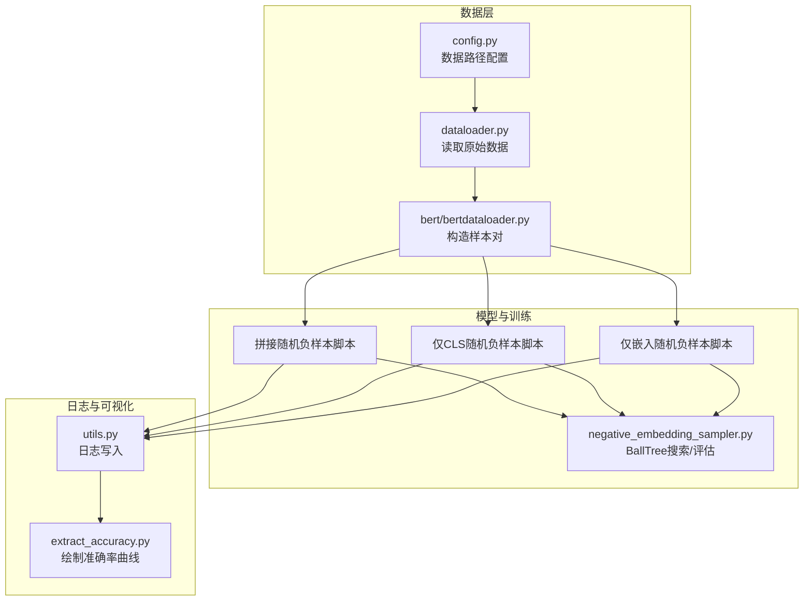
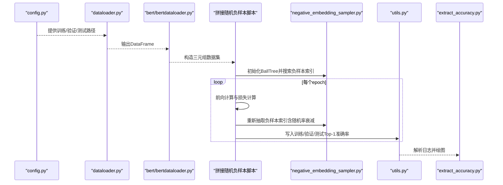
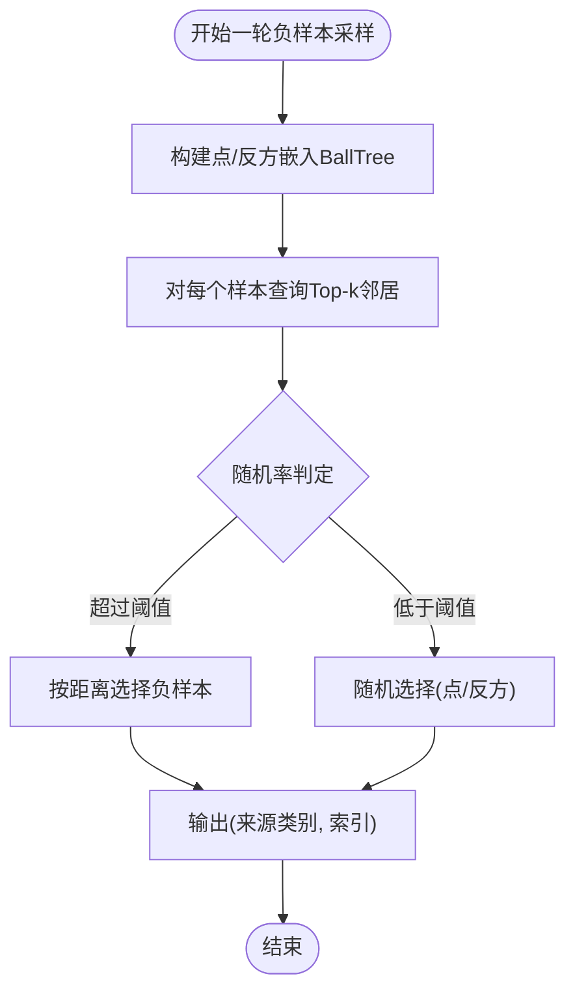
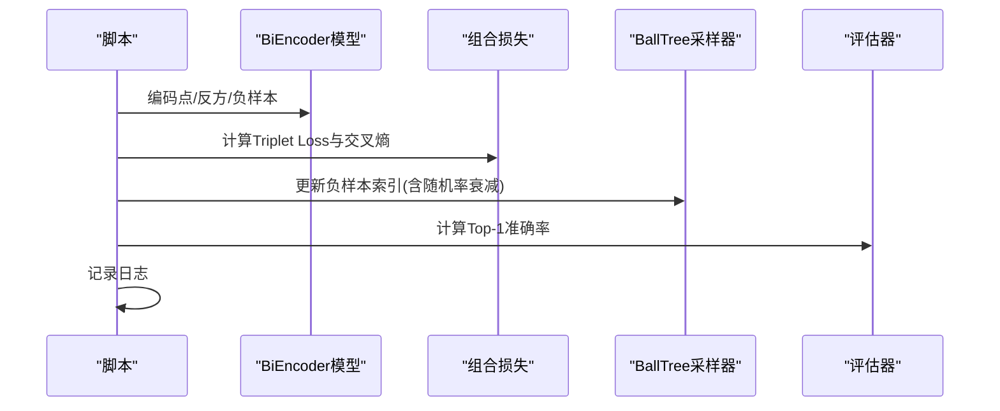
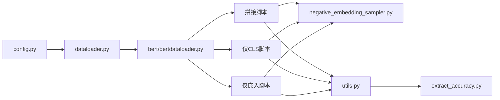

# 第一阶段实验

<cite>
**本文引用的文件**
- [README.md](file://README.md)
- [config.py](file://config.py)
- [dataloader.py](file://dataloader.py)
- [bert/bertdataloader.py](file://bert/bertdataloader.py)
- [utils.py](file://utils.py)
- [bert/negative_embedding_sampler.py](file://bert/negative_embedding_sampler.py)
- [extract_accuracy.py](file://extract_accuracy.py)
- [bert/biencoder_firststage_experiment/biencoder_embedding_classification_concanated_together_random.py](file://bert/biencoder_firststage_experiment/biencoder_embedding_classification_concanated_together_random.py)
- [bert/biencoder_firststage_experiment/biencoder_embedding_classification_only_cls_random.py](file://bert/biencoder_firststage_experiment/biencoder_embedding_classification_only_cls_random.py)
- [bert/biencoder_firststage_experiment/biencoder_embedding_classification_only_embedding_random.py](file://bert/biencoder_firststage_experiment/biencoder_embedding_classification_only_embedding_random.py)
</cite>

## 目录
1. [引言](#引言)
2. [项目结构](#项目结构)
3. [核心组件](#核心组件)
4. [架构总览](#架构总览)
5. [详细组件分析](#详细组件分析)
6. [依赖关系分析](#依赖关系分析)
7. [性能考量](#性能考量)
8. [故障排查指南](#故障排查指南)
9. [结论](#结论)
10. [附录](#附录)

## 引言
本阶段实验旨在验证基础训练流程的可行性，并重点评估“随机负样本采样策略”对模型初始性能的影响。实验在同一套训练条件下，对比三种特征融合方式：
- 拼接（拼接两个句子的嵌入及其差值的绝对值）
- 仅CLS（仅使用每个句子的[CLS]向量）
- 仅嵌入（仅使用每个句子的完整序列嵌入）

控制变量包括：固定学习率、批次大小、损失函数构成等；唯一变化是输入表示形式（即融合层的输入维度与组合方式）。通过日志记录与可视化工具，对比不同融合方式在训练集、验证集与测试集上的Top-1准确率曲线，以评估其有效性与稳定性。

## 项目结构
围绕第一阶段实验，相关代码主要分布在以下模块：
- 数据加载与预处理：config.py、dataloader.py、bert/bertdataloader.py
- 负样本采样与评估：bert/negative_embedding_sampler.py
- 训练脚本（三种融合方式的随机负样本版本）：位于 bert/biencoder_firststage_experiment/
- 日志与可视化：utils.py、extract_accuracy.py
- 说明文档：README.md

图表来源
- [config.py](file://config.py#L1-L11)
- [dataloader.py](file://dataloader.py#L1-L87)
- [bert/bertdataloader.py](file://bert/bertdataloader.py#L1-L44)
- [bert/negative_embedding_sampler.py](file://bert/negative_embedding_sampler.py#L1-L92)
- [extract_accuracy.py](file://extract_accuracy.py#L1-L38)
- [utils.py](file://utils.py#L297-L304)

章节来源
- [README.md](file://README.md#L1-L7)
- [config.py](file://config.py#L1-L11)
- [dataloader.py](file://dataloader.py#L1-L87)
- [bert/bertdataloader.py](file://bert/bertdataloader.py#L1-L44)
- [bert/negative_embedding_sampler.py](file://bert/negative_embedding_sampler.py#L1-L92)
- [extract_accuracy.py](file://extract_accuracy.py#L1-L38)
- [utils.py](file://utils.py#L297-L304)

## 核心组件
- 数据配置与读取：config.py定义训练/验证/测试目录；dataloader.py按主题、论点类型等组织数据并输出DataFrame；bert/bertdataloader.py将样本转换为“点-反方-负样本”的三元组格式。
- 负样本采样：negative_embedding_sampler.py基于BallTree进行最近邻搜索，支持按比例引入随机负样本，以平衡硬负与随机负样本的比例。
- 训练脚本：三个随机负样本脚本分别对应三种融合方式，统一采用Triplet Loss与交叉熵组合损失，固定学习率与批次大小，周期性评估Top-1准确率。
- 日志与可视化：utils.logger写入日志；extract_accuracy.py解析日志并绘制训练/验证/测试的Top-1准确率曲线。

章节来源
- [config.py](file://config.py#L1-L11)
- [dataloader.py](file://dataloader.py#L1-L87)
- [bert/bertdataloader.py](file://bert/bertdataloader.py#L1-L44)
- [bert/negative_embedding_sampler.py](file://bert/negative_embedding_sampler.py#L1-L92)
- [extract_accuracy.py](file://extract_accuracy.py#L1-L38)
- [utils.py](file://utils.py#L297-L304)

## 架构总览
下面以“拼接随机负样本脚本”为例，展示从数据准备到训练与评估的整体流程。

图表来源
- [config.py](file://config.py#L1-L11)
- [dataloader.py](file://dataloader.py#L1-L87)
- [bert/bertdataloader.py](file://bert/bertdataloader.py#L1-L44)
- [bert/biencoder_firststage_experiment/biencoder_embedding_classification_concanated_together_random.py](file://bert/biencoder_firststage_experiment/biencoder_embedding_classification_concanated_together_random.py#L1-L285)
- [bert/negative_embedding_sampler.py](file://bert/negative_embedding_sampler.py#L1-L92)
- [utils.py](file://utils.py#L297-L304)
- [extract_accuracy.py](file://extract_accuracy.py#L1-L38)

## 详细组件分析

### 数据加载与样本对构造
- config.py提供训练/验证/测试目录，作为后续数据读取的基础。
- dataloader.py递归读取指定目录下的文本文件，构造包含领域、主题、立场、轮次类型等字段的DataFrame。
- bert/bertdataloader.py将同一主题、同一论点ID的数据聚合为“点-反方-负样本”的样本对，便于后续成对训练。

章节来源
- [config.py](file://config.py#L1-L11)
- [dataloader.py](file://dataloader.py#L1-L87)
- [bert/bertdataloader.py](file://bert/bertdataloader.py#L1-L44)

### 负样本采样与评估
- BallTreeSearcher：基于点与反方嵌入分别构建BallTree，查询时优先排除自身，再根据随机率决定是否随机选择或依据距离选择负样本。
- BallTreeEvaluater：将点与反方嵌入拼接为待检索集合，计算Top-K命中率，同时调用分类器计算正样本概率，用于Top-1准确率评估。

图表来源
- [bert/negative_embedding_sampler.py](file://bert/negative_embedding_sampler.py#L1-L92)

章节来源
- [bert/negative_embedding_sampler.py](file://bert/negative_embedding_sampler.py#L1-L92)

### 训练脚本（三种融合方式）
三个脚本均遵循相同的训练框架：
- 使用BERT编码点、反方与负样本，得到两组嵌入（例如[CLS]向量与序列嵌入），用于后续融合与相似度计算。
- 分类头将融合后的特征映射到二分类，计算正样本与负样本的分类概率。
- 组合损失包含Triplet Loss与交叉熵，分别鼓励正样本更接近、负样本更远离，并约束分类置信度。
- 固定学习率与批次大小，周期性更新负样本索引（包含随机率随epoch衰减）。
- 每轮训练后评估Top-1准确率，并写入日志文件。

图表来源
- [bert/biencoder_firststage_experiment/biencoder_embedding_classification_concanated_together_random.py](file://bert/biencoder_firststage_experiment/biencoder_embedding_classification_concanated_together_random.py#L1-L285)
- [bert/biencoder_firststage_experiment/biencoder_embedding_classification_only_cls_random.py](file://bert/biencoder_firststage_experiment/biencoder_embedding_classification_only_cls_random.py#L1-L283)
- [bert/biencoder_firststage_experiment/biencoder_embedding_classification_only_embedding_random.py](file://bert/biencoder_firststage_experiment/biencoder_embedding_classification_only_embedding_random.py#L1-L282)
- [bert/negative_embedding_sampler.py](file://bert/negative_embedding_sampler.py#L1-L92)

章节来源
- [bert/biencoder_firststage_experiment/biencoder_embedding_classification_concanated_together_random.py](file://bert/biencoder_firststage_experiment/biencoder_embedding_classification_concanated_together_random.py#L1-L285)
- [bert/biencoder_firststage_experiment/biencoder_embedding_classification_only_cls_random.py](file://bert/biencoder_firststage_experiment/biencoder_embedding_classification_only_cls_random.py#L1-L283)
- [bert/biencoder_firststage_experiment/biencoder_embedding_classification_only_embedding_random.py](file://bert/biencoder_firststage_experiment/biencoder_embedding_classification_only_embedding_random.py#L1-L282)

### 特征融合方式对比
- 拼接（concanated_together）：将两段文本的嵌入与其差值的绝对值拼接后送入分类头，输入维度较大，能捕获更多差异信息。
- 仅CLS（only_cls）：仅使用每段文本的[CLS]向量，输入维度较小，强调全局语义。
- 仅嵌入（only_embedding）：使用每段文本的完整序列嵌入，输入维度最大，保留局部细节但可能带来噪声。

上述差异体现在脚本中的融合逻辑与线性层输入维度处，具体请参考相应脚本文件。

章节来源
- [bert/biencoder_firststage_experiment/biencoder_embedding_classification_concanated_together_random.py](file://bert/biencoder_firststage_experiment/biencoder_embedding_classification_concanated_together_random.py#L1-L285)
- [bert/biencoder_firststage_experiment/biencoder_embedding_classification_only_cls_random.py](file://bert/biencoder_firststage_experiment/biencoder_embedding_classification_only_cls_random.py#L1-L283)
- [bert/biencoder_firststage_experiment/biencoder_embedding_classification_only_embedding_random.py](file://bert/biencoder_firststage_experiment/biencoder_embedding_classification_only_embedding_random.py#L1-L282)

## 依赖关系分析
- 训练脚本依赖于数据加载模块与负样本采样模块，形成“数据-模型-采样-评估”的闭环。
- 日志模块贯穿训练过程，可视化模块依赖日志文件进行曲线绘制。

图表来源
- [config.py](file://config.py#L1-L11)
- [dataloader.py](file://dataloader.py#L1-L87)
- [bert/bertdataloader.py](file://bert/bertdataloader.py#L1-L44)
- [bert/negative_embedding_sampler.py](file://bert/negative_embedding_sampler.py#L1-L92)
- [utils.py](file://utils.py#L297-L304)
- [extract_accuracy.py](file://extract_accuracy.py#L1-L38)

章节来源
- [config.py](file://config.py#L1-L11)
- [dataloader.py](file://dataloader.py#L1-L87)
- [bert/bertdataloader.py](file://bert/bertdataloader.py#L1-L44)
- [bert/negative_embedding_sampler.py](file://bert/negative_embedding_sampler.py#L1-L92)
- [utils.py](file://utils.py#L297-L304)
- [extract_accuracy.py](file://extract_accuracy.py#L1-L38)

## 性能考量
- 随机负样本比例随epoch衰减：脚本中通过随机率参数逐步降低随机采样比例，有助于初期探索与后期稳定收敛。
- 批次大小与学习率固定：保证不同融合方式在相同训练强度下进行公平对比。
- Top-1准确率作为评估指标：通过BallTreeEvaluater计算，反映模型在检索空间内的判别能力。
- 多GPU并行：脚本中使用DataParallel在多GPU上加速训练。

章节来源
- [bert/biencoder_firststage_experiment/biencoder_embedding_classification_concanated_together_random.py](file://bert/biencoder_firststage_experiment/biencoder_embedding_classification_concanated_together_random.py#L1-L285)
- [bert/biencoder_firststage_experiment/biencoder_embedding_classification_only_cls_random.py](file://bert/biencoder_firststage_experiment/biencoder_embedding_classification_only_cls_random.py#L1-L283)
- [bert/biencoder_firststage_experiment/biencoder_embedding_classification_only_embedding_random.py](file://bert/biencoder_firststage_experiment/biencoder_embedding_classification_only_embedding_random.py#L1-L282)

## 故障排查指南
- 过拟合识别与缓解
  - 现象：训练集准确率持续上升，验证集/测试集准确率停滞或下降。
  - 缓解策略：增加随机负样本比例、降低学习率、减少模型容量（如降低分类头维度）、加入正则化项或早停。
- 负样本质量不佳
  - 现象：Top-1准确率低且波动大。
  - 排查：检查BallTree采样是否正确排除自身、随机率是否设置合理、是否需要提高k值或调整距离阈值。
- 数据不平衡
  - 现象：某一融合方式在某些数据子集上表现异常。
  - 排查：检查数据分布、样本对构造是否一致、是否存在缺失标签导致的NaN影响。
- 日志与可视化
  - 使用日志解析工具绘制准确率曲线，观察训练/验证/测试趋势，辅助判断模型状态。

章节来源
- [extract_accuracy.py](file://extract_accuracy.py#L1-L38)
- [bert/negative_embedding_sampler.py](file://bert/negative_embedding_sampler.py#L1-L92)

## 结论
本阶段实验通过固定训练超参与引入随机负样本策略，在三种特征融合方式之间建立了可控的对比环境。借助BallTree采样与Top-1准确率评估，能够有效衡量不同输入表示形式对初始性能的影响。建议在后续阶段扩展更多融合策略与正则化手段，并系统性地记录与可视化各指标，以便进一步优化。

## 附录

### 实验运行步骤指南
- 准备数据
  - 将数据放入 data/ 目录，确保包含训练/验证/测试子目录。
- 选择模板文件
  - 在 bert/biencoder_firststage_experiment/ 中选择一种融合方式的“随机负样本”脚本作为模板。
- 配置数据路径
  - 修改 config.py 中的 training_dir、validation_dir、test_dir 指向实际数据路径。
- 启动训练
  - 直接运行所选脚本，脚本会自动：
    - 读取数据并构造样本对
    - 初始化负样本索引
    - 训练并周期性更新负样本索引（含随机率衰减）
    - 评估Top-1准确率并写入日志
- 记录日志
  - 日志文件位于 logs/ 下，按脚本命名保存。
- 可视化结果
  - 使用 extract_accuracy.py 解析日志并绘制训练/验证/测试的Top-1准确率曲线。

章节来源
- [README.md](file://README.md#L1-L7)
- [config.py](file://config.py#L1-L11)
- [dataloader.py](file://dataloader.py#L1-L87)
- [bert/bertdataloader.py](file://bert/bertdataloader.py#L1-L44)
- [extract_accuracy.py](file://extract_accuracy.py#L1-L38)
- [bert/biencoder_firststage_experiment/biencoder_embedding_classification_concanated_together_random.py](file://bert/biencoder_firststage_experiment/biencoder_embedding_classification_concanated_together_random.py#L1-L285)
- [bert/biencoder_firststage_experiment/biencoder_embedding_classification_only_cls_random.py](file://bert/biencoder_firststage_experiment/biencoder_embedding_classification_only_cls_random.py#L1-L283)
- [bert/biencoder_firststage_experiment/biencoder_embedding_classification_only_embedding_random.py](file://bert/biencoder_firststage_experiment/biencoder_embedding_classification_only_embedding_random.py#L1-L282)