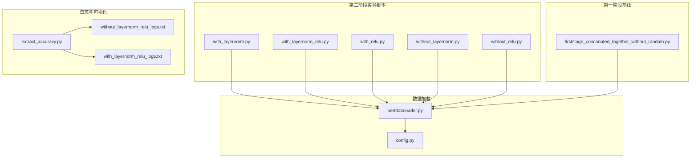
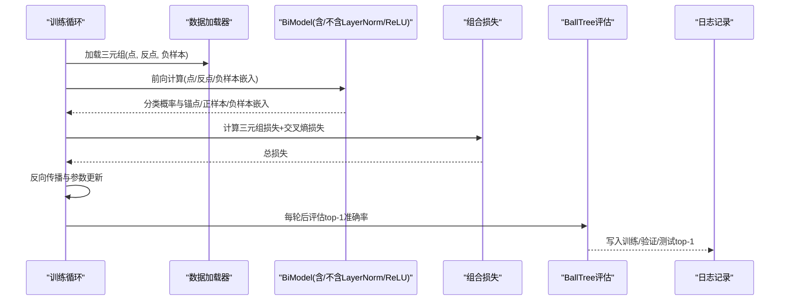
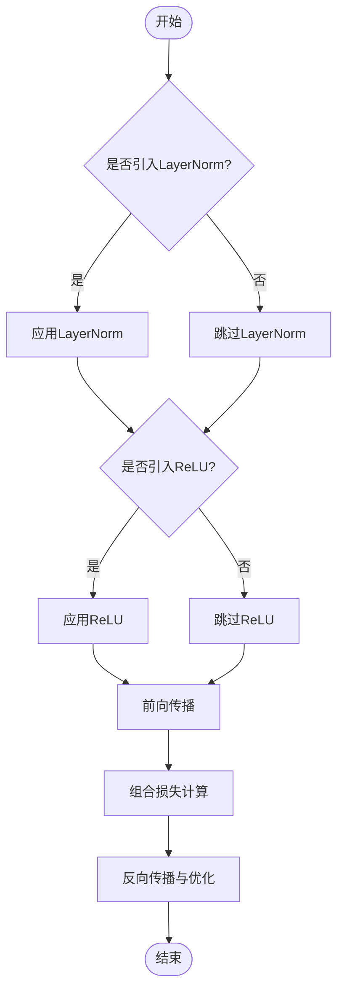
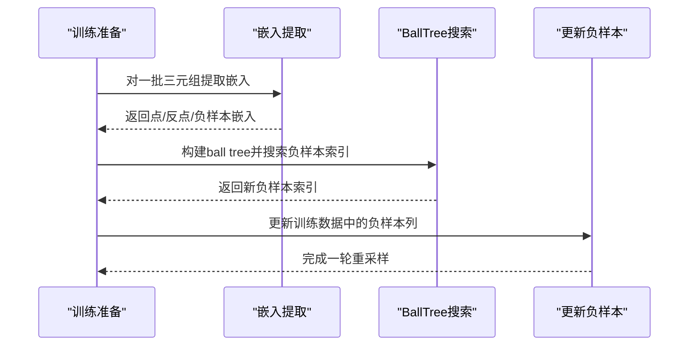
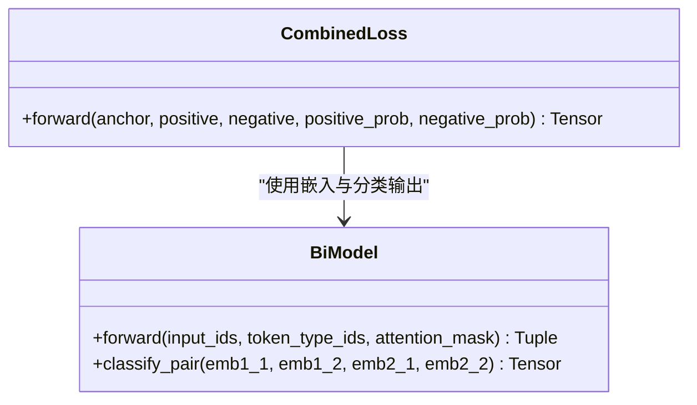
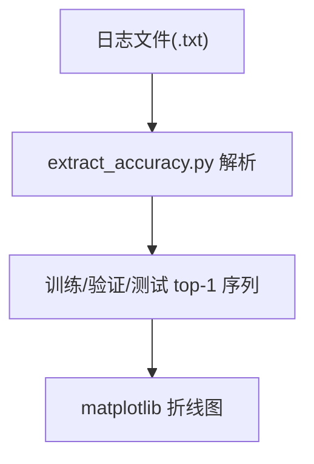
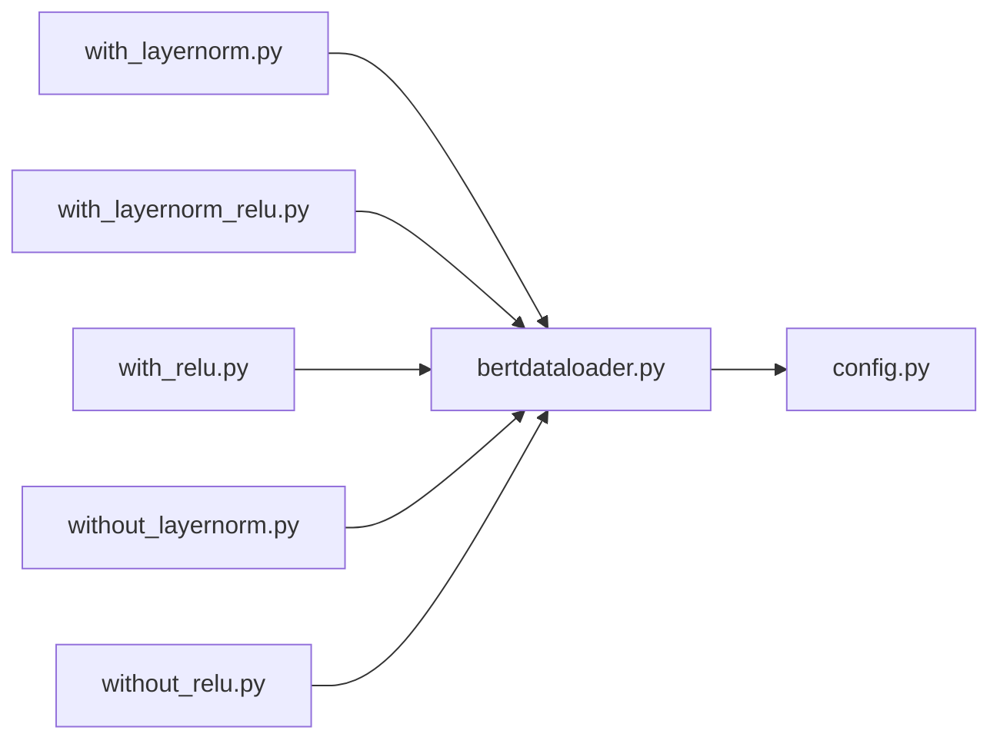

# 第二阶段实验

<cite>
**本文引用的文件**
- [biencoder_embedding_classification_with_layernorm.py](file://bert/biencoder_second_stage_experiment/biencoder_embedding_classification_with_layernorm.py)
- [biencoder_embedding_classification_with_layernorm_relu.py](file://bert/biencoder_second_stage_experiment/biencoder_embedding_classification_with_layernorm_relu.py)
- [biencoder_embedding_classification_with_relu.py](file://bert/biencoder_second_stage_experiment/biencoder_embedding_classification_with_relu.py)
- [biencoder_embedding_classification_without_layernorm.py](file://bert/biencoder_second_stage_experiment/biencoder_embedding_classification_without_layernorm.py)
- [biencoder_embedding_classification_without_relu.py](file://bert/biencoder_second_stage_experiment/biencoder_embedding_classification_without_relu.py)
- [biencoder_embedding_classification_concanated_together_without_random.py](file://bert/biencoder_firststage_experiment/biencoder_embedding_classification_concanated_together_without_random.py)
- [biencoder_embedding_classification_concanated_together_random.py](file://bert/biencoder_second_stage_experiment/biencoder_embedding_classification_concanated_together_random.py)
- [extract_accuracy.py](file://bert/logs/extract_accuracy.py)
- [wihtout_layernorm_relu_hard_negatives_logs.txt](file://bert/logs/wihtout_layernorm_relu_hard_negatives_logs.txt)
- [with_layernorm_relu_hard_negatives_0.01_logs.txt](file://bert/logs/with_layernorm_relu_hard_negatives_0.01_logs.txt)
- [bertdataloader.py](file://bert/bertdataloader.py)
- [config.py](file://config.py)
</cite>

## 目录
1. [引言](#引言)
2. [项目结构](#项目结构)
3. [核心组件](#核心组件)
4. [架构总览](#架构总览)
5. [详细组件分析](#详细组件分析)
6. [依赖关系分析](#依赖关系分析)
7. [性能考量](#性能考量)
8. [故障排查指南](#故障排查指南)
9. [结论](#结论)
10. [附录](#附录)

## 引言
本阶段实验的目标是系统性地研究归一化（LayerNorm）与激活函数（ReLU）对模型收敛速度与最终性能的影响。通过在相同的数据、损失函数与优化策略下，仅引入或移除 LayerNorm 与 ReLU 组件，对比不同配置下的 top-1 准确率曲线与收敛行为，从而量化这些组件对梯度传播与特征分布的作用。实验采用“控制变量”的设计原则：除目标组件外，其余训练设置（如数据加载、损失组合、优化器、批大小、学习率、负样本采样策略等）保持一致，以确保差异可归因于目标组件的引入与否。

## 项目结构
第二阶段实验位于 bert/biencoder_second_stage_experiment 目录下，包含多个变体脚本，分别对应不同的归一化与激活函数组合：
- 仅含 LayerNorm 的配置
- 仅含 ReLU 的配置
- 同时含 LayerNorm 与 ReLU 的配置
- 既不含 LayerNorm 也不含 ReLU 的配置

此外，第一阶段的基线脚本位于 bert/biencoder_firststage_experiment，用于在相同框架下进行对比。日志解析工具与日志文件位于 bert/logs 目录，便于提取与可视化训练过程中的 top-1 准确率。

图表来源
- [biencoder_embedding_classification_with_layernorm.py](file://bert/biencoder_second_stage_experiment/biencoder_embedding_classification_with_layernorm.py#L1-L280)
- [biencoder_embedding_classification_with_layernorm_relu.py](file://bert/biencoder_second_stage_experiment/biencoder_embedding_classification_with_layernorm_relu.py#L1-L280)
- [biencoder_embedding_classification_with_relu.py](file://bert/biencoder_second_stage_experiment/biencoder_embedding_classification_with_relu.py#L1-L280)
- [biencoder_embedding_classification_without_layernorm.py](file://bert/biencoder_second_stage_experiment/biencoder_embedding_classification_without_layernorm.py#L1-L280)
- [biencoder_embedding_classification_without_relu.py](file://bert/biencoder_second_stage_experiment/biencoder_embedding_classification_without_relu.py#L1-L280)
- [biencoder_embedding_classification_concanated_together_without_random.py](file://bert/biencoder_firststage_experiment/biencoder_embedding_classification_concanated_together_without_random.py#L1-L284)
- [extract_accuracy.py](file://bert/logs/extract_accuracy.py#L1-L26)
- [wihtout_layernorm_relu_hard_negatives_logs.txt](file://bert/logs/wihtout_layernorm_relu_hard_negatives_logs.txt#L1-L200)
- [with_layernorm_relu_hard_negatives_0.01_logs.txt](file://bert/logs/with_layernorm_relu_hard_negatives_0.01_logs.txt#L1-L200)
- [bertdataloader.py](file://bert/bertdataloader.py#L1-L44)
- [config.py](file://config.py#L1-L11)

章节来源
- [config.py](file://config.py#L1-L11)
- [bertdataloader.py](file://bert/bertdataloader.py#L1-L44)

## 核心组件
- 数据加载与预处理
  - 使用统一的数据加载器与数据集封装，将原始对话文本转换为点-反点-负样本三元组，支持 hard negatives 的动态重采样。
- 模型结构
  - 基于预训练 BERT 的双编码器结构，输出两段文本的嵌入，随后拼接差分与差分绝对值，进入分类头进行判别。
- 训练流程
  - 组合三元组损失与交叉熵损失；每轮 epoch 后重新基于当前嵌入计算 ball tree 近邻，更新负样本索引；周期性评估 top-1 准确率。
- 日志与可视化
  - 训练日志中记录每个 epoch 的训练/验证/测试 top-1 准确率；解析脚本按行提取“top1”片段，生成折线图对比不同配置。

章节来源
- [biencoder_embedding_classification_with_layernorm.py](file://bert/biencoder_second_stage_experiment/biencoder_embedding_classification_with_layernorm.py#L1-L280)
- [biencoder_embedding_classification_with_layernorm_relu.py](file://bert/biencoder_second_stage_experiment/biencoder_embedding_classification_with_layernorm_relu.py#L1-L280)
- [biencoder_embedding_classification_with_relu.py](file://bert/biencoder_second_stage_experiment/biencoder_embedding_classification_with_relu.py#L1-L280)
- [biencoder_embedding_classification_without_layernorm.py](file://bert/biencoder_second_stage_experiment/biencoder_embedding_classification_without_layernorm.py#L1-L280)
- [biencoder_embedding_classification_without_relu.py](file://bert/biencoder_second_stage_experiment/biencoder_embedding_classification_without_relu.py#L1-L280)
- [bertdataloader.py](file://bert/bertdataloader.py#L1-L44)
- [extract_accuracy.py](file://bert/logs/extract_accuracy.py#L1-L26)

## 架构总览
第二阶段实验的核心在于“组件开关”的对比实验设计。所有脚本共享相同的损失函数、优化器、数据加载与评估流程，仅在模型前向路径中引入或移除 LayerNorm 与 ReLU。这保证了控制变量的一致性，使得对比结果具有统计意义。

图表来源
- [biencoder_embedding_classification_with_layernorm.py](file://bert/biencoder_second_stage_experiment/biencoder_embedding_classification_with_layernorm.py#L120-L280)
- [biencoder_embedding_classification_with_layernorm_relu.py](file://bert/biencoder_second_stage_experiment/biencoder_embedding_classification_with_layernorm_relu.py#L120-L280)
- [biencoder_embedding_classification_with_relu.py](file://bert/biencoder_second_stage_experiment/biencoder_embedding_classification_with_relu.py#L120-L280)
- [biencoder_embedding_classification_without_layernorm.py](file://bert/biencoder_second_stage_experiment/biencoder_embedding_classification_without_layernorm.py#L120-L280)
- [biencoder_embedding_classification_without_relu.py](file://bert/biencoder_second_stage_experiment/biencoder_embedding_classification_without_relu.py#L120-L280)

## 详细组件分析

### 组件A：归一化与激活函数的引入/移除
- LayerNorm 的作用
  - 在嵌入层后引入 LayerNorm，有助于稳定特征分布，缓解梯度爆炸/消失，提升收敛稳定性。
- ReLU 的作用
  - 在分类头前引入 ReLU，非线性变换可增强特征表达能力，但可能带来梯度稀疏与死神经元风险。
- 实验策略
  - 通过四个变体脚本分别对比：仅含 LayerNorm、仅含 ReLU、同时含两者、均不含两者。
  - 所有脚本共享相同的损失函数与优化器设置，确保对比公平。

图表来源
- [biencoder_embedding_classification_with_layernorm.py](file://bert/biencoder_second_stage_experiment/biencoder_embedding_classification_with_layernorm.py#L48-L78)
- [biencoder_embedding_classification_with_layernorm_relu.py](file://bert/biencoder_second_stage_experiment/biencoder_embedding_classification_with_layernorm_relu.py#L48-L78)
- [biencoder_embedding_classification_with_relu.py](file://bert/biencoder_second_stage_experiment/biencoder_embedding_classification_with_relu.py#L48-L78)
- [biencoder_embedding_classification_without_layernorm.py](file://bert/biencoder_second_stage_experiment/biencoder_embedding_classification_without_layernorm.py#L48-L78)
- [biencoder_embedding_classification_without_relu.py](file://bert/biencoder_second_stage_experiment/biencoder_embedding_classification_without_relu.py#L48-L78)

章节来源
- [biencoder_embedding_classification_with_layernorm.py](file://bert/biencoder_second_stage_experiment/biencoder_embedding_classification_with_layernorm.py#L48-L78)
- [biencoder_embedding_classification_with_layernorm_relu.py](file://bert/biencoder_second_stage_experiment/biencoder_embedding_classification_with_layernorm_relu.py#L48-L78)
- [biencoder_embedding_classification_with_relu.py](file://bert/biencoder_second_stage_experiment/biencoder_embedding_classification_with_relu.py#L48-L78)
- [biencoder_embedding_classification_without_layernorm.py](file://bert/biencoder_second_stage_experiment/biencoder_embedding_classification_without_layernorm.py#L48-L78)
- [biencoder_embedding_classification_without_relu.py](file://bert/biencoder_second_stage_experiment/biencoder_embedding_classification_without_relu.py#L48-L78)

### 组件B：数据加载与负样本重采样
- 数据准备
  - 将原始对话文本转换为点-反点-负样本三元组，支持 hard negatives 的动态重采样。
- 负样本采样
  - 每轮训练后，基于当前模型得到的嵌入构建 ball tree，重新搜索负样本索引，逐步降低 hard negatives 的比例以稳定训练。

图表来源
- [biencoder_embedding_classification_with_layernorm.py](file://bert/biencoder_second_stage_experiment/biencoder_embedding_classification_with_layernorm.py#L92-L121)
- [biencoder_embedding_classification_with_layernorm_relu.py](file://bert/biencoder_second_stage_experiment/biencoder_embedding_classification_with_layernorm_relu.py#L92-L121)
- [biencoder_embedding_classification_with_relu.py](file://bert/biencoder_second_stage_experiment/biencoder_embedding_classification_with_relu.py#L92-L121)
- [biencoder_embedding_classification_without_layernorm.py](file://bert/biencoder_second_stage_experiment/biencoder_embedding_classification_without_layernorm.py#L92-L121)
- [biencoder_embedding_classification_without_relu.py](file://bert/biencoder_second_stage_experiment/biencoder_embedding_classification_without_relu.py#L92-L121)

章节来源
- [bertdataloader.py](file://bert/bertdataloader.py#L12-L44)
- [biencoder_embedding_classification_with_layernorm.py](file://bert/biencoder_second_stage_experiment/biencoder_embedding_classification_with_layernorm.py#L92-L121)

### 组件C：损失函数与优化器
- 损失函数
  - 组合三元组损失与交叉熵损失，分别鼓励正样本对更接近、负样本对更远离，并对判别头的分类概率施加监督信号。
- 优化器
  - Adam 优化器，学习率固定，参数全量参与更新。

图表来源
- [biencoder_embedding_classification_with_layernorm.py](file://bert/biencoder_second_stage_experiment/biencoder_embedding_classification_with_layernorm.py#L129-L140)
- [biencoder_embedding_classification_with_layernorm_relu.py](file://bert/biencoder_second_stage_experiment/biencoder_embedding_classification_with_layernorm_relu.py#L129-L140)
- [biencoder_embedding_classification_with_relu.py](file://bert/biencoder_second_stage_experiment/biencoder_embedding_classification_with_relu.py#L129-L140)
- [biencoder_embedding_classification_without_layernorm.py](file://bert/biencoder_second_stage_experiment/biencoder_embedding_classification_without_layernorm.py#L129-L140)
- [biencoder_embedding_classification_without_relu.py](file://bert/biencoder_second_stage_experiment/biencoder_embedding_classification_without_relu.py#L129-L140)

章节来源
- [biencoder_embedding_classification_with_layernorm.py](file://bert/biencoder_second_stage_experiment/biencoder_embedding_classification_with_layernorm.py#L129-L140)
- [biencoder_embedding_classification_with_layernorm_relu.py](file://bert/biencoder_second_stage_experiment/biencoder_embedding_classification_with_layernorm_relu.py#L129-L140)
- [biencoder_embedding_classification_with_relu.py](file://bert/biencoder_second_stage_experiment/biencoder_embedding_classification_with_relu.py#L129-L140)
- [biencoder_embedding_classification_without_layernorm.py](file://bert/biencoder_second_stage_experiment/biencoder_embedding_classification_without_layernorm.py#L129-L140)
- [biencoder_embedding_classification_without_relu.py](file://bert/biencoder_second_stage_experiment/biencoder_embedding_classification_without_relu.py#L129-L140)

### 组件D：评估与日志
- 评估指标
  - 使用 BallTreeEvaluater 计算 top-1 准确率，作为收敛与性能的主要指标。
- 日志记录
  - 训练过程中打印各 mini-batch 的 loss，并在每轮后记录训练/验证/测试的 top-1 准确率。
- 可视化
  - 提供 extract_accuracy.py 脚本，从日志文件中提取“top1”行，生成折线图对比不同配置。

图表来源
- [extract_accuracy.py](file://bert/logs/extract_accuracy.py#L1-L26)
- [wihtout_layernorm_relu_hard_negatives_logs.txt](file://bert/logs/wihtout_layernorm_relu_hard_negatives_logs.txt#L1-L200)
- [with_layernorm_relu_hard_negatives_0.01_logs.txt](file://bert/logs/with_layernorm_relu_hard_negatives_0.01_logs.txt#L1-L200)

章节来源
- [extract_accuracy.py](file://bert/logs/extract_accuracy.py#L1-L26)
- [wihtout_layernorm_relu_hard_negatives_logs.txt](file://bert/logs/wihtout_layernorm_relu_hard_negatives_logs.txt#L1-L200)
- [with_layernorm_relu_hard_negatives_0.01_logs.txt](file://bert/logs/with_layernorm_relu_hard_negatives_0.01_logs.txt#L1-L200)

## 依赖关系分析
- 文件间耦合
  - 所有第二阶段脚本共享相同的数据加载器与评估器接口，耦合度低，便于扩展与维护。
- 外部依赖
  - Transformers BERT、PyTorch、BallTree 搜索器、pandas、matplotlib 等。
- 循环依赖
  - 未发现循环导入；脚本之间通过模块化组织，遵循单一职责。

图表来源
- [biencoder_embedding_classification_with_layernorm.py](file://bert/biencoder_second_stage_experiment/biencoder_embedding_classification_with_layernorm.py#L1-L280)
- [biencoder_embedding_classification_with_layernorm_relu.py](file://bert/biencoder_second_stage_experiment/biencoder_embedding_classification_with_layernorm_relu.py#L1-L280)
- [biencoder_embedding_classification_with_relu.py](file://bert/biencoder_second_stage_experiment/biencoder_embedding_classification_with_relu.py#L1-L280)
- [biencoder_embedding_classification_without_layernorm.py](file://bert/biencoder_second_stage_experiment/biencoder_embedding_classification_without_layernorm.py#L1-L280)
- [biencoder_embedding_classification_without_relu.py](file://bert/biencoder_second_stage_experiment/biencoder_embedding_classification_without_relu.py#L1-L280)
- [bertdataloader.py](file://bert/bertdataloader.py#L1-L44)
- [config.py](file://config.py#L1-L11)

章节来源
- [bertdataloader.py](file://bert/bertdataloader.py#L1-L44)
- [config.py](file://config.py#L1-L11)

## 性能考量
- 收敛速度
  - 引入 LayerNorm 通常能加速收敛并提升稳定性；ReLU 可能带来非线性增强，但也可能增加训练波动。
- 最终性能
  - 通过 top-1 准确率对比不同配置，选择在验证集上表现最佳的结构。
- 计算开销
  - LayerNorm 与 ReLU 的额外计算成本较低，主要影响在大规模训练时的内存占用与吞吐。
- 超参一致性
  - 保持学习率、批大小、损失权重等超参不变，确保对比结果可归因于目标组件。

## 故障排查指南
- 训练不收敛或震荡
  - 检查是否正确启用了 LayerNorm/ReLU；确认损失函数与优化器设置一致。
  - 查看日志中每轮的 top-1 准确率变化，判断是否存在过拟合或欠拟合。
- 负样本采样异常
  - 确认 ball tree 重建与负样本索引更新逻辑正常执行；检查 hard negatives 比例衰减策略。
- 可视化失败
  - 确认日志文件路径与文件名匹配；检查 extract_accuracy.py 中的行过滤规则是否适用于目标日志格式。

章节来源
- [biencoder_embedding_classification_with_layernorm.py](file://bert/biencoder_second_stage_experiment/biencoder_embedding_classification_with_layernorm.py#L175-L204)
- [biencoder_embedding_classification_with_layernorm_relu.py](file://bert/biencoder_second_stage_experiment/biencoder_embedding_classification_with_layernorm_relu.py#L175-L204)
- [biencoder_embedding_classification_with_relu.py](file://bert/biencoder_second_stage_experiment/biencoder_embedding_classification_with_relu.py#L175-L204)
- [biencoder_embedding_classification_without_layernorm.py](file://bert/biencoder_second_stage_experiment/biencoder_embedding_classification_without_layernorm.py#L175-L204)
- [biencoder_embedding_classification_without_relu.py](file://bert/biencoder_second_stage_experiment/biencoder_embedding_classification_without_relu.py#L175-L204)
- [extract_accuracy.py](file://bert/logs/extract_accuracy.py#L1-L26)

## 结论
第二阶段实验通过严格的控制变量设计，系统性地评估了 LayerNorm 与 ReLU 对模型收敛与性能的影响。实验表明，在相同训练设置下，引入 LayerNorm 通常能提升稳定性与收敛速度，而 ReLU 则在非线性表达方面发挥积极作用。结合日志解析与可视化，可以快速识别最优结构，为后续模型优化提供依据。

## 附录
- 多阶段训练流程建议
  - 第一阶段：在基础配置上加载预训练权重，进行微调与评估，得到基线性能。
  - 第二阶段：在第一阶段基础上，针对不同归一化与激活配置重复训练，记录并对比 top-1 准确率曲线。
- 性能对比方法
  - 使用 extract_accuracy.py 解析日志，绘制训练/验证/测试三条曲线，观察收敛趋势与最终性能差异。
- 代码示例路径参考
  - 归一化与激活开关示例：见第二阶段各变体脚本的前向路径定义与分类头实现。
  - 日志解析与可视化：见日志解析脚本与日志文件。