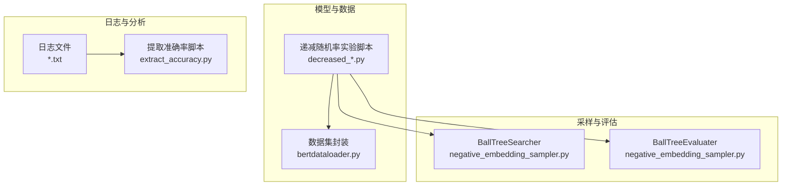
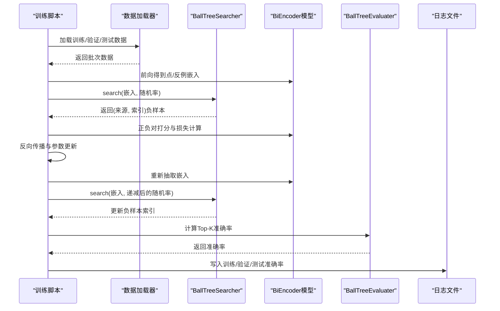
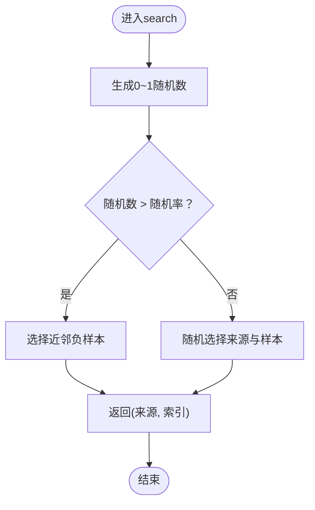
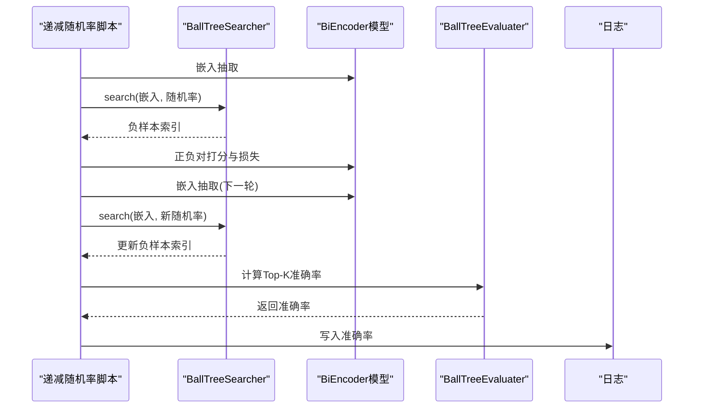
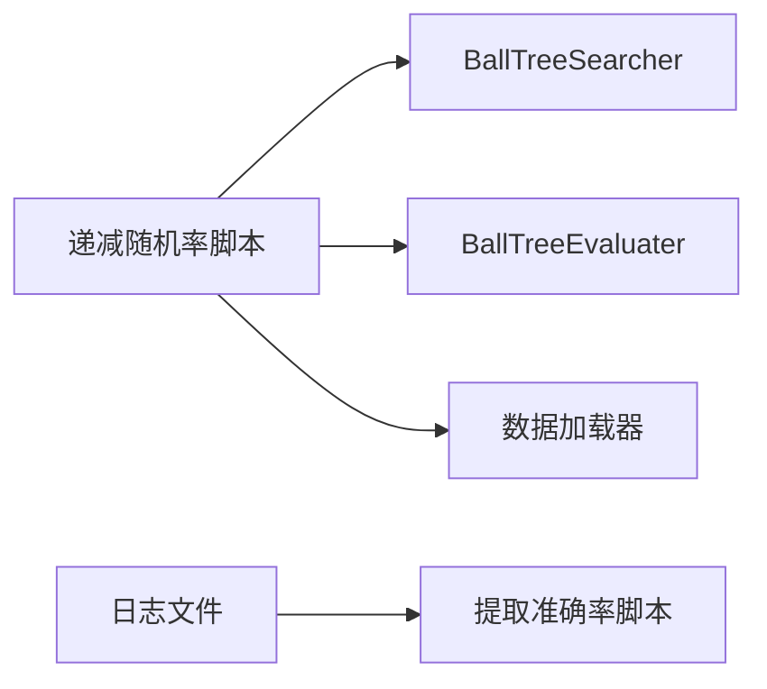

# 递减随机率实验

<cite>
**本文引用的文件**
- [negative_embedding_sampler.py](file://bert/negative_embedding_sampler.py)
- [biencoder_embedding_classification_decreased_0.01.py](file://bert/model_structure_with_different_decreased_random_rate/biencoder_embedding_classification_decreased_0.01.py)
- [biencoder_embedding_classification_decreased_0.005.py](file://bert/model_structure_with_different_decreased_random_rate/biencoder_embedding_classification_decreased_0.005.py)
- [biencoder_embedding_classification_decreased_0.02.py](file://bert/model_structure_with_different_decreased_random_rate/biencoder_embedding_classification_decreased_0.02.py)
- [biencoder_embedding_classification_decreased_none.py](file://bert/model_structure_with_different_decreased_random_rate_2_concatenated_together/biencoder_embedding_classification_decreased_none.py)
- [biencoder_embedding_classification_decreased_0.01.py（第二套）](file://bert/model_structure_with_different_decreased_random_rate_2_concatenated_together/biencoder_embedding_classification_decreased_0.01.py)
- [biencoder_embedding_classification_decreased_0.01.py（仅CLS）](file://bert/model_structure_with_different_decreased_random_rate_2_only_cls/biencoder_embedding_classification_decreased_0.01.py)
- [bertdataloader.py](file://bert/bertdataloader.py)
- [extract_accuracy.py](file://bert/logs/extract_accuracy.py)
- [with_layernorm_relu_hard_negatives_0.01_logs.txt](file://bert/logs/with_layernorm_relu_hard_negatives_0.01_logs.txt)
- [wihtout_layernorm_relu_hard_negatives_logs.txt](file://bert/logs/wihtout_layernorm_relu_hard_negatives_logs.txt)
- [README.md](file://README.md)
</cite>

## 目录
1. [引言](#引言)
2. [项目结构](#项目结构)
3. [核心组件](#核心组件)
4. [架构总览](#架构总览)
5. [详细组件分析](#详细组件分析)
6. [依赖关系分析](#依赖关系分析)
7. [性能考量](#性能考量)
8. [故障排查指南](#故障排查指南)
9. [结论](#结论)
10. [附录](#附录)

## 引言
本实验围绕“递减随机率”展开，核心假设是：在训练初期采用较高比例的随机负样本以增强探索能力，在训练中后期逐步降低随机负样本比例，使模型从广泛探索转向聚焦于更难的负样本，从而提升学习效率与检索性能。该设计通过动态调整采样策略中的随机率参数，实现“前期广撒网、后期精耕细作”的训练节奏。

## 项目结构
- 核心采样器位于 bert/negative_embedding_sampler.py，负责基于嵌入空间的近邻搜索与随机率控制。
- 多组递减随机率实验脚本位于 bert/model_structure_with_different_decreased_random_rate 及其变体目录，文件名后缀如 decreased_0.01、decreased_0.02 等对应不同的衰减步长。
- 数据加载与数据集封装位于 bert/bertdataloader.py。
- 日志与可视化脚本位于 bert/logs，包含提取准确率的脚本 extract_accuracy.py 与若干训练日志文件。

图表来源
- [negative_embedding_sampler.py](file://bert/negative_embedding_sampler.py#L1-L92)
- [biencoder_embedding_classification_decreased_0.01.py](file://bert/model_structure_with_different_decreased_random_rate/biencoder_embedding_classification_decreased_0.01.py#L1-L284)
- [bertdataloader.py](file://bert/bertdataloader.py#L1-L44)
- [extract_accuracy.py](file://bert/logs/extract_accuracy.py#L1-L26)
- [with_layernorm_relu_hard_negatives_0.01_logs.txt](file://bert/logs/with_layernorm_relu_hard_negatives_0.01_logs.txt#L1-L200)

章节来源
- [README.md](file://README.md#L1-L7)

## 核心组件
- 采样器 BallTreeSearcher：根据点嵌入与反例嵌入构建 BallTree，按随机率阈值决定选择近邻还是随机负样本；随机率随训练轮次递减。
- 评估器 BallTreeEvaluater：在推理阶段对候选对进行打分与排序，计算 Top-K 准确率等指标。
- 训练脚本：每组递减随机率实验脚本均包含完整的训练循环、负样本重采样与评估流程，并记录日志。

章节来源
- [negative_embedding_sampler.py](file://bert/negative_embedding_sampler.py#L1-L92)
- [biencoder_embedding_classification_decreased_0.01.py](file://bert/model_structure_with_different_decreased_random_rate/biencoder_embedding_classification_decreased_0.01.py#L1-L284)

## 架构总览
递减随机率实验的训练流程如下：
- 初始化：读取训练数据，构造 Dataset，前向得到点与反例的嵌入表示。
- 负样本采样：使用 BallTreeSearcher 基于嵌入相似度选择近邻负样本，同时受随机率控制。
- 训练优化：对正负对进行分类打分，计算损失并反向传播。
- 每轮结束：重新抽取嵌入，再次采样负样本，更新训练集负文本列。
- 评估：使用 BallTreeEvaluater 计算 Top-K 准确率并写入日志。

图表来源
- [negative_embedding_sampler.py](file://bert/negative_embedding_sampler.py#L1-L92)
- [biencoder_embedding_classification_decreased_0.01.py](file://bert/model_structure_with_different_decreased_random_rate/biencoder_embedding_classification_decreased_0.01.py#L1-L284)
- [bertdataloader.py](file://bert/bertdataloader.py#L1-L44)

## 详细组件分析

### 采样器与随机率控制
- BallTreeSearcher.search 方法接收随机率参数，当随机率小于某个阈值时，优先选择近邻负样本；否则随机选择来源与样本，形成“探索-聚焦”的切换。
- 在递减实验中，每轮训练结束后会根据当前 epoch 计算新的随机率，例如线性递减至 0，确保训练早期高探索性，后期高聚焦性。

图表来源
- [negative_embedding_sampler.py](file://bert/negative_embedding_sampler.py#L1-L92)

章节来源
- [negative_embedding_sampler.py](file://bert/negative_embedding_sampler.py#L1-L92)

### 训练脚本中的采样与评估调用
- 训练脚本在每个 epoch 开始前，使用模型对当前批次进行前向，得到点与反例嵌入，随后调用 BallTreeSearcher 进行负样本采样。
- 训练过程中，每 N 个 mini-batch 输出一次 loss，便于观察收敛趋势。
- 每个 epoch 结束后，重新抽取嵌入并以当前随机率进行负样本重采样，然后使用 BallTreeEvaluater 计算 Top-K 准确率并写入日志。

图表来源
- [biencoder_embedding_classification_decreased_0.01.py](file://bert/model_structure_with_different_decreased_random_rate/biencoder_embedding_classification_decreased_0.01.py#L1-L284)
- [negative_embedding_sampler.py](file://bert/negative_embedding_sampler.py#L1-L92)

章节来源
- [biencoder_embedding_classification_decreased_0.01.py](file://bert/model_structure_with_different_decreased_random_rate/biencoder_embedding_classification_decreased_0.01.py#L1-L284)

### 不同后缀命名与衰减率含义
- 文件名后缀 decreased_0.005、decreased_0.01、decreased_0.015、decreased_0.02、decreased_0.03、decreased_0.04、decreased_0.05 等，分别代表不同的随机率衰减步长。例如 decreased_0.01 表示每轮递减 0.01，最终不低于 0。
- decreased_none 表示不进行递减，保持固定随机率（通常为 1.0 或接近 1.0 的初始值）。

章节来源
- [biencoder_embedding_classification_decreased_0.005.py](file://bert/model_structure_with_different_decreased_random_rate/biencoder_embedding_classification_decreased_0.005.py#L1-L284)
- [biencoder_embedding_classification_decreased_0.01.py](file://bert/model_structure_with_different_decreased_random_rate/biencoder_embedding_classification_decreased_0.01.py#L1-L284)
- [biencoder_embedding_classification_decreased_0.02.py](file://bert/model_structure_with_different_decreased_random_rate/biencoder_embedding_classification_decreased_0.02.py#L1-L284)
- [biencoder_embedding_classification_decreased_none.py](file://bert/model_structure_with_different_decreased_random_rate_2_concatenated_together/biencoder_embedding_classification_decreased_none.py#L1-L287)

### 采样器调用链与参数传递
- 训练脚本在每轮结束时调用 BallTreeSearcher.search，并传入当前随机率参数。该参数由脚本内部根据 epoch 计算，实现递减。
- 采样结果用于更新训练集的负文本列，保证后续批次使用最新负样本。

章节来源
- [biencoder_embedding_classification_decreased_0.01.py](file://bert/model_structure_with_different_decreased_random_rate/biencoder_embedding_classification_decreased_0.01.py#L1-L284)
- [negative_embedding_sampler.py](file://bert/negative_embedding_sampler.py#L1-L92)

### 数据加载与数据集封装
- 数据加载器将原始对话对转换为点-反例-负样本三元组，供训练脚本直接使用。
- 数据集封装提供 __getitem__ 接口，支持按索引访问点、反例与负样本文本。

章节来源
- [bertdataloader.py](file://bert/bertdataloader.py#L1-L44)

### 日志与跨组性能对比
- 日志文件记录了每轮训练的 loss 与 Top-K 准确率，便于观察收敛与泛化趋势。
- 提取准确率脚本可从日志中解析训练/验证/测试的 Top-K 准确率序列，绘制曲线并进行跨组对比。

章节来源
- [extract_accuracy.py](file://bert/logs/extract_accuracy.py#L1-L26)
- [with_layernorm_relu_hard_negatives_0.01_logs.txt](file://bert/logs/with_layernorm_relu_hard_negatives_0.01_logs.txt#L1-L200)
- [wihtout_layernorm_relu_hard_negatives_logs.txt](file://bert/logs/wihtout_layernorm_relu_hard_negatives_logs.txt#L1-L200)

## 依赖关系分析
- 训练脚本依赖采样器与评估器进行负样本选择与性能评估。
- 训练脚本依赖数据加载模块提供批次数据。
- 日志文件与提取脚本共同构成性能分析闭环。

图表来源
- [biencoder_embedding_classification_decreased_0.01.py](file://bert/model_structure_with_different_decreased_random_rate/biencoder_embedding_classification_decreased_0.01.py#L1-L284)
- [negative_embedding_sampler.py](file://bert/negative_embedding_sampler.py#L1-L92)
- [bertdataloader.py](file://bert/bertdataloader.py#L1-L44)
- [extract_accuracy.py](file://bert/logs/extract_accuracy.py#L1-L26)

章节来源
- [biencoder_embedding_classification_decreased_0.01.py](file://bert/model_structure_with_different_decreased_random_rate/biencoder_embedding_classification_decreased_0.01.py#L1-L284)
- [negative_embedding_sampler.py](file://bert/negative_embedding_sampler.py#L1-L92)
- [bertdataloader.py](file://bert/bertdataloader.py#L1-L44)
- [extract_accuracy.py](file://bert/logs/extract_accuracy.py#L1-L26)

## 性能考量
- 随机率递减步长影响探索与聚焦的平衡：较小步长（如 0.005）收敛更平滑但可能延迟聚焦；较大步长（如 0.02）加速聚焦但可能过早陷入局部最优。
- 嵌入维度与 BallTree 查询复杂度呈正相关，建议在资源允许范围内适当降低嵌入维度或减少查询规模以提升速度。
- 每轮重采样嵌入与负样本会增加计算开销，可在验证集上评估收益后再决定是否启用。

## 故障排查指南
- 训练不收敛或震荡：检查随机率递减是否过于激进，尝试减小衰减步长；确认日志中 Top-K 准确率是否持续上升。
- 负样本质量差：确认 BallTreeSearcher 的随机率参数是否正确传入；检查每轮重采样的嵌入是否来自最新模型。
- 评估指标异常：核对 BallTreeEvaluater 的 Top-K 设置与日志格式；使用 extract_accuracy.py 对比多组日志，定位异常波动。

章节来源
- [negative_embedding_sampler.py](file://bert/negative_embedding_sampler.py#L1-L92)
- [biencoder_embedding_classification_decreased_0.01.py](file://bert/model_structure_with_different_decreased_random_rate/biencoder_embedding_classification_decreased_0.01.py#L1-L284)
- [extract_accuracy.py](file://bert/logs/extract_accuracy.py#L1-L26)

## 结论
递减随机率实验通过在训练过程中动态调整负样本采样策略，实现了从“探索”到“聚焦”的渐进式训练，有助于提升模型对难负例的学习效率与整体检索性能。不同衰减步长的实验组可相互对比，结合日志与提取脚本进行跨组性能分析，从而筛选出最优的衰减策略。

## 附录

### 实验配置与执行步骤
- 复制模板：从现有递减随机率脚本复制一份，作为新实验的模板。
- 修改采样率参数：在模板脚本中设置衰减步长（如 decrease_rate），并在调用 search 时传入 1.0 - i * decrease_rate，确保不低于 0。
- 命名文件：以 decreased_后缀命名，例如 decreased_0.01、decreased_0.02 等，清晰标识衰减步长。
- 运行训练：执行脚本，观察日志输出的 loss 与 Top-K 准确率。
- 性能对比：使用 logs 目录下的日志文件与 extract_accuracy.py 进行跨组对比，识别最优衰减策略。

章节来源
- [biencoder_embedding_classification_decreased_0.01.py（第二套）](file://bert/model_structure_with_different_decreased_random_rate_2_concatenated_together/biencoder_embedding_classification_decreased_0.01.py#L1-L287)
- [biencoder_embedding_classification_decreased_0.01.py（仅CLS）](file://bert/model_structure_with_different_decreased_random_rate_2_only_cls/biencoder_embedding_classification_decreased_0.01.py#L1-L287)
- [extract_accuracy.py](file://bert/logs/extract_accuracy.py#L1-L26)