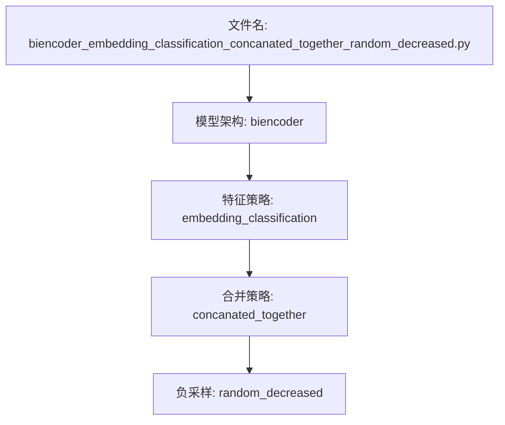
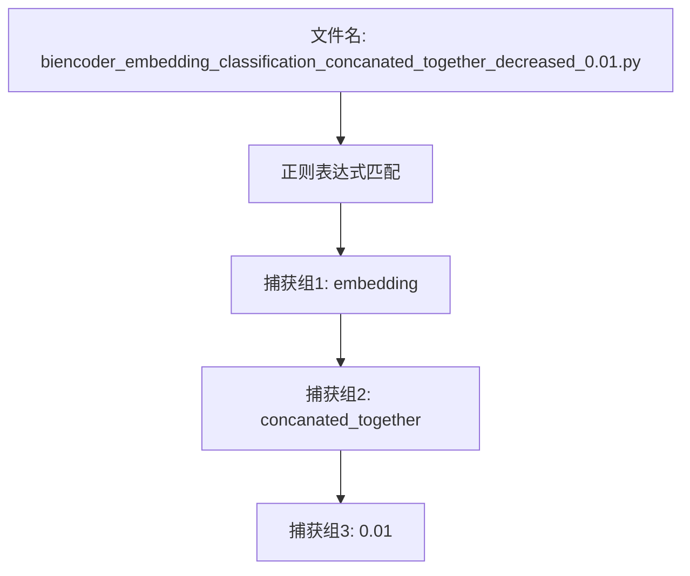

# 文件命名规范

<cite>
**本文档中引用的文件**
- [biencoder_embedding_classification_only_cls_random_decreased.py](file://bert\biencoder_firststage_experiment\biencoder_embedding_classification_only_cls_random_decreased.py)
- [biencoder_embedding_classification_with_layernorm_relu.py](file://bert\biencoder_second_stage_experiment\biencoder_embedding_classification_with_layernorm_relu.py)
- [biencoder_embedding_classification_decreased_0.01.py](file://bert\model_structure_with_different_decreased_random_rate\biencoder_embedding_classification_decreased_0.01.py)
- [biencoder_embedding_classification_only_cls.py](file://bert\model_structure_with_different_norm_activation\biencoder_embedding_classification_only_cls.py)
- [biencoder_embedding_classification_concanated_together.py](file://bert\biencoder\biencoder_embedding_classification_concanated_together.py)
- [with_layernorm_relu_hard_negatives_0.01_logs.txt](file://bert\logs\with_layernorm_relu_hard_negatives_0.01_logs.txt)
- [wihtout_layernorm_relu_hard_negatives_logs.txt](file://bert\logs\wihtout_layernorm_relu_hard_negatives_logs.txt)
</cite>

## 目录
1. [引言](#引言)
2. [文件命名结构解析](#文件命名结构解析)
3. [核心组件命名模式](#核心组件命名模式)
4. [特征使用策略标识](#特征使用策略标识)
5. [负采样策略命名](#负采样策略命名)
6. [模型配置后缀](#模型配置后缀)
7. [数值型参数表示](#数值型参数表示)
8. [正则表达式提取配置](#正则表达式提取配置)
9. [命名规范映射表](#命名规范映射表)
10. [实验可追溯性](#实验可追溯性)
11. [新增实验命名指南](#新增实验命名指南)

## 引言
本项目通过系统化的文件命名规范，将实验配置信息编码到文件名中，实现元数据的自描述。这种命名方式不仅提高了实验的可追溯性，还便于自动化脚本解析和管理。文件名由多个语义段组成，每个段落都代表特定的实验配置，从模型架构到训练策略，形成了一套完整的实验配置描述体系。

**Section sources**
- [biencoder_embedding_classification_only_cls_random_decreased.py](file://bert\biencoder_firststage_experiment\biencoder_embedding_classification_only_cls_random_decreased.py)

## 文件命名结构解析
项目中的Python文件命名遵循严格的结构化模式，通常由多个下划线分隔的语义段组成。典型的文件名如`biencoder_embedding_classification_concanated_together_random_decreased.py`，可以分解为：模型架构前缀、特征使用策略、负采样策略等部分。这种结构化命名使得仅通过文件名就能准确理解实验的核心配置。

**Diagram sources**
- [biencoder_embedding_classification_concanated_together_random_decreased.py](file://bert\biencoder_firststage_experiment\biencoder_embedding_classification_concanated_together_random_decreased.py)

**Section sources**
- [biencoder_embedding_classification_concanated_together_random_decreased.py](file://bert\biencoder_firststage_experiment\biencoder_embedding_classification_concanated_together_random_decreased.py)

## 核心组件命名模式
文件名的前缀部分明确标识了模型的架构和核心组件。例如，`biencoder`表示使用双编码器架构，`embedding_classification`表明该实验涉及嵌入向量的分类任务。这些前缀构成了实验的基础配置，是理解整个实验设计的第一步。

**Section sources**
- [biencoder_embedding_classification_concanated_together.py](file://bert\biencoder\biencoder_embedding_classification_concanated_together.py)

## 特征使用策略标识
文件名中的`_only_cls`、`_only_embedding`等后缀明确指出了特征使用策略。`_only_cls`表示仅使用[CLS]标记的嵌入向量进行分类，而`_only_embedding`则表示使用整个嵌入向量序列。这种命名约定使得研究人员能够快速识别不同特征提取方法对模型性能的影响。

**Section sources**
- [biencoder_embedding_classification_only_cls.py](file://bert\model_structure_with_different_norm_activation\biencoder_embedding_classification_only_cls.py)

## 负采样策略命名
负采样策略通过特定的后缀来标识，如`_random`表示随机负采样，`_decreased`表示递减式负采样。组合使用时，`_random_decreased`明确表示采用了递减率的随机负采样策略。这种命名方式精确描述了训练过程中负样本的选择机制。

**Section sources**
- [biencoder_embedding_classification_only_cls_random_decreased.py](file://bert\biencoder_firststage_experiment\biencoder_embedding_classification_only_cls_random_decreased.py)

## 模型配置后缀
模型的配置参数通过后缀形式体现在文件名中。`_with_layernorm_relu`表示模型使用了层归一化和ReLU激活函数，而`_without_relu`则表示没有使用ReLU激活函数。这些后缀为模型的超参数配置提供了清晰的标识。

**Section sources**
- [biencoder_embedding_classification_with_layernorm_relu.py](file://bert\biencoder_second_stage_experiment\biencoder_embedding_classification_with_layernorm_relu.py)

## 数值型参数表示
数值型参数直接嵌入在文件名中，如`_decreased_0.01`中的`0.01`表示递减率的具体值。这种表示方法直观且精确，使得不同参数设置的实验结果可以轻松对比。数值的精度也反映了实验设计的细致程度。

**Section sources**
- [biencoder_embedding_classification_decreased_0.01.py](file://bert\model_structure_with_different_decreased_random_rate\biencoder_embedding_classification_decreased_0.01.py)

## 正则表达式提取配置
可以通过正则表达式从文件名中自动提取实验配置。例如，使用正则表达式`r'biencoder_(.*)_classification_(.*)_decreased_(\d+\.\d+)'`可以从`biencoder_embedding_classification_concanated_together_decreased_0.01.py`中提取出特征策略、合并策略和递减率等关键配置参数，实现配置信息的自动化解析。

**Diagram sources**
- [biencoder_embedding_classification_decreased_0.01.py](file://bert\model_structure_with_different_decreased_random_rate\biencoder_embedding_classification_decreased_0.01.py)

## 命名规范映射表
以下表格总结了项目中使用的文件命名规范及其对应的实验配置：

| 命名片段 | 含义 | 示例文件 |
|---------|------|---------|
| `biencoder` | 双编码器架构 | 所有biencoder相关文件 |
| `embedding_classification` | 嵌入向量分类任务 | 多个文件 |
| `only_cls` | 仅使用[CLS]标记 | `_only_cls`系列文件 |
| `only_embedding` | 使用完整嵌入向量 | `_only_embedding`系列文件 |
| `random` | 随机负采样 | `_random`系列文件 |
| `decreased` | 递减式负采样 | `_decreased`系列文件 |
| `with_layernorm` | 使用层归一化 | `_with_layernorm`系列文件 |
| `without_relu` | 不使用ReLU激活 | `_without_relu`系列文件 |
| `decreased_0.01` | 递减率为0.01 | `_decreased_0.01.py` |

**Section sources**
- [biencoder_embedding_classification_decreased_0.01.py](file://bert\model_structure_with_different_decreased_random_rate\biencoder_embedding_classification_decreased_0.01.py)

## 实验可追溯性
一致的命名规范对实验的可追溯性至关重要。通过文件名，研究人员可以立即识别出实验的配置，无需查阅额外的文档或代码。这种自描述性大大提高了研究的可重复性和团队协作效率，特别是在进行大量消融实验时。

**Section sources**
- [biencoder_embedding_classification_only_cls_random_decreased.py](file://bert\biencoder_firststage_experiment\biencoder_embedding_classification_only_cls_random_decreased.py)

## 新增实验命名指南
当新增实验时，应遵循现有的命名规范。首先确定模型架构前缀，然后依次添加特征使用策略、负采样策略和具体参数值。例如，要创建一个使用0.03递减率的随机负采样实验，文件名应为`biencoder_embedding_classification_concanated_together_random_decreased_0.03.py`，确保命名的一致性和可预测性。

**Section sources**
- [biencoder_embedding_classification_decreased_0.01.py](file://bert\model_structure_with_different_decreased_random_rate\biencoder_embedding_classification_decreased_0.01.py)