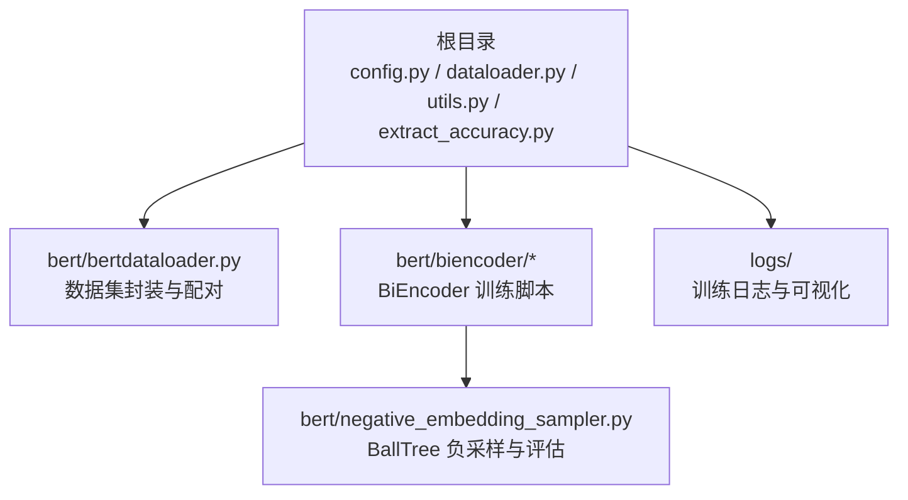
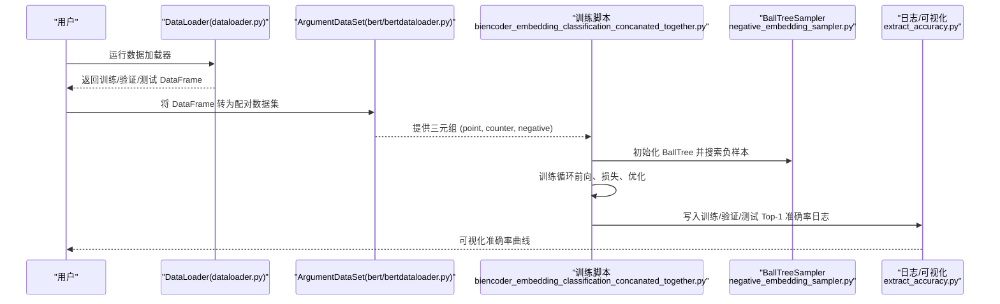
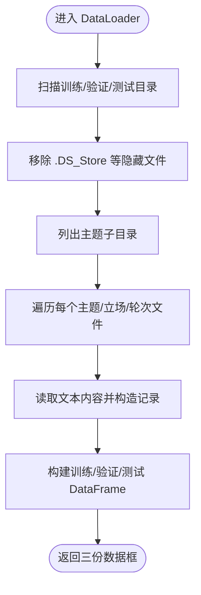
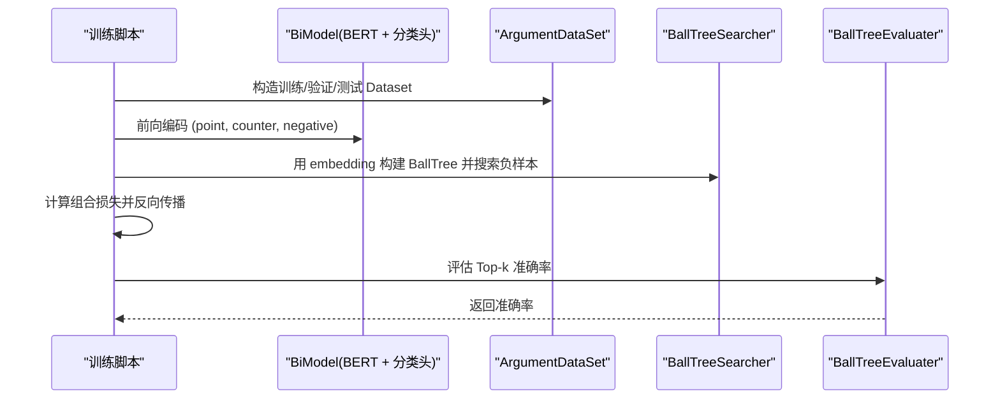
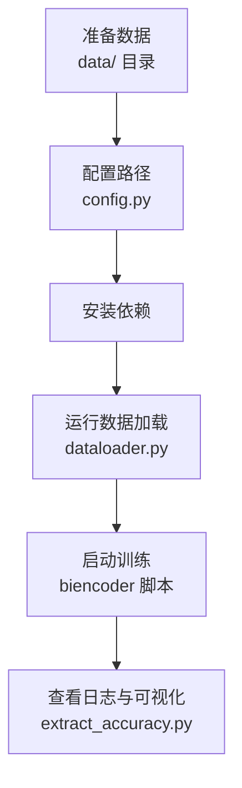

# 快速入门指南

<cite>
**本文引用的文件列表**
- [README.md](file://README.md)
- [config.py](file://config.py)
- [dataloader.py](file://dataloader.py)
- [bert/bertdataloader.py](file://bert/bertdataloader.py)
- [bert/biencoder/biencoder_embedding_classification_concanated_together.py](file://bert/biencoder/biencoder_embedding_classification_concanated_together.py)
- [bert/negative_embedding_sampler.py](file://bert/negative_embedding_sampler.py)
- [utils.py](file://utils.py)
- [extract_accuracy.py](file://extract_accuracy.py)
</cite>

## 目录
1. [简介](#简介)
2. [项目结构](#项目结构)
3. [核心组件](#核心组件)
4. [架构总览](#架构总览)
5. [详细组件分析](#详细组件分析)
6. [依赖与安装](#依赖与安装)
7. [数据准备与路径配置](#数据准备与路径配置)
8. [启动第一个实验](#启动第一个实验)
9. [端到端示例流程](#端到端示例流程)
10. [性能与调参建议](#性能与调参建议)
11. [故障排查](#故障排查)
12. [结论](#结论)

## 简介
本指南面向初学者，帮助你在本地环境中成功运行第一个反论点检索实验。你将学会：
- 安装必要的 Python 依赖（transformers、torch、sklearn、pandas、tqdm 等）
- 准备 ArguAna 反论点数据集并放置到 data/ 目录
- 修改配置文件以适配你的本地路径
- 启动基础训练脚本，理解关键命令行参数
- 完成从数据加载、模型训练到初步结果查看的端到端流程
- 预判并解决常见问题（如 .DS_Store 干扰、路径错误、依赖版本冲突）

## 项目结构
该项目采用“功能模块化 + 分层组织”的方式：
- 根目录提供配置与数据加载入口
- bert/ 子目录包含 BERT 检索与分类相关实现
- bert/biencoder/ 提供多种 BiEncoder 训练脚本
- bert/logs/ 存放日志与评估工具
- utils.py 提供数据分组与切分工具
- extract_accuracy.py 提供日志可视化辅助

图表来源
- [config.py](file://config.py#L1-L11)
- [dataloader.py](file://dataloader.py#L1-L87)
- [bert/bertdataloader.py](file://bert/bertdataloader.py#L1-L44)
- [bert/biencoder/biencoder_embedding_classification_concanated_together.py](file://bert/biencoder/biencoder_embedding_classification_concanated_together.py#L1-L280)
- [bert/negative_embedding_sampler.py](file://bert/negative_embedding_sampler.py#L1-L92)
- [extract_accuracy.py](file://extract_accuracy.py#L1-L38)

章节来源
- [README.md](file://README.md#L1-L7)
- [config.py](file://config.py#L1-L11)
- [dataloader.py](file://dataloader.py#L1-L87)
- [bert/bertdataloader.py](file://bert/bertdataloader.py#L1-L44)
- [bert/negative_embedding_sampler.py](file://bert/negative_embedding_sampler.py#L1-L92)
- [extract_accuracy.py](file://extract_accuracy.py#L1-L38)

## 核心组件
- 数据加载器：负责扫描 data/training、data/validation、data/test 下的数据文件，过滤系统隐藏文件，构建训练/验证/测试的 DataFrame。
- 数据集封装：将每条对话按领域、主题、立场、轮次进行分组，生成“正样本”与“负样本”配对。
- BiEncoder 训练脚本：使用 BERT 编码句子，构造对比损失与分类损失，动态更新负样本并评估 Top-1 准确率。
- 负采样与评估：基于 BallTree 的近邻搜索与概率打分，评估检索效果。

章节来源
- [dataloader.py](file://dataloader.py#L1-L87)
- [bert/bertdataloader.py](file://bert/bertdataloader.py#L1-L44)
- [bert/biencoder/biencoder_embedding_classification_concanated_together.py](file://bert/biencoder/biencoder_embedding_classification_concanated_together.py#L1-L280)
- [bert/negative_embedding_sampler.py](file://bert/negative_embedding_sampler.py#L1-L92)

## 架构总览
下面的序列图展示了从数据准备到训练与评估的整体流程。

图表来源
- [dataloader.py](file://dataloader.py#L1-L87)
- [bert/bertdataloader.py](file://bert/bertdataloader.py#L1-L44)
- [bert/biencoder/biencoder_embedding_classification_concanated_together.py](file://bert/biencoder/biencoder_embedding_classification_concanated_together.py#L1-L280)
- [bert/negative_embedding_sampler.py](file://bert/negative_embedding_sampler.py#L1-L92)
- [extract_accuracy.py](file://extract_accuracy.py#L1-L38)

## 详细组件分析

### 数据加载器（DataLoader）
- 功能要点
  - 读取训练/验证/测试目录下的文件列表，自动过滤 .DS_Store（macOS 隐藏文件）
  - 递归遍历领域/主题/立场/轮次结构，读取文本内容，构造统一字段的 DataFrame
  - 提供 to_dataframe() 输出三份数据框，供下游使用
- 关键行为
  - 目录扫描与异常容错（缺失 .DS_Store 不报错）
  - 文件名解析提取领域、主题、立场、轮次 ID 与类型
  - 使用进度条输出读取状态

图表来源
- [dataloader.py](file://dataloader.py#L1-L87)

章节来源
- [dataloader.py](file://dataloader.py#L1-L87)

### 数据集封装（ArgumentDataSet）
- 功能要点
  - 将按轮次分组后的 DataFrame 转换为三元组样本：(point, counter, negative_text)
  - 作为 PyTorch Dataset 供 DataLoader 使用
- 关键行为
  - __getitem__ 返回三元组，便于批处理训练

章节来源
- [bert/bertdataloader.py](file://bert/bertdataloader.py#L1-L44)

### BiEncoder 训练脚本（示例：拼接分类）
- 功能要点
  - 加载预训练 BERT，定义线性分类头
  - 使用 Triplet Loss + CrossEntropy 组合损失
  - 基于 BallTree 的负样本搜索与动态更新
  - 每轮评估训练/验证/测试集 Top-1 准确率
- 关键参数与设置
  - 批大小：训练时通常为 8；预热阶段为 16
  - 学习率：示例中为 3e-6
  - 设备：默认启用 CUDA_VISIBLE_DEVICES=0,1（多卡）
  - 负样本策略：BallTreeSearcher，支持随机率衰减

图表来源
- [bert/biencoder/biencoder_embedding_classification_concanated_together.py](file://bert/biencoder/biencoder_embedding_classification_concanated_together.py#L1-L280)
- [bert/negative_embedding_sampler.py](file://bert/negative_embedding_sampler.py#L1-L92)

章节来源
- [bert/biencoder/biencoder_embedding_classification_concanated_together.py](file://bert/biencoder/biencoder_embedding_classification_concanated_together.py#L1-L280)
- [bert/negative_embedding_sampler.py](file://bert/negative_embedding_sampler.py#L1-L92)

### 负采样与评估（BallTree）
- 功能要点
  - BallTreeSearcher：基于嵌入空间的最近邻搜索，按一定随机率混合随机负样本
  - BallTreeEvaluater：计算 Top-k 准确率，结合分类头输出正样本概率
- 关键行为
  - 搜索时避免命中自身样本
  - 支持随机率随训练轮数衰减，提升稳定性

章节来源
- [bert/negative_embedding_sampler.py](file://bert/negative_embedding_sampler.py#L1-L92)

## 依赖与安装
- Python 版本：建议使用 Python 3.8 或以上
- 核心依赖
  - transformers：BERT 预训练模型与分词器
  - torch：深度学习框架
  - scikit-learn：BallTree 负采样
  - pandas：数据处理
  - tqdm：进度条
  - matplotlib（可选）：可视化日志
- 安装步骤（推荐使用虚拟环境）
  1) 创建并激活虚拟环境
  2) 安装 PyTorch（根据你的 CUDA 版本选择合适的安装命令）
  3) 安装 transformers、scikit-learn、pandas、tqdm、matplotlib
  4) 验证安装：python -c "import torch; import transformers; import sklearn; import pandas; print('依赖安装成功')"
- 常见问题
  - CUDA 版本与 PyTorch 匹配：确保安装与显卡驱动匹配的 torch 版本
  - pip 国内镜像加速：可使用国内源提高下载速度
  - 依赖冲突：优先安装 torch，再安装 transformers 和 sklearn

## 数据准备与路径配置
- 数据来源
  - README 指明数据来自 ArguAna 反论点语料，需放入 data/ 目录
- 目录结构要求
  - data/training/
  - data/validation/
  - data/test/
  - 每个子目录下应包含领域/主题/立场/轮次的文件夹结构
- 路径配置
  - config.py 中定义了 training_dir、validation_dir、test_dir
  - dataloader.py 会将相对路径拼接为绝对路径
  - 若你更改了 data/ 目录位置，请同步修改 config.py 中的路径
- 常见问题
  - .DS_Store 干扰：dataloader.py 已自动移除隐藏文件，无需手动清理
  - 路径错误：请确认 data/ 目录存在且包含上述三个子目录
  - 文件格式：确保文本文件编码为 UTF-8，且文件名包含轮次与类型信息以便解析

章节来源
- [README.md](file://README.md#L1-L7)
- [config.py](file://config.py#L1-L11)
- [dataloader.py](file://dataloader.py#L1-L87)

## 启动第一个实验
- 选择脚本
  - 推荐使用：bert/biencoder/biencoder_embedding_classification_concanated_together.py
- 关键命令行参数（在脚本内部设置）
  - 批大小：训练时 batch_size=8；预热阶段 batch_size=16
  - 学习率：lr=3e-6
  - 设备：CUDA_VISIBLE_DEVICES=0,1（多卡）
  - 训练轮数：epochs=200
  - 负样本随机率：随轮数衰减（从 0.8 开始）
- 启动方式
  - 在项目根目录执行：python bert/biencoder/biencoder_embedding_classification_concanated_together.py
- 初步结果查看
  - 日志输出包含训练/验证/测试集的 Top-1 准确率
  - 可使用 extract_accuracy.py 可视化日志曲线

章节来源
- [bert/biencoder/biencoder_embedding_classification_concanated_together.py](file://bert/biencoder/biencoder_embedding_classification_concanated_together.py#L1-L280)
- [extract_accuracy.py](file://extract_accuracy.py#L1-L38)

## 端到端示例流程
以下为从零到一的完整步骤，适合第一次运行的用户：
1) 准备数据
   - 下载 ArguAna 反论点数据集
   - 将数据解压后放入 data/ 目录，确保包含 training、validation、test 三个子目录
2) 配置路径
   - 如需更改 data/ 目录位置，请修改 config.py 中的 training_dir、validation_dir、test_dir
3) 安装依赖
   - 按“依赖与安装”章节安装所需包
4) 运行数据加载
   - 在项目根目录执行：python dataloader.py
   - 观察输出的列名与示例数据，确认数据读取正常
5) 启动训练
   - 在项目根目录执行：python bert/biencoder/biencoder_embedding_classification_concanated_together.py
   - 训练过程中会输出每轮的 Top-1 准确率
6) 查看结果
   - 在 logs/ 目录下查看对应日志文件
   - 使用 extract_accuracy.py 可视化准确率曲线

图表来源
- [dataloader.py](file://dataloader.py#L1-L87)
- [bert/biencoder/biencoder_embedding_classification_concanated_together.py](file://bert/biencoder/biencoder_embedding_classification_concanated_together.py#L1-L280)
- [extract_accuracy.py](file://extract_accuracy.py#L1-L38)

## 性能与调参建议
- 批大小
  - 训练阶段建议从 8 开始；显存不足时可降低至 4
  - 预热阶段 batch_size=16，用于稳定负样本搜索
- 学习率
  - 示例 lr=3e-6；如收敛过慢可尝试 5e-6
- 负样本策略
  - 随机率衰减有助于稳定训练；可根据数据规模调整衰减幅度
- 设备与多卡
  - 若有多张 GPU，可设置 CUDA_VISIBLE_DEVICES=0,1
- 训练轮数
  - 从 200 轮开始观察；如验证集准确率不再提升可提前停止

## 故障排查
- .DS_Store 干扰
  - dataloader.py 已自动移除隐藏文件，无需手动清理
- 路径错误
  - 确认 data/ 目录存在且包含 training、validation、test 三个子目录
  - 若自定义 data/ 路径，请同步修改 config.py
- 依赖版本冲突
  - 优先安装 torch，再安装 transformers、sklearn、pandas
  - 确保 transformers 与 torch 版本兼容
- CUDA 相关问题
  - 若无 GPU 或 CUDA 版本不匹配，可注释掉多卡设置或降级 torch
- 训练不收敛
  - 降低学习率、增大 batch size、检查负样本随机率是否合适
- 日志与可视化
  - 确认 logs/ 目录存在对应日志文件
  - 使用 extract_accuracy.py 时注意日志文件名与路径

章节来源
- [dataloader.py](file://dataloader.py#L1-L87)
- [bert/biencoder/biencoder_embedding_classification_concanated_together.py](file://bert/biencoder/biencoder_embedding_classification_concanated_together.py#L1-L280)
- [extract_accuracy.py](file://extract_accuracy.py#L1-L38)

## 结论
通过本指南，你已掌握在本地运行第一个反论点检索实验的全流程：从环境准备、数据准备、路径配置，到启动训练与查看结果。建议在熟悉基础脚本后，尝试调整负样本策略、学习率与批大小，进一步探索不同 BiEncoder 实现的效果差异。