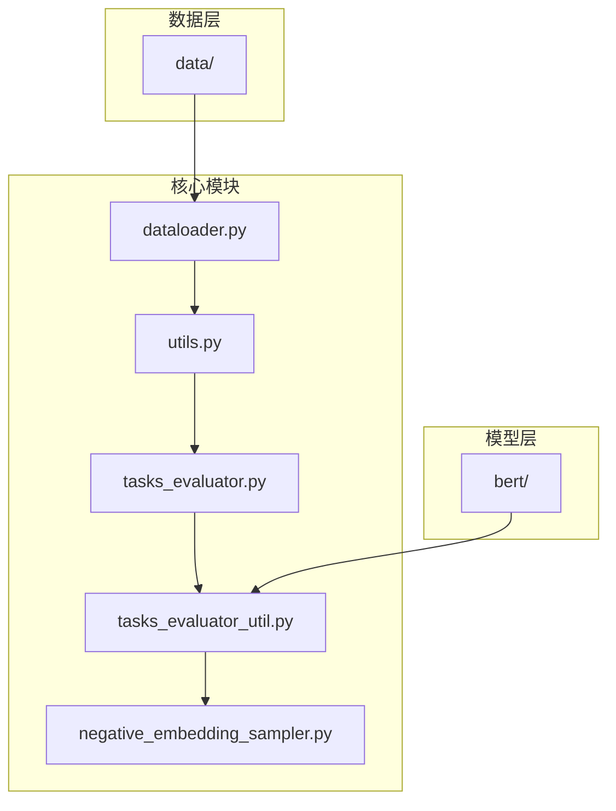
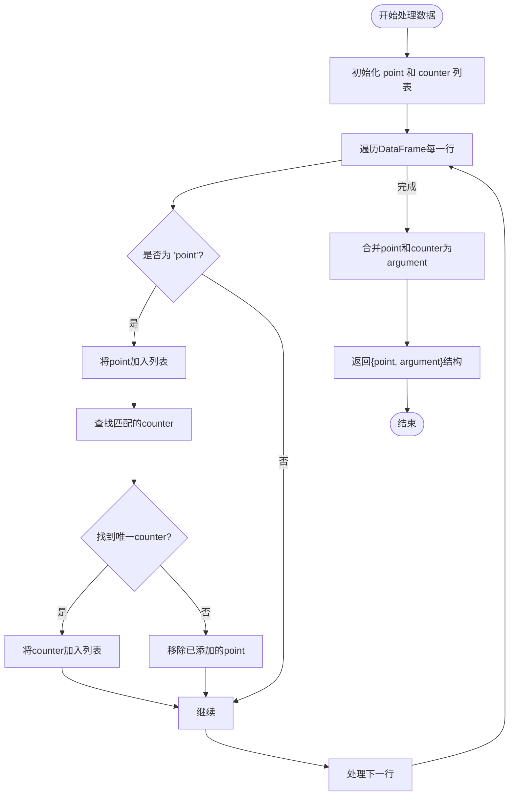
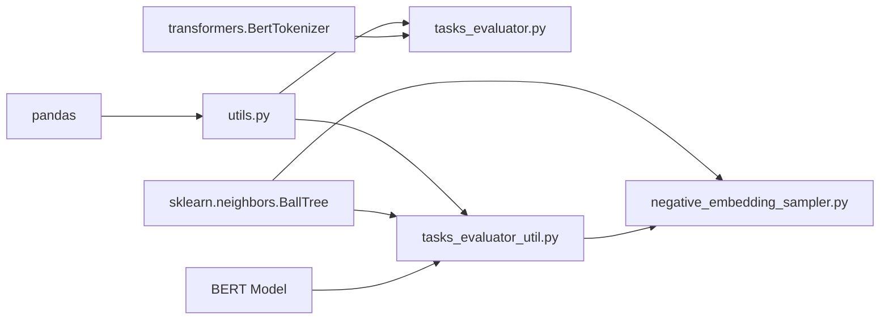

# EPA任务分组

<cite>
**本文档中引用的文件**  
- [utils.py](file://utils.py)
- [dataloader.py](file://dataloader.py)
- [tasks_evaluator.py](file://bert/tasks_evaluator.py)
- [tasks_evaluator_util.py](file://bert/tasks_evaluator_util.py)
- [negative_embedding_sampler.py](file://bert/negative_embedding_sampler.py)
</cite>

## 目录
1. [引言](#引言)
2. [项目结构](#项目结构)
3. [核心组件](#核心组件)
4. [EPA任务的全局检索评估机制](#epa任务的全局检索评估机制)
5. [split_point_argument_for_entire_portal函数的数据处理逻辑](#split_point_argument_for_entire_portal函数的数据处理逻辑)
6. [EPA评估策略的优势与挑战](#epa评估策略的优势与挑战)
7. [依赖关系分析](#依赖关系分析)
8. [性能考量](#性能考量)
9. [故障排除指南](#故障排除指南)
10. [结论](#结论)

## 引言
本文档系统阐述了在CounterArgumentRetrieval项目中，EPA（entire portal argument）任务所采用的全局检索评估机制。该机制通过`split_point_argument_for_entire_portal`函数实现，旨在为每个论点（point）从整个语料库中查找其精确匹配的反论点（counter），并构建统一的检索库。此策略代表最开放的评估场景，要求模型具备跨主题、跨立场从全量数据中识别相关论点的能力。

## 项目结构
项目结构以模块化方式组织，主要包含BERT模型实现、数据加载、任务评估和工具函数等组件。数据存储于`data/`目录下，按训练、验证和测试集划分。核心逻辑分布在`utils.py`和`bert/`子模块中，其中`utils.py`定义了多种分组与拆分策略。

**Diagram sources**
- [dataloader.py](file://dataloader.py#L6)
- [utils.py](file://utils.py#L234)
- [tasks_evaluator.py](file://bert/tasks_evaluator.py#L4)

**Section sources**
- [dataloader.py](file://dataloader.py#L1-L87)
- [config.py](file://config.py#L3-L5)

## 核心组件
系统的核心组件包括数据加载器、分组拆分策略、任务评估器和负样本采样器。`DataLoader`负责从文件系统读取原始文本数据并构建成结构化DataFrame；`utils.py`中的`group_and_split`函数根据不同的评估任务（如sdoc、epa等）调用相应的分组与拆分方法；`tasks_evaluator.py`集成所有任务的评估流程；`BallTreeEvaluater`用于高效检索最近邻样本以评估模型性能。

**Section sources**
- [dataloader.py](file://dataloader.py#L11-L87)
- [utils.py](file://utils.py#L259-L295)
- [tasks_evaluator.py](file://bert/tasks_evaluator.py#L27-L36)

## EPA任务的全局检索评估机制
EPA任务代表“entire portal argument”，即在整个语料库范围内进行论点检索评估。与其他限制在特定领域或主题内的评估方式不同，EPA不进行任何预分组，直接在未分组的全量数据上运行。其目标是评估模型是否具备从整个语料库中识别与给定论点相关的反论点的能力。

该机制通过`split_point_argument_for_entire_portal`函数实现，其核心思想是：对于每一个标记为“point”的论点，查找具有相同`utterence_id`、`stance`、`domain`和`argumentation_title`的“counter”作为其精确匹配项。一旦找到匹配的counter，就将其与原始point合并，形成一个统一的argument检索库。

这种策略模拟了真实世界中开放域论点检索的场景，要求模型不仅理解局部上下文，还需具备跨文档、跨主题的语义匹配能力。

**Section sources**
- [utils.py](file://utils.py#L234-L255)
- [tasks_evaluator.py](file://bert/tasks_evaluator.py#L35-L36)

## split_point_argument_for_entire_portal函数的数据处理逻辑
`split_point_argument_for_entire_portal`函数是EPA评估机制的核心实现。其处理逻辑如下：

1. 遍历输入的DataFrame集合（通常为训练、验证或测试集）
2. 对每个DataFrame，初始化两个空列表：`point`和`counter`
3. 遍历DataFrame中的每一行：
   - 如果当前行为“point”类型，则将其加入`point`列表
   - 使用`utterence_id`、`stance`、`domain`和`argumentation_title`作为复合键，在同一DataFrame中查找对应的“counter”
   - 若找到唯一匹配项，则将其加入`counter`列表；否则，将之前加入的“point”移除（确保点-反点配对完整性）
4. 将所有找到的`counter`与`point`合并为`argument`列表
5. 返回包含`point`和`argument`的字典结构

该函数的关键在于其匹配条件的严格性：必须同时满足`utterence_id`、`stance`、`domain`和`argumentation_title`四个字段完全一致，才能构成有效配对。这确保了检索结果的精确性。

**Diagram sources**
- [utils.py](file://utils.py#L234-L255)

**Section sources**
- [utils.py](file://utils.py#L234-L255)

## EPA评估策略的优势与挑战
### 优势
1. **全面性**：评估模型在整个语料库上的检索能力，避免局部偏差
2. **真实性**：更贴近实际应用场景，用户可能在任何上下文中提出论点
3. **鲁棒性检验**：迫使模型学习更通用的语义表示，而非依赖特定主题的表面特征
4. **高挑战性**：提供最严格的性能基准，有助于区分模型的真实能力

### 挑战
1. **计算复杂度高**：需要在大规模语料库中进行检索，对效率要求高
2. **噪声干扰**：全量数据中存在大量无关内容，增加误匹配风险
3. **稀疏性问题**：某些`utterence_id`可能在全局范围内无匹配counter
4. **过拟合风险**：模型可能过度依赖特定字段（如utterence_id）而非语义理解

该策略通过`BallTreeEvaluater`等近邻搜索技术缓解计算压力，并依赖BERT等深度模型提取高维语义特征来应对噪声和稀疏性问题。

**Section sources**
- [utils.py](file://utils.py#L234-L255)
- [negative_embedding_sampler.py](file://bert/negative_embedding_sampler.py#L48-L92)

## 依赖关系分析
系统各组件间存在清晰的依赖关系。`tasks_evaluator.py`依赖`utils.py`中的`group_and_split`函数来构建不同任务的数据结构；`utils.py`依赖`pandas`进行数据操作；`tasks_evaluator_util.py`依赖`BallTree`进行高效近邻搜索；所有模块最终依赖BERT模型进行语义编码。

**Diagram sources**
- [utils.py](file://utils.py#L259)
- [tasks_evaluator.py](file://bert/tasks_evaluator.py#L7)
- [negative_embedding_sampler.py](file://bert/negative_embedding_sampler.py#L6)

**Section sources**
- [utils.py](file://utils.py#L259-L295)
- [tasks_evaluator.py](file://bert/tasks_evaluator.py#L2-L37)
- [negative_embedding_sampler.py](file://bert/negative_embedding_sampler.py#L1-L92)

## 性能考量
EPA评估机制在性能方面面临主要挑战是检索效率。由于需要在全量数据上进行搜索，时间复杂度较高。系统通过以下方式优化性能：
- 使用Ball Tree数据结构加速最近邻搜索
- 批量处理embedding提取，减少GPU调用开销
- 缓存已计算的embedding结果
- 限制检索top-k范围，平衡精度与效率

尽管如此，在大规模语料库上运行EPA评估仍可能耗时较长，建议在高性能计算环境中执行。

## 故障排除指南
### 常见问题
1. **找不到匹配的counter**：检查`utterence_id`、`stance`、`domain`和`argumentation_title`是否完全一致
2. **数据加载失败**：确认`data/`目录结构符合预期，文件编码为UTF-8
3. **内存溢出**：减少batch size或使用更小的模型
4. **检索精度低**：检查Ball Tree参数设置，考虑调整leaf_size

### 调试建议
- 使用`logger`函数记录关键步骤的中间结果
- 在小规模数据子集上验证逻辑正确性
- 检查DataFrame分组后的数据完整性

**Section sources**
- [utils.py](file://utils.py#L297-L304)
- [dataloader.py](file://dataloader.py#L59-L68)

## 结论
EPA任务的全局检索评估机制通过`split_point_argument_for_entire_portal`函数实现了在未分组全量数据上的精确论点-反论点匹配。该策略构建了一个统一的argument检索库，代表最开放的评估场景，对模型的语义理解能力和跨文档检索能力提出了最高要求。虽然面临计算复杂度和噪声干扰等挑战，但通过Ball Tree等高效搜索算法和BERT等先进语义模型，系统能够有效评估模型在真实开放环境下的性能表现。这一机制为论点检索系统的研发提供了严格的基准测试框架。