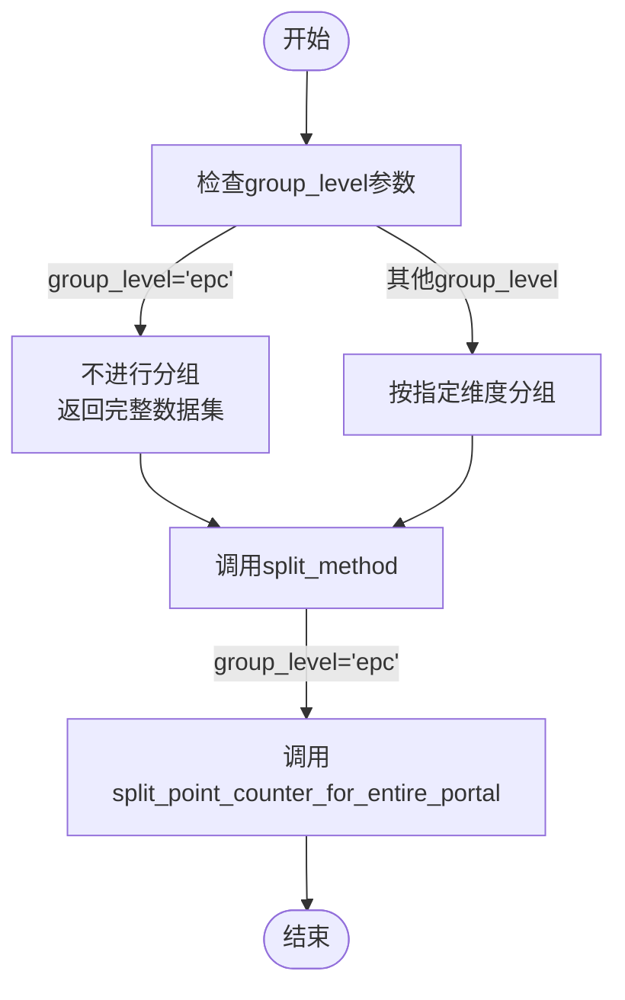
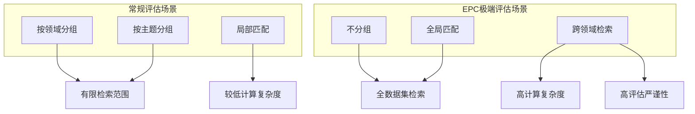
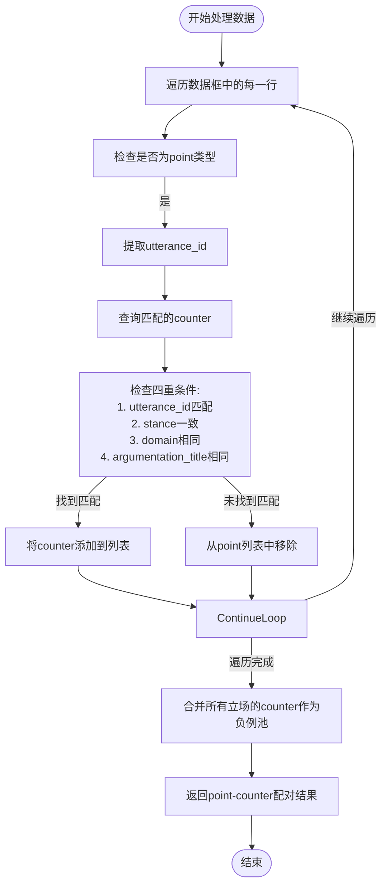

# EPC任务分组

<cite>
**本文档中引用的文件**
- [tasks_evaluator.py](file://bert/tasks_evaluator.py)
- [tasks_evaluator_util.py](file://bert/tasks_evaluator_util.py)
- [dataloader.py](file://dataloader.py)
- [utils.py](file://utils.py)
</cite>

## 目录
1. [引言](#引言)
2. [EPC任务分组机制](#epc任务分组机制)
3. [极端评估场景设计](#极端评估场景设计)
4. [全局匹配函数分析](#全局匹配函数分析)
5. [正负样本构建策略](#正负样本构建策略)
6. [评估严谨性与计算复杂度权衡](#评估严谨性与计算复杂度权衡)

## 引言
本文档全面解析EPC（Entire Portal Counter）任务的极端评估场景设计。当group_level='epc'时，系统采用特殊的分组与分割策略，旨在测试模型在全数据集范围内进行精确反论点检索的能力。该策略通过全局匹配机制，基于多重条件精确配对论点与反论点，并构建具有挑战性的负例池。

**Section sources**
- [tasks_evaluator.py](file://bert/tasks_evaluator.py#L27-L37)
- [tasks_evaluator_util.py](file://bert/tasks_evaluator_util.py#L14-L24)

## EPC任务分组机制
在EPC任务中，分组机制的设计与其他任务有本质区别。当group_level设置为'epc'时，group_method函数不会对数据进行任何实际分组操作，而是返回完整的数据集。这种设计确保了评估过程在整个数据集范围内进行，而非局限于特定主题或领域。

**Diagram sources**
- [utils.py](file://utils.py#L259-L274)

**Section sources**
- [utils.py](file://utils.py#L259-L274)

## 极端评估场景设计
EPC任务代表了一种极端的评估场景，其核心目标是测试模型在最大可能范围内进行反论点检索的能力。与基于主题或领域的局部评估不同，EPC评估要求模型能够跨越所有领域、所有主题，从整个数据集中识别出正确的反论点。

这种设计模拟了真实世界中信息检索的挑战：用户提出的论点可能涉及任何领域，而系统需要从海量异构数据中找到最相关的反驳观点。EPC评估因此成为衡量模型泛化能力和跨领域推理能力的重要指标。

**Diagram sources**
- [utils.py](file://utils.py#L267)
- [dataloader.py](file://dataloader.py#L61-L67)

## 全局匹配函数分析
当group_level='epc'时，split_method会调用split_point_counter_for_entire_portal函数执行全局匹配。该函数基于四重条件精确配对论点与反论点：

1. **utterance_id**: 确保论点与反论点属于同一话语对
2. **stance**: 确保立场一致（pro与pro，con与con）
3. **domain**: 确保领域相同
4. **argumentation_title**: 确保论证主题相同

**Diagram sources**
- [utils.py](file://utils.py#L194-L231)

**Section sources**
- [utils.py](file://utils.py#L194-L231)

## 正负样本构建策略
EPC任务的样本构建策略体现了其评估的严谨性。正样本通过四重条件严格匹配获得，确保了配对的准确性。而负样本则采用更具挑战性的构建方式：

所有其他立场的样本被合并为一个统一的负例池。这意味着对于一个pro立场的论点，其负例不仅包括同主题下的其他pro反论点，还包括所有con立场的论点与反论点。这种设计极大地增加了检索难度，迫使模型学习更精细的语义区别。

该策略的优势在于：
- **高严谨性**: 模型必须区分语义上可能非常接近的样本
- **强泛化能力测试**: 模型需要理解跨立场的语义关系
- **真实场景模拟**: 更接近实际应用中噪声数据的分布

**Section sources**
- [utils.py](file://utils.py#L227-L230)

## 评估严谨性与计算复杂度权衡
EPC任务的设计体现了评估严谨性与计算复杂度之间的显著权衡。一方面，全局匹配和统一负例池的设计极大地提高了评估的严谨性，能够全面测试模型的检索能力。另一方面，这种设计也带来了较高的计算复杂度。

计算复杂度主要体现在：
- **匹配过程**: 需要在整个数据集中进行四重条件匹配
- **检索空间**: 负例池包含所有其他样本，检索空间最大
- **计算资源**: 需要更多的内存和计算时间

尽管存在计算成本，但这种权衡是必要的。EPC评估提供了一个"压力测试"环境，能够揭示模型在极限条件下的表现，为模型改进提供有价值的反馈。在实际应用中，可以根据需求在不同group_level之间选择，平衡评估效率与严谨性。

**Section sources**
- [utils.py](file://utils.py#L194-L231)
- [tasks_evaluator.py](file://bert/tasks_evaluator.py#L27-L37)