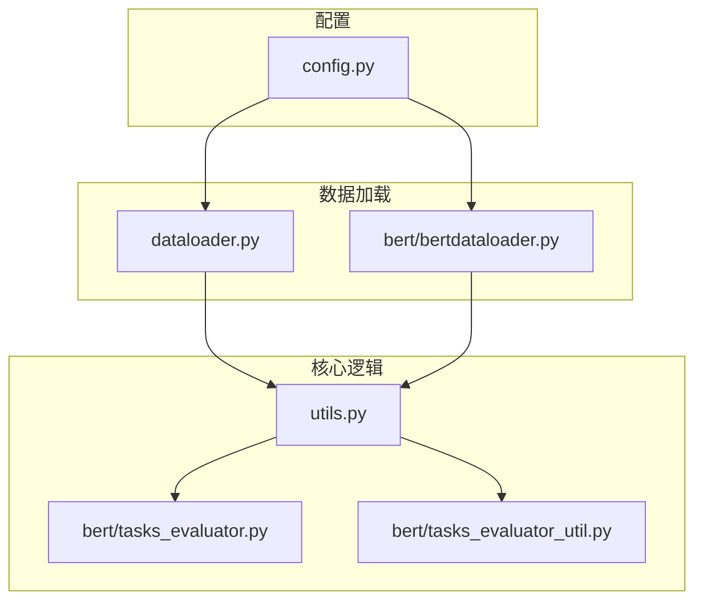
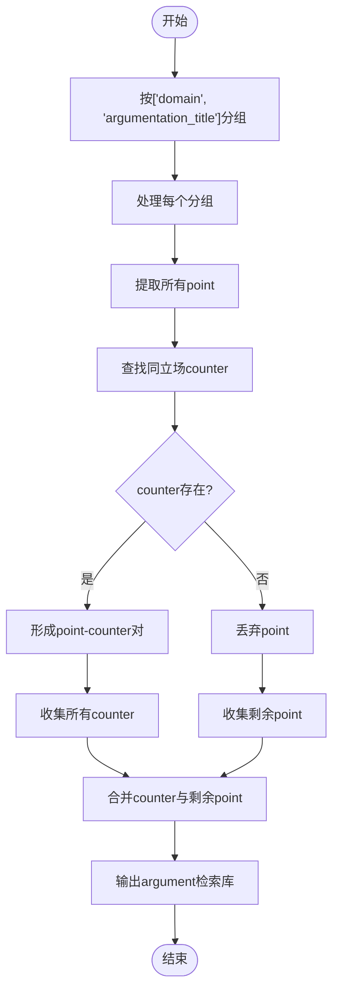
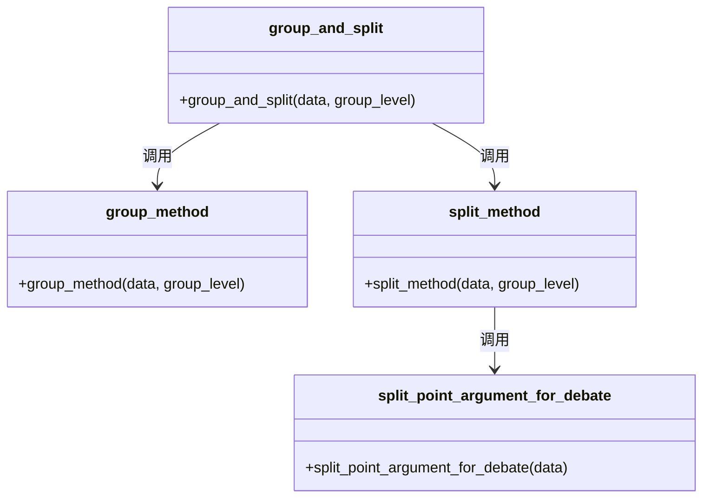
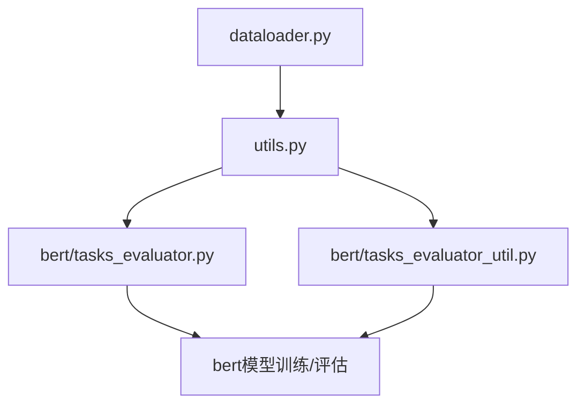

# SDA任务分组

<cite>
**本文档引用的文件**  
- [dataloader.py](file://dataloader.py)
- [utils.py](file://utils.py)
- [bert/tasks_evaluator.py](file://bert/tasks_evaluator.py)
- [bert/tasks_evaluator_util.py](file://bert/tasks_evaluator_util.py)
- [bert/bertdataloader.py](file://bert/bertdataloader.py)
</cite>

## 目录
1. [简介](#简介)
2. [项目结构](#项目结构)
3. [核心组件](#核心组件)
4. [架构概述](#架构概述)
5. [详细组件分析](#详细组件分析)
6. [依赖分析](#依赖分析)
7. [性能考虑](#性能考虑)
8. [故障排除指南](#故障排除指南)
9. [结论](#结论)

## 简介
本文档详细说明了SDA任务中数据的分组与拆分流程。重点描述了`group_method`如何依据`['domain', 'argumentation_title']`对数据进行分组，以及`split_method`如何调用`split_point_argument_for_debate`函数，将每个立场的point与其对应的counter配对，并将剩余的point和counter合并为统一的argument检索库。该策略旨在测试模型从混合文本池中检索相关反论点的能力，并分析其在开放域检索场景下的适用性。

## 项目结构
项目结构以模块化方式组织，主要分为数据加载、BERT模型集成、工具函数和配置文件。数据处理逻辑集中在根目录和`bert`子目录中，其中`dataloader.py`负责原始数据读取，`utils.py`包含核心分组与拆分逻辑，`tasks_evaluator.py`负责任务级别的数据组织。

**Diagram sources**  
- [dataloader.py](file://dataloader.py#L1-L87)
- [utils.py](file://utils.py#L1-L304)
- [bert/tasks_evaluator.py](file://bert/tasks_evaluator.py#L1-L37)

**Section sources**  
- [dataloader.py](file://dataloader.py#L1-L87)
- [config.py](file://config.py#L1-L11)

## 核心组件
核心组件包括数据加载器、分组方法、拆分方法以及任务评估器。`DataLoader`类从文件系统读取结构化辩论数据，`group_method`根据指定层级（如sda）对数据进行分组，`split_method`则调用相应的拆分函数（如`split_point_argument_for_debate`）进行数据重组，最终由`tasks_evaluator`统一调度生成8种不同任务配置的数据集。

**Section sources**  
- [utils.py](file://utils.py#L259-L295)
- [dataloader.py](file://dataloader.py#L11-L87)
- [bert/tasks_evaluator.py](file://bert/tasks_evaluator.py#L27-L37)

## 架构概述
系统整体架构遵循数据流模式：原始文本数据 → DataFrame结构化 → 分组（group_method）→ 拆分（split_method）→ 任务数据集生成 → 嵌入提取与评估。分组与拆分过程是核心预处理阶段，决定了后续检索任务的构造方式。

**Diagram sources**  
- [dataloader.py](file://dataloader.py#L11-L87)
- [utils.py](file://utils.py#L259-L295)
- [bert/tasks_evaluator.py](file://bert/tasks_evaluator.py#L27-L37)

## 详细组件分析

### SDA分组与拆分机制分析
SDA任务的分组策略基于`domain`和`argumentation_title`两个维度，确保每个数据块包含同一主题下的所有辩论内容。拆分阶段调用`split_point_argument_for_debate`函数，其核心逻辑如下：遍历数据中所有`utterence_type`为`point`的条目，查找具有相同`utterence_id`且`stance`一致的`counter`，若存在则配对成功，否则丢弃该`point`。最终将所有成功配对的`counter`与剩余的`point`合并为`argument`检索库。

#### 分组逻辑流程图

**Diagram sources**  
- [utils.py](file://utils.py#L270-L274)
- [utils.py](file://utils.py#L170-L192)

#### 拆分函数调用关系

**Diagram sources**  
- [utils.py](file://utils.py#L291-L295)
- [utils.py](file://utils.py#L278-L289)

**Section sources**  
- [utils.py](file://utils.py#L170-L192)
- [utils.py](file://utils.py#L259-L295)

### 数据结构变换示例
以单个`argumentation_title`下的数据为例，输入数据包含多个`point`和`counter`条目，经过`split_point_argument_for_debate`处理后：
- 输入：N个`point`条目，M个`counter`条目（部分与`point`配对）
- 处理：仅保留能成功配对的`point`，收集所有配对成功的`counter`
- 输出：`point`列表（已配对）和`argument`列表（`counter` + 未配对`point`）

此结构设计使得模型需从混合的`argument`池中检索与给定`point`最相关的反论点，模拟真实开放域检索场景。

**Section sources**  
- [utils.py](file://utils.py#L170-L192)
- [dataloader.py](file://dataloader.py#L61-L67)

## 依赖分析
系统依赖关系清晰，`tasks_evaluator`模块依赖`utils.py`中的`group_and_split`函数，而`utils.py`又依赖`dataloader.py`生成的DataFrame结构。BERT相关模块通过`bertdataloader.py`间接依赖核心数据处理逻辑。

**Diagram sources**  
- [dataloader.py](file://dataloader.py#L6-L8)
- [utils.py](file://utils.py#L3-L295)
- [bert/tasks_evaluator.py](file://bert/tasks_evaluator.py#L3-L4)

**Section sources**  
- [utils.py](file://utils.py#L1-L304)
- [bert/tasks_evaluator.py](file://bert/tasks_evaluator.py#L1-L37)

## 性能考虑
分组与拆分操作的时间复杂度主要由`pandas.DataFrame.groupby`和`iterrows()`决定。对于大规模数据集，建议优化`iterrows()`为向量化操作以提升性能。此外，`BallTreeEvaluater`使用Ball Tree结构进行近邻搜索，适用于高维向量空间的高效检索。

## 故障排除指南
常见问题包括数据文件路径错误、`.DS_Store`文件干扰、`utterence_id`不匹配导致配对失败等。可通过检查`dataloader.py`中的文件读取逻辑和`utils.py`中的配对条件来诊断。日志记录功能由`logger`函数提供，可用于追踪数据处理流程。

**Section sources**  
- [dataloader.py](file://dataloader.py#L19-L24)
- [utils.py](file://utils.py#L297-L304)

## 结论
SDA任务的分组与拆分流程设计精巧，通过`group_method`和`split_method`的组合，实现了从原始辩论数据到结构化检索任务的转换。`split_point_argument_for_debate`函数的实现有效测试了模型在混合文本池中检索相关反论点的能力，为开放域辩论系统提供了有价值的评估基准。