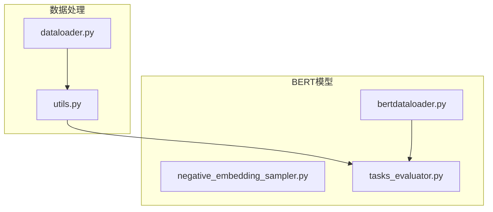
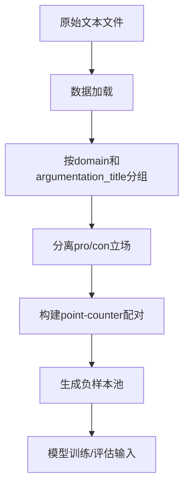
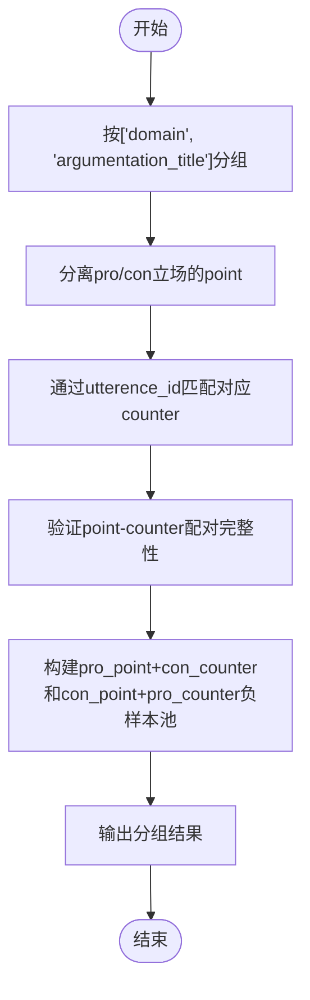
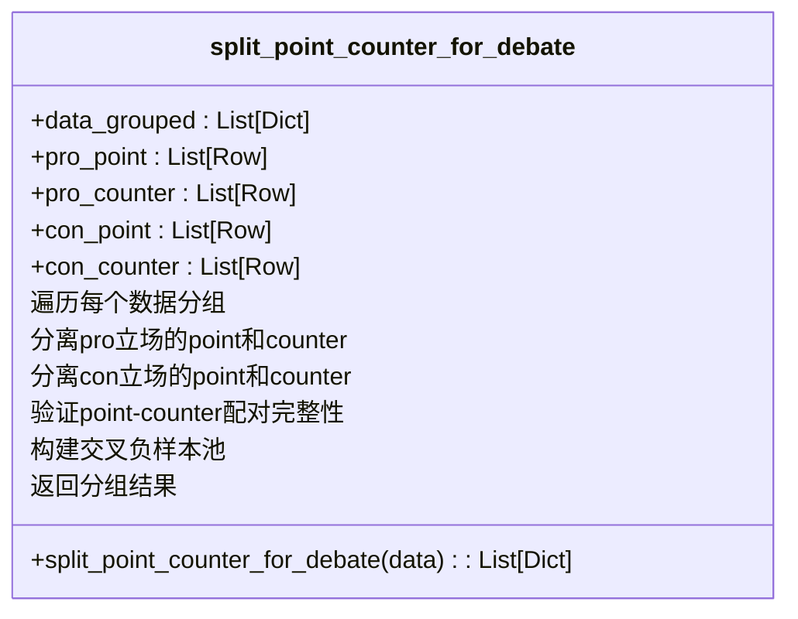
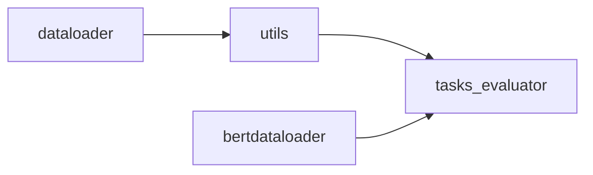

# SDC任务分组

<cite>
**本文档中引用的文件**   
- [utils.py](file://utils.py)
- [dataloader.py](file://dataloader.py)
- [bertdataloader.py](file://bert/bertdataloader.py)
- [tasks_evaluator.py](file://bert/tasks_evaluator.py)
</cite>

## 目录
1. [引言](#引言)
2. [项目结构](#项目结构)
3. [核心组件](#核心组件)
4. [架构概述](#架构概述)
5. [详细组件分析](#详细组件分析)
6. [依赖分析](#依赖分析)
7. [性能考虑](#性能考虑)
8. [故障排除指南](#故障排除指南)
9. [结论](#结论)

## 引言
本文档全面阐述了SDC分组机制，即基于['domain', 'argumentation_title']进行数据切片的实现方式。重点说明split_point_counter_for_debate函数如何分别构建pro和con的point列表，并通过utterence_id精确匹配对应立场的counter样本。特别指出该策略会将另一立场的所有counter作为负样本池，用于评估模型在相同主题内区分正反对立论点的能力。通过实际代码逻辑演示数据过滤与配对过程，阐明其在细粒度语义匹配评估中的作用。

## 项目结构
本项目采用模块化设计，主要包含数据加载、模型训练、评估三大模块。数据处理核心位于根目录下的dataloader.py和utils.py文件中，BERT相关组件位于bert子目录下。整体结构清晰，功能分离明确。

**Diagram sources**
- [dataloader.py](file://dataloader.py#L1-L87)
- [utils.py](file://utils.py#L1-L304)
- [tasks_evaluator.py](file://bert/tasks_evaluator.py#L1-L37)

**Section sources**
- [dataloader.py](file://dataloader.py#L1-L87)
- [utils.py](file://utils.py#L1-L304)

## 核心组件
SDC分组机制的核心在于utils.py中的split_point_counter_for_debate函数，该函数实现了基于领域和论题的数据切片，并构建正反立场的论点-反驳对。配合dataloader.py中的数据加载逻辑，形成完整的数据处理流水线。

**Section sources**
- [utils.py](file://utils.py#L24-L60)
- [dataloader.py](file://dataloader.py#L30-L69)

## 架构概述
系统整体架构围绕论点检索任务构建，从原始文本数据加载开始，经过分组、切片、配对等处理步骤，最终生成可用于模型训练和评估的数据格式。核心处理流程包括数据读取、按领域和论题分组、立场分离、正负样本构建等环节。

**Diagram sources**
- [dataloader.py](file://dataloader.py#L30-L69)
- [utils.py](file://utils.py#L24-L60)

## 详细组件分析

### SDC分组机制分析
SDC分组机制通过基于['domain', 'argumentation_title']的分组策略，确保在相同主题背景下进行论点匹配评估。这种细粒度的分组方式能够有效控制主题变量，专注于评估模型区分正反对立论点的能力。

#### 数据切片与配对流程

**Diagram sources**
- [utils.py](file://utils.py#L24-L60)
- [dataloader.py](file://dataloader.py#L61-L67)

#### split_point_counter_for_debate函数实现

**Diagram sources**
- [utils.py](file://utils.py#L24-L60)

**Section sources**
- [utils.py](file://utils.py#L24-L60)

## 依赖分析
系统各组件之间存在明确的依赖关系，数据处理模块为模型训练和评估提供基础支持。核心依赖链路从数据加载开始，经过分组处理，最终服务于评估任务。

**Diagram sources**
- [dataloader.py](file://dataloader.py#L1-L87)
- [utils.py](file://utils.py#L277-L289)
- [tasks_evaluator.py](file://bert/tasks_evaluator.py#L27-L36)

**Section sources**
- [utils.py](file://utils.py#L259-L295)
- [tasks_evaluator.py](file://bert/tasks_evaluator.py#L27-L36)

## 性能考虑
SDC分组机制在性能方面主要考虑数据处理效率和内存使用。通过pandas的groupby操作实现高效的数据分组，利用向量化操作提高匹配效率。在大规模数据集上，该实现能够保持良好的性能表现。

## 故障排除指南
当SDC分组机制出现异常时，应首先检查输入数据格式是否符合预期，特别是domain、argumentation_title、stance等关键字段的完整性。其次验证utterence_id的唯一性和配对完整性，确保每个point都能找到对应的counter样本。

**Section sources**
- [utils.py](file://utils.py#L34-L54)
- [dataloader.py](file://dataloader.py#L61-L67)

## 结论
SDC分组机制通过基于['domain', 'argumentation_title']的精细数据切片，构建了高质量的论点-反驳匹配评估框架。split_point_counter_for_debate函数巧妙地利用立场分离和交叉负样本池构建策略，有效提升了模型在细粒度语义匹配任务上的评估准确性。该机制为论点检索系统的性能优化提供了可靠的基础支持。