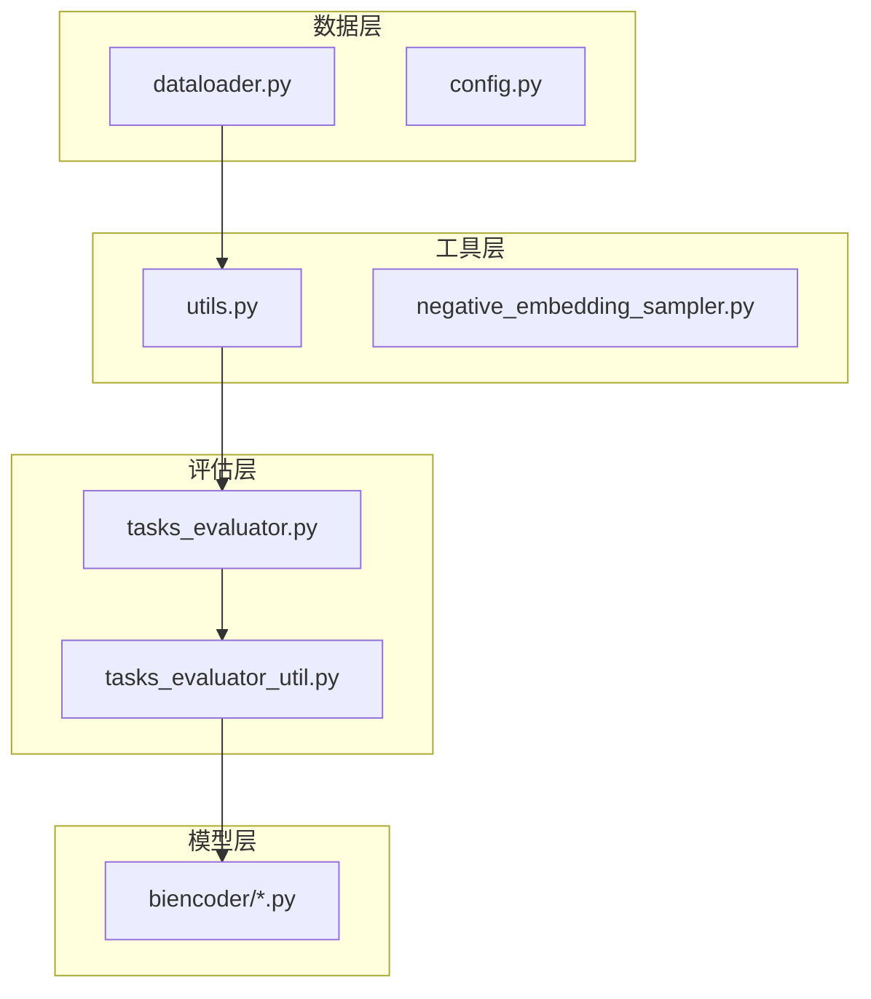
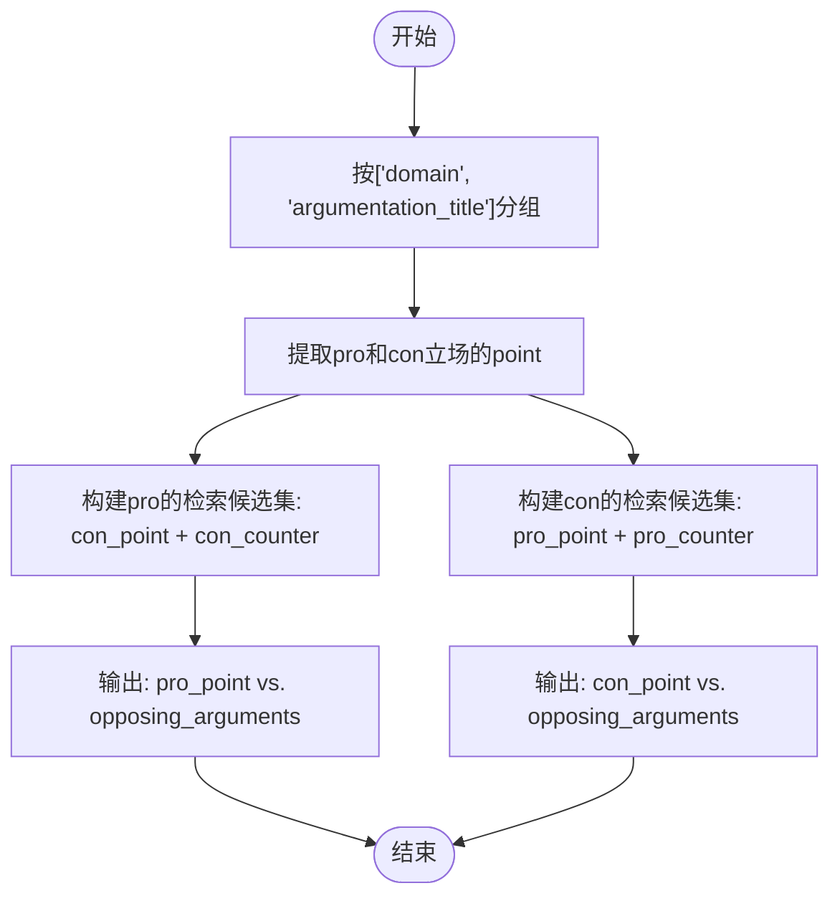
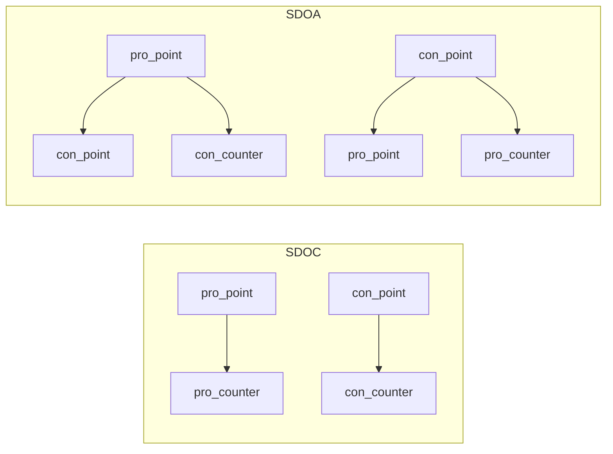
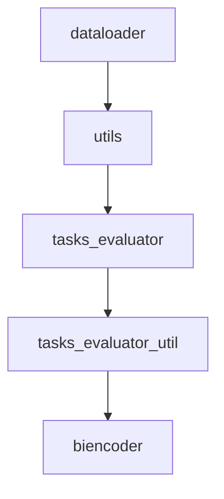

# SDOA任务分组

<cite>
**本文档中引用的文件**  
- [dataloader.py](file://dataloader.py)
- [utils.py](file://utils.py)
- [tasks_evaluator.py](file://bert/tasks_evaluator.py)
- [tasks_evaluator_util.py](file://bert/tasks_evaluator_util.py)
</cite>

## 目录
1. [引言](#引言)
2. [项目结构](#项目结构)
3. [核心组件](#核心组件)
4. [架构概述](#架构概述)
5. [详细组件分析](#详细组件分析)
6. [依赖分析](#依赖分析)
7. [性能考虑](#性能考虑)
8. [故障排除指南](#故障排除指南)
9. [结论](#结论)

## 引言
本文档深入讲解在 `group_level='sdoa'` 时的分组策略，即按 `['domain', 'argumentation_title']` 聚合数据。重点分析 `split_method` 如何调用 `split_point_opposing_argument_for_debate` 函数构建评估集：从同一主题下提取 pro/con 立场的 point，并将其与对立立场的全部 argument（包括 counter 和 point）组合成检索候选集。解释该策略在评估模型识别对立观点能力方面的设计意图，提供具体数据流转示例，并对比其与 sdoc 策略在样本覆盖范围上的差异。

## 项目结构
本项目用于论证检索任务，主要结构包括数据加载、BERT 模型训练与评估模块。核心数据处理逻辑位于根目录下的 `dataloader.py` 和 `utils.py`，而评估逻辑则集中在 `bert/` 子目录中，特别是 `tasks_evaluator.py` 和 `tasks_evaluator_util.py`。

**Diagram sources**
- [dataloader.py](file://dataloader.py#L1-L87)
- [utils.py](file://utils.py#L1-L304)
- [tasks_evaluator.py](file://bert/tasks_evaluator.py#L1-L37)

**Section sources**
- [dataloader.py](file://dataloader.py#L1-L87)
- [utils.py](file://utils.py#L1-L304)

## 核心组件
核心组件包括数据加载器 `DataLoader`，用于将原始文本数据转换为结构化 DataFrame；`group_method` 和 `split_method` 函数，分别负责按指定层级分组和划分数据；以及 `split_point_opposing_argument_for_debate` 函数，专门用于 SDOA 任务的评估集构建。

**Section sources**
- [dataloader.py](file://dataloader.py#L11-L87)
- [utils.py](file://utils.py#L259-L295)

## 架构概述
系统整体架构遵循数据加载 → 分组处理 → 评估执行的流程。首先通过 `DataLoader` 读取文件并构建 DataFrame，然后利用 `group_and_split` 统一接口根据 `group_level` 参数选择不同的分组与划分策略，最终在评估阶段使用 BallTree 等技术进行向量检索与排序。

**Diagram sources**
- [dataloader.py](file://dataloader.py#L11-L87)
- [utils.py](file://utils.py#L292-L295)
- [tasks_evaluator_util.py](file://bert/tasks_evaluator_util.py#L60-L101)

## 详细组件分析

### SDOA分组策略分析
当 `group_level='sdoa'` 时，系统使用 `['domain', 'argumentation_title']` 作为分组键，将同一主题下的所有立场（pro/con）的数据聚合在一起。随后调用 `split_point_opposing_argument_for_debate` 函数进行数据划分。

#### 数据划分逻辑

**Diagram sources**
- [utils.py](file://utils.py#L63-L99)

该策略的设计意图是评估模型在面对同一主题下对立观点时的检索能力。每个 pro 的 point 都需要从所有 con 的论点（包括 point 和 counter）中识别出最相关的反驳，反之亦然。这比仅匹配成对的 point-counter 更具挑战性，因为它要求模型理解立场的对立性而非简单的句对匹配。

#### 数据流转示例
假设有一个主题 "Climate Change" 属于 "Environment" 领域：
- pro_point: "Renewable energy reduces carbon emissions."
- con_point: "Solar panels are too expensive."
- con_counter: "Costs have decreased significantly in the last decade."

在 SDOA 策略下，当评估 pro_point 时，其检索候选集包含 con_point 和 con_counter，模型需从中识别出最能反驳 "Renewable energy reduces carbon emissions." 的论点。

**Section sources**
- [utils.py](file://utils.py#L63-L99)

### 与SDOC策略的对比分析
SDOC 策略按 `['domain', 'argumentation_title', 'stance']` 分组，其 `split_method` 使用 `split_point_counter_for_opposing_debate`，仅将 point 与同立场的 counter 配对。这导致评估范围局限于已标注的正例对，无法测试模型对未标注但语义相关的对立论点的识别能力。

相比之下，SDOA 策略扩大了候选集范围，将整个对立立场的所有论点都纳入检索空间，从而更全面地评估模型的对抗性检索能力。这种设计更贴近真实场景，即用户可能用任意方式反驳一个观点，而不仅限于预定义的反论。

**Diagram sources**
- [utils.py](file://utils.py#L4-L22)
- [utils.py](file://utils.py#L63-L99)

**Section sources**
- [utils.py](file://utils.py#L4-L22)
- [utils.py](file://utils.py#L63-L99)

## 依赖分析
系统依赖关系清晰：`tasks_evaluator.py` 依赖 `utils.py` 中的 `group_and_split` 函数，而 `utils.py` 又依赖 `dataloader.py` 提供的 DataFrame 数据结构。评估器 `BallTreeEvaluater` 依赖模型输出的嵌入向量，形成从数据到模型再到评估的完整链条。

**Diagram sources**
- [dataloader.py](file://dataloader.py#L6-L28)
- [utils.py](file://utils.py#L259-L295)
- [tasks_evaluator.py](file://bert/tasks_evaluator.py#L4)
- [tasks_evaluator_util.py](file://bert/tasks_evaluator_util.py#L3)

**Section sources**
- [utils.py](file://utils.py#L259-L295)
- [tasks_evaluator.py](file://bert/tasks_evaluator.py#L1-L37)

## 性能考虑
SDOA 策略由于候选集规模更大，在评估阶段需要进行更多的向量相似度计算，可能影响 BallTree 检索效率。建议在大规模数据集上使用近似最近邻（ANN）算法优化检索速度。

## 故障排除指南
若 SDOA 评估结果异常，应首先检查 `split_point_opposing_argument_for_debate` 函数的输入 DataFrame 是否正确包含所有立场的数据。其次验证分组键 `['domain', 'argumentation_title']` 是否能唯一标识主题，避免数据泄露。

**Section sources**
- [utils.py](file://utils.py#L63-L99)
- [dataloader.py](file://dataloader.py#L61-L67)

## 结论
SDOA 分组策略通过按领域和主题聚合数据，并构建对立立场的完整检索候选集，有效提升了模型评估的挑战性和实用性。相比 SDOC 策略，它更能反映模型在真实场景中识别和检索对立观点的能力，是论证挖掘任务中更为严格的评估标准。