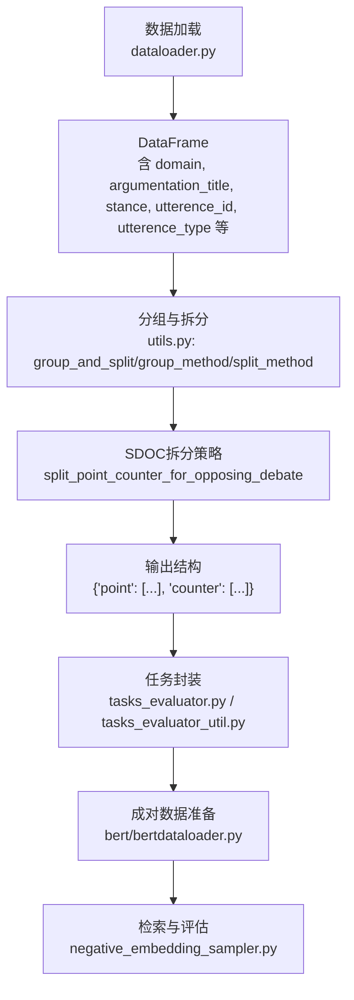
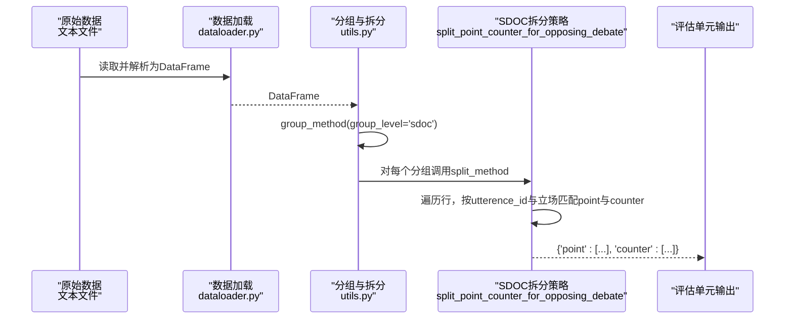
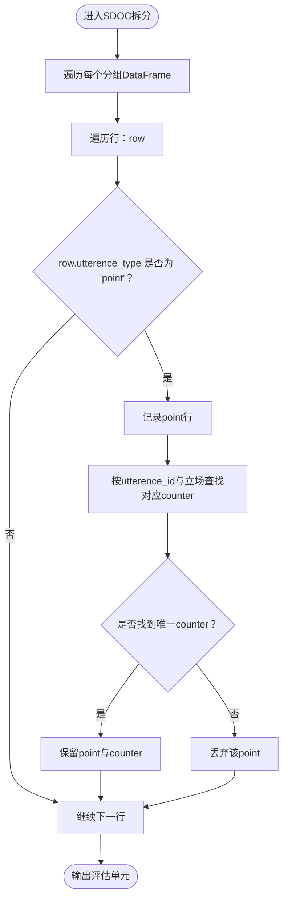
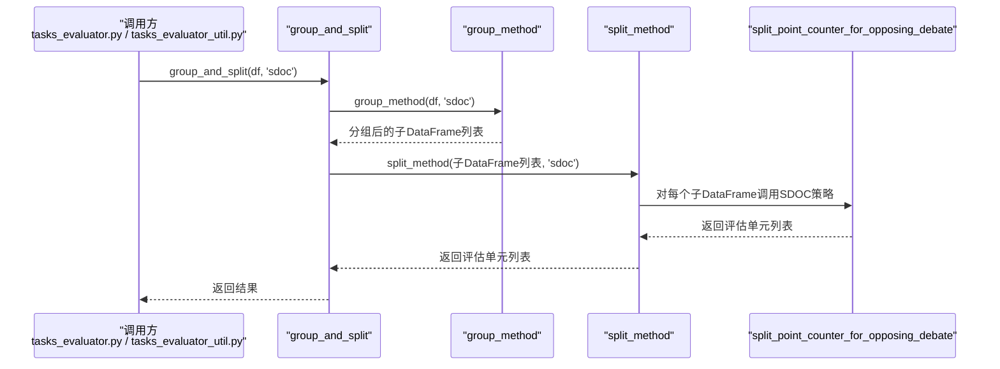
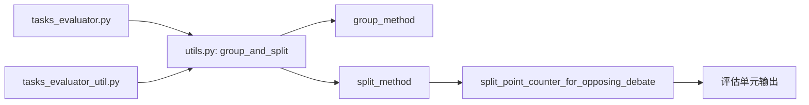

# SDOC任务分组

<cite>
**本文引用的文件列表**
- [utils.py](file://utils.py)
- [dataloader.py](file://dataloader.py)
- [tasks_evaluator.py](file://bert/tasks_evaluator.py)
- [tasks_evaluator_util.py](file://bert/tasks_evaluator_util.py)
- [bertdataloader.py](file://bert/bertdataloader.py)
- [negative_embedding_sampler.py](file://bert/negative_embedding_sampler.py)
- [README.md](file://README.md)
</cite>

## 目录
1. [引言](#引言)
2. [项目结构](#项目结构)
3. [核心组件](#核心组件)
4. [架构总览](#架构总览)
5. [详细组件分析](#详细组件分析)
6. [依赖关系分析](#依赖关系分析)
7. [性能考量](#性能考量)
8. [故障排查指南](#故障排查指南)
9. [结论](#结论)
10. [附录](#附录)

## 引言
本文件聚焦于SDOC任务分组场景，系统性解析group_and_split函数在group_level='sdoc'时的处理流程：如何基于['domain', 'argumentation_title', 'stance']三元组进行分组，形成独立评估单元；split_method在调用split_point_counter_for_opposing_debate时，如何为每个立场（pro/con）提取对应的point与counter样本对，并确保utterence_id匹配；并通过代码路径示例展示从输入DataFrame到输出{'point': [], 'counter': []}结构的转换过程。最后讨论该方法在跨辩论主题反论点检索场景下的应用价值与限制。

## 项目结构
围绕SDOC任务分组，涉及以下关键模块：
- 数据加载与预处理：dataloader.py负责将原始文本文件组织为DataFrame，包含领域、论辩标题、立场、utterence_id、utterence_type等字段。
- 分组与拆分工具：utils.py提供group_and_split、group_method、split_method及具体拆分策略（如split_point_counter_for_opposing_debate）。
- 任务封装与调用：bert/tasks_evaluator.py与bert/tasks_evaluator_util.py在多个任务维度上统一调用group_and_split(df, level)。
- 训练/评估数据准备：bert/bertdataloader.py提供按utterence_id聚合的成对数据转换，便于后续检索与分类。
- 检索与评估：bert/negative_embedding_sampler.py提供BallTree检索与Top-1准确率评估能力，支撑SDOC任务的下游应用。

图表来源
- [dataloader.py](file://dataloader.py#L30-L75)
- [utils.py](file://utils.py#L259-L296)
- [tasks_evaluator.py](file://bert/tasks_evaluator.py#L27-L37)
- [tasks_evaluator_util.py](file://bert/tasks_evaluator_util.py#L14-L24)
- [bertdataloader.py](file://bert/bertdataloader.py#L12-L25)
- [negative_embedding_sampler.py](file://bert/negative_embedding_sampler.py#L1-L92)

章节来源
- [README.md](file://README.md#L1-L7)
- [dataloader.py](file://dataloader.py#L30-L75)
- [utils.py](file://utils.py#L259-L296)
- [tasks_evaluator.py](file://bert/tasks_evaluator.py#L27-L37)
- [tasks_evaluator_util.py](file://bert/tasks_evaluator_util.py#L14-L24)
- [bertdataloader.py](file://bert/bertdataloader.py#L12-L25)
- [negative_embedding_sampler.py](file://bert/negative_embedding_sampler.py#L1-L92)

## 核心组件
- group_and_split(data, group_level)
  - 先按group_level指定的列进行分组，再调用对应拆分策略生成独立评估单元。
  - 在SDOC场景下，group_level='sdoc'，对应分组键为['domain', 'argumentation_title', 'stance']。
- group_method(data, group_level)
  - 将DataFrame按group_level映射的列集合进行分组，返回分组后的子DataFrame列表。
- split_method(data, group_level)
  - 根据group_level选择具体拆分函数，SDOC对应split_point_counter_for_opposing_debate。
- split_point_counter_for_opposing_debate(data)
  - 针对对立立场（pro/con）分别提取point与counter样本对，要求utterence_id一致且立场相同。

章节来源
- [utils.py](file://utils.py#L259-L296)

## 架构总览
SDOC任务的端到端流程如下：
- 输入：原始文本文件被解析为DataFrame，包含domain、argumentation_title、stance、utterence_id、utterence_type等字段。
- 分组：按['domain', 'argumentation_title', 'stance']三元组分组，形成独立评估单元。
- 拆分：对每个单元，依据utterence_id与立场，提取point与counter样本对，确保每条point都有对应立场相同的counter。
- 输出：每个评估单元输出为{'point': [...], 'counter': [...]}结构，便于后续检索与分类。

图表来源
- [dataloader.py](file://dataloader.py#L30-L75)
- [utils.py](file://utils.py#L259-L296)

## 详细组件分析

### 组件A：SDOC分组与拆分策略
- 分组键：['domain', 'argumentation_title', 'stance']
- 拆分策略：split_point_counter_for_opposing_debate
  - 针对每个分组（即每个(domain, argumentation_title, stance)组合），遍历行：
    - 若当前行为point，则记录该行，并以utterence_id为锚点，查找同一立场(stance)下是否存在对应counter。
    - 若存在唯一counter，则同时保留该point与counter；否则丢弃该point。
  - 最终输出为{'point': [...], 'counter': [...]}的列表，每个元素代表一个独立评估单元。

图表来源
- [utils.py](file://utils.py#L4-L22)

章节来源
- [utils.py](file://utils.py#L4-L22)

### 组件B：分组与拆分入口
- group_and_split(data, group_level)
  - 先group_method按group_level分组，再split_method调用对应拆分函数。
- 在SDOC场景下：
  - group_level='sdoc'
  - group_method映射到['domain', 'argumentation_title', 'stance']
  - split_method映射到split_point_counter_for_opposing_debate

图表来源
- [utils.py](file://utils.py#L259-L296)
- [tasks_evaluator.py](file://bert/tasks_evaluator.py#L27-L37)
- [tasks_evaluator_util.py](file://bert/tasks_evaluator_util.py#L14-L24)

章节来源
- [utils.py](file://utils.py#L259-L296)
- [tasks_evaluator.py](file://bert/tasks_evaluator.py#L27-L37)
- [tasks_evaluator_util.py](file://bert/tasks_evaluator_util.py#L14-L24)

### 组件C：输入DataFrame到输出结构的转换示例（代码路径）
- 输入DataFrame字段要点：
  - domain、argumentation_title、stance、utterence_id、utterence_type、text
- 输出结构：
  - 每个评估单元为字典{'point': [...], 'counter': [...]}
  - 其中point与counter均为DataFrame行对象列表，且每条point与对应counter共享相同的utterence_id与立场(stance)
- 关键实现位置：
  - 分组与拆分入口：[utils.py](file://utils.py#L259-L296)
  - SDOC拆分策略：[utils.py](file://utils.py#L4-L22)
  - 数据加载与字段来源：[dataloader.py](file://dataloader.py#L30-L75)

章节来源
- [utils.py](file://utils.py#L4-L22)
- [utils.py](file://utils.py#L259-L296)
- [dataloader.py](file://dataloader.py#L30-L75)

### 组件D：跨主题反论点检索的应用价值与限制
- 应用价值
  - 独立评估单元：按(domain, argumentation_title, stance)分组，确保不同主题与立场的样本相互隔离，避免信息泄露，提升评估的公平性与可比性。
  - 成对检索：通过utterence_id与立场匹配，形成稳定的point-counter对，便于在跨主题场景下进行反论点检索与排序。
  - 可扩展性：该策略可直接复用于其他任务级别（如sdoa、sdc、sda、stc、sta、epc、epa），便于统一框架下的多任务评估。
- 局限性
  - 数据完整性依赖：若某条point缺失对应立场相同的counter或utterence_id不匹配，则该point会被丢弃，可能导致有效样本减少。
  - 主题覆盖：仅在同主题内进行匹配，跨主题检索需额外设计策略（例如按domain或argumentation_title放宽匹配条件，但会引入主题间干扰）。
  - 平衡性：pro与con立场的样本数量不平衡时，可能影响评估指标的稳定性，需在采样或统计阶段进行平衡处理。

章节来源
- [utils.py](file://utils.py#L4-L22)
- [utils.py](file://utils.py#L259-L296)
- [dataloader.py](file://dataloader.py#L30-L75)

## 依赖关系分析
- 组件耦合
  - tasks_evaluator.py与tasks_evaluator_util.py共同依赖utils.py中的group_and_split，形成统一的任务数据准备入口。
  - utils.py内部通过level映射将group_level与具体拆分函数关联，降低调用方与实现细节的耦合。
- 外部依赖
  - 数据加载依赖pandas的groupby能力，保证分组与迭代的高效性。
  - 评估阶段依赖BallTree检索与分类器概率输出，支撑Top-1准确率等指标。

图表来源
- [tasks_evaluator.py](file://bert/tasks_evaluator.py#L27-L37)
- [tasks_evaluator_util.py](file://bert/tasks_evaluator_util.py#L14-L24)
- [utils.py](file://utils.py#L259-L296)

章节来源
- [tasks_evaluator.py](file://bert/tasks_evaluator.py#L27-L37)
- [tasks_evaluator_util.py](file://bert/tasks_evaluator_util.py#L14-L24)
- [utils.py](file://utils.py#L259-L296)

## 性能考量
- 分组复杂度：group_method基于pandas的groupby，时间复杂度近似O(N)，其中N为样本总数。
- 拆分复杂度：split_point_counter_for_opposing_debate对每个分组进行线性扫描，查找对应counter时依赖布尔索引，整体复杂度近似O(M)，M为分组内样本数。
- 内存占用：输出为行对象列表，内存占用与样本数量线性相关；建议在大规模数据上分批处理或采用惰性迭代策略。
- 评估阶段：BallTree检索与分类器推理为主要耗时环节，可通过GPU加速与批量推理优化。

## 故障排查指南
- 常见问题
  - 缺失counter：若某条point找不到唯一counter，该point会被丢弃。检查utterence_id与立场是否一致，以及数据是否完整。
  - 主题/立场不匹配：若domain或argumentation_title不一致，将导致无法在同一单元内匹配，需确认数据加载与字段解析逻辑。
  - 数据类型异常：确保utterence_type为字符串且值为'point'或'counter'，否则匹配失败。
- 定位方法
  - 在split_point_counter_for_opposing_debate中增加日志，打印未匹配的point及其utterence_id与立场，辅助定位缺失样本。
  - 使用group_method的中间结果检查分组是否符合预期，确认分组键顺序与内容正确。

章节来源
- [utils.py](file://utils.py#L4-L22)
- [utils.py](file://utils.py#L259-L296)

## 结论
SDOC任务分组通过['domain', 'argumentation_title', 'stance']三元组将数据切分为独立评估单元，并以split_point_counter_for_opposing_debate确保每条point与对应立场相同的counter按utterence_id严格匹配，形成稳定的point-counter对。该策略在跨主题反论点检索中具备良好的隔离性与可比性，但在数据完整性与样本平衡方面仍需关注。结合BallTree检索与分类器概率输出，可进一步完善SDOC任务的评估与应用。

## 附录
- 相关文件与职责
  - utils.py：分组与拆分核心逻辑，包括group_and_split、group_method、split_method与各拆分策略。
  - dataloader.py：数据加载与字段解析，提供domain、argumentation_title、stance、utterence_id、utterence_type等字段。
  - tasks_evaluator.py / tasks_evaluator_util.py：统一调用group_and_split，构建多任务评估数据。
  - bertdataloader.py：将DataFrame按utterence_id聚合为成对数据，便于检索与分类。
  - negative_embedding_sampler.py：BallTree检索与Top-1准确率评估，支撑下游应用。

章节来源
- [utils.py](file://utils.py#L259-L296)
- [dataloader.py](file://dataloader.py#L30-L75)
- [tasks_evaluator.py](file://bert/tasks_evaluator.py#L27-L37)
- [tasks_evaluator_util.py](file://bert/tasks_evaluator_util.py#L14-L24)
- [bertdataloader.py](file://bert/bertdataloader.py#L12-L25)
- [negative_embedding_sampler.py](file://bert/negative_embedding_sampler.py#L1-L92)