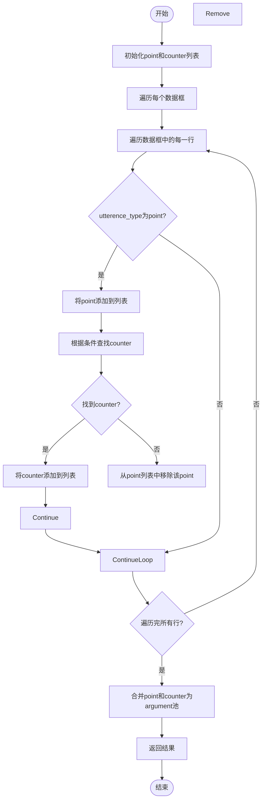
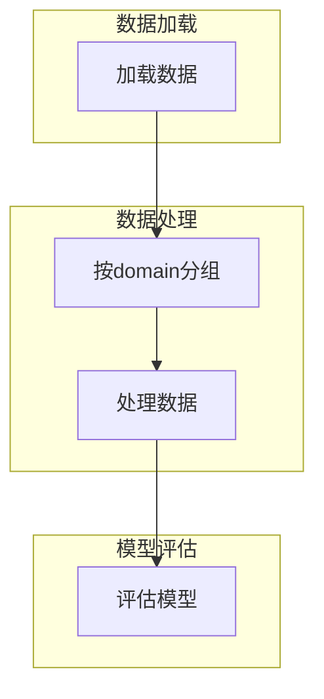
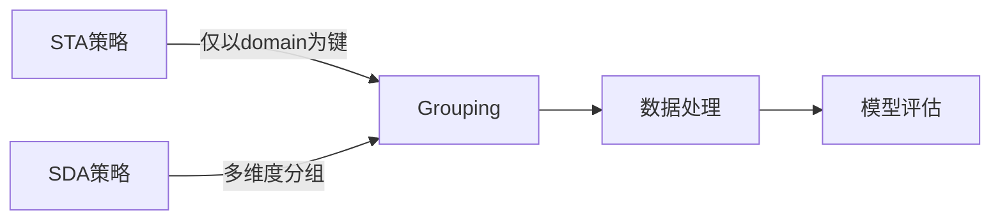

# STA任务分组

<cite>
**本文档中引用的文件**   
- [utils.py](file://utils.py)
- [dataloader.py](file://dataloader.py)
- [bertdataloader.py](file://bert/bertdataloader.py)
- [tasks_evaluator.py](file://bert/tasks_evaluator.py)
- [tasks_evaluator_util.py](file://bert/tasks_evaluator_util.py)
- [config.py](file://config.py)
</cite>

## 目录
1. [引言](#引言)
2. [STA任务分组策略](#sta任务分组策略)
3. [split_point_argument_for_theme函数分析](#split_point_argument_for_theme函数分析)
4. [评估集构建方法](#评估集构建方法)
5. [与SDA策略的比较](#与sda策略的比较)
6. [具体数据示例](#具体数据示例)
7. [结论](#结论)

## 引言
STA（Stance-based Topic Agnostic）任务是一种用于评估模型在大规模、跨主题语料中识别语义相关性的能力的评估策略。该策略通过特定的数据分组和处理方法，构建评估集以测试模型的检索性能。本文将详细描述STA任务的分组方式，阐明split_point_argument_for_theme函数的工作原理，并通过具体数据示例说明其构建评估集的方法。

## STA任务分组策略
STA任务的分组策略基于'domain'键进行数据划分。具体来说，数据首先按照'domain'字段进行分组，然后在每个领域内进行进一步处理。这种分组方式确保了同一领域内的所有point和counter能够被正确匹配，并用于构建正例对。同时，所有point和counter被合并为统一的argument池，用于后续的检索评估。

**Section sources**
- [utils.py](file://utils.py#L266)
- [dataloader.py](file://dataloader.py#L61)

## split_point_argument_for_theme函数分析
split_point_argument_for_theme函数是STA任务中用于数据处理的核心函数。该函数的主要功能是将同一领域内的所有point与counter（按立场匹配）组成正例对，并将全部point和counter合并为统一的argument池。

函数的工作流程如下：
1. 遍历输入数据中的每个数据框（df）。
2. 对于每个数据框，初始化point和counter列表。
3. 遍历数据框中的每一行，如果该行的'utterence_type'为'point'，则将其添加到point列表中。
4. 根据'utterence_id'、'utterence_type'、'stance'和'argumentation_title'查找对应的counter，并将其添加到counter列表中。
5. 如果未找到对应的counter，则从point列表中移除该point。
6. 将所有point和counter合并为统一的argument池。
7. 返回包含point和argument的字典列表。

**Diagram sources**
- [utils.py](file://utils.py#L147-L166)

**Section sources**
- [utils.py](file://utils.py#L147-L166)

## 评估集构建方法
STA任务的评估集构建方法主要包括以下几个步骤：
1. 数据加载：从指定目录加载训练、验证和测试数据。
2. 数据分组：按照'domain'字段对数据进行分组。
3. 数据处理：使用split_point_argument_for_theme函数处理每个分组内的数据，生成正例对和argument池。
4. 模型评估：使用处理后的数据对模型进行评估，计算检索性能指标。

**Diagram sources**
- [dataloader.py](file://dataloader.py#L12)
- [utils.py](file://utils.py#L147)

**Section sources**
- [dataloader.py](file://dataloader.py#L12)
- [utils.py](file://utils.py#L147)

## 与SDA策略的比较
STA策略与SDA（Stance-based Domain Agnostic）策略在数据分组和处理方法上存在一些异同。相同点在于两者都基于立场（stance）进行数据处理，并将point和counter合并为统一的argument池。不同点在于：
- STA策略仅以'domain'为键进行数据划分，而SDA策略可能涉及更多的分组维度。
- STA策略更注重跨主题语料中的语义相关性识别，而SDA策略可能更关注特定领域的性能。

**Diagram sources**
- [utils.py](file://utils.py#L266)
- [utils.py](file://utils.py#L284)

**Section sources**
- [utils.py](file://utils.py#L266)
- [utils.py](file://utils.py#L284)

## 具体数据示例
以下是一个具体的数据示例，展示了STA任务的分组和处理过程：

假设有一个数据框包含以下数据：
- domain: digital-freedoms
- argumentation_title: p-ip-internet-digital-freedoms-access-information-house-would-censor
- stance: pro
- utterence_id: pro01a
- utterence_type: point
- text: Governments have a moral duty to protect its citizens from harmful sites.

根据split_point_argument_for_theme函数的处理逻辑，该point将与同一领域内、立场相同的counter进行匹配，并最终与其他point和counter一起合并为统一的argument池。

**Section sources**
- [data\training\digital-freedoms\p-ip-internet-digital-freedoms-access-information-house-would-censor\pro\pro01a-point.txt](file://data/training/digital-freedoms/p-ip-internet-digital-freedoms-access-information-house-would-censor/pro/pro01a-point.txt)
- [data\training\digital-freedoms\p-ip-internet-digital-freedoms-access-information-house-would-censor\con\con01b-counter.txt](file://data/training/digital-freedoms/p-ip-internet-digital-freedoms-access-information-house-would-censor/con/con01b-counter.txt)

## 结论
STA任务的分组策略通过仅以'domain'为键进行数据划分，有效地构建了评估集，用于测试模型在大规模、跨主题语料中识别语义相关性的能力。split_point_argument_for_theme函数在这一过程中起到了关键作用，确保了正例对的正确匹配和argument池的统一构建。与SDA策略相比，STA策略更注重跨主题的语义相关性识别，为模型评估提供了新的视角。