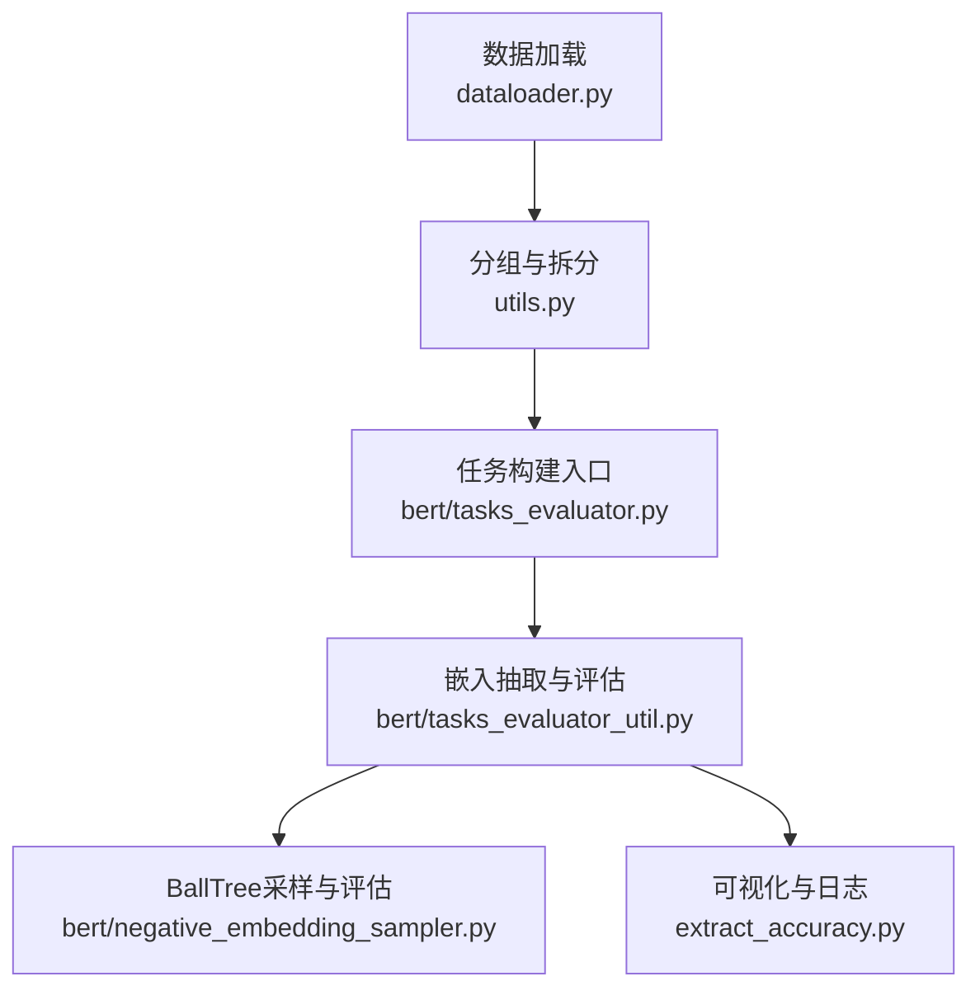
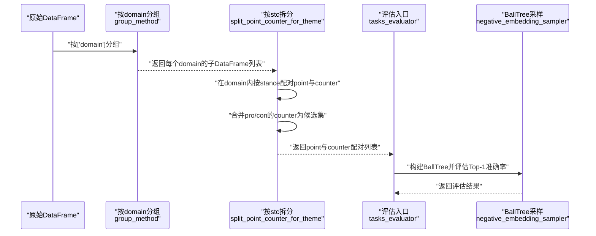
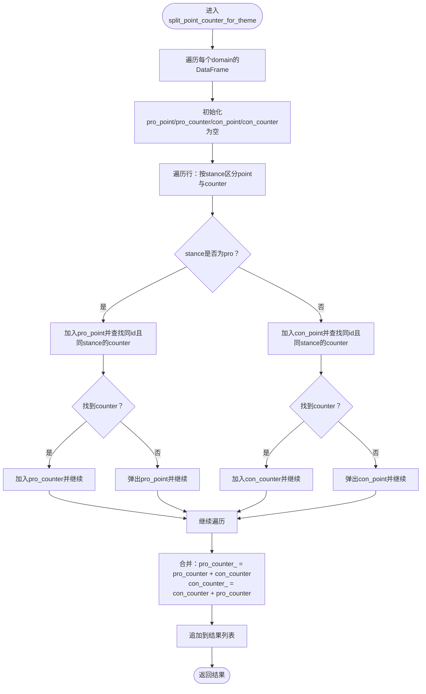
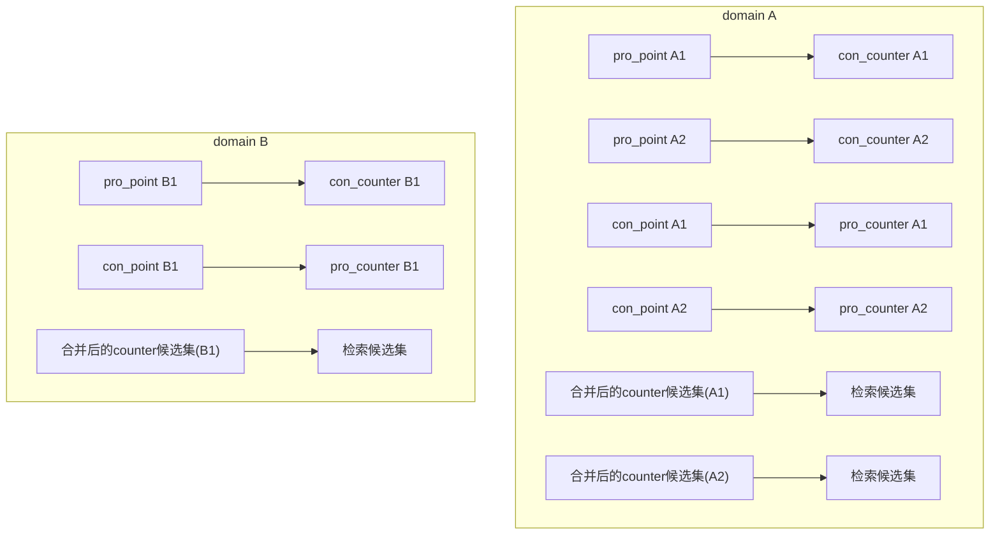
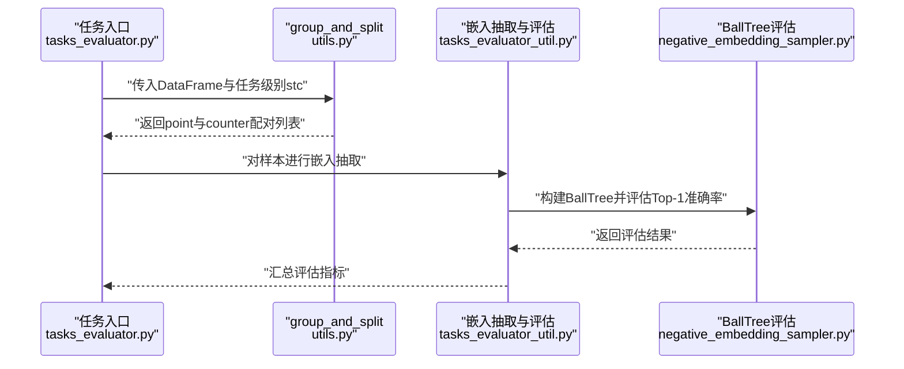
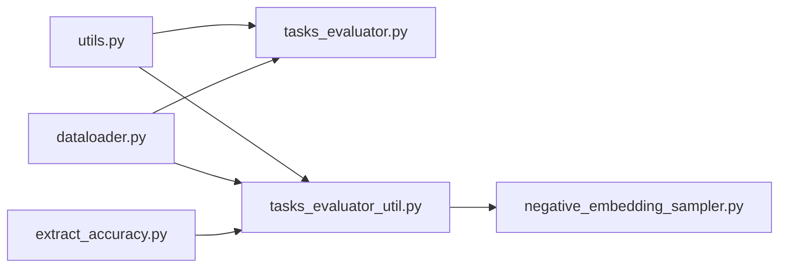

# STC任务分组

<cite>
**本文引用的文件**
- [utils.py](file://utils.py)
- [tasks_evaluator.py](file://bert/tasks_evaluator.py)
- [tasks_evaluator_util.py](file://bert/tasks_evaluator_util.py)
- [dataloader.py](file://dataloader.py)
- [bertdataloader.py](file://bert/bertdataloader.py)
- [negative_embedding_sampler.py](file://bert/negative_embedding_sampler.py)
- [extract_accuracy.py](file://extract_accuracy.py)
</cite>

## 目录
1. [引言](#引言)
2. [项目结构](#项目结构)
3. [核心组件](#核心组件)
4. [架构总览](#架构总览)
5. [详细组件分析](#详细组件分析)
6. [依赖关系分析](#依赖关系分析)
7. [性能考量](#性能考量)
8. [故障排查指南](#故障排查指南)
9. [结论](#结论)
10. [附录](#附录)

## 引言
本文件围绕STC（“仅按领域 domain 分组”的任务）展开，系统解析其在反论点检索中的实现机制与评估策略。STC任务的核心目标是在“领域”这一粗粒度维度上对样本进行分组，从而评估模型在广泛主题集合中定位反论点的能力，强调模型的跨主题泛化能力。本文将重点阐述：
- split_point_counter_for_theme 函数如何在领域级别内提取 point 与 counter 的配对；
- 如何在 argumentation_title 与 stance 维度上跨主题合并 counter，形成检索候选集；
- 跨主题样本整合过程的流程与潜在噪声来源；
- 该策略对模型泛化性能的要求及其实证评估方法。

## 项目结构
该项目采用“数据加载 -> 分组与拆分 -> 模型评估”的分层设计。关键路径如下：
- 数据加载：从本地目录读取多主题、多辩论标题、多立场的对话片段，生成统一的DataFrame。
- 分组与拆分：根据任务级别（如 stc）对数据进行粗粒度分组，并在组内执行 point 与 counter 的配对与合并。
- 模型评估：基于配对后的样本，利用嵌入与BallTree进行Top-1准确率等指标评估。

图表来源
- [dataloader.py](file://dataloader.py#L30-L87)
- [utils.py](file://utils.py#L259-L296)
- [tasks_evaluator.py](file://bert/tasks_evaluator.py#L24-L37)
- [tasks_evaluator_util.py](file://bert/tasks_evaluator_util.py#L13-L24)
- [negative_embedding_sampler.py](file://bert/negative_embedding_sampler.py#L13-L47)
- [extract_accuracy.py](file://extract_accuracy.py#L1-L38)

章节来源
- [dataloader.py](file://dataloader.py#L30-L87)
- [utils.py](file://utils.py#L259-L296)
- [tasks_evaluator.py](file://bert/tasks_evaluator.py#L24-L37)
- [tasks_evaluator_util.py](file://bert/tasks_evaluator_util.py#L13-L24)
- [negative_embedding_sampler.py](file://bert/negative_embedding_sampler.py#L13-L47)
- [extract_accuracy.py](file://extract_accuracy.py#L1-L38)

## 核心组件
- 数据加载器：负责从本地目录读取训练/验证/测试数据，构建包含 domain、argumentation_title、stance、utterence_id、utterence_type、text 等字段的DataFrame。
- 分组与拆分工具：提供多种任务级别的分组与拆分策略，其中 stc 使用“仅按 domain 分组”，并在组内按 stance 和 argumentation_title 合并 counter。
- 任务构建入口：调用 group_and_split，将原始DataFrame转换为各任务所需的配对样本格式。
- 嵌入抽取与评估：对样本文本进行编码，构建BallTree，评估 Top-1 准确率等指标。
- 负样本采样：通过BallTree在候选集中选择负例，辅助训练与评估。

章节来源
- [dataloader.py](file://dataloader.py#L30-L87)
- [utils.py](file://utils.py#L259-L296)
- [tasks_evaluator.py](file://bert/tasks_evaluator.py#L24-L37)
- [tasks_evaluator_util.py](file://bert/tasks_evaluator_util.py#L13-L24)
- [negative_embedding_sampler.py](file://bert/negative_embedding_sampler.py#L13-L47)

## 架构总览
STC任务的端到端流程如下：
- 输入：按 domain、argumentation_title、stance、utterence_id、utterence_type、text 组织的数据帧。
- 分组：按 domain 进行粗粒度分组。
- 拆分：在每个 domain 内，按 stance 将 point 与 counter 配对；随后将 pro 与 con 的 counter 合并，形成跨 argumentation_title 的 counter 候选集。
- 评估：对每个 domain 内的 point，使用合并后的 counter 候选集进行检索，统计 Top-1 正确率。

图表来源
- [utils.py](file://utils.py#L259-L296)
- [utils.py](file://utils.py#L102-L143)
- [tasks_evaluator.py](file://bert/tasks_evaluator.py#L24-L37)
- [negative_embedding_sampler.py](file://bert/negative_embedding_sampler.py#L48-L92)

## 详细组件分析

### STC任务的分组与拆分逻辑
STC任务的关键在于“仅按 domain 分组”，并在组内进行 point 与 counter 的配对与合并。具体流程如下：
- 在每个 domain 内，分别收集 stance 为 pro 与 con 的 point，并寻找同 id、同 stance 的 counter 进行配对；
- 若未能找到对应 counter，则丢弃该 point；
- 最终将 pro 的 counter 与 con 的 counter 合并，形成跨 argumentation_title 的 counter 候选集，作为该 domain 下所有 point 的检索候选。

图表来源
- [utils.py](file://utils.py#L102-L143)

章节来源
- [utils.py](file://utils.py#L102-L143)

### 跨主题样本整合与检索候选集
STC任务的特殊之处在于：在每个 domain 内，将 pro 与 con 的 counter 合并为该 domain 的 counter 候选集。这意味着：
- 对于某个 domain 内的任意 point，其检索候选集由该 domain 下所有 argumentation_title 的 counter 构成；
- 这种做法扩大了候选集规模，有助于评估模型在更广泛主题集合中的定位能力；
- 同时，也引入了潜在噪声：不同 argumentation_title 下的 counter 可能与当前 point 的语义关联较弱，导致检索难度上升。

图表来源
- [utils.py](file://utils.py#L102-L143)

章节来源
- [utils.py](file://utils.py#L102-L143)

### 评估流程与模型泛化要求
STC任务的评估流程如下：
- 任务构建：调用 group_and_split(df, 'stc')，得到每个 domain 的 point 与 counter 配对；
- 嵌入抽取：对每个样本文本进行编码，得到 embedding1 与 embedding2；
- BallTree评估：对每个 point，查询合并后的 counter 候选集，统计 Top-1 正确率；
- 泛化要求：由于候选集跨越多个 argumentation_title，模型需具备跨主题、跨立场的语义匹配能力，才能在广泛主题集合中准确定位反论点。

图表来源
- [tasks_evaluator.py](file://bert/tasks_evaluator.py#L24-L37)
- [utils.py](file://utils.py#L259-L296)
- [tasks_evaluator_util.py](file://bert/tasks_evaluator_util.py#L13-L24)
- [negative_embedding_sampler.py](file://bert/negative_embedding_sampler.py#L48-L92)

章节来源
- [tasks_evaluator.py](file://bert/tasks_evaluator.py#L24-L37)
- [tasks_evaluator_util.py](file://bert/tasks_evaluator_util.py#L13-L24)
- [negative_embedding_sampler.py](file://bert/negative_embedding_sampler.py#L48-L92)

### 数据加载与预处理
数据加载器负责从本地目录读取多主题、多辩论标题、多立场的对话片段，生成包含 domain、argumentation_title、stance、utterence_id、utterence_type、text 的DataFrame。该步骤确保后续分组与拆分的输入格式一致。

章节来源
- [dataloader.py](file://dataloader.py#L30-L87)

### 负样本采样与噪声控制
负样本采样器通过BallTree在候选集中选择负例，支持随机率参数以平衡确定性与随机性。在STC任务中，由于候选集跨越多个 argumentation_title，负样本的选择可能引入额外噪声，影响评估稳定性。可通过调整随机率或候选集规模来缓解。

章节来源
- [negative_embedding_sampler.py](file://bert/negative_embedding_sampler.py#L13-L47)

## 依赖关系分析
STC任务的依赖关系如下：
- utils.py 提供分组与拆分方法，包括 stc 的实现；
- tasks_evaluator.py 与 tasks_evaluator_util.py 调用 group_and_split，构建任务数据；
- negative_embedding_sampler.py 提供BallTree采样与评估接口；
- dataloader.py 提供基础数据加载能力；
- extract_accuracy.py 提供日志读取与可视化辅助。

图表来源
- [utils.py](file://utils.py#L259-L296)
- [tasks_evaluator.py](file://bert/tasks_evaluator.py#L24-L37)
- [tasks_evaluator_util.py](file://bert/tasks_evaluator_util.py#L13-L24)
- [negative_embedding_sampler.py](file://bert/negative_embedding_sampler.py#L48-L92)
- [dataloader.py](file://dataloader.py#L30-L87)
- [extract_accuracy.py](file://extract_accuracy.py#L1-L38)

章节来源
- [utils.py](file://utils.py#L259-L296)
- [tasks_evaluator.py](file://bert/tasks_evaluator.py#L24-L37)
- [tasks_evaluator_util.py](file://bert/tasks_evaluator_util.py#L13-L24)
- [negative_embedding_sampler.py](file://bert/negative_embedding_sampler.py#L48-L92)
- [dataloader.py](file://dataloader.py#L30-L87)
- [extract_accuracy.py](file://extract_accuracy.py#L1-L38)

## 性能考量
- 计算复杂度：STC任务在每个 domain 内进行 point 与 counter 的配对与合并，时间复杂度主要取决于 domain 内样本数量与配对查找操作。合并后候选集规模增大，BallTree查询的开销也随之增加。
- 噪声控制：候选集跨越多个 argumentation_title，可能导致检索噪声上升。可通过降低随机率、限制候选集规模或引入过滤规则减少噪声。
- 评估稳定性：Top-1准确率受负样本采样影响较大，建议多次运行取均值或使用置信区间评估稳定性。

## 故障排查指南
- 数据格式异常：检查 dataloader 是否正确解析 domain、argumentation_title、stance、utterence_id、utterence_type、text 字段，避免后续分组失败。
- 配对缺失：若某些 point 无法找到对应 counter，会被丢弃。可检查数据质量与 id 匹配规则。
- 候选集过大：合并后的候选集可能过大，导致BallTree查询缓慢。可考虑按 argumentation_title 或 stance 进一步筛选。
- 评估不稳定：若Top-1准确率波动较大，检查负样本采样的随机率设置与候选集构成。

章节来源
- [dataloader.py](file://dataloader.py#L30-L87)
- [utils.py](file://utils.py#L102-L143)
- [negative_embedding_sampler.py](file://bert/negative_embedding_sampler.py#L13-L47)

## 结论
STC任务通过“仅按领域 domain 分组”的策略，在组内提取 point 与 counter 的配对，并将 pro 与 con 的 counter 合并为跨 argumentation_title 的检索候选集。该策略有效评估模型在广泛主题集合中的反论点定位能力，对模型的跨主题泛化性能提出更高要求。同时，候选集的扩大可能引入噪声，需通过合理的负样本采样与候选集管理加以控制。

## 附录
- 任务级别映射：stc 对应 split_point_counter_for_theme，通过 group_and_split 完成分组与拆分。
- 评估指标：使用 Top-1 准确率衡量模型在 domain 粗粒度下的检索性能。

章节来源
- [utils.py](file://utils.py#L259-L296)
- [tasks_evaluator.py](file://bert/tasks_evaluator.py#L24-L37)
- [tasks_evaluator_util.py](file://bert/tasks_evaluator_util.py#L13-L24)
- [negative_embedding_sampler.py](file://bert/negative_embedding_sampler.py#L48-L92)