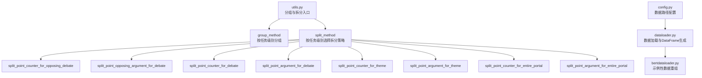
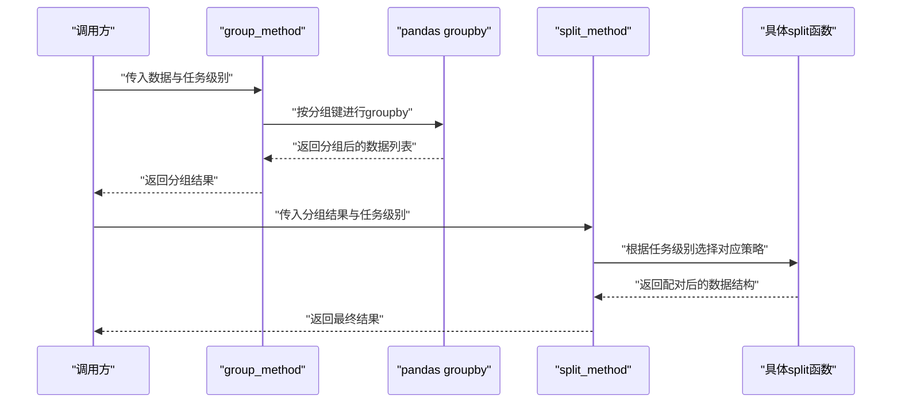
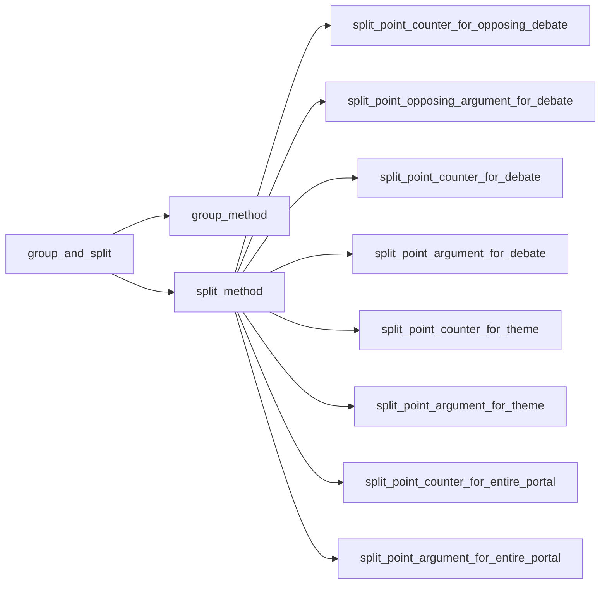

# 任务分组机制

<cite>
**本文引用的文件**
- [utils.py](file://utils.py)
- [dataloader.py](file://dataloader.py)
- [bertdataloader.py](file://bert/bertdataloader.py)
- [config.py](file://config.py)
- [README.md](file://README.md)
</cite>

## 目录
1. [引言](#引言)
2. [项目结构](#项目结构)
3. [核心组件](#核心组件)
4. [架构总览](#架构总览)
5. [详细组件分析](#详细组件分析)
6. [依赖关系分析](#依赖关系分析)
7. [性能考量](#性能考量)
8. [故障排查指南](#故障排查指南)
9. [结论](#结论)
10. [附录](#附录)

## 引言
本文件围绕 utils.py 中的 group_and_split 函数及其依赖的分组与拆分策略进行系统化解析。重点说明：
- group_method 如何依据 sdoc、sdoa、sdc 等任务级别定义分组键（如 domain、argumentation_title、stance 等），并通过 pandas groupby 实现数据切片；
- split_method 如何根据任务级别映射到不同的策略函数（如 split_point_counter_for_opposing_debate、split_point_argument_for_theme 等），完成特定任务的数据配对逻辑；
- 结合具体任务场景，分析各 split 函数在处理 point/counter 匹配、跨立场反论点构造时的差异与业务含义；
- 提供调用示例与输出结构说明，帮助读者快速理解与复用。

## 项目结构
本仓库包含数据加载、BERT 训练辅助以及工具函数等模块。与本文主题直接相关的核心文件如下：
- utils.py：提供分组与拆分的统一入口，以及多种 split 策略函数；
- dataloader.py：将原始文本数据转换为 DataFrame，并提供 to_dataframe 接口；
- bertdataloader.py：演示基于 pandas groupby 的数据重组思路；
- config.py：配置训练/验证/测试数据路径；
- README.md：项目背景与数据来源说明。

图表来源
- [utils.py](file://utils.py#L259-L296)
- [dataloader.py](file://dataloader.py#L1-L87)
- [bertdataloader.py](file://bert/bertdataloader.py#L1-L44)
- [config.py](file://config.py#L1-L11)

章节来源
- [README.md](file://README.md#L1-L7)
- [config.py](file://config.py#L1-L11)
- [dataloader.py](file://dataloader.py#L1-L87)
- [bertdataloader.py](file://bert/bertdataloader.py#L1-L44)
- [utils.py](file://utils.py#L259-L296)

## 核心组件
- group_and_split：统一入口，先按任务级别进行分组，再按任务级别选择拆分策略。
- group_method：根据任务级别字符串映射到一组分组键，调用 pandas groupby 进行数据切片。
- split_method：根据任务级别字符串映射到具体的拆分策略函数，执行点-反论点或点-论据配对。
- 多种 split 函数：针对不同任务目标（对立辩论、主题级、全门户等）设计的配对逻辑。

章节来源
- [utils.py](file://utils.py#L259-L296)

## 架构总览
下面的序列图展示了从输入数据到最终配对结果的整体流程，包括分组与拆分两个阶段。

图表来源
- [utils.py](file://utils.py#L259-L296)

## 详细组件分析

### 分组策略：group_method
- 任务级别与分组键映射
  - sdoc：按 domain、argumentation_title、stance 分组；
  - sdoa：按 domain、argumentation_title 分组；
  - sdc：按 domain、argumentation_title 分组；
  - sda：按 domain、argumentation_title 分组；
  - stc：按 domain 分组；
  - sta：按 domain 分组；
  - epc：不分组（返回整表）；
  - epa：不分组（返回整表）。
- 执行逻辑
  - 若存在分组键，则调用 pandas DataFrame.groupby 按指定键集合进行分组，将每个分组转为独立的 DataFrame 列表；
  - 若无分组键（如 epc/epa），则将整张表作为单一元素返回。
- 复杂度与性能
  - groupby 的时间复杂度近似 O(N)，空间复杂度 O(N)；
  - 对于大表，建议确保分组键具备合理基数，避免极端倾斜导致内存压力。

章节来源
- [utils.py](file://utils.py#L259-L274)

### 拆分策略：split_method 与具体策略函数
- 映射关系
  - sdoc → split_point_counter_for_opposing_debate
  - sdoa → split_point_opposing_argument_for_debate
  - sdc → split_point_counter_for_debate
  - sda → split_point_argument_for_debate
  - stc → split_point_counter_for_theme
  - sta → split_point_argument_for_theme
  - epc → split_point_counter_for_entire_portal
  - epa → split_point_argument_for_entire_portal
- 公共特征
  - 所有策略函数均以“point”为锚点，尝试在同一条记录上寻找对应的“counter”或“argument”，并按规则保留或丢弃不完整的配对；
  - 返回结构通常为包含“point”和“counter/argument”的字典列表，便于下游训练或评估使用。

#### split_point_counter_for_opposing_debate（对立辩论-点-反论）
- 业务目标
  - 在同一立场内，将 point 与其对应的 stance 相同的 counter 配对；
  - 若找不到匹配的 counter，则丢弃该 point。
- 输出结构
  - 每个分组返回一个字典，包含“point”和“counter”两个键，值为各自列表。
- 适用场景
  - 对立辩论任务，强调同一立场内的反驳关系构建。

章节来源
- [utils.py](file://utils.py#L1-L22)

#### split_point_opposing_argument_for_debate（对立辩论-点-论据）
- 业务目标
  - 将 pro 立场的 point 与 con 立场的 counter 组合，或将 con 立场的 point 与 pro 立场的 counter 组合，形成跨立场的 argument；
  - 同样以“point”为锚点，寻找匹配的 counter 并保留完整配对。
- 输出结构
  - 每个分组返回两个字典，分别代表 pro 和 con 的 argument 构造结果。
- 适用场景
  - 需要跨立场构造论据的辩论任务。

章节来源
- [utils.py](file://utils.py#L63-L99)

#### split_point_counter_for_debate（普通辩论-点-反论）
- 业务目标
  - 将 pro 与 con 的 point 分别与对方立场的 counter 进行配对，形成两套配对结果；
  - 同一立场内的 counter 会拼接到另一立场的 counter 列表中，形成跨立场的反论集合。
- 输出结构
  - 每个分组返回两个字典，分别代表 pro 和 con 的 point-counter 配对。
- 适用场景
  - 基础的辩论任务，强调正反双方的对称配对。

章节来源
- [utils.py](file://utils.py#L25-L60)

#### split_point_argument_for_debate（普通辩论-点-论据）
- 业务目标
  - 将 point 与其对应的 stance 相同的 counter 组合成 argument；
  - 若找不到匹配的 counter，则丢弃该 point。
- 输出结构
  - 每个分组返回一个字典，包含“point”和“argument”两个键。
- 适用场景
  - 侧重论据构造而非严格反论点配对的任务。

章节来源
- [utils.py](file://utils.py#L170-L192)

#### split_point_counter_for_theme（主题级-点-反论）
- 业务目标
  - 在相同 domain 与 argumentation_title 的主题范围内，将 point 与其对应的 stance 相同的 counter 进行配对；
  - 若找不到匹配的 counter，则丢弃该 point。
- 输出结构
  - 每个分组返回一个字典，包含“point”和“counter”两个键。
- 适用场景
  - 主题维度的辩论任务，强调在同一议题下的反驳关系。

章节来源
- [utils.py](file://utils.py#L102-L143)

#### split_point_argument_for_theme（主题级-点-论据）
- 业务目标
  - 在相同 domain 与 argumentation_title 的主题范围内，将 point 与其对应的 stance 相同的 counter 组合成 argument；
  - 若找不到匹配的 counter，则丢弃该 point。
- 输出结构
  - 每个分组返回一个字典，包含“point”和“argument”两个键。
- 适用场景
  - 主题维度的论据构造任务。

章节来源
- [utils.py](file://utils.py#L147-L166)

#### split_point_counter_for_entire_portal（全门户-点-反论）
- 业务目标
  - 在整个门户范围内（不按主题细分），将 point 与其对应的 stance 相同的 counter 进行配对；
  - 若找不到匹配的 counter，则丢弃该 point。
- 输出结构
  - 每个分组返回一个字典，包含“point”和“counter”两个键。
- 适用场景
  - 全局视角的辩论任务，不区分主题。

章节来源
- [utils.py](file://utils.py#L195-L231)

#### split_point_argument_for_entire_portal（全门户-点-论据）
- 业务目标
  - 在整个门户范围内，将 point 与其对应的 stance 相同的 counter 组合成 argument；
  - 若找不到匹配的 counter，则丢弃该 point。
- 输出结构
  - 每个分组返回一个字典，包含“point”和“argument”两个键。
- 适用场景
  - 全局视角的论据构造任务。

章节来源
- [utils.py](file://utils.py#L235-L255)

### 调用示例与输出结构说明
- 入口函数
  - group_and_split(data, group_level)：先按任务级别分组，再按任务级别拆分。
- 典型调用流程
  - 数据准备：通过 dataloader.py 生成 DataFrame；
  - 分组：调用 group_method，得到按任务级别分组的数据列表；
  - 拆分：调用 split_method，得到按策略函数配对后的数据结构。
- 输出结构约定
  - 每个分组返回一个字典，键通常为“point”和“counter”或“argument”，值为列表；
  - 不同任务级别的策略函数会根据业务目标调整返回字段与组合方式。

章节来源
- [utils.py](file://utils.py#L259-L296)
- [dataloader.py](file://dataloader.py#L61-L75)

## 依赖关系分析
- 组件耦合
  - group_and_split 依赖 group_method 与 split_method；
  - split_method 依赖多个 split 函数，形成策略映射；
  - split 函数内部依赖 pandas 的 loc 查询与列表操作，逻辑清晰、低耦合。
- 外部依赖
  - pandas：用于 groupby 与 loc 查询；
  - 文件系统：数据路径由 config.py 提供，dataloader.py 读取文本并生成 DataFrame。
- 可能的循环依赖
  - 当前文件结构未发现循环导入；各函数均为纯函数式设计，便于测试与维护。

图表来源
- [utils.py](file://utils.py#L259-L296)

章节来源
- [utils.py](file://utils.py#L259-L296)
- [dataloader.py](file://dataloader.py#L1-L87)
- [config.py](file://config.py#L1-L11)

## 性能考量
- 分组键选择
  - 优先选择具有合理基数的键，避免极端倾斜导致内存与计算压力；
  - 对于 epc/epa 等不分组场景，仅进行一次遍历即可完成配对，适合大规模数据的快速预处理。
- 查询效率
  - split 函数内部使用 pandas loc 进行过滤，建议确保相关列已建立索引（如在上游预处理阶段）以提升查询速度；
  - 对于超大数据集，可考虑分批处理或使用更高效的分组/过滤策略。
- 内存占用
  - groupby 会生成多个子 DataFrame，注意监控内存峰值；
  - 配对过程中使用列表存储中间结果，建议在下游使用时及时转换为更高效的数据结构（如向量化操作）。

## 故障排查指南
- 常见问题
  - 缺失分组键：当任务级别映射到空键列表（如 epc/epa）时，应确认是否期望不分组；
  - 数据不完整：若某条 point 无法找到匹配的 counter 或 argument，策略函数会丢弃该点，需检查数据一致性；
  - 键名不一致：split 函数依赖列名（如 utterence_type、stance、domain、argumentation_title 等），请确保上游数据清洗后列名一致。
- 定位方法
  - 使用 dataloader.py 生成 DataFrame 并打印列名与样本数量，核对数据结构；
  - 在 split 函数中增加日志输出，定位丢弃点的原因（例如未找到 counter）；
  - 对异常分组键进行单元测试，验证 groupby 的行为与预期一致。

章节来源
- [dataloader.py](file://dataloader.py#L61-L75)
- [utils.py](file://utils.py#L1-L304)

## 结论
本文系统梳理了 utils.py 中的分组与拆分机制，明确了：
- group_method 通过任务级别映射到分组键，借助 pandas groupby 实现灵活的数据切片；
- split_method 将任务级别映射到多种 split 函数，覆盖对立辩论、主题级与全门户等多类业务场景；
- 各 split 函数在 point/counter 或 point/argument 的配对逻辑上各有侧重，满足不同任务目标；
- 通过合理的分组键选择与数据清洗，可显著提升配对质量与运行效率。

## 附录
- 术语说明
  - stance：立场（pro/con）；
  - utterence_type：话语类型（point/counter）；
  - argumentation_title：论辩主题标题；
  - domain：领域/主题域；
  - epc/epa：全门户不分组的任务级别；
  - sdoc/sdoa/sdc/sda/stc/sta：按领域/主题/立场等维度分组的任务级别。
- 参考实现
  - bertdataloader.py 展示了另一种基于 groupby 的数据重组思路，可作为扩展参考。

章节来源
- [bertdataloader.py](file://bert/bertdataloader.py#L1-L44)
- [README.md](file://README.md#L1-L7)