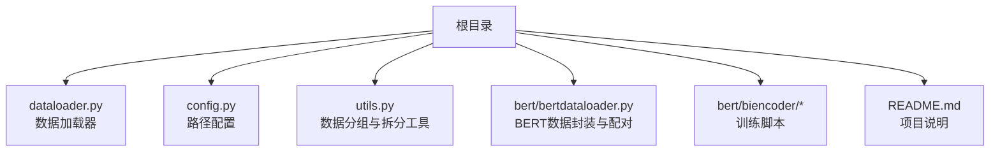
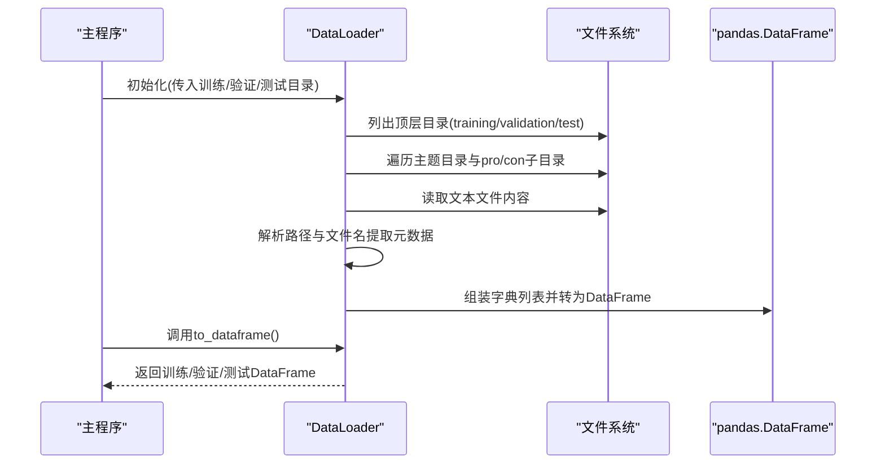
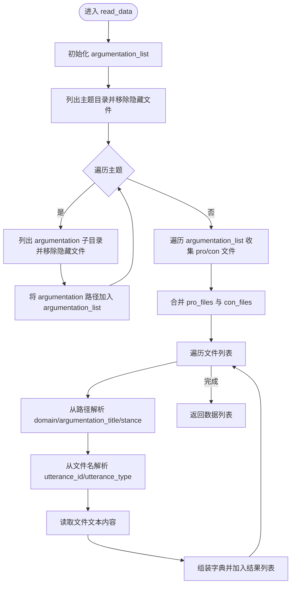
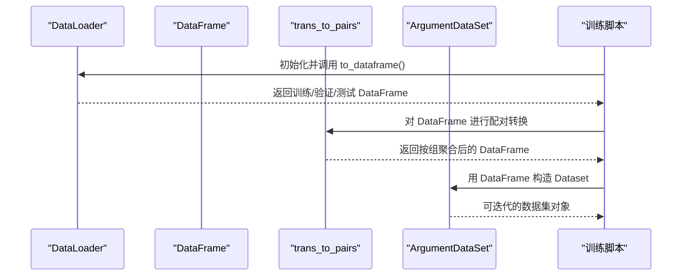
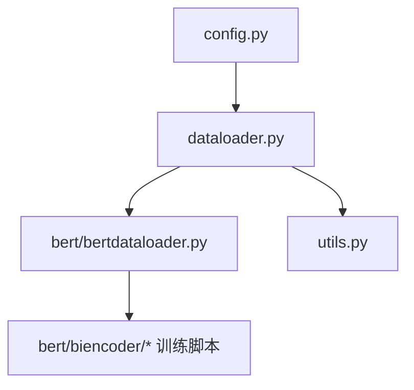

# 数据加载

<cite>
**本文引用的文件**
- [dataloader.py](file://dataloader.py)
- [config.py](file://config.py)
- [utils.py](file://utils.py)
- [bertdataloader.py](file://bert/bertdataloader.py)
- [biencoder_embedding_classification_concanated_together.py](file://bert/biencoder/biencoder_embedding_classification_concanated_together.py)
- [README.md](file://README.md)
</cite>

## 目录
1. [简介](#简介)
2. [项目结构](#项目结构)
3. [核心组件](#核心组件)
4. [架构总览](#架构总览)
5. [详细组件分析](#详细组件分析)
6. [依赖关系分析](#依赖关系分析)
7. [性能考量](#性能考量)
8. [故障排查指南](#故障排查指南)
9. [结论](#结论)
10. [附录](#附录)

## 简介
本文件围绕数据加载模块进行深入解析，重点阐述 DataLoader 类在 dataloader.py 中的实现机制。文档将详细说明其如何初始化并递归遍历 training_dir、validation_dir 和 test_dir 目录，读取每个主题（topic）下 pro 和 con 子目录中的文本文件；解析文件路径以提取 domain、argumentation_title、stance 等元数据，并通过字符串分割方式解析 utterance_id 和 utterance_type；描述 read_data 方法中对 .DS_Store 等系统隐藏文件的容错处理；说明如何将原始文本内容与结构化元数据组合成字典列表；并结合代码片段路径展示数据从原始文件系统到内存列表的转换流程，讨论目录结构假设与潜在的路径兼容性问题。

## 项目结构
该项目采用按功能分层的组织方式：数据加载位于根目录的 dataloader.py，配置信息位于 config.py，BERT 相关的数据封装与转换位于 bert/bertdataloader.py，实际训练脚本位于 bert/biencoder/*。README.md 提供了数据来源与放置位置的简要说明。

图表来源
- [dataloader.py](file://dataloader.py#L1-L87)
- [config.py](file://config.py#L1-L11)
- [utils.py](file://utils.py#L1-L304)
- [bertdataloader.py](file://bert/bertdataloader.py#L1-L44)
- [biencoder_embedding_classification_concanated_together.py](file://bert/biencoder/biencoder_embedding_classification_concanated_together.py#L1-L280)
- [README.md](file://README.md#L1-L7)

章节来源
- [README.md](file://README.md#L1-L7)
- [config.py](file://config.py#L1-L11)

## 核心组件
- DataLoader 类：负责初始化训练、验证、测试三类目录，递归遍历目录结构，读取文本文件，解析元数据，构建结构化数据列表，并提供 to_dataframe 接口输出为 pandas DataFrame。
- 配置项：training_dir、validation_dir、test_dir 由 config.py 提供，作为相对路径基准。
- 工具函数：utils.py 提供多种基于不同粒度（如 sdoc、sdoa、sdc、sda、stc、sta、epc、epa）的数据分组与拆分策略，配合 DataLoader 输出的 DataFrame 进行后续处理。

章节来源
- [dataloader.py](file://dataloader.py#L11-L87)
- [config.py](file://config.py#L1-L11)
- [utils.py](file://utils.py#L1-L304)

## 架构总览
DataLoader 的工作流从初始化开始，读取各集合的顶层目录，逐层展开到主题与论点立场，再读取 pro/con 文本文件，解析文件名与路径中的元数据，最终生成包含 domain、argumentation_title、stance、utterance_id、utterance_type、text 的字典列表。BERT 训练脚本通过 DataLoader 获取数据后，调用 bertdataloader.trans_to_pairs 将每条记录按 domain、argumentation_title、utterance_id、stance 分组聚合为“点-反点”配对，再封装为 Dataset 供训练使用。

图表来源
- [dataloader.py](file://dataloader.py#L11-L87)
- [bertdataloader.py](file://bert/bertdataloader.py#L1-L44)
- [biencoder_embedding_classification_concanated_together.py](file://bert/biencoder/biencoder_embedding_classification_concanated_together.py#L1-L280)

## 详细组件分析

### DataLoader 类实现机制
- 初始化阶段
  - 读取 config.py 中的 training_dir、validation_dir、test_dir，拼接当前工作目录得到绝对路径。
  - 使用 os.listdir 获取各集合顶层目录的文件/目录项，并移除 .DS_Store 等系统隐藏文件（容错处理）。
  - 建立 dtype 到目录的映射 self.dirs，并立即调用 read_data 生成训练、验证、测试三类数据。
- 读取与解析阶段（read_data）
  - 依据 dtype 选择对应目录，列出主题目录并移除隐藏文件。
  - 对每个主题，列出其 argumentation 子目录，同样移除隐藏文件。
  - 遍历每个 argumentation，将其 pro 与 con 子目录下的文件分别收集到 pro_files 与 con_files。
  - 合并两类文件列表，逐个打开文件读取文本内容。
  - 通过路径切片提取 domain、argumentation_title、stance；通过文件名去除扩展名后的最后一段按“-”分割提取 utterance_id 与 utterance_type。
  - 将上述元数据与文本内容组装为字典并加入结果列表。
- 输出阶段（to_dataframe）
  - 将训练、验证、测试三类数据分别转换为 pandas DataFrame 并返回。

图表来源
- [dataloader.py](file://dataloader.py#L30-L69)

章节来源
- [dataloader.py](file://dataloader.py#L11-L87)

### 目录结构假设与路径兼容性
- 目录层级假设
  - 训练/验证/测试根目录下直接包含多个主题目录。
  - 每个主题目录下包含若干 argumentation 目录。
  - 每个 argumentation 目录下包含 pro 与 con 两个子目录，分别存放正反方文本。
  - 文本文件命名规则要求：文件名去掉扩展名后最后一段应包含“-”，以便按“-”分割提取 utterance_id 与 utterance_type。
- 兼容性与容错
  - 对 .DS_Store 等隐藏文件进行了显式移除，避免误读。
  - 在多处 try/except 中移除隐藏文件，确保在不同平台（Windows/Linux/macOS）上运行时的稳定性。
- 潜在问题
  - 若文件名不符合“-”分隔约定，utterance_id/utterance_type 解析可能失败。
  - 若 argumentation 目录下缺少 pro 或 con 子目录，会导致读取异常。
  - 若 domain/argumentation_title/stance 路径层级不一致，将导致解析错误。

章节来源
- [dataloader.py](file://dataloader.py#L11-L87)

### 与 BERT 训练流程的衔接
- DataLoader.to_dataframe 输出的 DataFrame 包含 domain、argumentation_title、stance、utterance_id、utterance_type、text 等字段。
- bertdataloader.trans_to_pairs 将 DataFrame 按 domain、argumentation_title、utterance_id、stance 分组，将同组内的 point 与 counter 文本合并为“点-反点”配对，形成 point_text、counter_text 等列，便于后续训练。
- 训练脚本 biencoder_embedding_classification_concanated_together.py 通过 DataLoader 获取三类数据，调用 trans_to_pairs 完成配对，再封装为 Dataset 供 PyTorch DataLoader 使用。

图表来源
- [dataloader.py](file://dataloader.py#L71-L87)
- [bertdataloader.py](file://bert/bertdataloader.py#L1-L44)
- [biencoder_embedding_classification_concanated_together.py](file://bert/biencoder/biencoder_embedding_classification_concanated_together.py#L1-L280)

章节来源
- [bertdataloader.py](file://bert/bertdataloader.py#L1-L44)
- [biencoder_embedding_classification_concanated_together.py](file://bert/biencoder/biencoder_embedding_classification_concanated_together.py#L1-L280)

## 依赖关系分析
- dataloader.py 依赖 config.py 提供的训练/验证/测试目录路径。
- bertdataloader.py 依赖 dataloader.py 的 DataLoader 类与 config.py 的路径配置。
- 训练脚本 biencoder_embedding_classification_concanated_together.py 依赖 bertdataloader.py 的 ArgumentDataSet 与 trans_to_pairs，以及 dataloader.py 的 DataLoader。
- utils.py 提供数据分组与拆分工具，可与 DataLoader 输出的 DataFrame 结合使用。

图表来源
- [config.py](file://config.py#L1-L11)
- [dataloader.py](file://dataloader.py#L1-L87)
- [bertdataloader.py](file://bert/bertdataloader.py#L1-L44)
- [biencoder_embedding_classification_concanated_together.py](file://bert/biencoder/biencoder_embedding_classification_concanated_together.py#L1-L280)
- [utils.py](file://utils.py#L1-L304)

章节来源
- [config.py](file://config.py#L1-L11)
- [dataloader.py](file://dataloader.py#L1-L87)
- [bertdataloader.py](file://bert/bertdataloader.py#L1-L44)
- [biencoder_embedding_classification_concanated_together.py](file://bert/biencoder/biencoder_embedding_classification_concanated_together.py#L1-L280)
- [utils.py](file://utils.py#L1-L304)

## 性能考量
- 目录遍历与文件读取：遍历主题、argumentation 与 pro/con 子目录，逐个读取文本文件，I/O 成本较高。建议：
  - 在大规模数据场景下，优先使用更高效的文件系统访问方式或缓存中间结果。
  - 对 .DS_Store 等隐藏文件的移除操作为常数时间，影响有限。
- 字符串解析：路径切片与文件名分割为 O(n) 操作，n 为路径长度或文件名长度，通常可忽略。
- DataFrame 构建：将字典列表转换为 DataFrame 为线性复杂度，建议在数据量较大时考虑分批处理或延迟加载策略。

[本节为通用性能讨论，不直接分析具体文件，故无章节来源]

## 故障排查指南
- 目录结构不匹配
  - 现象：读取 pro/con 子目录时报错或缺失数据。
  - 排查：确认每个 argumentation 下均存在 pro 与 con 子目录；检查路径层级是否符合 domain/argumentation_title/stance 的四层结构。
- 文件名格式不规范
  - 现象：utterance_id/utterance_type 解析异常。
  - 排查：确保文件名去掉扩展名后最后一段包含“-”，且顺序为 utterance_id-utterance_type。
- 隐藏文件干扰
  - 现象：出现 .DS_Store 导致解析错误。
  - 处理：代码已显式移除 .DS_Store，若仍出现，检查是否在不同平台下存在其他隐藏文件。
- 编码问题
  - 现象：读取文本时报编码错误。
  - 处理：确保文本文件为 UTF-8 编码；必要时在 open 调用中指定编码参数。

章节来源
- [dataloader.py](file://dataloader.py#L11-L87)

## 结论
DataLoader 类通过清晰的目录遍历与元数据解析逻辑，将原始文件系统中的文本数据转换为结构化的字典列表，并进一步输出为 pandas DataFrame，为后续的 BERT 训练与数据分组提供了稳定的数据基础。其对隐藏文件的容错处理与对路径层级的严格假设，使得数据加载过程在不同平台上具备较好的兼容性。结合 utils.py 的分组与拆分工具，能够灵活地支持多种粒度的数据组织与配对策略，满足不同任务需求。

[本节为总结性内容，不直接分析具体文件，故无章节来源]

## 附录
- 目录结构假设与字段说明
  - 训练/验证/测试根目录：data/training/、data/validation/、data/test/
  - 主题目录：domain/
  - 论点目录：argumentation_title/
  - 立场目录：stance/
  - 文本文件：utterance_id-utterance_type.txt
  - 输出字段：domain、argumentation_title、stance、utterance_id、utterance_type、text

章节来源
- [config.py](file://config.py#L1-L11)
- [dataloader.py](file://dataloader.py#L30-L69)
- [README.md](file://README.md#L1-L7)