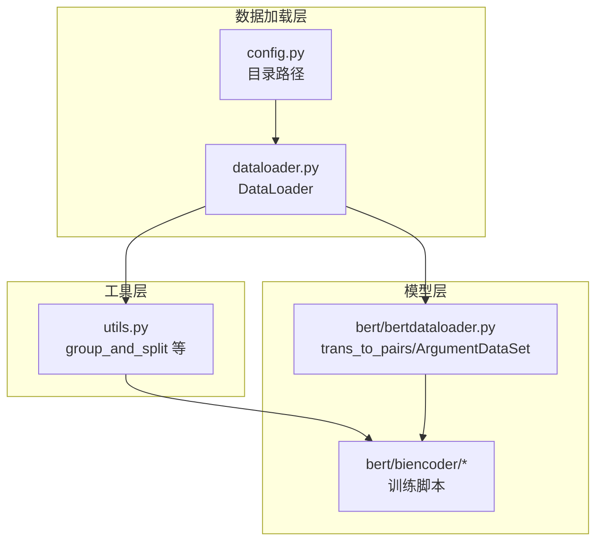
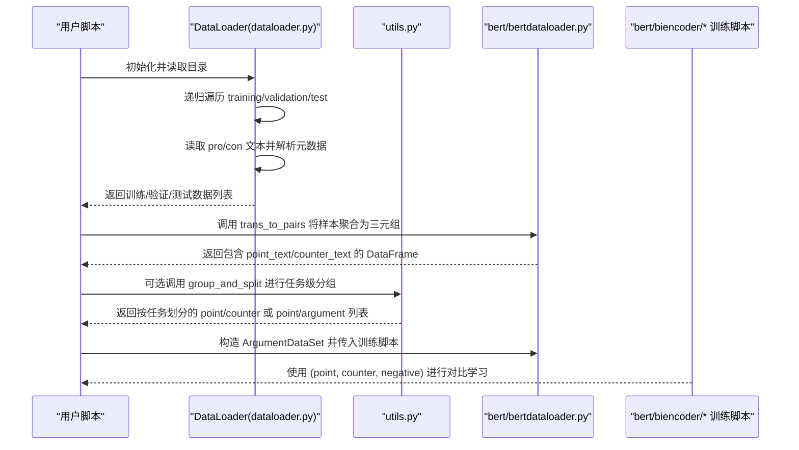
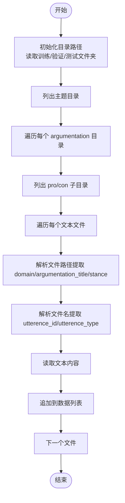
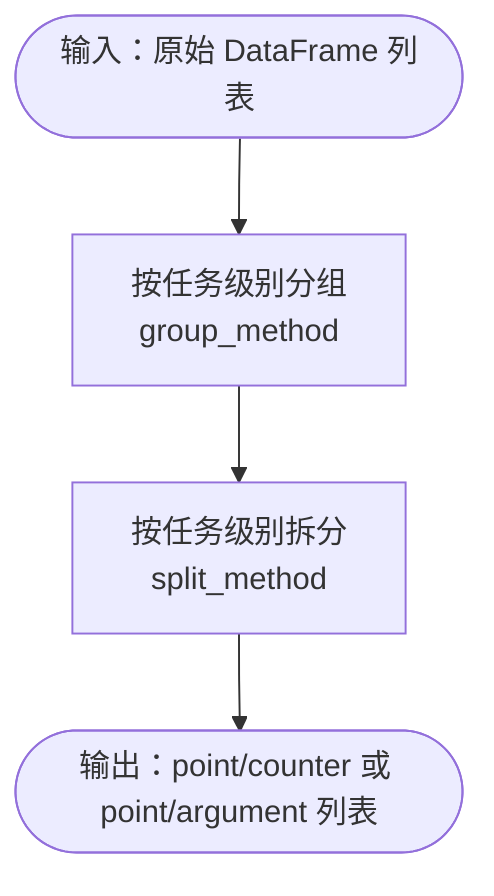
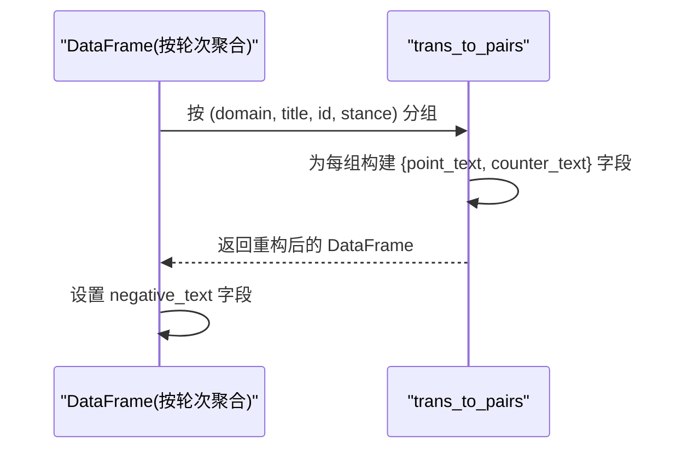
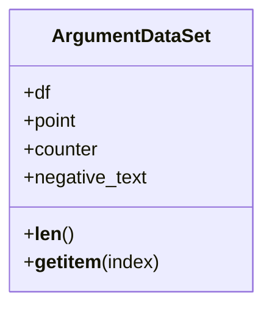
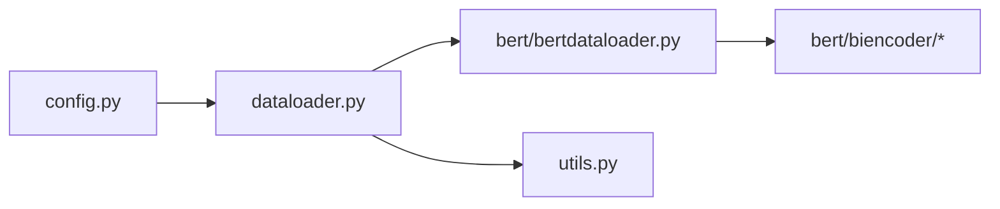

# 数据处理

<cite>
**本文引用的文件**
- [dataloader.py](file://dataloader.py)
- [utils.py](file://utils.py)
- [config.py](file://config.py)
- [bert/bertdataloader.py](file://bert/bertdataloader.py)
- [bert/biencoder/biencoder_embedding_classification_concanated_together.py](file://bert/biencoder/biencoder_embedding_classification_concanated_together.py)
- [README.md](file://README.md)
</cite>

## 目录
1. [引言](#引言)
2. [项目结构](#项目结构)
3. [核心组件](#核心组件)
4. [架构总览](#架构总览)
5. [详细组件分析](#详细组件分析)
6. [依赖关系分析](#依赖关系分析)
7. [性能考量](#性能考量)
8. [故障排查指南](#故障排查指南)
9. [结论](#结论)
10. [附录](#附录)

## 引言
本文件系统性梳理项目的数据处理机制，重点围绕以下目标展开：
- 解析 DataLoader 类在 dataloader.py 中的实现，说明其如何递归遍历 training_dir、validation_dir 和 test_dir 的目录结构，读取 pro 与 con 子目录下的文本文件，并从中提取 domain、argumentation_title、stance 等元数据。
- 解释 to_dataframe() 方法如何将原始列表转换为 Pandas DataFrame，以及 utterence_id 与 utterence_type 的解析逻辑。
- 结合 utils.py 中的 group_and_split 函数，说明数据如何按任务（如 sdoc、sda 等）进行分组与划分。
- 描述 bert/bertdataloader.py 中的 trans_to_pairs 函数如何将原始数据构造成 (point_text, counter_text, negative_text) 三元组用于对比学习。
- 提供代码片段路径，展示数据从原始文件到训练样本的转换过程，并讨论数据格式假设与潜在的预处理需求。

## 项目结构
该项目采用“数据加载层 + 工具层 + 模型层”的分层组织方式：
- 数据加载层：dataloader.py 定义 DataLoader，负责从本地目录读取文本并抽取元数据。
- 工具层：utils.py 提供多种分组与拆分策略，支持不同任务场景（如 sdoc、sda、stc、sta、epc、epa 等）。
- 模型层：bert/bertdataloader.py 提供 trans_to_pairs 将样本按对话轮聚合为三元组；bert/biencoder/*.py 使用该三元组进行对比学习训练。
- 配置层：config.py 定义训练/验证/测试目录路径。

图表来源
- [dataloader.py](file://dataloader.py#L1-L87)
- [config.py](file://config.py#L1-L11)
- [utils.py](file://utils.py#L259-L304)
- [bert/bertdataloader.py](file://bert/bertdataloader.py#L1-L44)
- [bert/biencoder/biencoder_embedding_classification_concanated_together.py](file://bert/biencoder/biencoder_embedding_classification_concanated_together.py#L1-L60)

章节来源
- [README.md](file://README.md#L1-L7)
- [config.py](file://config.py#L1-L11)

## 核心组件
- DataLoader：负责从指定目录读取文本，解析文件路径中的层级信息以提取 domain、argumentation_title、stance 等元数据；将每条文本与对应元数据封装为字典，最终输出训练/验证/测试三份数据。
- utils.group_and_split：根据任务级别（如 sdoc、sda、stc、sta、epc、epa）对数据进行分组与拆分，生成 point/counter 或 point/argument 的配对集合。
- bert/bertdataloader.trans_to_pairs：将按 domain、argumentation_title、utterence_id、stance 分组后的样本，重构成包含 point_text、counter_text 字段的样本表，便于后续构造三元组 (point, counter, negative)。

章节来源
- [dataloader.py](file://dataloader.py#L1-L87)
- [utils.py](file://utils.py#L259-L304)
- [bert/bertdataloader.py](file://bert/bertdataloader.py#L1-L44)

## 架构总览
下面的序列图展示了从原始文件到训练样本的关键流程，包括 DataLoader 读取、DataFrame 转换、分组拆分、三元组构造与 Dataset 包装。

图表来源
- [dataloader.py](file://dataloader.py#L1-L87)
- [utils.py](file://utils.py#L259-L304)
- [bert/bertdataloader.py](file://bert/bertdataloader.py#L1-L44)
- [bert/biencoder/biencoder_embedding_classification_concanated_together.py](file://bert/biencoder/biencoder_embedding_classification_concanated_together.py#L1-L60)

## 详细组件分析

### DataLoader 类与目录遍历
DataLoader 的职责是：
- 读取训练/验证/测试目录，忽略 macOS 常见隐藏文件（如 .DS_Store）。
- 递归遍历目录结构，定位每个 argumentation 下的 pro 与 con 子目录。
- 逐个读取文本文件，解析文件路径层级以提取 domain、argumentation_title、stance。
- 解析文件名以提取 utterence_id 与 utterence_type，并将文本内容与元数据组合为字典列表。

图表来源
- [dataloader.py](file://dataloader.py#L1-L87)

章节来源
- [dataloader.py](file://dataloader.py#L1-L87)
- [config.py](file://config.py#L1-L11)

### to_dataframe() 方法与字段解析
- DataLoader.to_dataframe() 将训练/验证/测试三类数据分别转为 Pandas DataFrame，便于后续处理。
- 元数据解析逻辑：
  - domain、argumentation_title、stance：从文件路径倒数第四至倒数第二段中提取。
  - utterence_id、utterence_type：从文件名去掉扩展名后按“-”分割得到。
- 文本内容直接读取文件内容作为 text 字段。

章节来源
- [dataloader.py](file://dataloader.py#L56-L75)

### utils.py 中的分组与拆分
utils.py 提供了多种任务级别的分组与拆分策略，通过 group_and_split 统一入口调用：
- group_method：根据任务级别选择分组维度（如 sdoc、sdoa、sdc、sda、stc、sta、epc、epa）。
- split_method：根据任务级别选择对应的拆分函数（如 split_point_counter_for_debate、split_point_argument_for_debate 等）。
- group_and_split：先按维度分组，再按任务拆分为 point/counter 或 point/argument 的配对集合。

图表来源
- [utils.py](file://utils.py#L259-L304)

章节来源
- [utils.py](file://utils.py#L1-L304)

### bert/bertdataloader.py 中的三元组构造
trans_to_pairs 将按 domain、argumentation_title、utterence_id、stance 分组后的样本，重构成包含 point_text、counter_text 的样本表。随后训练脚本会为每个样本设置 negative_text 字段，形成 (point_text, counter_text, negative_text) 三元组，用于对比学习。

图表来源
- [bert/bertdataloader.py](file://bert/bertdataloader.py#L1-L44)
- [bert/biencoder/biencoder_embedding_classification_concanated_together.py](file://bert/biencoder/biencoder_embedding_classification_concanated_together.py#L24-L44)

章节来源
- [bert/bertdataloader.py](file://bert/bertdataloader.py#L1-L44)
- [bert/biencoder/biencoder_embedding_classification_concanated_together.py](file://bert/biencoder/biencoder_embedding_classification_concanated_together.py#L1-L60)

### 训练脚本中的数据使用
训练脚本以 ArgumentDataSet 包装三元组数据，按批次返回 (point, counter, negative)，供对比学习损失函数使用。

图表来源
- [bert/bertdataloader.py](file://bert/bertdataloader.py#L30-L44)
- [bert/biencoder/biencoder_embedding_classification_concanated_together.py](file://bert/biencoder/biencoder_embedding_classification_concanated_together.py#L39-L44)

章节来源
- [bert/bertdataloader.py](file://bert/bertdataloader.py#L30-L44)
- [bert/biencoder/biencoder_embedding_classification_concanated_together.py](file://bert/biencoder/biencoder_embedding_classification_concanated_together.py#L1-L60)

## 依赖关系分析
- dataloader.py 依赖 config.py 中的目录路径常量。
- bert/bertdataloader.py 依赖 dataloader.py 的 DataLoader 类（通过别名导入），并在训练脚本中被广泛使用。
- utils.py 与 bert/bertdataloader.py 之间无直接 import 关系，但训练脚本可选择性地调用 utils 的分组拆分能力。

图表来源
- [config.py](file://config.py#L1-L11)
- [dataloader.py](file://dataloader.py#L1-L87)
- [bert/bertdataloader.py](file://bert/bertdataloader.py#L1-L44)
- [utils.py](file://utils.py#L259-L304)
- [bert/biencoder/biencoder_embedding_classification_concanated_together.py](file://bert/biencoder/biencoder_embedding_classification_concanated_together.py#L1-L60)

章节来源
- [config.py](file://config.py#L1-L11)
- [dataloader.py](file://dataloader.py#L1-L87)
- [bert/bertdataloader.py](file://bert/bertdataloader.py#L1-L44)
- [utils.py](file://utils.py#L259-L304)
- [bert/biencoder/biencoder_embedding_classification_concanated_together.py](file://bert/biencoder/biencoder_embedding_classification_concanated_together.py#L1-L60)

## 性能考量
- 目录遍历与文件读取：DataLoader 在读取 pro/con 子目录时会遍历所有文件，建议确保目录结构规范，避免过多无关文件干扰。
- DataFrame 构建：to_dataframe() 将原始列表转为 DataFrame，注意内存占用与列数量控制。
- 分组与拆分：utils 的分组与拆分函数基于 pandas 分组与筛选，复杂度与样本规模相关，建议在大规模数据上评估性能瓶颈。
- 三元组构造：trans_to_pairs 对样本进行重排，注意字段命名一致性与缺失值处理（训练脚本中对空值进行了清理）。

## 故障排查指南
- 目录结构不匹配
  - 现象：DataLoader 报错或无法读取文件。
  - 排查：确认 training_dir、validation_dir、test_dir 的实际目录结构是否符合预期（domain -> argumentation_title -> stance -> pro/con -> 文本文件）。
  - 参考路径：[config.py](file://config.py#L1-L11)、[dataloader.py](file://dataloader.py#L1-L87)
- 文件名格式异常
  - 现象：utterence_id/utterence_type 解析失败。
  - 排查：检查文件名是否遵循“utterence_id-utterence_type.ext”格式，且扩展名为 .txt 或其他 UTF-8 可读格式。
  - 参考路径：[dataloader.py](file://dataloader.py#L56-L75)
- 空值与缺失字段
  - 现象：训练前清洗阶段出现空值。
  - 处理：训练脚本中对 DataFrame 进行 dropna 并 reset_index，确保后续三元组构造稳定。
  - 参考路径：[bert/biencoder/biencoder_embedding_classification_concanated_together.py](file://bert/biencoder/biencoder_embedding_classification_concanated_together.py#L24-L44)
- 任务级别选择不当
  - 现象：分组拆分结果不符合预期。
  - 处理：核对 group_and_split 的任务级别映射，确保与数据维度一致（如 sdoc、sda、stc、sta、epc、epa）。
  - 参考路径：[utils.py](file://utils.py#L259-L304)

章节来源
- [config.py](file://config.py#L1-L11)
- [dataloader.py](file://dataloader.py#L1-L87)
- [bert/bertdataloader.py](file://bert/bertdataloader.py#L1-L44)
- [bert/biencoder/biencoder_embedding_classification_concanated_together.py](file://bert/biencoder/biencoder_embedding_classification_concanated_together.py#L24-L44)
- [utils.py](file://utils.py#L259-L304)

## 结论
本项目的数据处理链路清晰：DataLoader 负责从本地目录读取并抽取元数据，utils 提供任务级分组与拆分策略，bert/bertdataloader 将样本聚合为三元组并交由训练脚本进行对比学习。整体设计具备良好的模块化与可扩展性，适合在不同任务级别（如 sdoc、sda、stc、sta、epc、epa）下灵活切换。

## 附录

### 数据格式假设与预处理需求
- 目录结构假设
  - 训练/验证/测试根目录下包含若干主题目录，主题目录下为 argumentation 目录，argumentation 目录下包含 pro 与 con 子目录，子目录内为文本文件。
  - 参考路径：[dataloader.py](file://dataloader.py#L1-L87)
- 文件命名假设
  - 文件名需包含 utterence_id 与 utterence_type，二者以“-”连接，扩展名为 .txt 或其他 UTF-8 可读格式。
  - 参考路径：[dataloader.py](file://dataloader.py#L56-L75)
- 元数据提取假设
  - domain、argumentation_title、stance 由文件路径层级推断；若目录层级变化，需同步调整解析逻辑。
  - 参考路径：[dataloader.py](file://dataloader.py#L56-L75)
- 任务级别映射
  - group_and_split 依赖任务级别字符串（如 sdoc、sda、stc、sta、epc、epa）与对应拆分函数的映射关系。
  - 参考路径：[utils.py](file://utils.py#L259-L304)
- 三元组构造要求
  - trans_to_pairs 依赖 domain、argumentation_title、utterence_id、stance 四维分组键；训练脚本会为每个样本设置 negative_text 字段。
  - 参考路径：[bert/bertdataloader.py](file://bert/bertdataloader.py#L1-L44)、[bert/biencoder/biencoder_embedding_classification_concanated_together.py](file://bert/biencoder/biencoder_embedding_classification_concanated_together.py#L24-L44)