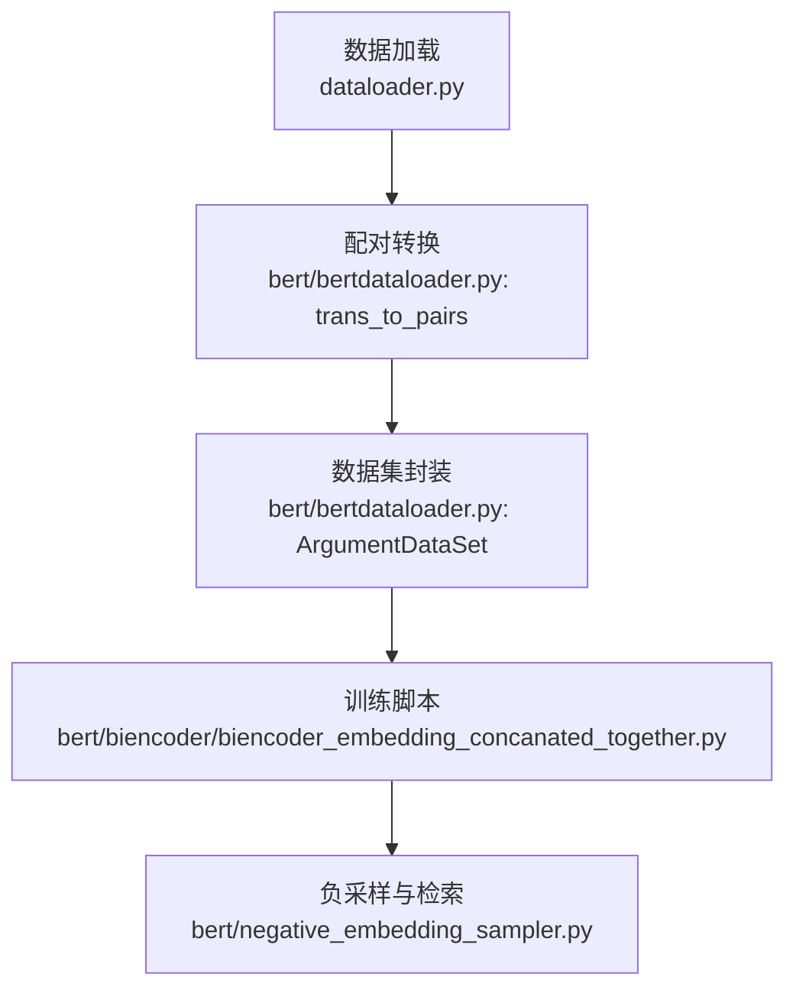
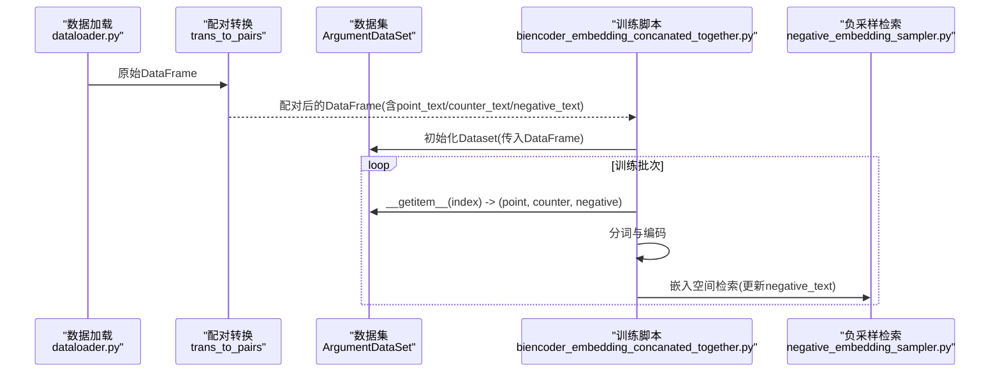
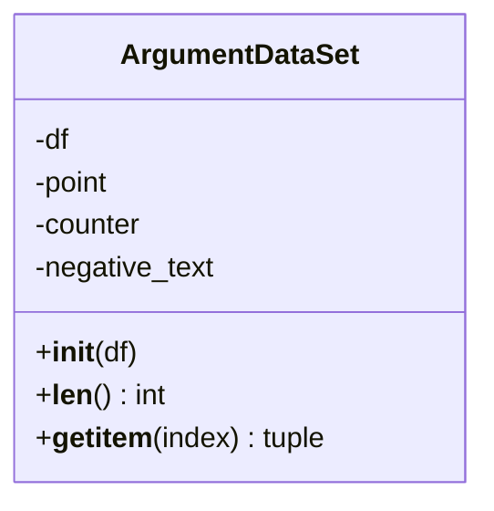
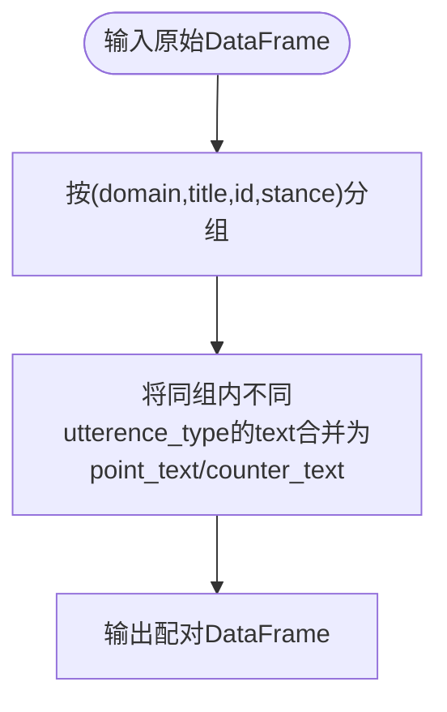
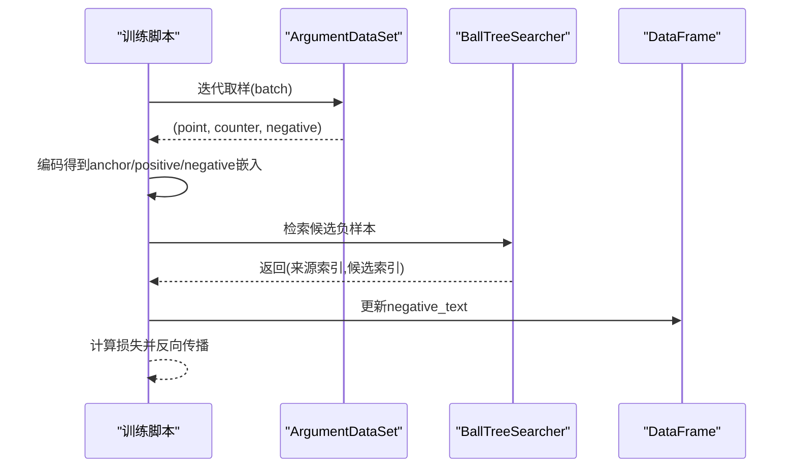
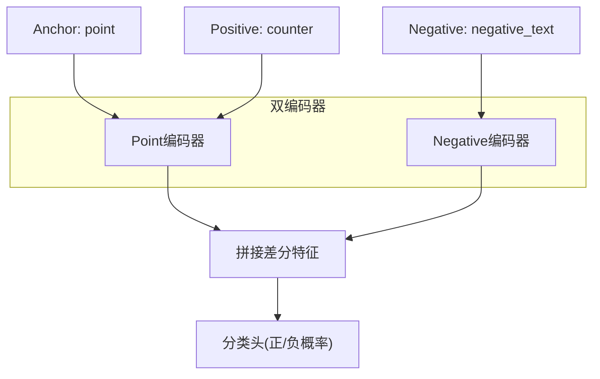
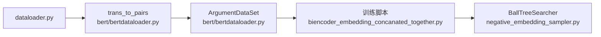

# 样本构造

<cite>
**本文引用的文件**
- [bert/bertdataloader.py](file://bert/bertdataloader.py)
- [bert/biencoder/biencoder_embedding_concanated_together.py](file://bert/biencoder/biencoder_embedding_concanated_together.py)
- [bert/negative_embedding_sampler.py](file://bert/negative_embedding_sampler.py)
- [dataloader.py](file://dataloader.py)
- [utils.py](file://utils.py)
- [README.md](file://README.md)
</cite>

## 目录
1. [引言](#引言)
2. [项目结构](#项目结构)
3. [核心组件](#核心组件)
4. [架构总览](#架构总览)
5. [详细组件分析](#详细组件分析)
6. [依赖关系分析](#依赖关系分析)
7. [性能考量](#性能考量)
8. [故障排查指南](#故障排查指南)
9. [结论](#结论)

## 引言
本文围绕 ArgumentDataSet 类在 PyTorch 中作为 Dataset 的实现进行深入讲解，重点说明其如何接收 trans_to_pairs 处理后的 DataFrame，并从其中提取 point_text、counter_text 和 negative_text 字段，构建对比学习所需的三元组样本；同时阐述 __getitem__ 返回的 (point, counter, negative) 元组如何服务于双编码器架构下的语义匹配与检索任务，以及该数据构造方式如何支撑对比学习中“正负样本对”的训练目标。

## 项目结构
本仓库围绕论辩文本的检索与分类展开，数据加载与预处理位于 bert/bertdataloader.py，核心训练脚本位于 bert/biencoder 下的多个 biencoder_* 文件。ArgumentDataSet 作为 PyTorch Dataset，被训练脚本直接使用，配合 trans_to_pairs 将原始对话级文本聚合成“立场-主题-轮次”粒度的配对样本，并在后续阶段动态生成负样本。

图表来源
- [dataloader.py](file://dataloader.py#L1-L87)
- [bert/bertdataloader.py](file://bert/bertdataloader.py#L1-L44)
- [bert/biencoder/biencoder_embedding_concanated_together.py](file://bert/biencoder/biencoder_embedding_concanated_together.py#L1-L280)
- [bert/negative_embedding_sampler.py](file://bert/negative_embedding_sampler.py#L1-L92)

章节来源
- [README.md](file://README.md#L1-L7)
- [dataloader.py](file://dataloader.py#L1-L87)
- [bert/bertdataloader.py](file://bert/bertdataloader.py#L1-L44)

## 核心组件
- ArgumentDataSet：继承自 PyTorch Dataset，负责将 DataFrame 中的三列文本映射为三元组样本，供 DataLoader 迭代消费。
- trans_to_pairs：将原始按“轮次-立场-主题-域”组织的对话文本，聚合为每条论点（point）与其对应反论（counter）的配对样本，并补充 negative_text 列。
- 训练脚本：在第一阶段固定 negative_text 为 counter_text，在第二阶段通过嵌入空间检索得到更高质量的负样本，从而提升对比学习效果。

章节来源
- [bert/bertdataloader.py](file://bert/bertdataloader.py#L1-L44)
- [bert/biencoder/biencoder_embedding_concanated_together.py](file://bert/biencoder/biencoder_embedding_concanated_together.py#L1-L280)

## 架构总览
ArgumentDataSet 在训练流程中的位置如下：
- 数据准备：dataloader.py 读取原始数据并转为 DataFrame；
- 配对构造：trans_to_pairs 按“立场-主题-轮次”聚合，形成 point_text 与 counter_text；
- 数据集封装：ArgumentDataSet 提供 __len__ 与 __getitem__；
- 训练循环：训练脚本迭代 ArgumentDataSet，对三元组分别进行分词与编码，计算损失并更新参数；
- 负样本更新：基于嵌入空间检索更新 negative_text，持续优化对比学习。

图表来源
- [dataloader.py](file://dataloader.py#L1-L87)
- [bert/bertdataloader.py](file://bert/bertdataloader.py#L1-L44)
- [bert/biencoder/biencoder_embedding_concanated_together.py](file://bert/biencoder/biencoder_embedding_concanated_together.py#L1-L280)
- [bert/negative_embedding_sampler.py](file://bert/negative_embedding_sampler.py#L1-L92)

## 详细组件分析

### ArgumentDataSet 类实现与三元组构造
- 输入：DataFrame，包含 point_text、counter_text、negative_text 三列。
- 输出：每个样本是一个三元组 (point, counter, negative)，分别代表论点文本、反论文本与负例文本。
- 设计要点：
  - __len__ 返回 DataFrame 行数，保证 DataLoader 可正确遍历。
  - __getitem__ 返回三列在指定索引处的字符串，便于后续分词与编码。
  - 该结构天然契合对比学习：anchor=point，positive=counter，negative 由 hard negative 或随机策略生成，用于最大化 anchor 与 positive 的相似度、最小化与 negative 的相似度。

图表来源
- [bert/bertdataloader.py](file://bert/bertdataloader.py#L1-L44)

章节来源
- [bert/bertdataloader.py](file://bert/bertdataloader.py#L1-L44)

### trans_to_pairs 的配对逻辑与字段含义
- 功能：按“域-domain、主题-title、轮次-id、立场-stance”分组，将同一组内的不同 utterence_type（如 point、counter）合并为一行，形成 point_text 与 counter_text 字段。
- 后续：在训练脚本中，会将 negative_text 初始化为 counter_text，随后通过嵌入检索替换为更合适的负样本。

图表来源
- [bert/bertdataloader.py](file://bert/bertdataloader.py#L1-L44)

章节来源
- [bert/bertdataloader.py](file://bert/bertdataloader.py#L1-L44)

### 训练脚本中的三元组消费与负样本更新
- 第一阶段：将 negative_text 直接设为 counter_text，快速启动训练。
- 第二阶段：通过嵌入检索（BallTreeSearcher）为每个 anchor 找到距离最近且非自身的正负候选，按一定概率选择 hard negative 或随机负样本，更新 DataFrame 的 negative_text。
- 损失函数：结合三元组对比损失与分类交叉熵，使正样本对更相似、负样本对更远离。

图表来源
- [bert/biencoder/biencoder_embedding_concanated_together.py](file://bert/biencoder/biencoder_embedding_concanated_together.py#L1-L280)
- [bert/negative_embedding_sampler.py](file://bert/negative_embedding_sampler.py#L1-L92)

章节来源
- [bert/biencoder/biencoder_embedding_concanated_together.py](file://bert/biencoder/biencoder_embedding_concanated_together.py#L1-L280)
- [bert/negative_embedding_sampler.py](file://bert/negative_embedding_sampler.py#L1-L92)

### 双编码器架构下的语义匹配
- 结构：两个 BERT 编码器共享或独立参数，分别对 point 与 negative 进行编码，最终拼接差分特征进行二分类，输出正样本概率。
- 目标：在对比学习框架下，最大化 anchor 与 positive 的相似度，最小化与 negative 的相似度，同时通过分类头给出正负样本判别概率，辅助检索与排序。

图表来源
- [bert/biencoder/biencoder_embedding_concanated_together.py](file://bert/biencoder/biencoder_embedding_concanated_together.py#L1-L280)

章节来源
- [bert/biencoder/biencoder_embedding_concanated_together.py](file://bert/biencoder/biencoder_embedding_concanated_together.py#L1-L280)

## 依赖关系分析
- ArgumentDataSet 依赖于 bert/bertdataloader.py 中的 DataFrame 字段约定（point_text、counter_text、negative_text）。
- 训练脚本依赖 ArgumentDataSet 产出的三元组，再调用 negative_embedding_sampler 进行负样本检索与更新。
- dataloader.py 提供原始数据读取与 DataFrame 组织，为 trans_to_pairs 提供输入。

图表来源
- [dataloader.py](file://dataloader.py#L1-L87)
- [bert/bertdataloader.py](file://bert/bertdataloader.py#L1-L44)
- [bert/biencoder/biencoder_embedding_concanated_together.py](file://bert/biencoder/biencoder_embedding_concanated_together.py#L1-L280)
- [bert/negative_embedding_sampler.py](file://bert/negative_embedding_sampler.py#L1-L92)

章节来源
- [dataloader.py](file://dataloader.py#L1-L87)
- [bert/bertdataloader.py](file://bert/bertdataloader.py#L1-L44)
- [bert/biencoder/biencoder_embedding_concanated_together.py](file://bert/biencoder/biencoder_embedding_concanated_together.py#L1-L280)
- [bert/negative_embedding_sampler.py](file://bert/negative_embedding_sampler.py#L1-L92)

## 性能考量
- 数据加载与分组：trans_to_pairs 使用 groupby 按多维键聚合，建议确保输入数据已按 domain/title/id/stance 排序，以减少分组开销。
- 负样本检索：BallTreeSearcher 查询复杂度与 k 值相关，k=3 已可满足“排除自身”的需求；若增大 k，需权衡检索速度与负样本质量。
- 训练批处理：第一阶段 batch_size 较大（如 16），第二阶段 batch_size 较小（如 8），以平衡内存占用与收敛稳定性。
- 硬负样本比例：通过 random_rate 控制随机与硬负样本混合比例，初期较高有助于探索，后期降低以稳定收敛。

[本节提供通用建议，无需特定文件引用]

## 故障排查指南
- DataFrame 缺失字段：确认 trans_to_pairs 是否成功生成 point_text、counter_text、negative_text；若存在空值，需在训练前 dropna 并 reset_index。
- 负样本为空：检查嵌入检索是否成功返回候选；若返回空，需检查嵌入维度与 BallTree 构建是否正常。
- 训练不稳定：适当减小学习率或 batch size，或提高 hard negative 的比例，观察损失曲线变化。
- 数据分布不均：若某些主题/立场样本过少，可能导致检索偏差，建议在分组时进行均衡采样或重采样。

章节来源
- [bert/bertdataloader.py](file://bert/bertdataloader.py#L1-L44)
- [bert/biencoder/biencoder_embedding_concanated_together.py](file://bert/biencoder/biencoder_embedding_concanated_together.py#L1-L280)
- [bert/negative_embedding_sampler.py](file://bert/negative_embedding_sampler.py#L1-L92)

## 结论
ArgumentDataSet 通过简洁的三列封装，将配对后的论点-反论-负样本统一为 PyTorch Dataset 的标准输出，完美契合对比学习与双编码器架构。配合 trans_to_pairs 的配对构造与 BallTreeSearcher 的负样本检索，实现了从“固定负样本”到“动态硬负样本”的渐进式优化，有效提升了检索与分类任务的性能表现。