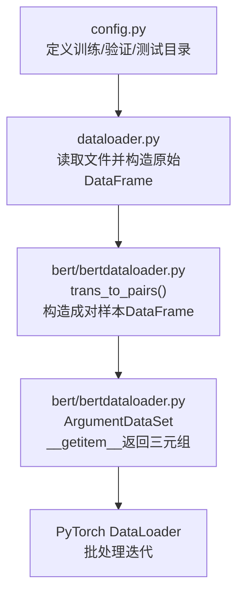
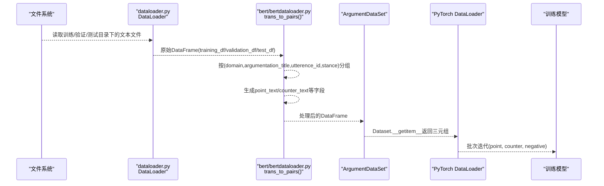
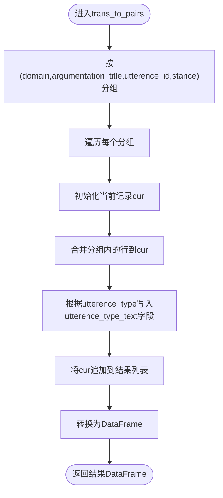
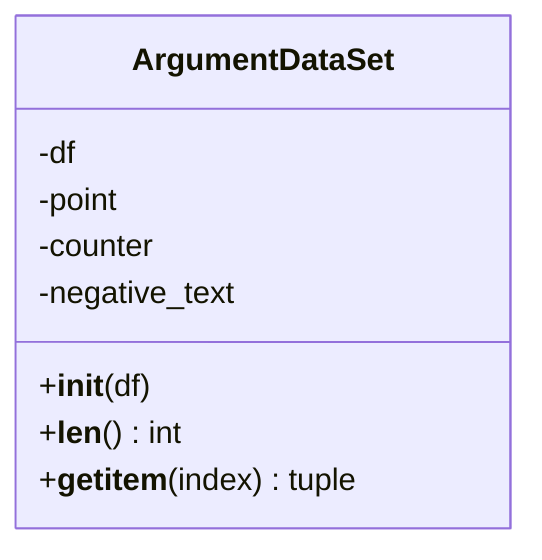
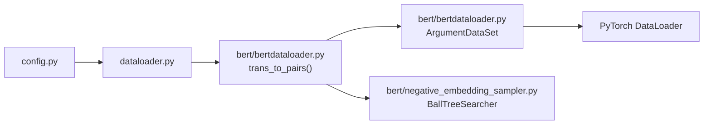

# BERT数据加载器API

<cite>
**本文引用的文件**
- [bert/bertdataloader.py](file://bert/bertdataloader.py)
- [dataloader.py](file://dataloader.py)
- [utils.py](file://utils.py)
- [config.py](file://config.py)
- [bert/negative_embedding_sampler.py](file://bert/negative_embedding_sampler.py)
- [bert/biencoder/biencoder_embedding_classification_concanated_together.py](file://bert/biencoder/biencoder_embedding_classification_concanated_together.py)
</cite>

## 目录
1. [简介](#简介)
2. [项目结构](#项目结构)
3. [核心组件](#核心组件)
4. [架构总览](#架构总览)
5. [详细组件分析](#详细组件分析)
6. [依赖关系分析](#依赖关系分析)
7. [性能考量](#性能考量)
8. [故障排查指南](#故障排查指南)
9. [结论](#结论)
10. [附录：完整使用流程示例](#附录完整使用流程示例)

## 简介
本文件面向BERT专用数据加载模块，聚焦以下目标：
- 文档化 trans_to_pairs() 函数：说明其输入为原始DataFrame，输出为构造成对样本的DataFrame（包含point_text、counter_text等字段），并解释其基于domain、argumentation_title、utterence_id、stance的分组逻辑。
- 详细描述 ArgumentDataSet 类：其 __init__ 接收处理后的DataFrame，__getitem__ 返回(point_text, counter_text, negative_text)三元组；说明其与PyTorch DataLoader的协作方式与批处理机制。
- 提供从DataFrame到ArgumentDataSet再到数据迭代器的完整流程示例路径，强调其在模型训练中的核心作用及与上游DataLoader的衔接。

## 项目结构
BERT数据加载模块位于 bert/bertdataloader.py，配合通用的数据读取器 dataloader.py 与配置 config.py，形成从原始文本文件到可训练Dataset的完整管线。

图表来源
- [config.py](file://config.py#L1-L11)
- [dataloader.py](file://dataloader.py#L1-L87)
- [bert/bertdataloader.py](file://bert/bertdataloader.py#L1-L44)

章节来源
- [config.py](file://config.py#L1-L11)
- [dataloader.py](file://dataloader.py#L1-L87)
- [bert/bertdataloader.py](file://bert/bertdataloader.py#L1-L44)

## 核心组件
- trans_to_pairs(df)
  - 输入：原始DataFrame，包含列 domain、argumentation_title、utterence_id、stance、utterence_type、text。
  - 输出：构造后的DataFrame，按(domain, argumentation_title, utterence_id, stance)分组，每组生成一行，字段包含 domain、title、stance、point_text、counter_text 等。
  - 关键逻辑：以四维组合键进行分组，遍历每个分组，依据utterence_type将对应text写入到相应字段（如point_text、counter_text）。
- ArgumentDataSet(Dataset)
  - __init__(self, df)：保存处理后的DataFrame，并预取point、counter、negative_text三列。
  - __len__(self)：返回样本数量。
  - __getitem__(self, index)：返回三元组(point_text, counter_text, negative_text)，供DataLoader批处理使用。

章节来源
- [bert/bertdataloader.py](file://bert/bertdataloader.py#L12-L25)
- [bert/bertdataloader.py](file://bert/bertdataloader.py#L30-L44)

## 架构总览
下图展示了从原始数据到训练批次的数据流，以及与PyTorch DataLoader的衔接。

图表来源
- [dataloader.py](file://dataloader.py#L1-L87)
- [bert/bertdataloader.py](file://bert/bertdataloader.py#L12-L44)
- [bert/biencoder/biencoder_embedding_classification_concanated_together.py](file://bert/biencoder/biencoder_embedding_classification_concanated_together.py#L24-L44)

## 详细组件分析

### trans_to_pairs() 函数
- 功能概述
  - 将原始按utterence拆分的多行记录，按(domain, argumentation_title, utterence_id, stance)聚合为一条成对样本记录，字段名自动映射为utterence_type_text（如point_text、counter_text）。
- 分组与字段映射
  - 分组键：domain、argumentation_title、utterence_id、stance。
  - 字段映射：根据utterence_type取text，写入到utterence_type_text字段中，最终得到point_text、counter_text等。
- 输出结构
  - 输出DataFrame包含：domain、title、stance、point_text、counter_text等列；后续通常还会新增negative_text列用于三元组训练。

图表来源
- [bert/bertdataloader.py](file://bert/bertdataloader.py#L12-L25)

章节来源
- [bert/bertdataloader.py](file://bert/bertdataloader.py#L12-L25)

### ArgumentDataSet 类
- 继承关系与职责
  - 继承自torch.utils.data.Dataset，作为PyTorch数据集接口，负责将DataFrame转换为可迭代的三元组样本。
- 初始化与属性
  - __init__(self, df)：保存DataFrame并缓存point、counter、negative_text三列，便于快速索引。
- 访问接口
  - __len__(self)：返回样本总数。
  - __getitem__(self, index)：返回三元组(point_text, counter_text, negative_text)，供DataLoader批处理使用。
- 与DataLoader协作
  - DataLoader(dataset, batch_size, shuffle, drop_last)会调用Dataset.__getitem__按索引取样，形成批次。
  - 在训练脚本中，通常会先构造Dataset，再传入DataLoader进行迭代。

图表来源
- [bert/bertdataloader.py](file://bert/bertdataloader.py#L30-L44)

章节来源
- [bert/bertdataloader.py](file://bert/bertdataloader.py#L30-L44)

### 与PyTorch DataLoader的批处理机制
- 数据准备
  - 使用dataloader.py读取文件并构造原始DataFrame。
  - 调用trans_to_pairs()将原始DataFrame转换为成对样本DataFrame。
  - 为DataFrame添加negative_text列（例如通过嵌入相似性采样）。
  - 构造ArgumentDataSet实例。
- 批处理
  - 使用torch.utils.data.DataLoader(dataset, batch_size, shuffle, drop_last)进行批处理迭代。
  - 每个批次返回三元组(point, counter, negative)，供下游模型训练使用。

章节来源
- [dataloader.py](file://dataloader.py#L1-L87)
- [bert/bertdataloader.py](file://bert/bertdataloader.py#L12-L44)
- [bert/biencoder/biencoder_embedding_classification_concanated_together.py](file://bert/biencoder/biencoder_embedding_classification_concanated_together.py#L24-L44)

## 依赖关系分析
- 文件间依赖
  - bert/bertdataloader.py 依赖 dataloader.py 的DataFrame结构与字段约定。
  - bert/bertdataloader.py 依赖 config.py 中的训练/验证/测试目录配置。
  - 训练脚本（如 biencoder_embedding_classification_concanated_together.py）依赖 bert/bertdataloader.py 的 ArgumentDataSet 与 trans_to_pairs。
  - 负样本采样依赖 bert/negative_embedding_sampler.py 的BallTreeSearcher。
- 关键耦合点
  - DataFrame字段约定：domain、argumentation_title、utterence_id、stance、utterence_type、text。
  - 成对样本字段：point_text、counter_text、negative_text。
  - Dataset接口：__getitem__返回三元组，供DataLoader批处理。

图表来源
- [config.py](file://config.py#L1-L11)
- [dataloader.py](file://dataloader.py#L1-L87)
- [bert/bertdataloader.py](file://bert/bertdataloader.py#L12-L44)
- [bert/negative_embedding_sampler.py](file://bert/negative_embedding_sampler.py#L1-L92)

章节来源
- [config.py](file://config.py#L1-L11)
- [dataloader.py](file://dataloader.py#L1-L87)
- [bert/bertdataloader.py](file://bert/bertdataloader.py#L12-L44)
- [bert/negative_embedding_sampler.py](file://bert/negative_embedding_sampler.py#L1-L92)

## 性能考量
- 分组与映射复杂度
  - trans_to_pairs() 对DataFrame执行分组与逐行映射，时间复杂度近似O(N)，N为原始记录数；空间复杂度近似O(N)。
- Dataset访问
  - ArgumentDataSet通过列索引直接访问point、counter、negative_text，索引访问为O(1)。
- DataLoader批处理
  - 合理设置batch_size与shuffle可提升吞吐；drop_last控制是否丢弃不足一批的样本。
- 负样本采样
  - 使用BallTreeSearcher进行嵌入相似性检索，查询复杂度受BallTree参数与k值影响；建议在训练前离线构建候选负样本集合，减少在线采样开销。

[本节为通用性能讨论，无需特定文件引用]

## 故障排查指南
- 常见问题与定位
  - 缺少必要字段：确保DataFrame包含domain、argumentation_title、utterence_id、stance、utterence_type、text等列。
  - 分组后出现空值：trans_to_pairs()可能因某些utterence_type缺失导致空值，需在调用后进行dropna()处理。
  - negative_text未生成：在训练脚本中需要显式添加或通过嵌入相似性采样生成。
  - DataLoader报错：检查Dataset.__getitem__返回类型是否为三元组，且DataLoader参数batch_size、shuffle、drop_last设置合理。
- 参考实现位置
  - DataFrame构造与字段读取：参见 dataloader.py 的read_data与to_dataframe。
  - 成对样本构造：参见 bert/bertdataloader.py 的 trans_to_pairs()。
  - Dataset实现：参见 bert/bertdataloader.py 的 ArgumentDataSet。
  - 负样本采样：参见 bert/negative_embedding_sampler.py 的 BallTreeSearcher。

章节来源
- [dataloader.py](file://dataloader.py#L1-L87)
- [bert/bertdataloader.py](file://bert/bertdataloader.py#L12-L44)
- [bert/negative_embedding_sampler.py](file://bert/negative_embedding_sampler.py#L1-L92)

## 结论
BERT数据加载模块通过trans_to_pairs()将原始对话片段聚合成成对样本，并由ArgumentDataSet提供统一的Dataset接口，与PyTorch DataLoader无缝协作，支撑三元组训练流程。该模块在数据预处理阶段承担关键角色，直接影响模型训练的样本质量与效率。

[本节为总结性内容，无需特定文件引用]

## 附录：完整使用流程示例
以下示例展示从原始数据到训练迭代器的端到端流程，具体实现请参考下列文件路径与行号。

- 读取原始数据并构造DataFrame
  - 参考路径：[dataloader.py](file://dataloader.py#L1-L87)
  - 关键步骤：初始化DataLoader，读取文件，构造training_df、validation_df、test_df。
- 转换为成对样本DataFrame
  - 参考路径：[bert/bertdataloader.py](file://bert/bertdataloader.py#L12-L25)
  - 关键步骤：调用trans_to_pairs()，对训练/验证/测试集分别处理。
- 补充negative_text并构造Dataset
  - 参考路径：[bert/bertdataloader.py](file://bert/bertdataloader.py#L30-L44)
  - 参考路径：[bert/biencoder/biencoder_embedding_classification_concanated_together.py](file://bert/biencoder/biencoder_embedding_classification_concanated_together.py#L24-L44)
  - 关键步骤：为DataFrame添加negative_text列，构造ArgumentDataSet实例。
- 使用DataLoader进行批处理迭代
  - 参考路径：[bert/biencoder/biencoder_embedding_classification_concanated_together.py](file://bert/biencoder/biencoder_embedding_classification_concanated_together.py#L92-L112)
  - 关键步骤：DataLoader(training_dataset, batch_size=..., shuffle=..., drop_last=...)，在训练循环中迭代(point, counter, negative)三元组。

章节来源
- [dataloader.py](file://dataloader.py#L1-L87)
- [bert/bertdataloader.py](file://bert/bertdataloader.py#L12-L44)
- [bert/biencoder/biencoder_embedding_classification_concanated_together.py](file://bert/biencoder/biencoder_embedding_classification_concanated_together.py#L24-L44)
- [bert/biencoder/biencoder_embedding_classification_concanated_together.py](file://bert/biencoder/biencoder_embedding_classification_concanated_together.py#L92-L112)