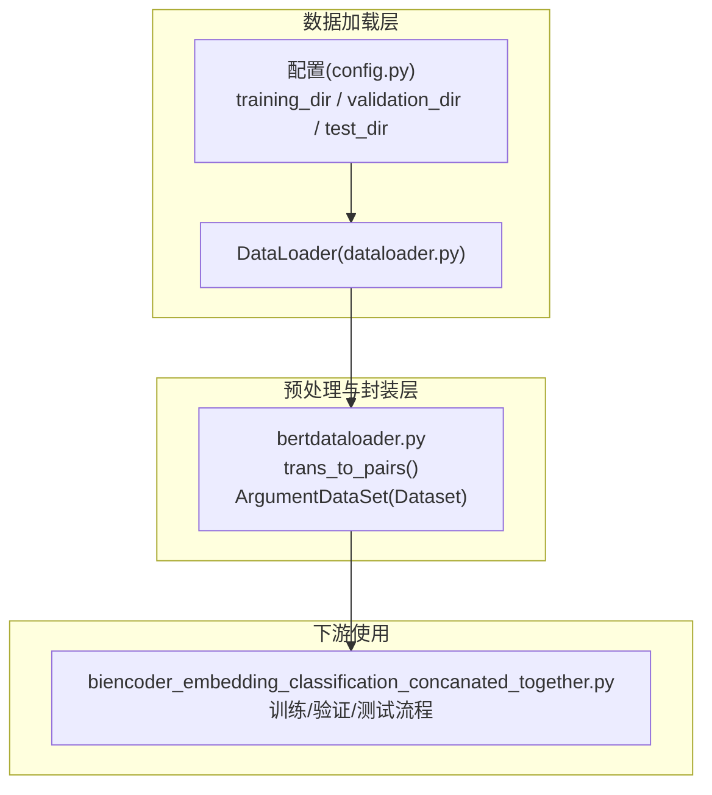
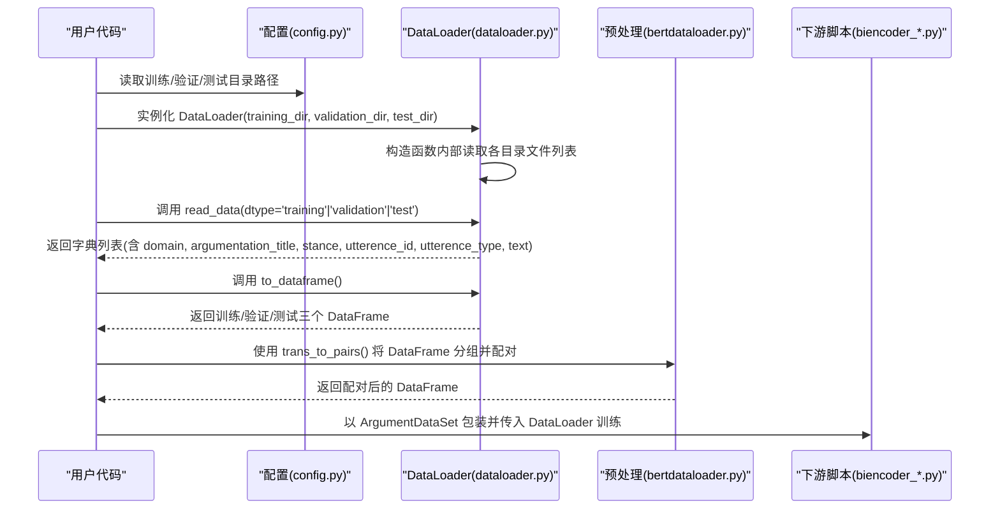
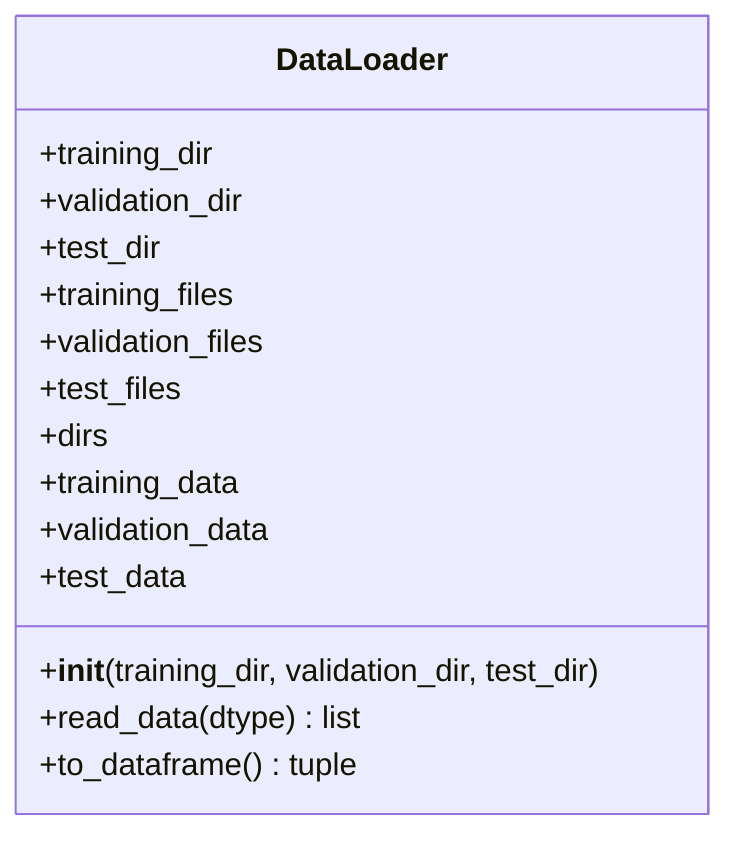
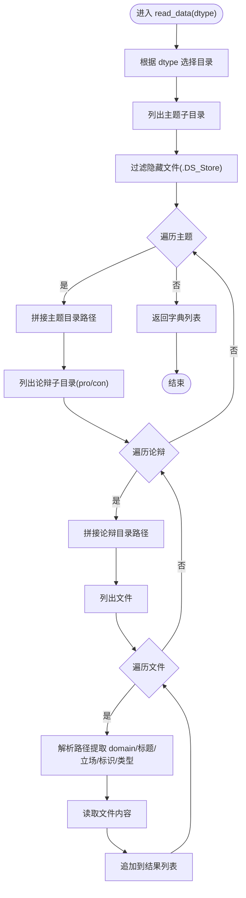
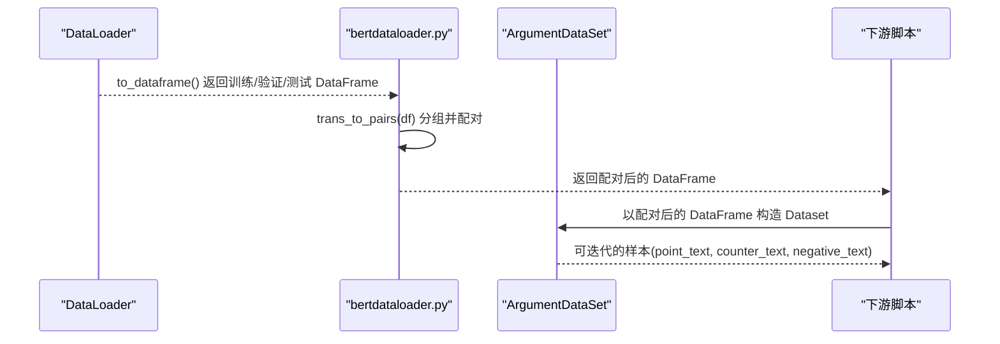

# DataLoader API

<cite>
**本文引用的文件**
- [dataloader.py](file://dataloader.py)
- [bertdataloader.py](file://bert/bertdataloader.py)
- [config.py](file://config.py)
- [utils.py](file://utils.py)
- [biencoder_embedding_classification_concanated_together.py](file://bert/biencoder/biencoder_embedding_classification_concanated_together.py)
</cite>

## 目录
1. [简介](#简介)
2. [项目结构](#项目结构)
3. [核心组件](#核心组件)
4. [架构总览](#架构总览)
5. [详细组件分析](#详细组件分析)
6. [依赖关系分析](#依赖关系分析)
7. [性能考量](#性能考量)
8. [故障排查指南](#故障排查指南)
9. [结论](#结论)
10. [附录](#附录)

## 简介
本文件为 DataLoader 类的详尽 API 参考文档，覆盖以下要点：
- 构造函数 __init__ 的参数 training_dir、validation_dir、test_dir 的用途与配置方式
- read_data() 方法的 dtype 参数（支持 'training'、'validation'、'test'）与返回数据结构（字典列表，包含 domain、argumentation_title、stance、utterence_id、utterence_type、text 等字段）
- to_dataframe() 方法如何将原始数据转换为 Pandas DataFrame，并返回训练、验证、测试三个数据集
- 实际调用示例：如何实例化 DataLoader 并获取 DataFrame
- 模块与 bertdataloader.py 的依赖关系，以及在数据预处理流程中的作用
- 可能的异常情况（如目录不存在）及处理建议

## 项目结构
DataLoader 位于仓库根目录，负责从本地文件系统读取论辩语料，解析为结构化数据；bertdataloader.py 则基于 DataLoader 输出的数据进行配对与 Dataset 包装，供下游模型训练使用。

图表来源
- [dataloader.py](file://dataloader.py#L1-L87)
- [bertdataloader.py](file://bert/bertdataloader.py#L1-L44)
- [config.py](file://config.py#L1-L11)
- [biencoder_embedding_classification_concanated_together.py](file://bert/biencoder/biencoder_embedding_classification_concanated_together.py#L20-L44)

章节来源
- [dataloader.py](file://dataloader.py#L1-L87)
- [config.py](file://config.py#L1-L11)

## 核心组件
- DataLoader 类：负责从指定目录读取论辩文本，构建统一的数据结构，并输出为 Pandas DataFrame。
- bertdataloader.py：对 DataLoader 输出的 DataFrame 进行分组与配对，生成可用于对比学习的正负样本组合，并封装为 PyTorch Dataset。
- 配置 config.py：定义训练/验证/测试数据目录路径前缀。

章节来源
- [dataloader.py](file://dataloader.py#L11-L87)
- [bertdataloader.py](file://bert/bertdataloader.py#L1-L44)
- [config.py](file://config.py#L1-L11)

## 架构总览
DataLoader 作为数据源，提供标准化的数据结构；bertdataloader 提供配对与 Dataset 封装；下游脚本通过 DataLoader 获取 DataFrame 后，再经由 bertdataloader 完成配对与训练数据准备。

图表来源
- [dataloader.py](file://dataloader.py#L11-L87)
- [bertdataloader.py](file://bert/bertdataloader.py#L1-L44)
- [config.py](file://config.py#L1-L11)
- [biencoder_embedding_classification_concanated_together.py](file://bert/biencoder/biencoder_embedding_classification_concanated_together.py#L20-L44)

## 详细组件分析

### DataLoader 类
- 作用：从本地文件系统按固定目录结构读取论辩文本，解析出领域、标题、立场、话语标识、话语类型与正文，形成统一的数据结构；随后可转为 Pandas DataFrame。
- 关键属性与方法：
  - __init__(training_dir, validation_dir, test_dir)
  - read_data(dtype='training'|'validation'|'test')
  - to_dataframe()

图表来源
- [dataloader.py](file://dataloader.py#L11-L87)

章节来源
- [dataloader.py](file://dataloader.py#L11-L87)

#### 构造函数 __init__
- 参数
  - training_dir：训练集目录相对路径（由 config.py 提供）
  - validation_dir：验证集目录相对路径（由 config.py 提供）
  - test_dir：测试集目录相对路径（由 config.py 提供）
- 行为
  - 将传入的相对路径与当前脚本所在目录拼接，得到绝对路径
  - 列出各目录下的文件/子目录，并过滤掉 macOS 常见隐藏文件
  - 构建 dtype 到目录的映射
  - 在构造时即读取三类数据，分别缓存到 training_data、validation_data、test_data

配置方式
- 默认路径来自 config.py 中的 training_dir、validation_dir、test_dir
- 若需自定义，可在实例化时传入新的相对路径字符串

章节来源
- [dataloader.py](file://dataloader.py#L11-L33)
- [config.py](file://config.py#L1-L11)

#### 方法 read_data(dtype)
- 参数
  - dtype：字符串，取值范围为 'training'、'validation'、'test'
- 行为
  - 根据 dtype 选择对应目录，遍历主题、论点、正反方子目录，收集所有文本文件
  - 解析文件路径，提取 domain、argumentation_title、stance、utterence_id、utterence_type
  - 读取文件内容，组装为字典列表
- 返回
  - 字典列表，每个字典包含以下键：
    - domain：领域
    - argumentation_title：论辩标题
    - stance：立场（pro/con）
    - utterence_id：话语标识
    - utterence_type：话语类型（point、counter 等）
    - text：文本内容

图表来源
- [dataloader.py](file://dataloader.py#L30-L69)

章节来源
- [dataloader.py](file://dataloader.py#L30-L69)

#### 方法 to_dataframe()
- 行为
  - 将 training_data、validation_data、test_data 分别转换为 Pandas DataFrame
- 返回
  - 三元组：(training_df, validation_df, test_df)

章节来源
- [dataloader.py](file://dataloader.py#L71-L75)

### bertdataloader.py 与 DataLoader 的协作
- 依赖关系
  - bertdataloader.py 导入 DataLoader 并使用其 to_dataframe() 输出的 DataFrame
  - bertdataloader.py 提供 trans_to_pairs() 将按领域/标题/标识/立场分组的记录配对为 point_text、counter_text 等列
  - bertdataloader.py 提供 ArgumentDataSet(Dataset) 以便 PyTorch DataLoader 使用
- 数据预处理流程
  - 先由 DataLoader 读取原始文本并转为 DataFrame
  - 再由 trans_to_pairs() 对 DataFrame 进行分组与配对，生成可用于对比学习的样本
  - 最后以 ArgumentDataSet 包装，供下游模型训练使用

图表来源
- [dataloader.py](file://dataloader.py#L71-L75)
- [bertdataloader.py](file://bert/bertdataloader.py#L1-L44)
- [biencoder_embedding_classification_concanated_together.py](file://bert/biencoder/biencoder_embedding_classification_concanated_together.py#L20-L44)

章节来源
- [bertdataloader.py](file://bert/bertdataloader.py#L1-L44)
- [biencoder_embedding_classification_concanated_together.py](file://bert/biencoder/biencoder_embedding_classification_concanated_together.py#L20-L44)

### 实际调用示例
- 基础用法
  - 从 config.py 读取默认路径，实例化 DataLoader
  - 调用 to_dataframe() 获取训练/验证/测试三个 DataFrame
- 下游使用
  - 将 DataFrame 传入 bertdataloader.trans_to_pairs() 进行配对
  - 以 ArgumentDataSet 包装后交由 PyTorch DataLoader 使用

章节来源
- [dataloader.py](file://dataloader.py#L81-L87)
- [config.py](file://config.py#L1-L11)
- [bertdataloader.py](file://bert/bertdataloader.py#L1-L44)
- [biencoder_embedding_classification_concanated_together.py](file://bert/biencoder/biencoder_embedding_classification_concanated_together.py#L20-L44)

## 依赖关系分析
- dataloader.py 依赖 config.py 提供的默认路径
- bertdataloader.py 依赖 dataloader.py 的 DataLoader 类
- 下游脚本（如 biencoder_embedding_classification_concanated_together.py）依赖 bertdataloader.py 的 Dataset 和配对函数

图表来源
- [config.py](file://config.py#L1-L11)
- [dataloader.py](file://dataloader.py#L1-L87)
- [bertdataloader.py](file://bert/bertdataloader.py#L1-L44)
- [biencoder_embedding_classification_concanated_together.py](file://bert/biencoder/biencoder_embedding_classification_concanated_together.py#L20-L44)

章节来源
- [config.py](file://config.py#L1-L11)
- [dataloader.py](file://dataloader.py#L1-L87)
- [bertdataloader.py](file://bert/bertdataloader.py#L1-L44)
- [biencoder_embedding_classification_concanated_together.py](file://bert/biencoder/biencoder_embedding_classification_concanated_together.py#L20-L44)

## 性能考量
- 文件系统 IO：read_data() 需要遍历大量小文件，建议确保数据目录结构规范，避免过多层级嵌套
- 进度显示：read_data() 使用进度条库打印读取进度，便于监控大文件集合的加载过程
- DataFrame 构建：to_dataframe() 将字典列表转为 DataFrame，注意内存占用与列数量

章节来源
- [dataloader.py](file://dataloader.py#L58-L75)

## 故障排查指南
- 目录不存在或路径错误
  - 现象：构造 DataLoader 时无法列出目录或读取文件报错
  - 处理建议：确认 config.py 中的路径与实际数据目录一致；或在实例化时传入正确的相对路径
- 隐藏文件干扰
  - 现象：目录中存在系统隐藏文件导致解析异常
  - 处理建议：确保数据目录不包含隐藏文件；代码已尝试过滤常见隐藏文件
- 文件编码问题
  - 现象：读取文件时报编码错误
  - 处理建议：确保文本文件采用 UTF-8 编码
- 数据结构不匹配
  - 现象：路径解析失败或字段缺失
  - 处理建议：检查数据目录结构是否符合预期（领域/标题/立场/标识/类型/文本文件）

章节来源
- [dataloader.py](file://dataloader.py#L11-L33)
- [dataloader.py](file://dataloader.py#L58-L69)

## 结论
DataLoader 提供了从本地文件系统到结构化数据的桥梁，配合 bertdataloader 的配对与 Dataset 封装，能够高效地支撑下游模型训练。正确配置路径、保持数据目录结构规范，是稳定运行的关键。

## 附录
- 字段说明
  - domain：领域
  - argumentation_title：论辩标题
  - stance：立场（pro/con）
  - utterence_id：话语标识
  - utterence_type：话语类型（point、counter 等）
  - text：文本内容

章节来源
- [dataloader.py](file://dataloader.py#L58-L69)