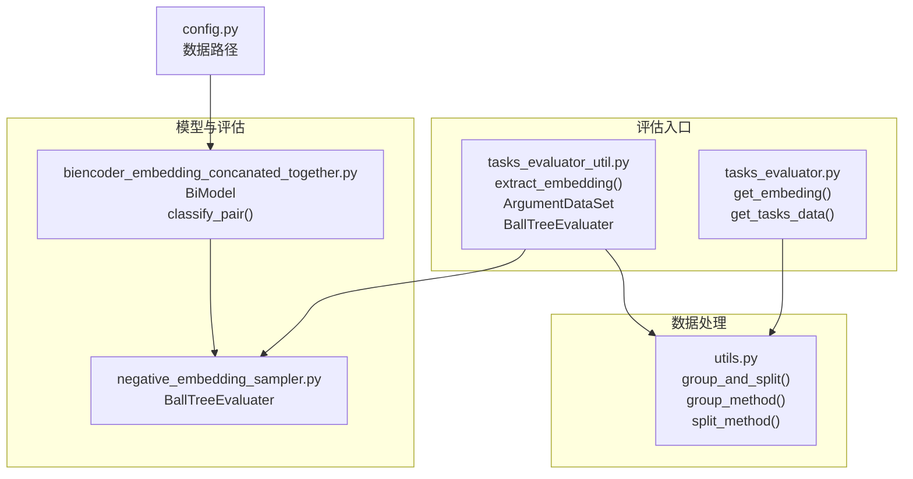
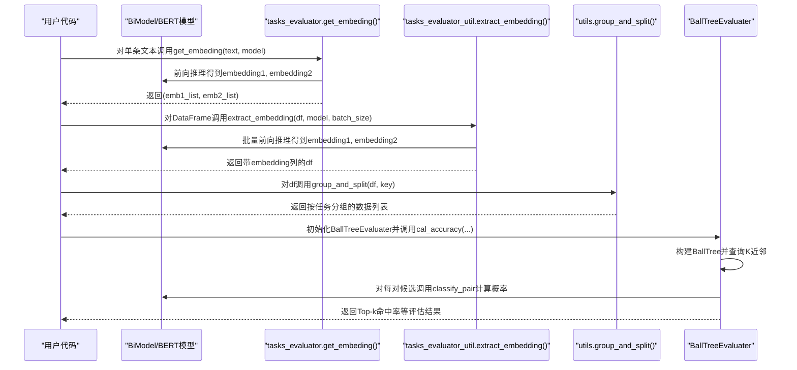
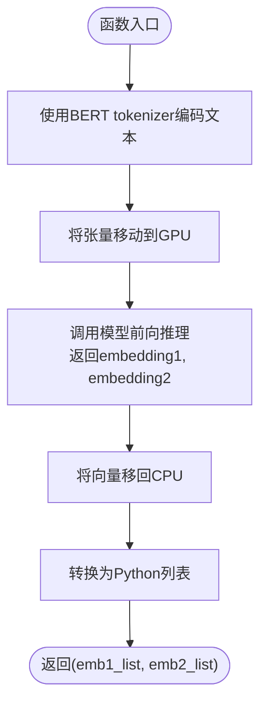
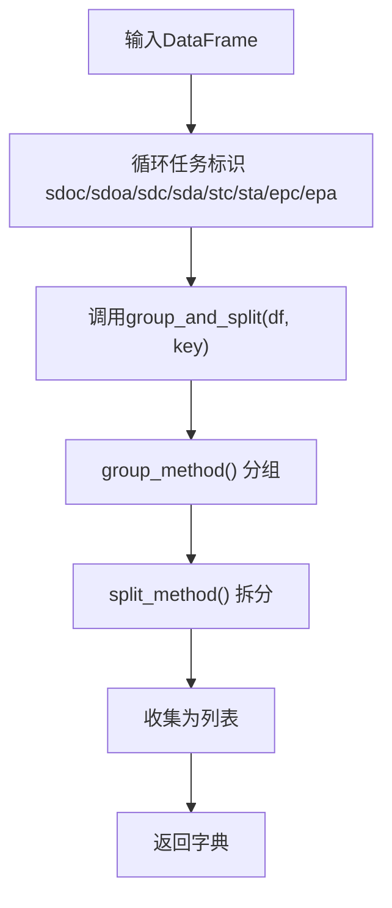
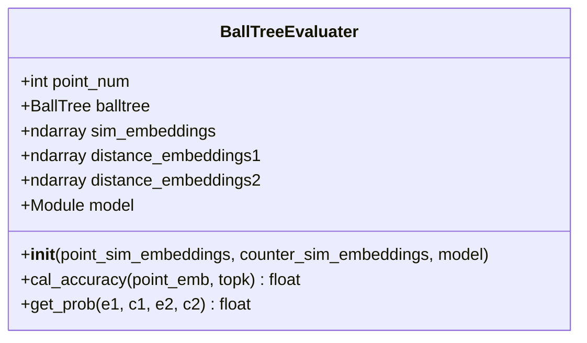
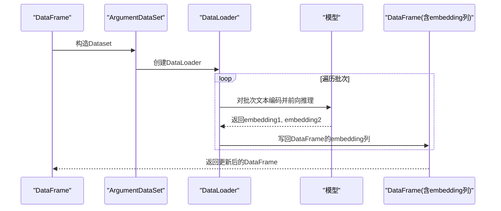
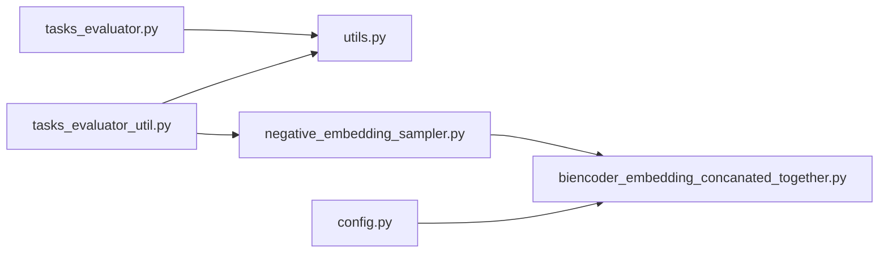

# 任务评估器API

<cite>
**本文引用的文件**
- [tasks_evaluator.py](file://bert/tasks_evaluator.py)
- [tasks_evaluator_util.py](file://bert/tasks_evaluator_util.py)
- [utils.py](file://utils.py)
- [negative_embedding_sampler.py](file://bert/negative_embedding_sampler.py)
- [biencoder_embedding_concanated_together.py](file://bert/biencoder/biencoder_embedding_concanated_together.py)
- [config.py](file://config.py)
</cite>

## 目录
1. [简介](#简介)
2. [项目结构](#项目结构)
3. [核心组件](#核心组件)
4. [架构总览](#架构总览)
5. [详细组件分析](#详细组件分析)
6. [依赖关系分析](#依赖关系分析)
7. [性能考量](#性能考量)
8. [故障排查指南](#故障排查指南)
9. [结论](#结论)
10. [附录：端到端示例与最佳实践](#附录端到端示例与最佳实践)

## 简介
本API文档聚焦于多任务评估框架中的两个关键函数与一个评估器类：
- get_embeding()：基于预训练BERT tokenizer与模型，对单条输入文本生成双层嵌入向量（embedding1, embedding2）。
- get_tasks_data()：接收DataFrame，按八类任务标识（sdoc、sdoa、sdc、sda、stc、sta、epc、epa）分别调用utils.py中的group_and_split()进行分组与拆分，返回包含各任务数据的字典。
- BallTreeEvaluater：集成BallTree进行跨任务性能评估，结合分类层计算正样本概率并统计Top-1命中率等指标。

文档还提供端到端示例，展示如何加载模型、生成嵌入、分组数据并执行评估。

## 项目结构
围绕任务评估的核心文件与职责如下：
- bert/tasks_evaluator.py：定义get_embeding()与get_tasks_data()，并引入预训练tokenizer与BallTreeEvaluater。
- bert/tasks_evaluator_util.py：提供批量提取嵌入的工具函数extract_embedding()、Dataset封装ArgumentDataSet，以及BallTreeEvaluater的实现。
- utils.py：提供group_and_split()及其内部的group_method()、split_method()与多种拆分策略函数，支撑按任务维度的数据分组与切分。
- bert/negative_embedding_sampler.py：BallTreeEvaluater的实现，负责构建BallTree、查询K近邻、调用分类层计算概率并评估准确率。
- bert/biencoder/biencoder_embedding_concanated_together.py：BiEncoder模型示例，展示如何使用BERT tokenizer与模型输出双层嵌入，并通过BallTreeEvaluater进行评估。
- config.py：数据路径配置，供数据加载与训练/验证/测试划分使用。

图表来源
- [tasks_evaluator.py](file://bert/tasks_evaluator.py#L1-L37)
- [tasks_evaluator_util.py](file://bert/tasks_evaluator_util.py#L1-L101)
- [utils.py](file://utils.py#L259-L296)
- [negative_embedding_sampler.py](file://bert/negative_embedding_sampler.py#L48-L92)
- [biencoder_embedding_concanated_together.py](file://bert/biencoder/biencoder_embedding_concanated_together.py#L48-L80)
- [config.py](file://config.py#L1-L11)

章节来源
- [tasks_evaluator.py](file://bert/tasks_evaluator.py#L1-L37)
- [tasks_evaluator_util.py](file://bert/tasks_evaluator_util.py#L1-L101)
- [utils.py](file://utils.py#L259-L296)
- [negative_embedding_sampler.py](file://bert/negative_embedding_sampler.py#L48-L92)
- [biencoder_embedding_concanated_together.py](file://bert/biencoder/biencoder_embedding_concanated_together.py#L48-L80)
- [config.py](file://config.py#L1-L11)

## 核心组件
- get_embeding(text, model)
  - 功能：对单条文本生成双层嵌入向量（embedding1, embedding2），并返回Python列表。
  - 输入：text（字符串）、model（支持forward(input_ids, token_type_ids, attention_mask)并返回两个向量的模型对象）。
  - 输出：(embedding1: list[float], embedding2: list[float])。
  - 关键步骤：使用预训练tokenizer对text进行编码；将编码张量移动至GPU；调用模型forward得到两个向量；将向量移回CPU并转为Python列表。
  - 复杂度：O(T)（T为序列长度），主要由tokenizer与模型前向传播决定。
  - 注意：需要确保模型具备forward签名与设备可用性（如CUDA）。

- get_tasks_data(df)
  - 功能：按八类任务标识对DataFrame进行分组与拆分，返回字典，键为任务标识，值为分组后的数据列表。
  - 支持的任务标识：sdoc、sdoa、sdc、sda、stc、sta、epc、epa。
  - 实现：对每个任务标识调用utils.group_and_split(df, key)，内部先按group_method()分组，再按split_method()拆分为point/argument或point/counter等结构。
  - 返回：dict[str, List[DataFrame]]。
  - 复杂度：O(N·log N)（分组）+ 拆分策略的线性扫描，N为样本数。

- BallTreeEvaluater
  - 功能：基于BallTree进行跨任务相似样本检索与排序，结合分类层计算正样本概率，评估Top-1命中率等。
  - 关键方法：
    - __init__(point_sim_embeddings, counter_sim_embeddings, model)：构建BallTree，拼接候选嵌入与对应距离向量。
    - cal_accuracy(point_emb, topk=10)：查询K近邻，对每条样本选择使分类概率最大的邻居作为预测，统计命中率。
    - get_prob(e1, c1, e2, e2)：将四路嵌入合并并通过模型的分类层（classify_pair）计算正样本概率。
  - 评估流程：对每个样本查询K近邻，比较分类概率，若命中自身则计为正样本，最终返回准确率。

章节来源
- [tasks_evaluator.py](file://bert/tasks_evaluator.py#L11-L19)
- [tasks_evaluator.py](file://bert/tasks_evaluator.py#L27-L37)
- [tasks_evaluator_util.py](file://bert/tasks_evaluator_util.py#L26-L56)
- [tasks_evaluator_util.py](file://bert/tasks_evaluator_util.py#L59-L101)
- [utils.py](file://utils.py#L259-L296)
- [negative_embedding_sampler.py](file://bert/negative_embedding_sampler.py#L48-L92)

## 架构总览
下图展示了从输入文本到任务分组再到评估的整体流程。

图表来源
- [tasks_evaluator.py](file://bert/tasks_evaluator.py#L11-L19)
- [tasks_evaluator_util.py](file://bert/tasks_evaluator_util.py#L39-L56)
- [utils.py](file://utils.py#L292-L296)
- [negative_embedding_sampler.py](file://bert/negative_embedding_sampler.py#L48-L92)

## 详细组件分析

### get_embeding() 组件分析
- 设计要点
  - 使用预训练BERT tokenizer对输入文本进行编码，生成input_ids、token_type_ids、attention_mask。
  - 将张量移动至GPU后传入模型，得到两个向量embedding1与embedding2。
  - 将向量移回CPU并转换为Python列表，便于后续处理。
- 错误处理
  - 需要确保模型forward签名与输入张量形状匹配。
  - 若无GPU或CUDA不可用，需调整设备设置。
- 性能建议
  - 单条文本处理开销较小，适合在评估阶段逐条生成嵌入。
  - 批量处理建议使用extract_embedding()以提升吞吐。

图表来源
- [tasks_evaluator.py](file://bert/tasks_evaluator.py#L11-L19)

章节来源
- [tasks_evaluator.py](file://bert/tasks_evaluator.py#L11-L19)

### get_tasks_data() 组件分析
- 设计要点
  - 针对八类任务标识依次调用group_and_split(df, key)，返回字典。
  - group_and_split内部先按group_method()进行分组，再按split_method()应用具体拆分策略。
- 数据结构
  - 返回dict[str, List[DataFrame]]，其中每个DataFrame代表某任务下的一个分组样本集合。
- 复杂度
  - 分组与拆分均为线性扫描，总体复杂度接近O(N)。

图表来源
- [tasks_evaluator.py](file://bert/tasks_evaluator.py#L27-L37)
- [utils.py](file://utils.py#L259-L296)

章节来源
- [tasks_evaluator.py](file://bert/tasks_evaluator.py#L27-L37)
- [utils.py](file://utils.py#L259-L296)

### BallTreeEvaluater 类分析
- 设计要点
  - 在初始化时拼接point与counter的嵌入，构建BallTree用于快速查询K近邻。
  - cal_accuracy()对每个样本查询K近邻，选择使分类概率最大的邻居作为预测，统计命中率。
  - get_prob()通过模型的classify_pair()合并四路嵌入并计算softmax后的正样本概率。
- 依赖关系
  - 依赖sklearn.neighbors.BallTree进行高效最近邻搜索。
  - 依赖模型的classify_pair()方法，通常来自BiModel或其他自定义模型。
- 复杂度
  - 查询阶段对每个样本进行K次查询，整体约为O(N·K·log N)。

图表来源
- [negative_embedding_sampler.py](file://bert/negative_embedding_sampler.py#L48-L92)

章节来源
- [negative_embedding_sampler.py](file://bert/negative_embedding_sampler.py#L48-L92)

### extract_embedding() 与 ArgumentDataSet 组件分析
- 设计要点
  - ArgumentDataSet提供Dataset接口，从DataFrame中取出文本字段。
  - extract_embedding()使用DataLoader批量处理，对每批文本进行padding与截断，调用模型得到embedding1与embedding2，并写回DataFrame。
- 适用场景
  - 当需要对整张表生成嵌入时，使用此函数可显著提升效率。
- 复杂度
  - O(N·T)（N为样本数，T为平均序列长度），受DataLoader批大小与模型前向传播影响。

图表来源
- [tasks_evaluator_util.py](file://bert/tasks_evaluator_util.py#L26-L56)

章节来源
- [tasks_evaluator_util.py](file://bert/tasks_evaluator_util.py#L26-L56)

## 依赖关系分析
- 模块耦合
  - tasks_evaluator.py与utils.py强耦合：前者直接调用后者提供的group_and_split()。
  - tasks_evaluator_util.py与utils.py强耦合：extract_embedding()内部同样依赖group_and_split()。
  - BallTreeEvaluater依赖模型的classify_pair()方法，通常来自BiModel。
- 外部依赖
  - transformers.BertTokenizer/BertModel：用于文本编码与嵌入生成。
  - sklearn.neighbors.BallTree：用于高效最近邻搜索。
  - torch：用于张量操作与模型推理。
- 潜在循环依赖
  - 未发现循环导入；各模块职责清晰，接口边界明确。

图表来源
- [tasks_evaluator.py](file://bert/tasks_evaluator.py#L1-L37)
- [tasks_evaluator_util.py](file://bert/tasks_evaluator_util.py#L1-L101)
- [utils.py](file://utils.py#L259-L296)
- [negative_embedding_sampler.py](file://bert/negative_embedding_sampler.py#L48-L92)
- [biencoder_embedding_concanated_together.py](file://bert/biencoder/biencoder_embedding_concanated_together.py#L48-L80)
- [config.py](file://config.py#L1-L11)

章节来源
- [tasks_evaluator.py](file://bert/tasks_evaluator.py#L1-L37)
- [tasks_evaluator_util.py](file://bert/tasks_evaluator_util.py#L1-L101)
- [utils.py](file://utils.py#L259-L296)
- [negative_embedding_sampler.py](file://bert/negative_embedding_sampler.py#L48-L92)
- [biencoder_embedding_concanated_together.py](file://bert/biencoder/biencoder_embedding_concanated_together.py#L48-L80)
- [config.py](file://config.py#L1-L11)

## 性能考量
- 单条嵌入生成：get_embeding()适合逐条生成，但吞吐较低；大批量请使用extract_embedding()。
- 批量嵌入生成：extract_embedding()通过DataLoader并行处理，显著提升速度；注意批大小与GPU显存。
- BallTree查询：K值越大，召回越准但耗时越高；可根据任务需求调整topk。
- 设备选择：确保模型与张量均在相同设备上；若无GPU，需禁用CUDA或将张量移回CPU。
- 数据预处理：group_and_split()依赖分组字段，确保DataFrame包含正确的任务标识列。

## 故障排查指南
- CUDA不可用或显存不足
  - 现象：运行时报错或内存溢出。
  - 排查：检查是否启用CUDA；降低批大小；确认模型与张量在同一设备。
  - 参考位置：[tasks_evaluator.py](file://bert/tasks_evaluator.py#L11-L19)、[tasks_evaluator_util.py](file://bert/tasks_evaluator_util.py#L39-L56)。
- 模型forward签名不匹配
  - 现象：调用模型时报错。
  - 排查：确保模型forward接受input_ids、token_type_ids、attention_mask参数并返回两个向量。
  - 参考位置：[tasks_evaluator.py](file://bert/tasks_evaluator.py#L11-L19)、[biencoder_embedding_concanated_together.py](file://bert/biencoder/biencoder_embedding_concanated_together.py#L48-L80)。
- 任务分组字段缺失
  - 现象：group_and_split()无法按指定key分组。
  - 排查：确认DataFrame包含sdoc/sdoa/sdc/sda/stc/sta/epc/epa对应的分组字段。
  - 参考位置：[utils.py](file://utils.py#L259-L296)。
- BallTree查询异常
  - 现象：cal_accuracy()报错或结果异常。
  - 排查：确认sim_embeddings与distance_embeddings1/2维度一致；检查模型classify_pair()是否可用。
  - 参考位置：[negative_embedding_sampler.py](file://bert/negative_embedding_sampler.py#L48-L92)。

章节来源
- [tasks_evaluator.py](file://bert/tasks_evaluator.py#L11-L19)
- [tasks_evaluator_util.py](file://bert/tasks_evaluator_util.py#L39-L56)
- [utils.py](file://utils.py#L259-L296)
- [negative_embedding_sampler.py](file://bert/negative_embedding_sampler.py#L48-L92)
- [biencoder_embedding_concanated_together.py](file://bert/biencoder/biencoder_embedding_concanated_together.py#L48-L80)

## 结论
本API文档系统梳理了多任务评估框架中的嵌入生成、任务分组与跨任务评估流程。get_embeding()与get_tasks_data()提供了简洁易用的接口，配合BallTreeEvaluater实现了高效的跨任务性能评估。通过extract_embedding()可实现大规模嵌入生成，结合utils.py的分组拆分策略，能够覆盖多种辩论与论证场景的任务维度。

## 附录：端到端示例与最佳实践
- 端到端示例（概览）
  - 加载模型与tokenizer：参考BiModel的初始化方式，确保模型具备forward与get_tokenizer方法。
    - 参考位置：[biencoder_embedding_concanated_together.py](file://bert/biencoder/biencoder_embedding_concanated_together.py#L48-L80)
  - 生成单条嵌入：调用get_embeding(text, model)。
    - 参考位置：[tasks_evaluator.py](file://bert/tasks_evaluator.py#L11-L19)
  - 批量生成嵌入：调用extract_embedding(df, model, batch_size)，将embedding1与embedding2写回DataFrame。
    - 参考位置：[tasks_evaluator_util.py](file://bert/tasks_evaluator_util.py#L39-L56)
  - 任务分组：对DataFrame调用get_tasks_data(df)，按八类任务标识分组与拆分。
    - 参考位置：[tasks_evaluator.py](file://bert/tasks_evaluator.py#L27-L37)、[utils.py](file://utils.py#L259-L296)
  - 评估：初始化BallTreeEvaluater并调用cal_accuracy(...)，统计Top-k命中率。
    - 参考位置：[negative_embedding_sampler.py](file://bert/negative_embedding_sampler.py#L48-L92)
- 最佳实践
  - 使用extract_embedding()进行批量嵌入生成，提高吞吐。
  - 合理设置batch_size与topk，平衡精度与性能。
  - 确保DataFrame包含正确的任务标识字段，避免分组失败。
  - 在GPU环境运行时，统一管理设备与dtype，避免跨设备错误。

章节来源
- [tasks_evaluator.py](file://bert/tasks_evaluator.py#L11-L19)
- [tasks_evaluator.py](file://bert/tasks_evaluator.py#L27-L37)
- [tasks_evaluator_util.py](file://bert/tasks_evaluator_util.py#L39-L56)
- [utils.py](file://utils.py#L259-L296)
- [negative_embedding_sampler.py](file://bert/negative_embedding_sampler.py#L48-L92)
- [biencoder_embedding_concanated_together.py](file://bert/biencoder/biencoder_embedding_concanated_together.py#L48-L80)