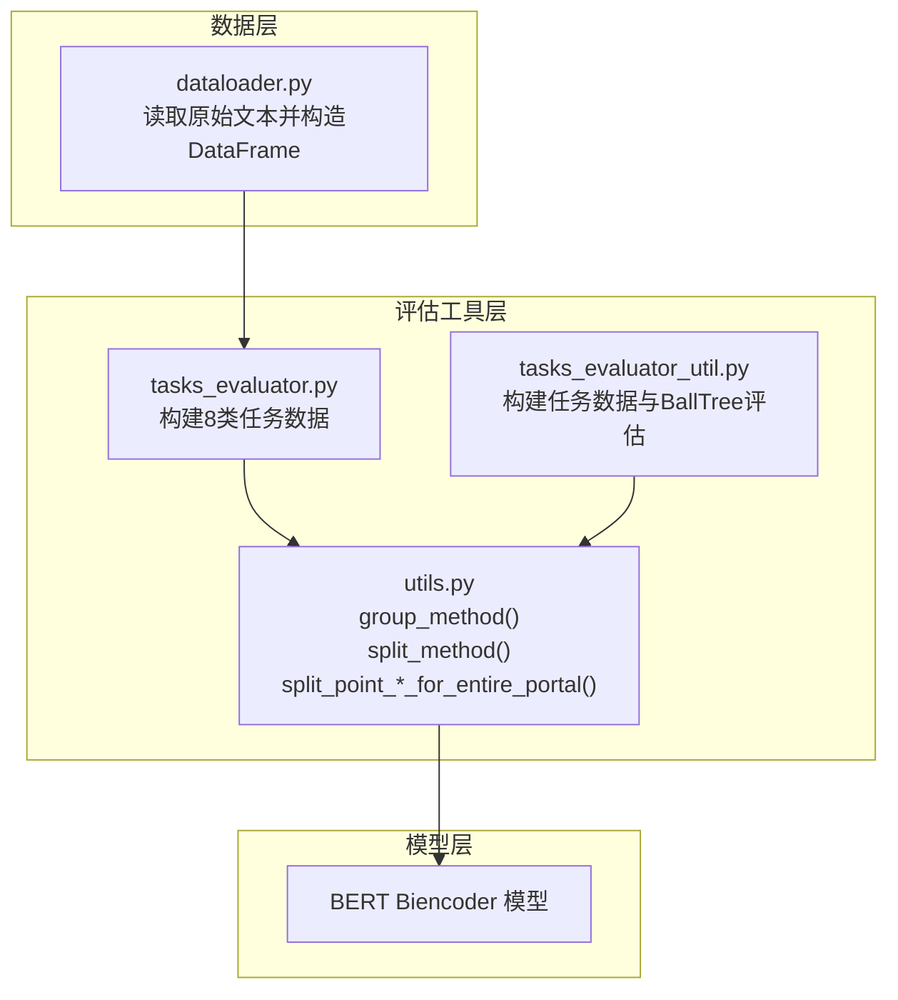
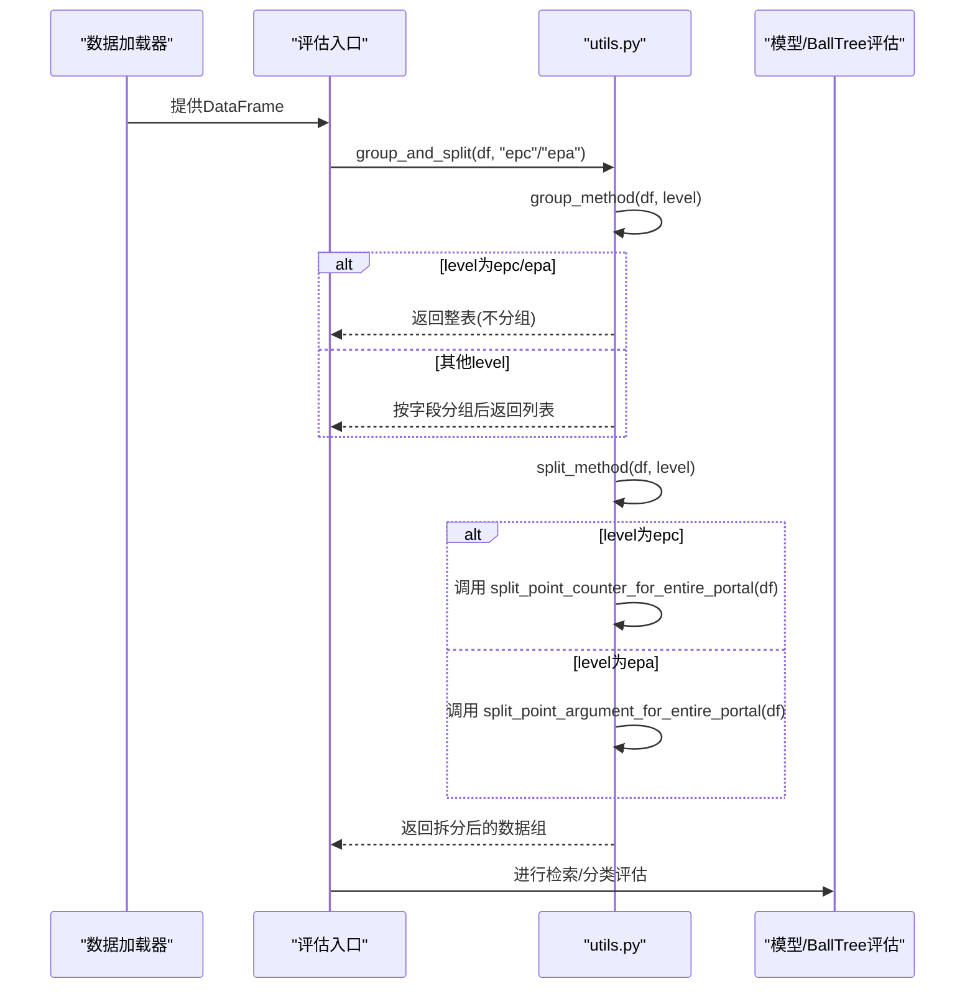
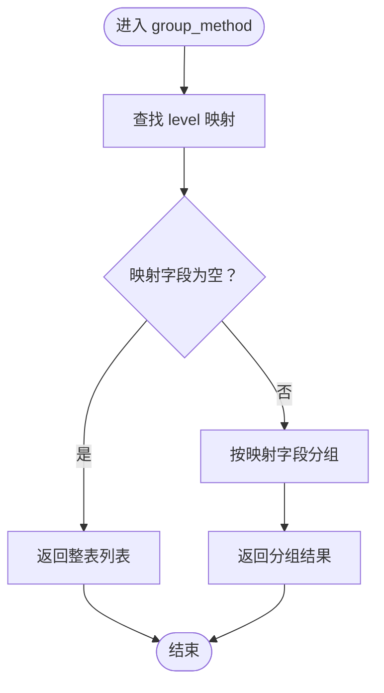
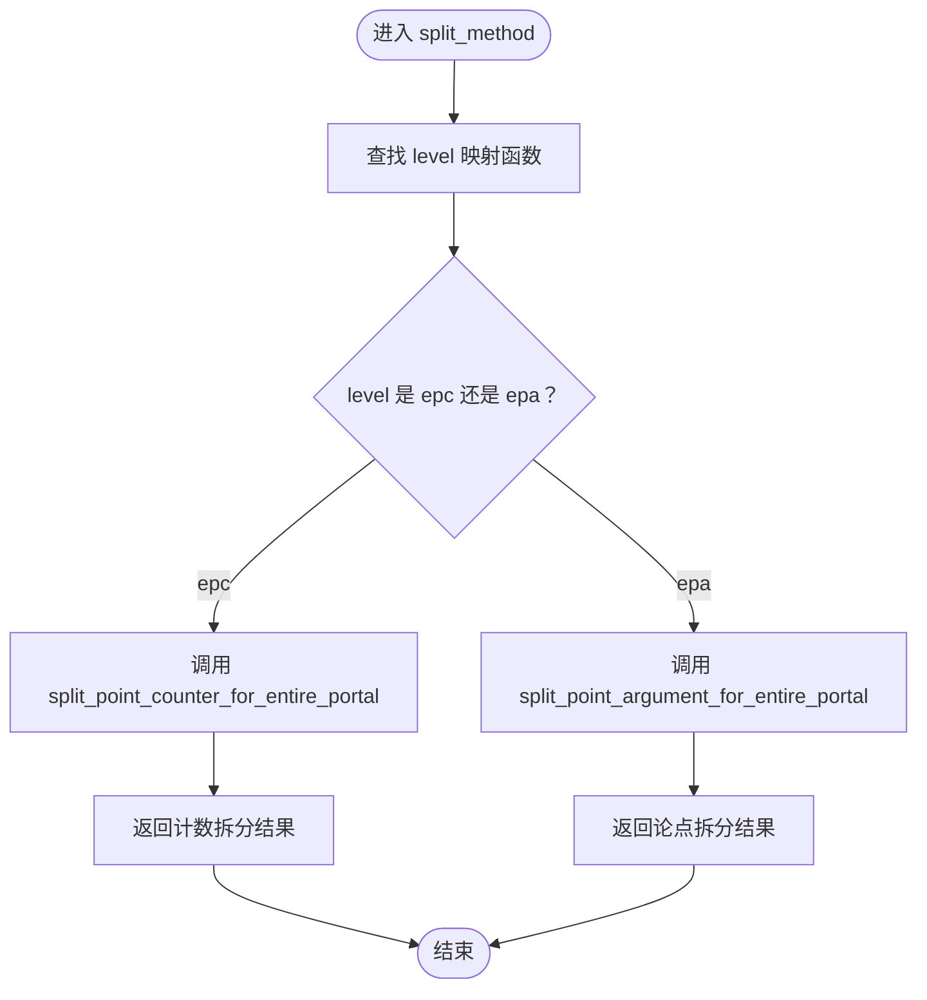
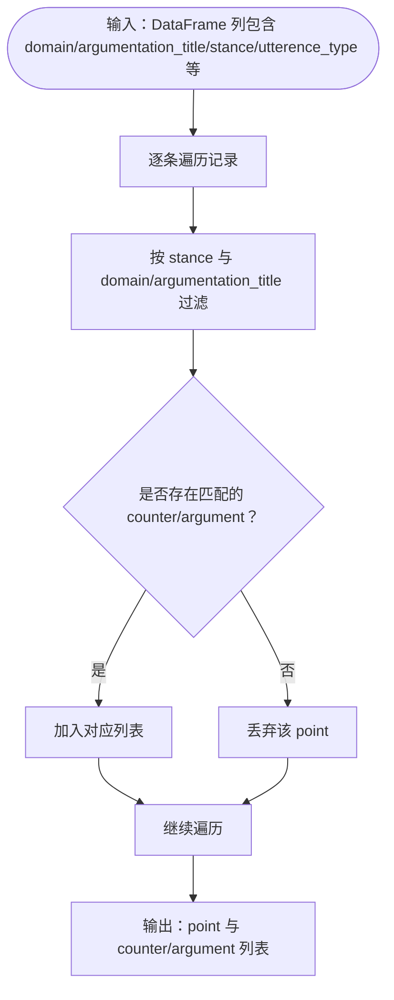
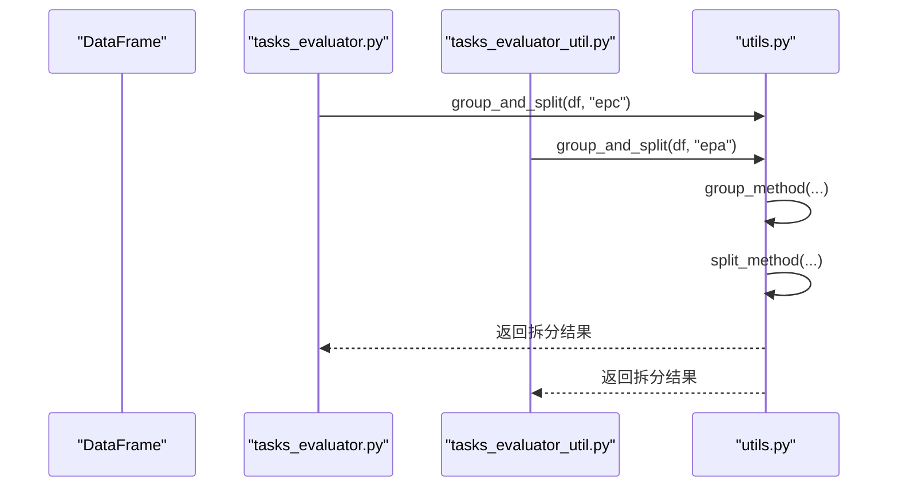
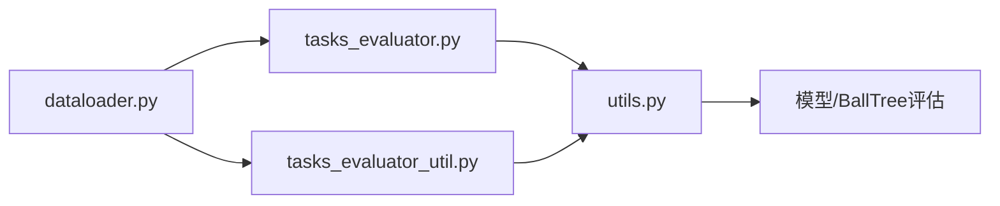

# epc与epa全局分组策略

<cite>
**本文引用的文件**
- [utils.py](file://utils.py)
- [tasks_evaluator.py](file://bert/tasks_evaluator.py)
- [tasks_evaluator_util.py](file://bert/tasks_evaluator_util.py)
- [dataloader.py](file://dataloader.py)
- [README.md](file://README.md)
</cite>

## 目录
1. [引言](#引言)
2. [项目结构](#项目结构)
3. [核心组件](#核心组件)
4. [架构总览](#架构总览)
5. [详细组件分析](#详细组件分析)
6. [依赖关系分析](#依赖关系分析)
7. [性能考量](#性能考量)
8. [故障排查指南](#故障排查指南)
9. [结论](#结论)

## 引言
本文件系统性阐述epc与epa两类全局评估级别在分组与拆分流程中的特殊处理机制，重点说明：
- group_method()在epc/epa下不执行分组，直接返回完整数据集；
- split_method()在epc/epa下分别调用针对“全门户”场景的计数拆分与论点拆分函数；
- 如何通过domain与argumentation_title双重过滤条件模拟“全库检索”场景，从而评估模型在大规模候选集中的检索能力；
- 双重过滤条件在保证数据有效性方面的关键作用以及其计算复杂度与评估价值。

## 项目结构
该项目围绕辩论性论证文本的数据组织与评估展开，核心流程由数据加载、分组与拆分、嵌入提取与检索评估构成。epc与epa属于评估任务集合中的两类全局级别，它们通过统一的分组与拆分接口参与评估流水线。

图示来源
- [dataloader.py](file://dataloader.py#L30-L75)
- [tasks_evaluator.py](file://bert/tasks_evaluator.py#L24-L37)
- [tasks_evaluator_util.py](file://bert/tasks_evaluator_util.py#L13-L24)
- [utils.py](file://utils.py#L259-L290)

章节来源
- [README.md](file://README.md#L1-L7)
- [dataloader.py](file://dataloader.py#L30-L75)
- [tasks_evaluator.py](file://bert/tasks_evaluator.py#L24-L37)
- [tasks_evaluator_util.py](file://bert/tasks_evaluator_util.py#L13-L24)
- [utils.py](file://utils.py#L259-L290)

## 核心组件
- 分组与拆分接口
  - group_method(data, group_level)：根据group_level选择是否按字段分组，epc/epa返回整表不分组。
  - split_method(data, group_level)：根据group_level选择拆分策略，epc/epa分别调用“全门户”计数拆分与“全门户”论点拆分。
- “全门户”拆分函数
  - split_point_counter_for_entire_portal(data)：按立场(pro/con)拆分point与counter，使用domain与argumentation_title双重过滤。
  - split_point_argument_for_entire_portal(data)：按立场(pro/con)拆分point与argument，同样使用domain与argumentation_title双重过滤。
- 评估入口
  - tasks_evaluator.py与tasks_evaluator_util.py中均调用group_and_split(df, level)构建8类任务数据，其中包含epc与epa。

章节来源
- [utils.py](file://utils.py#L259-L290)
- [tasks_evaluator.py](file://bert/tasks_evaluator.py#L24-L37)
- [tasks_evaluator_util.py](file://bert/tasks_evaluator_util.py#L13-L24)

## 架构总览
epc与epa的评估流程遵循“先不分组，再按全门户规则拆分”的设计，确保评估覆盖整个语料库规模，避免因分组导致的样本泄露或过拟合。

图示来源
- [utils.py](file://utils.py#L259-L290)
- [tasks_evaluator.py](file://bert/tasks_evaluator.py#L24-L37)
- [tasks_evaluator_util.py](file://bert/tasks_evaluator_util.py#L13-L24)

## 详细组件分析

### 分组策略：group_method()在epc/epa下的行为
- 设计要点
  - 对于epc/epa，group_method()在映射表中对应的分组字段为空数组，因此不分组，直接返回包含整张表的一个元素列表。
  - 这一设计使得后续拆分阶段面对的是“全库”视角，而非按领域/主题等维度切分后的子集。
- 评估意义
  - 避免因分组导致的样本分布偏差；
  - 使检索评估更接近真实生产环境中的全库检索场景。

图示来源
- [utils.py](file://utils.py#L259-L274)

章节来源
- [utils.py](file://utils.py#L259-L274)

### 拆分策略：split_method()在epc/epa下的行为
- 设计要点
  - 对于epc，split_method()调用split_point_counter_for_entire_portal()，按立场(pro/con)拆分point与counter，并使用domain与argumentation_title双重过滤。
  - 对于epa，split_method()调用split_point_argument_for_entire_portal()，按立场(pro/con)拆分point与argument，并使用同样的双重过滤。
- 评估意义
  - 通过“全门户”规则，确保每个point都与同一argumentation_title下的counter/argument进行匹配，从而在更大候选空间中评估检索质量。
  - 双重过滤有效控制了跨主题/跨立场的错误匹配，提升评估的可靠性。

图示来源
- [utils.py](file://utils.py#L277-L289)

章节来源
- [utils.py](file://utils.py#L277-L289)

### “全门户”拆分函数：计数与论点拆分
- split_point_counter_for_entire_portal(data)
  - 功能：按立场(pro/con)拆分point与counter，使用domain与argumentation_title双重过滤，确保匹配在同一argumentation_title内且立场一致。
  - 复杂度：对每条记录扫描并筛选，时间复杂度约为O(N^2)（在单个argumentation内部）；整体复杂度取决于数据结构与索引策略。
- split_point_argument_for_entire_portal(data)
  - 功能：按立场(pro/con)拆分point与argument，同样使用domain与argumentation_title双重过滤。
  - 复杂度：同上，受argumentation内部记录数量影响。

图示来源
- [utils.py](file://utils.py#L195-L231)
- [utils.py](file://utils.py#L235-L255)

章节来源
- [utils.py](file://utils.py#L195-L231)
- [utils.py](file://utils.py#L235-L255)

### 评估入口与调用链
- tasks_evaluator.py与tasks_evaluator_util.py均调用group_and_split(df, level)，其中level包含epc与epa。
- 该调用链确保epc/epa与其他level（如sdoc/sdoa/stc等）共享相同的分组与拆分接口，便于统一评估与对比。

图示来源
- [tasks_evaluator.py](file://bert/tasks_evaluator.py#L24-L37)
- [tasks_evaluator_util.py](file://bert/tasks_evaluator_util.py#L13-L24)
- [utils.py](file://utils.py#L259-L290)

章节来源
- [tasks_evaluator.py](file://bert/tasks_evaluator.py#L24-L37)
- [tasks_evaluator_util.py](file://bert/tasks_evaluator_util.py#L13-L24)
- [utils.py](file://utils.py#L259-L290)

## 依赖关系分析
- 组件耦合
  - 评估入口依赖utils.py提供的分组与拆分接口；
  - utils.py内部通过映射表将level与具体拆分函数绑定，降低调用方与实现细节的耦合。
- 关键依赖链
  - dataloader.py提供DataFrame；
  - tasks_evaluator*.py调用group_and_split；
  - utils.py实现group_method与split_method；
  - 模型/BallTree评估模块消费拆分后的数据组。

图示来源
- [dataloader.py](file://dataloader.py#L30-L75)
- [tasks_evaluator.py](file://bert/tasks_evaluator.py#L24-L37)
- [tasks_evaluator_util.py](file://bert/tasks_evaluator_util.py#L13-L24)
- [utils.py](file://utils.py#L259-L290)

章节来源
- [dataloader.py](file://dataloader.py#L30-L75)
- [tasks_evaluator.py](file://bert/tasks_evaluator.py#L24-L37)
- [tasks_evaluator_util.py](file://bert/tasks_evaluator_util.py#L13-L24)
- [utils.py](file://utils.py#L259-L290)

## 性能考量
- 时间复杂度
  - epc/epa下的拆分函数在单个argumentation内部进行point与counter/argument的配对，整体复杂度约O(N^2)（N为单argumentation内的记录数）。
  - 若argumentation数量较多或单个argumentation规模较大，建议考虑：
    - 使用索引或预处理加速匹配；
    - 将数据按argumentation_title分桶，减少不必要的全表扫描。
- 空间复杂度
  - 拆分过程主要产生point/counter/argument列表，空间开销与记录总数线性相关。
- 实际部署建议
  - 在大规模候选集上评估时，优先采用“全门户”策略以贴近真实检索场景；
  - 结合BallTree等高效检索方法，平衡召回与效率。

## 故障排查指南
- 常见问题
  - 数据缺失domain/argumentation_title/stance/utterence_type字段：会导致拆分失败或结果异常。
  - 记录重复或缺失counter：可能导致point被丢弃，影响评估样本数量。
- 排查步骤
  - 确认DataFrame列名与拆分函数期望一致；
  - 检查每个argumentation_title内的point与counter配对是否满足立场与标题一致性；
  - 对epc/epa结果进行抽样核验，确认无跨主题/跨立场误配。
- 相关定位路径
  - 分组与拆分逻辑：[utils.py](file://utils.py#L259-L290)
  - “全门户”计数拆分：[utils.py](file://utils.py#L195-L231)
  - “全门户”论点拆分：[utils.py](file://utils.py#L235-L255)
  - 评估入口调用：[tasks_evaluator.py](file://bert/tasks_evaluator.py#L24-L37), [tasks_evaluator_util.py](file://bert/tasks_evaluator_util.py#L13-L24)

章节来源
- [utils.py](file://utils.py#L195-L231)
- [utils.py](file://utils.py#L235-L255)
- [utils.py](file://utils.py#L259-L290)
- [tasks_evaluator.py](file://bert/tasks_evaluator.py#L24-L37)
- [tasks_evaluator_util.py](file://bert/tasks_evaluator_util.py#L13-L24)

## 结论
epc与epa通过“不分组、全门户”的策略，将评估范围扩展至整个语料库，从而更真实地反映模型在大规模候选集中的检索与匹配能力。domain与argumentation_title的双重过滤在保证数据有效性的同时，也提升了评估的稳定性与可比性。结合BallTree等高效检索方法，可在保证评估价值的前提下优化整体性能。