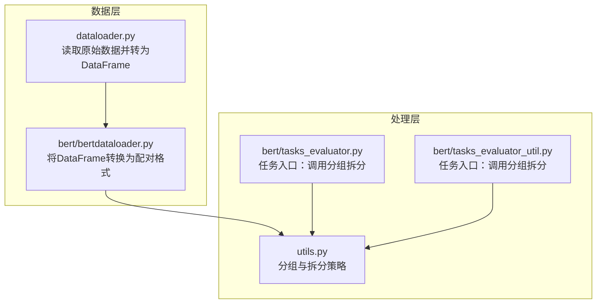
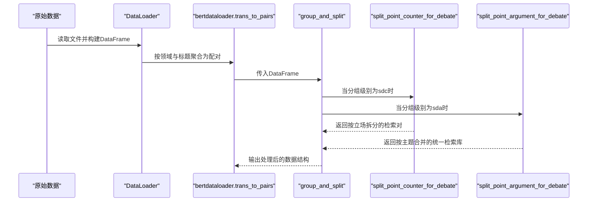
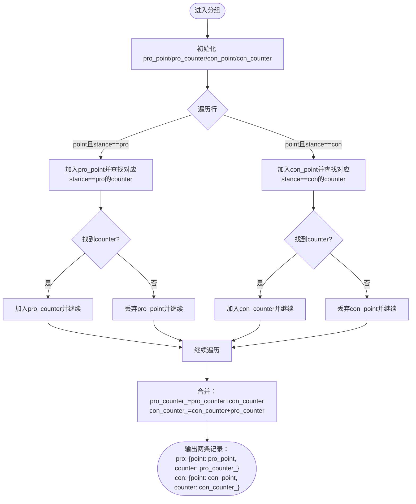
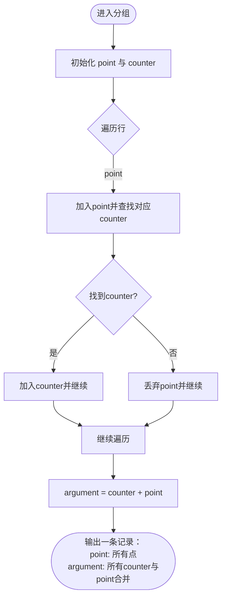
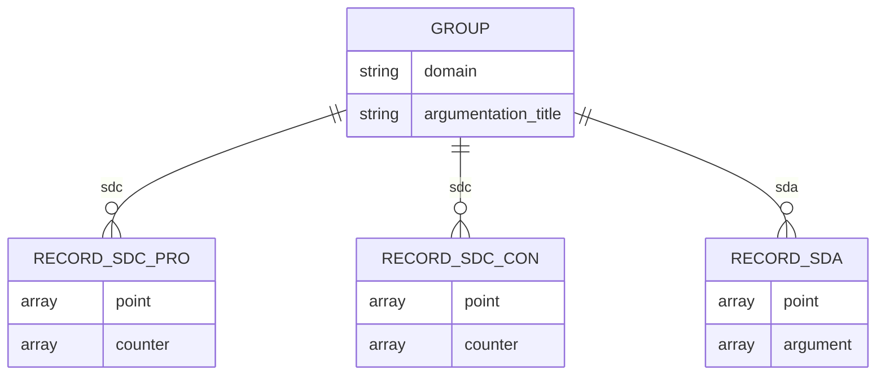
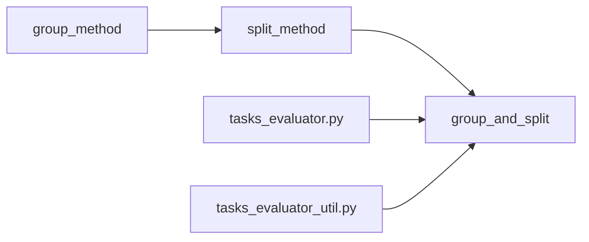

# sdc与sda分组拆分策略

<cite>
**本文引用的文件**
- [utils.py](file://utils.py)
- [tasks_evaluator.py](file://bert/tasks_evaluator.py)
- [tasks_evaluator_util.py](file://bert/tasks_evaluator_util.py)
- [bertdataloader.py](file://bert/bertdataloader.py)
- [dataloader.py](file://dataloader.py)
</cite>

## 目录
1. [引言](#引言)
2. [项目结构](#项目结构)
3. [核心组件](#核心组件)
4. [架构总览](#架构总览)
5. [详细组件分析](#详细组件分析)
6. [依赖关系分析](#依赖关系分析)
7. [性能考量](#性能考量)
8. [故障排查指南](#故障排查指南)
9. [结论](#结论)

## 引言
本文聚焦于两类分组级别“sdc”与“sda”的实现差异，二者均以“领域（domain）”与“论辩标题（argumentation_title）”作为分组键，但在分组后的拆分策略上存在本质区别：
- sdc 使用 split_point_counter_for_debate 将每个分组内的论点按立场（pro/con）拆分为对立的检索对，强调“立场敏感型检索”，即在同主题下区分正反立场，形成严格的对立检索对。
- sda 使用 split_point_argument_for_debate 将每个分组内的所有相关论点合并为统一检索库，强调“主题级广义检索”，即不区分立场，直接将正反立场的论点合并为一个统一的检索集合。

通过对比这两种策略，可以明确它们分别适用于不同业务场景：
- 立场敏感型检索：要求严格区分正反立场，适合需要精确匹配对立观点的场景。
- 主题级广义检索：要求覆盖更广的主题相关性，适合需要统一主题检索的场景。

## 项目结构
该仓库围绕论辩数据的加载、分组与拆分展开，核心文件包括：
- 数据加载与预处理：dataloader.py、bert/bertdataloader.py
- 分组与拆分逻辑：utils.py
- 任务执行入口：bert/tasks_evaluator.py、bert/tasks_evaluator_util.py

图表来源
- [dataloader.py](file://dataloader.py#L1-L87)
- [bert/bertdataloader.py](file://bert/bertdataloader.py#L1-L44)
- [utils.py](file://utils.py#L259-L304)
- [tasks_evaluator.py](file://bert/tasks_evaluator.py#L1-L37)
- [tasks_evaluator_util.py](file://bert/tasks_evaluator_util.py#L1-L24)

章节来源
- [dataloader.py](file://dataloader.py#L1-L87)
- [bert/bertdataloader.py](file://bert/bertdataloader.py#L1-L44)
- [utils.py](file://utils.py#L259-L304)
- [tasks_evaluator.py](file://bert/tasks_evaluator.py#L1-L37)
- [tasks_evaluator_util.py](file://bert/tasks_evaluator_util.py#L1-L24)

## 核心组件
- 分组键定义：sdc 与 sda 的分组键均为 ['domain', 'argumentation_title']，由 group_method 统一管理。
- 拆分策略映射：split_method 将分组级别映射到具体拆分函数，其中：
  - sdc 映射到 split_point_counter_for_debate
  - sda 映射到 split_point_argument_for_debate
- 任务入口：tasks_evaluator.py 与 tasks_evaluator_util.py 在各自模块中调用 group_and_split 对 DataFrame 进行分组与拆分。

章节来源
- [utils.py](file://utils.py#L259-L304)
- [tasks_evaluator.py](file://bert/tasks_evaluator.py#L24-L37)
- [tasks_evaluator_util.py](file://bert/tasks_evaluator_util.py#L13-L24)

## 架构总览
sdc 与 sda 的整体流程如下：数据经 DataLoader 读取后，通过 bertdataloader 转换为配对格式；随后在任务入口调用 group_and_split，依据分组键与拆分策略生成最终的数据结构，供下游检索与评估使用。

图表来源
- [dataloader.py](file://dataloader.py#L1-L87)
- [bert/bertdataloader.py](file://bert/bertdataloader.py#L12-L25)
- [utils.py](file://utils.py#L259-L304)
- [tasks_evaluator.py](file://bert/tasks_evaluator.py#L24-L37)
- [tasks_evaluator_util.py](file://bert/tasks_evaluator_util.py#L13-L24)

## 详细组件分析

### sdc：立场敏感型检索（split_point_counter_for_debate）
- 分组键：['domain', 'argumentation_title']
- 拆分策略要点：
  - 遍历每个分组的行，仅保留 utterence_type 为 point 且 stance 为 pro 或 con 的记录；
  - 对每个 point，查找对应 utterence_type 为 counter 且 stance 一致的记录，若存在则成对保留，否则丢弃该 point；
  - 最终将 pro 与 con 的 counter 合并为各自的 counter 列表，形成两组对立检索对（pro_counter_ 与 con_counter_），每组包含各自立场的 point 与对方立场的 counter。
- 输出结构特征：
  - 每个分组被拆分为两条记录，分别对应 pro 与 con；
  - 每条记录包含 point 与 counter 两个字段，其中 counter 是跨立场合并后的集合，体现“立场敏感”的对立检索对。

图表来源
- [utils.py](file://utils.py#L25-L60)

章节来源
- [utils.py](file://utils.py#L25-L60)

### sda：主题级广义检索（split_point_argument_for_debate）
- 分组键：['domain', 'argumentation_title']
- 拆分策略要点：
  - 遍历每个分组的行，仅保留 utterence_type 为 point 的记录；
  - 对每个 point，查找对应 utterence_type 为 counter 的记录（不区分 stance），若存在则成对保留，否则丢弃该 point；
  - 最终将所有 counter 与 point 合并为一个统一的 argument 列表，形成一条记录，包含 point 与 argument 两个字段。
- 输出结构特征：
  - 每个分组仅输出一条记录；
  - 记录包含 point 与 argument，其中 argument 是将所有 counter 与 point 合并后的统一检索库，体现“主题级广义检索”。

图表来源
- [utils.py](file://utils.py#L170-L193)

章节来源
- [utils.py](file://utils.py#L170-L193)

### 两类策略的业务场景映射
- sdc（立场敏感型检索）：
  - 适用场景：需要在同主题下严格区分正反立场，形成对立检索对，便于后续对正反立场进行精确匹配与对比。
  - 典型应用：辩论对抗、立场匹配、反驳检索等。
- sda（主题级广义检索）：
  - 适用场景：需要在同主题下统一检索所有相关论点，不区分立场，便于覆盖更广的主题相关性。
  - 典型应用：主题检索、知识图谱扩展、主题相关性评估等。

### 数据流对比与输出结构差异
- 输入：同一组数据，按 ['domain', 'argumentation_title'] 分组。
- sdc 输出：
  - 两条记录，分别代表 pro 与 con；
  - 每条记录包含 point 与 counter，其中 counter 为跨立场合并后的集合。
- sda 输出：
  - 一条记录；
  - 包含 point 与 argument，其中 argument 为所有 counter 与 point 合并后的统一集合。

图表来源
- [utils.py](file://utils.py#L25-L60)
- [utils.py](file://utils.py#L170-L193)

## 依赖关系分析
- 分组与拆分依赖关系：
  - group_method 定义分组键；
  - split_method 将分组级别映射到具体拆分函数；
  - group_and_split 组合上述两步。
- 任务入口依赖：
  - tasks_evaluator.py 与 tasks_evaluator_util.py 均调用 group_and_split，传入不同的分组级别字符串（如 'sdc'、'sda'）。

图表来源
- [utils.py](file://utils.py#L259-L304)
- [tasks_evaluator.py](file://bert/tasks_evaluator.py#L24-L37)
- [tasks_evaluator_util.py](file://bert/tasks_evaluator_util.py#L13-L24)

章节来源
- [utils.py](file://utils.py#L259-L304)
- [tasks_evaluator.py](file://bert/tasks_evaluator.py#L24-L37)
- [tasks_evaluator_util.py](file://bert/tasks_evaluator_util.py#L13-L24)

## 性能考量
- 时间复杂度：
  - 拆分函数对每个分组进行一次线性扫描，时间复杂度为 O(N)，N 为分组内行数；
  - sdc 会将每个分组拆分为两条记录，且对 counter 进行跨立场合并，额外开销与分组规模线性相关；
  - sda 将所有 counter 与 point 合并为统一检索库，合并操作为 O(M)，M 为匹配到的 counter 数量。
- 空间复杂度：
  - 两类策略均以列表存储 point 与 counter/argument，空间复杂度与记录数量线性相关；
  - sdc 的输出记录数约为 sda 的两倍（按立场拆分）。
- 可扩展性：
  - 若分组键扩大至 ['domain', 'argumentation_title', 'stance']（如 sdoc），可进一步细化立场维度，但会显著增加输出记录数与内存占用。

[本节提供一般性指导，无需特定文件来源]

## 故障排查指南
- 常见问题与定位建议：
  - 分组键不生效：检查 group_method 中的分组键定义是否正确，确认输入 DataFrame 是否包含所需列。
  - 拆分结果为空：检查 split_point_counter_for_debate 与 split_point_argument_for_debate 的条件过滤是否过于严格（如 stance 不匹配、counter 缺失）。
  - 输出记录异常：核对 sdc 与 sda 的合并逻辑，确保 counter 与 point 的对应关系正确。
- 关联文件定位：
  - 分组与拆分逻辑：utils.py
  - 任务入口调用：tasks_evaluator.py、tasks_evaluator_util.py
  - 数据预处理：dataloader.py、bert/bertdataloader.py

章节来源
- [utils.py](file://utils.py#L25-L60)
- [utils.py](file://utils.py#L170-L193)
- [tasks_evaluator.py](file://bert/tasks_evaluator.py#L24-L37)
- [tasks_evaluator_util.py](file://bert/tasks_evaluator_util.py#L13-L24)
- [dataloader.py](file://dataloader.py#L1-L87)
- [bert/bertdataloader.py](file://bert/bertdataloader.py#L12-L25)

## 结论
- sdc 与 sda 的核心差异在于拆分后的输出结构：
  - sdc 生成严格的对立检索对，强调立场区分，适合立场敏感型检索；
  - sda 生成统一检索库，强调主题覆盖，适合主题级广义检索。
- 二者均以 ['domain', 'argumentation_title'] 为分组键，通过 group_and_split 实现解耦，便于在不同任务中灵活切换策略。
- 在实际应用中，应根据业务目标选择合适的策略：若需精确匹配正反立场，优先选择 sdc；若需统一主题检索，优先选择 sda。