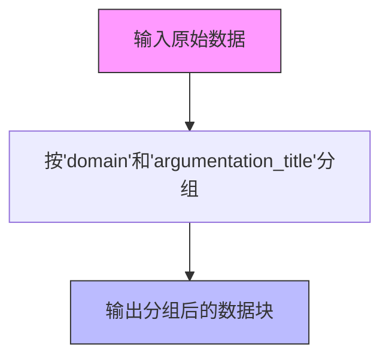
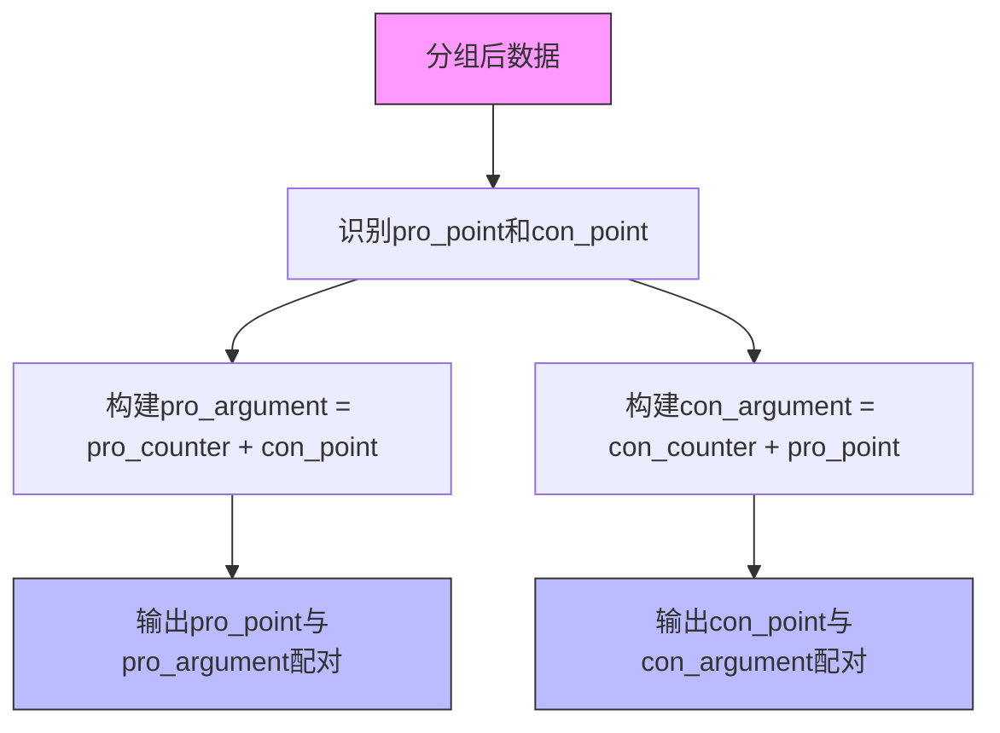
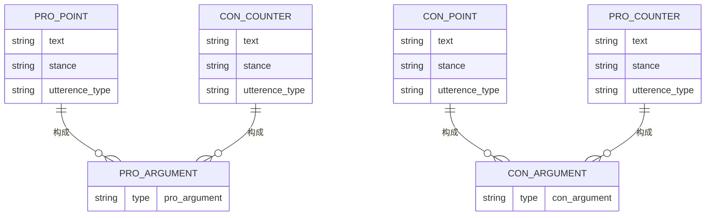

# sdoa分组与拆分策略

<cite>
**本文档中引用的文件**   
- [utils.py](file://utils.py)
- [dataloader.py](file://dataloader.py)
- [tasks_evaluator.py](file://bert/tasks_evaluator.py)
- [tasks_evaluator_util.py](file://bert/tasks_evaluator_util.py)
- [negative_embedding_sampler.py](file://bert/negative_embedding_sampler.py)
</cite>

## 目录
1. [引言](#引言)
2. [核心处理流程](#核心处理流程)
3. [分组方法分析](#分组方法分析)
4. [拆分方法分析](#拆分方法分析)
5. [sdoa模式下的反论检索机制](#sdoa模式下的反论检索机制)
6. [代码实现与逻辑说明](#代码实现与逻辑说明)
7. [应用场景与适用性](#应用场景与适用性)

## 引言
本文档深入解析在`group_level='sdoa'`配置下，系统如何通过`group_method()`和`split_method()`实现跨立场反论检索的完整流程。重点阐述基于'domain'和'argumentation_title'的分组逻辑，以及`split_point_opposing_argument_for_debate()`函数如何构建包含所有反论点的检索集合，从而支持开放性反论检索场景。

## 核心处理流程

**Section sources**
- [utils.py](file://utils.py#L291-L295)
- [tasks_evaluator.py](file://bert/tasks_evaluator.py#L27-L37)

## 分组方法分析
当`group_level='sdoa'`时，`group_method()`函数根据'domain'（领域）和'argumentation_title'（论证主题）两个维度对数据进行分组。这种分组方式将同一主题下的所有论点（无论立场）聚合在一起，为后续的跨立场检索奠定了基础。

**Diagram sources**
- [utils.py](file://utils.py#L259-L274)

**Section sources**
- [utils.py](file://utils.py#L259-L274)

## 拆分方法分析
分组完成后，`split_method()`调用`split_point_opposing_argument_for_debate()`函数进行数据拆分。该函数的核心逻辑是：
1. 分别提取支持立场（pro）和反对立场（con）的论点（point）
2. 为每个立场的论点构建包含所有反论点的候选集
3. 实现跨立场的反论检索能力

**Diagram sources**
- [utils.py](file://utils.py#L62-L99)

**Section sources**
- [utils.py](file://utils.py#L62-L99)

## sdoa模式下的反论检索机制
`sdoa`模式的关键创新在于其跨立场检索能力。通过将某一主题下的所有反论点（无论原始立场）作为检索候选集，系统能够实现：
- **全面性**：检索集合包含所有可能的反论点
- **开放性**：支持跨立场的论点对抗分析
- **灵活性**：适用于开放域反论检索场景

该机制特别适用于需要全面收集对立观点的应用场景，如辩论辅助系统、观点挖掘和立场分析等。

**Diagram sources**
- [utils.py](file://utils.py#L62-L99)

**Section sources**
- [utils.py](file://utils.py#L62-L99)

## 代码实现与逻辑说明
`split_point_opposing_argument_for_debate()`函数的实现逻辑如下：
1. 遍历数据框，分别收集pro和con立场的论点
2. 为每个论点寻找对应的反论点（counter）
3. 构建合并的检索集合：pro_argument = pro_counter + con_point，con_argument = con_counter + pro_point
4. 返回包含论点和对应检索集合的数据结构

这种设计确保了每个立场的论点都能在包含所有对立观点的集合中进行检索，实现了真正的跨立场反论检索。

**Section sources**
- [utils.py](file://utils.py#L62-L99)
- [tasks_evaluator_util.py](file://bert/tasks_evaluator_util.py#L14-L24)

## 应用场景与适用性
`sdoa`分组与拆分策略特别适用于以下场景：
- **辩论系统**：为辩论双方提供全面的反论点参考
- **观点挖掘**：分析特定主题下的所有对立观点
- **立场检测**：训练模型识别和生成跨立场的反论点
- **信息检索**：构建包含多立场观点的综合检索系统

该策略的优势在于其开放性和全面性，能够有效支持需要跨立场分析的应用需求。

**Section sources**
- [utils.py](file://utils.py#L278-L289)
- [tasks_evaluator.py](file://bert/tasks_evaluator.py#L27-L37)