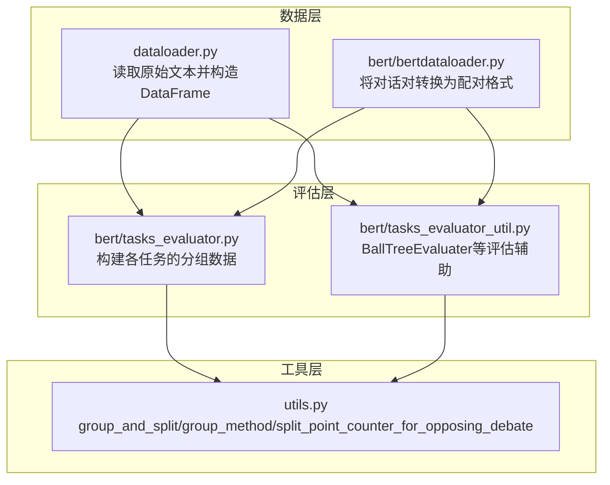
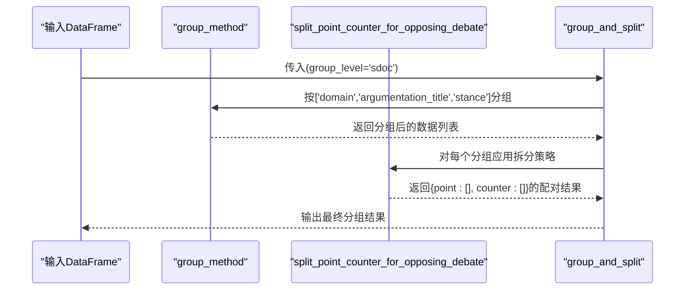
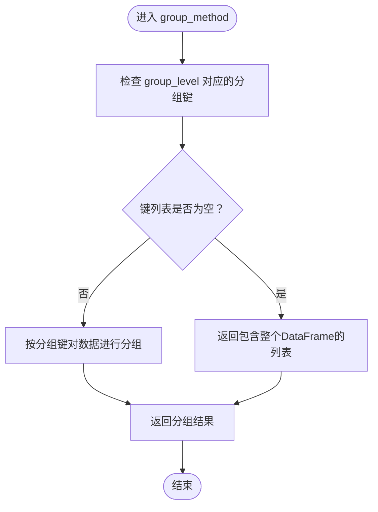
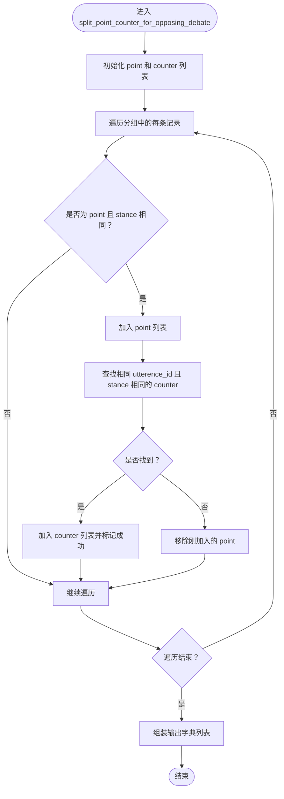
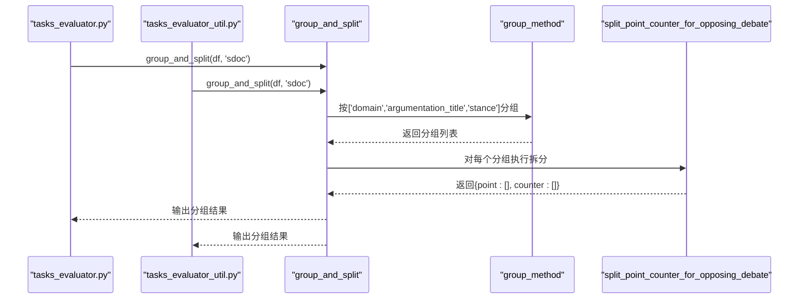
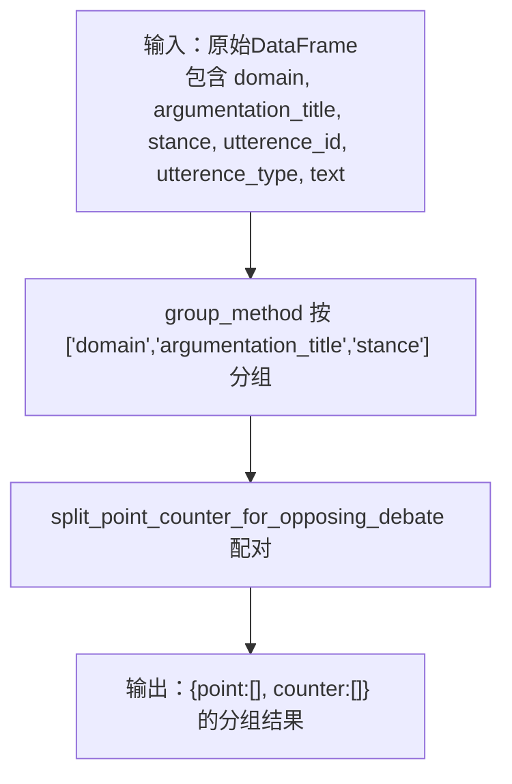
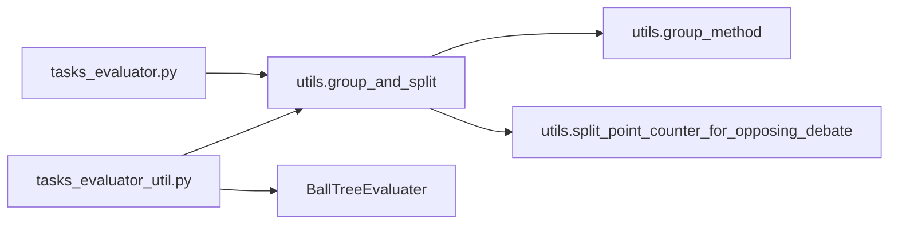

# sdoc分组与拆分策略

<cite>
**本文引用的文件**
- [utils.py](file://utils.py)
- [tasks_evaluator.py](file://bert/tasks_evaluator.py)
- [tasks_evaluator_util.py](file://bert/tasks_evaluator_util.py)
- [dataloader.py](file://dataloader.py)
- [bertdataloader.py](file://bert/bertdataloader.py)
</cite>

## 目录
1. [引言](#引言)
2. [项目结构](#项目结构)
3. [核心组件](#核心组件)
4. [架构总览](#架构总览)
5. [详细组件分析](#详细组件分析)
6. [依赖关系分析](#依赖关系分析)
7. [性能考量](#性能考量)
8. [故障排查指南](#故障排查指南)
9. [结论](#结论)
10. [附录](#附录)

## 引言
本文件围绕“sdoc”任务的分组与拆分策略展开，系统性说明当 group_level='sdoc' 时，group_and_split() 如何通过 group_method() 按“领域(domain)”、“论证标题(argumentation_title)”、“立场(stance)”三级维度对数据进行分组，并随后调用 split_point_counter_for_opposing_debate() 完成正反论点配对拆分。该策略确保每个分组内的立场一致的论点与其直接反论点构成检索对，从而适用于细粒度对立检索任务。文档还给出从输入 DataFrame 到输出分组结果的完整示例流程，并分析该策略在 tasks_evaluator 中用于 sdoc 任务评估时的性能影响。

## 项目结构
本仓库包含多个与检索评估相关的模块：
- 数据加载与预处理：dataloader.py、bert/bertdataloader.py
- 通用工具与分组拆分：utils.py
- 任务评估入口：bert/tasks_evaluator.py、bert/tasks_evaluator_util.py

图表来源
- [dataloader.py](file://dataloader.py#L1-L87)
- [bert/bertdataloader.py](file://bert/bertdataloader.py#L1-L44)
- [utils.py](file://utils.py#L258-L304)
- [tasks_evaluator.py](file://bert/tasks_evaluator.py#L1-L37)
- [tasks_evaluator_util.py](file://bert/tasks_evaluator_util.py#L1-L101)

章节来源
- [dataloader.py](file://dataloader.py#L1-L87)
- [bert/bertdataloader.py](file://bert/bertdataloader.py#L1-L44)
- [utils.py](file://utils.py#L258-L304)
- [tasks_evaluator.py](file://bert/tasks_evaluator.py#L1-L37)
- [tasks_evaluator_util.py](file://bert/tasks_evaluator_util.py#L1-L101)

## 核心组件
- group_and_split(data, group_level)：组合分组与拆分的统一入口，先按 group_level 的维度进行分组，再根据对应策略进行拆分。
- group_method(data, group_level)：依据 group_level 返回对应的分组键列表，并按这些键对数据进行分组。
- split_point_counter_for_opposing_debate(data)：针对 sdoc 任务，按“立场一致”的原则，将“论点(point)”与其直接反论点(counter)配对，形成检索对。
- tasks_evaluator.py 与 tasks_evaluator_util.py：在评估阶段调用 group_and_split 构建各任务的数据分组，供后续检索与排序评估使用。

章节来源
- [utils.py](file://utils.py#L258-L304)
- [tasks_evaluator.py](file://bert/tasks_evaluator.py#L1-L37)
- [tasks_evaluator_util.py](file://bert/tasks_evaluator_util.py#L1-L24)

## 架构总览
sdoc 任务的评估流程如下：
- 输入：原始 DataFrame（包含 domain、argumentation_title、stance、utterence_id、utterence_type 等列）
- 步骤一：group_method 按 ['domain', 'argumentation_title', 'stance'] 分组
- 步骤二：split_point_counter_for_opposing_debate 将每个分组内的“point”与其直接反论点(counter)配对
- 输出：返回由若干个“point”和“counter”列表组成的分组结果，用于后续检索与排序评估

图表来源
- [utils.py](file://utils.py#L258-L304)

章节来源
- [utils.py](file://utils.py#L258-L304)

## 详细组件分析

### 组件A：group_and_split() 与 group_method()
- 功能概述
  - group_and_split(data, group_level)：统一入口，先调用 group_method 进行分组，再调用 split_method 选择对应拆分策略。
  - group_method(data, group_level)：根据 group_level 返回分组键列表；当键列表非空时，按这些键对数据进行分组；否则返回整个数据作为单一分组。
- sdoc 场景下的分组键
  - 当 group_level='sdoc' 时，分组键为 ['domain', 'argumentation_title', 'stance']，确保每个分组内的立场一致，便于后续按立场配对。
- 复杂度与性能
  - 分组操作的时间复杂度主要取决于分组键的数量与数据规模；键越多，分组越细，拆分阶段的配对数量越小，但分组数量增加。
- 错误处理与边界情况
  - 若某分组内无任何记录，将返回空列表；若某分组内仅有单侧（仅 point 或仅 counter），则会被丢弃，保证只保留可配对的检索对。

图表来源
- [utils.py](file://utils.py#L258-L275)

章节来源
- [utils.py](file://utils.py#L258-L275)

### 组件B：split_point_counter_for_opposing_debate()
- 功能概述
  - 针对 sdoc 任务，按“立场一致”的原则，将“论点(point)”与其直接反论点(counter)配对。
  - 匹配条件：utterence_type='point' 且 stance 相同，同时存在 id 一致的 counter。
- 处理逻辑
  - 遍历每个分组内的记录，收集“point”，并查找同一 utterence_id 下、类型为“counter”且 stance 相同的记录进行配对。
  - 若找不到匹配的 counter，则丢弃该“point”，确保只保留可检索的正反对。
- 输出结构
  - 返回字典列表，每个元素包含“point”和“counter”两个键，分别对应配对后的论点与反论点集合。

图表来源
- [utils.py](file://utils.py#L3-L23)

章节来源
- [utils.py](file://utils.py#L3-L23)

### 组件C：sdoc 在 tasks_evaluator 中的应用
- 入口调用
  - 在 bert/tasks_evaluator.py 与 bert/tasks_evaluator_util.py 中，均通过 group_and_split(df, 'sdoc') 获取 sdoc 任务的分组数据。
- 评估流程
  - 评估器会基于返回的“point”和“counter”列表构建检索对，用于后续检索排序与指标计算。
- 性能影响
  - 由于 sdoc 使用三级分组键，分组更细，拆分后每组内的检索对数量减少，有利于提升检索效率与准确性。
  - 同时，因分组数量增加，整体拆分阶段的循环次数增多，需注意内存与时间开销的平衡。

图表来源
- [tasks_evaluator.py](file://bert/tasks_evaluator.py#L24-L37)
- [tasks_evaluator_util.py](file://bert/tasks_evaluator_util.py#L13-L24)
- [utils.py](file://utils.py#L258-L304)

章节来源
- [tasks_evaluator.py](file://bert/tasks_evaluator.py#L24-L37)
- [tasks_evaluator_util.py](file://bert/tasks_evaluator_util.py#L13-L24)
- [utils.py](file://utils.py#L258-L304)

### 组件D：输入DataFrame到输出分组结果的完整示例
- 输入 DataFrame 字段
  - 必要字段：domain、argumentation_title、stance、utterence_id、utterence_type、text
  - 数据来源：dataloader.py 读取文件并构造 DataFrame；bert/bertdataloader.py 可将对话对转换为配对格式
- 示例流程
  1) 读取数据并构造 DataFrame（见 dataloader.py）
  2) 调用 group_and_split(df, 'sdoc')
     - group_method 按 ['domain', 'argumentation_title', 'stance'] 分组
     - split_point_counter_for_opposing_debate 将每个分组内的“point”与其直接反论点(counter)配对
  3) 输出：若干个字典，每个包含“point”和“counter”两个键，分别存储配对后的论点与反论点列表

图表来源
- [dataloader.py](file://dataloader.py#L61-L68)
- [utils.py](file://utils.py#L258-L304)

章节来源
- [dataloader.py](file://dataloader.py#L61-L68)
- [utils.py](file://utils.py#L258-L304)

## 依赖关系分析
- 组件耦合
  - group_and_split 依赖 group_method 与 split_method（通过 split_point_counter_for_opposing_debate 实现）
  - tasks_evaluator 与 tasks_evaluator_util 依赖 utils 中的 group_and_split
- 外部依赖
  - pandas 的 groupby 用于分组
  - scikit-learn 的 BallTree（在评估器中使用）用于检索排序评估

图表来源
- [tasks_evaluator.py](file://bert/tasks_evaluator.py#L24-L37)
- [tasks_evaluator_util.py](file://bert/tasks_evaluator_util.py#L13-L24)
- [utils.py](file://utils.py#L258-L304)

章节来源
- [tasks_evaluator.py](file://bert/tasks_evaluator.py#L24-L37)
- [tasks_evaluator_util.py](file://bert/tasks_evaluator_util.py#L13-L24)
- [utils.py](file://utils.py#L258-L304)

## 性能考量
- 分组键数量与数据规模
  - sdoc 使用三级分组键，分组更细，有助于减少每组内的噪声，提高检索对质量；但分组数量增加，拆分阶段的循环次数增多，需关注内存与时间开销。
- 拆分策略的过滤机制
  - 仅保留存在直接反论点的“point”，避免无效配对，降低后续检索成本。
- 评估阶段的检索排序
  - 评估器使用 BallTree 进行最近邻搜索与概率排序，sdoc 的细粒度分组有助于提升排序精度与召回表现。

[本节为一般性指导，不直接分析具体文件]

## 故障排查指南
- 常见问题
  - 缺少必要字段：若 DataFrame 缺失 domain、argumentation_title、stance、utterence_id、utterence_type 等字段，group_method 将无法正确分组。
  - 数据不完整：若某“point”没有对应的“counter”，该“point”会被丢弃，导致输出的“point”或“counter”列表为空。
- 排查步骤
  - 检查 DataFrame 的列名与数据类型，确保与分组键一致
  - 对分组后的数据进行计数统计，确认每组内“point”与“counter”的数量关系
  - 在评估阶段验证检索对的质量，观察排序指标是否符合预期

章节来源
- [utils.py](file://utils.py#L3-L23)
- [utils.py](file://utils.py#L258-L304)

## 结论
sdoc 任务通过三级分组键“领域(domain)”、“论证标题(argumentation_title)”、“立场(stance)”实现细粒度分组，并在拆分阶段严格遵循“立场一致”的原则，将“论点(point)”与其直接反论点(counter)配对，形成高质量的检索对。该策略在 tasks_evaluator 中被广泛采用，既提升了检索对的准确性，又为后续的检索排序与评估提供了清晰的数据结构。实践中需关注分组数量与拆分循环带来的性能开销，并结合评估指标持续优化。

[本节为总结性内容，不直接分析具体文件]

## 附录
- 相关文件路径
  - utils.py：包含 group_and_split、group_method、split_point_counter_for_opposing_debate 等核心函数
  - tasks_evaluator.py、tasks_evaluator_util.py：在评估阶段调用 group_and_split 构建任务数据
  - dataloader.py：读取原始数据并构造 DataFrame
  - bert/bertdataloader.py：将对话对转换为配对格式

[本节为概览性内容，不直接分析具体文件]