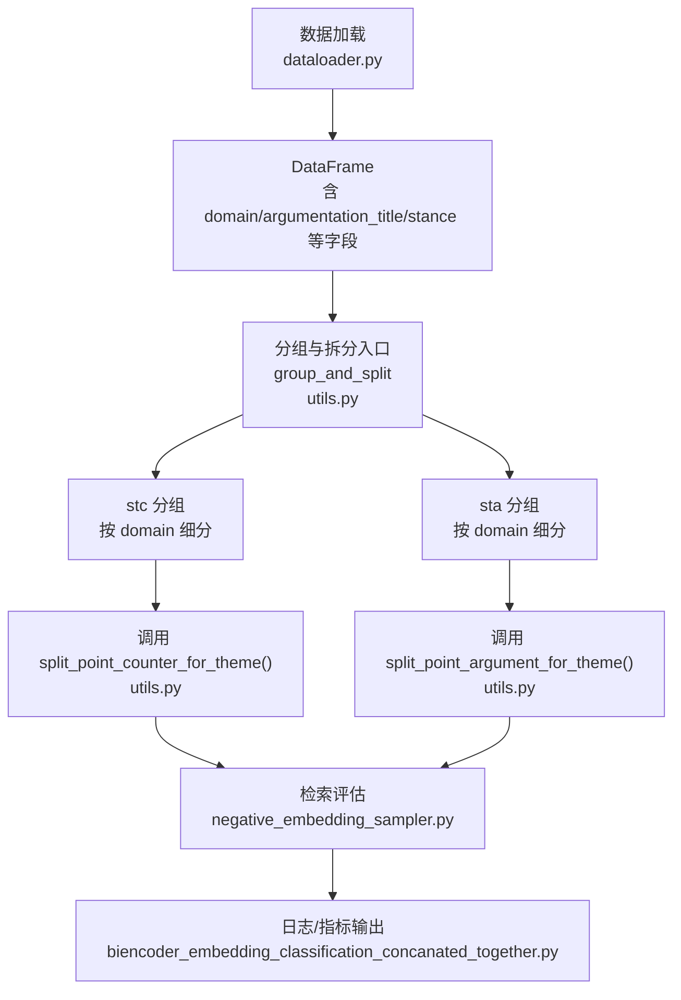
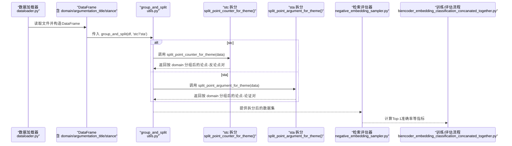
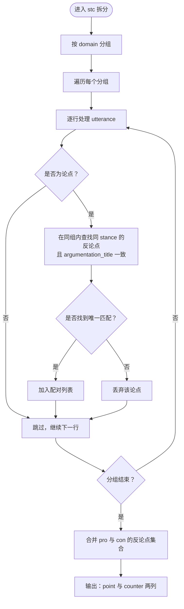
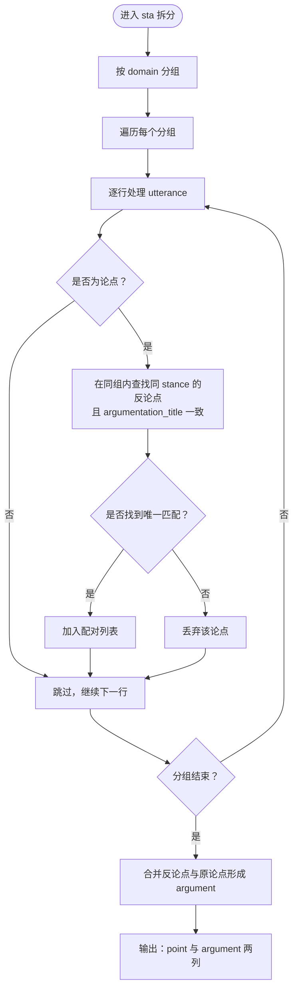
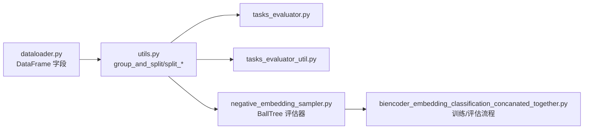

# stc与sta分组拆分策略

<cite>
**本文引用的文件**
- [utils.py](file://utils.py)
- [tasks_evaluator.py](file://bert/tasks_evaluator.py)
- [tasks_evaluator_util.py](file://bert/tasks_evaluator_util.py)
- [dataloader.py](file://dataloader.py)
- [negative_embedding_sampler.py](file://bert/negative_embedding_sampler.py)
- [biencoder_embedding_classification_concanated_together.py](file://bert/biencoder_embedding_classification_concanated_together.py)
</cite>

## 目录
1. [引言](#引言)
2. [项目结构](#项目结构)
3. [核心组件](#核心组件)
4. [架构总览](#架构总览)
5. [详细组件分析](#详细组件分析)
6. [依赖关系分析](#依赖关系分析)
7. [性能考量](#性能考量)
8. [故障排查指南](#故障排查指南)
9. [结论](#结论)

## 引言
本文件聚焦于“stc”和“sta”两类分组级别的拆分策略，阐述它们如何仅依据“领域（domain）”进行粗粒度分组，并在主题聚合场景下分别调用 split_point_counter_for_theme() 和 split_point_argument_for_theme()。重点说明：
- 仅按“领域（domain）”进行分组，避免跨主题误匹配；
- 在主题聚合场景中，通过增加“论证标题（argumentation_title）”匹配条件，显著提升论点-反论点配对的准确性；
- 该策略在减少跨主题误匹配方面的优势及其对检索精度的影响。

## 项目结构
围绕主题聚合与配对拆分的关键文件与职责如下：
- utils.py：提供多种分组与拆分方法，包括按“领域（domain）”的stc与sta两级策略；
- bert/tasks_evaluator.py 与 bert/tasks_evaluator_util.py：在多个任务上统一调用 group_and_split，包含stc与sta；
- dataloader.py：从本地数据目录读取文本，解析出 domain、argumentation_title、stance 等字段；
- bert/negative_embedding_sampler.py：基于BallTree的检索评估器，用于Top-1准确率等指标评估；
- bert/biencoder_embedding_classification_concanated_together.py：端到端训练与评估流程示例，展示如何在训练/评估阶段使用上述分组策略。

图表来源
- [dataloader.py](file://dataloader.py#L60-L68)
- [utils.py](file://utils.py#L259-L296)
- [negative_embedding_sampler.py](file://bert/negative_embedding_sampler.py#L48-L92)
- [biencoder_embedding_classification_concanated_together.py](file://bert/biencoder_embedding_classification_concanated_together.py#L1-L280)

章节来源
- [dataloader.py](file://dataloader.py#L60-L68)
- [utils.py](file://utils.py#L259-L296)

## 核心组件
- 分组与拆分入口：group_and_split(data, group_level)
  - 先按 group_level 对 DataFrame 进行粗粒度分组，再调用对应拆分函数。
- stc（按领域分组的论点-反论点拆分）：split_point_counter_for_theme(data)
  - 仅依据 domain 进行分组；在配对时引入 argumentation_title 匹配，确保同一主题内的论点-反论点配对。
- sta（按领域分组的论点-论证拆分）：split_point_argument_for_theme(data)
  - 仅依据 domain 进行分组；在配对时引入 argumentation_title 匹配，确保同一主题内的论点-论证配对。

章节来源
- [utils.py](file://utils.py#L259-L296)
- [utils.py](file://utils.py#L101-L146)
- [utils.py](file://utils.py#L147-L167)

## 架构总览
下图展示了从数据加载到分组拆分再到检索评估的整体流程，突出stc与sta在主题聚合场景中的作用。

图表来源
- [dataloader.py](file://dataloader.py#L60-L68)
- [utils.py](file://utils.py#L259-L296)
- [utils.py](file://utils.py#L101-L146)
- [utils.py](file://utils.py#L147-L167)
- [negative_embedding_sampler.py](file://bert/negative_embedding_sampler.py#L48-L92)
- [biencoder_embedding_classification_concanated_together.py](file://bert/biencoder_embedding_classification_concanated_together.py#L1-L280)

## 详细组件分析

### stc 分组策略：按领域（domain）粗粒度分组，主题内配对
- 分组方式：仅依据“领域（domain）”进行分组，避免跨主题误匹配。
- 配对逻辑：在查找反论点时，同时要求 argumentation_title 一致，从而保证同一主题内的论点-反论点配对。
- 输出形态：返回“论点（point）-反论点（counter）”对，分别包含 pro 与 con 的两类子集。

图表来源
- [utils.py](file://utils.py#L101-L146)

章节来源
- [utils.py](file://utils.py#L101-L146)

### sta 分组策略：按领域（domain）粗粒度分组，主题内配对
- 分组方式：仅依据“领域（domain）”进行分组，避免跨主题误匹配。
- 配对逻辑：在查找论证（argument）时，同时要求 argumentation_title 一致，从而保证同一主题内的论点-论证配对。
- 输出形态：返回“论点（point）-论证（argument）”对，其中 argument 同样包含 pro 与 point 的混合。

图表来源
- [utils.py](file://utils.py#L147-L167)

章节来源
- [utils.py](file://utils.py#L147-L167)

### 数据加载与字段来源
- 数据加载器会从文件路径中解析出 domain、argumentation_title、stance 等字段，作为后续分组与配对的基础。
- 这些字段在 stc/sta 拆分中被直接使用，确保主题一致性。

章节来源
- [dataloader.py](file://dataloader.py#L60-L68)

### 在任务评估中的应用
- 任务评估器统一调用 group_and_split(df, 'stc') 与 group_and_split(df, 'sta')，以在多任务场景下保持一致的数据组织方式。
- 评估器内部可进一步使用检索评估器计算 Top-1 准确率等指标，验证配对质量。

章节来源
- [tasks_evaluator.py](file://bert/tasks_evaluator.py#L24-L37)
- [tasks_evaluator_util.py](file://bert/tasks_evaluator_util.py#L14-L24)
- [negative_embedding_sampler.py](file://bert/negative_embedding_sampler.py#L48-L92)

## 依赖关系分析
- 分组与拆分依赖关系
  - group_and_split 通过字典映射选择具体拆分函数；
  - stc 与 sta 均依赖于“领域（domain）”进行粗粒度分组；
  - 在配对阶段，两者均引入“论证标题（argumentation_title）”作为强约束，减少跨主题误配。
- 评估依赖关系
  - 拆分后的数据集用于检索评估器，计算 Top-1 准确率；
  - 训练/评估流程示例展示了如何在端到端流程中使用上述策略。

图表来源
- [utils.py](file://utils.py#L259-L296)
- [tasks_evaluator.py](file://bert/tasks_evaluator.py#L24-L37)
- [tasks_evaluator_util.py](file://bert/tasks_evaluator_util.py#L14-L24)
- [dataloader.py](file://dataloader.py#L60-L68)
- [negative_embedding_sampler.py](file://bert/negative_embedding_sampler.py#L48-L92)
- [biencoder_embedding_classification_concanated_together.py](file://bert/biencoder_embedding_classification_concanated_together.py#L1-L280)

章节来源
- [utils.py](file://utils.py#L259-L296)
- [tasks_evaluator.py](file://bert/tasks_evaluator.py#L24-L37)
- [tasks_evaluator_util.py](file://bert/tasks_evaluator_util.py#L14-L24)
- [negative_embedding_sampler.py](file://bert/negative_embedding_sampler.py#L48-L92)

## 性能考量
- 粗粒度分组（仅按 domain）的优势
  - 显著降低跨主题误匹配概率，提高检索精度；
  - 减少不必要的跨主题配对尝试，提升整体运行效率。
- 主题内强约束（argumentation_title）的作用
  - 在同一领域内进一步限定主题范围，提升配对准确性；
  - 有助于在大规模数据中快速收敛到高质量配对。
- 评估指标
  - 使用 Top-1 准确率等指标衡量检索效果，便于对比不同分组策略的收益。

[本节为通用性能讨论，不直接分析具体文件]

## 故障排查指南
- 常见问题
  - argumentation_title 缺失或不一致导致无法配对：检查数据加载器是否正确解析字段，确保同一主题文件夹下的文本具有相同的 argumentation_title。
  - stance 不匹配导致无法配对：确认 stance 字段在数据中正确标注，且拆分时按 stance 进行筛选。
  - domain 不一致导致跨主题误配：确认分组仅按 domain 进行，避免额外字段干扰。
- 排查步骤
  - 打印分组后各子DataFrame的 shape 与字段分布，核对 domain 与 argumentation_title 的一致性；
  - 对拆分结果进行抽样检查，确认配对是否满足“同主题、同立场”的约束；
  - 使用评估器计算 Top-1 准确率，观察策略改进带来的收益。

章节来源
- [dataloader.py](file://dataloader.py#L60-L68)
- [utils.py](file://utils.py#L101-L146)
- [utils.py](file://utils.py#L147-L167)
- [negative_embedding_sampler.py](file://bert/negative_embedding_sampler.py#L48-L92)

## 结论
- stc 与 sta 两类策略通过“仅按领域（domain）”进行粗粒度分组，在主题聚合场景下有效减少了跨主题误匹配；
- 在配对阶段引入“论证标题（argumentation_title）”匹配条件，显著提升了论点-反论点与论点-论证的配对准确性；
- 该策略在检索精度方面具有明显优势，适合在大规模主题数据集中稳定地组织与评估配对任务。