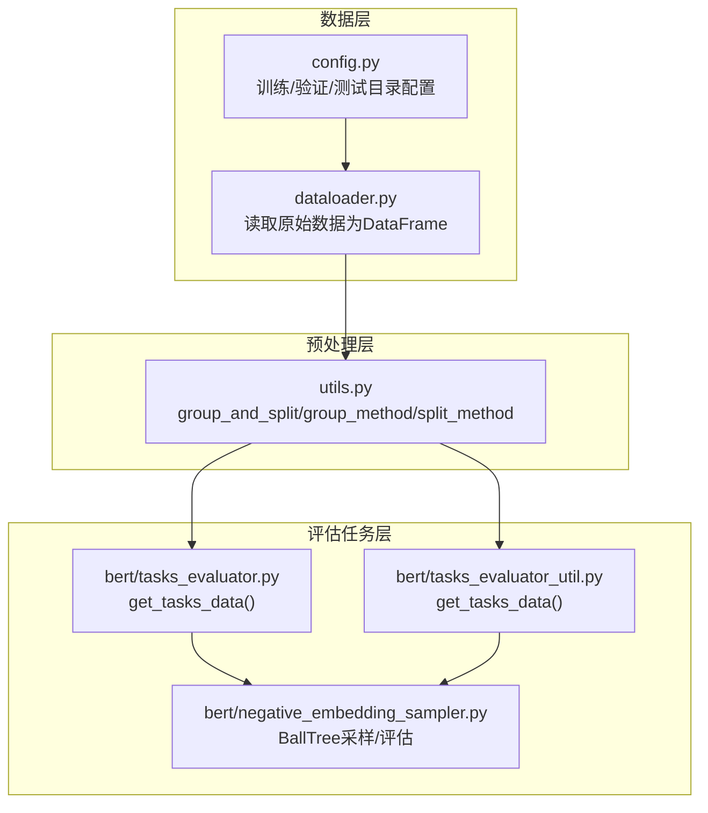
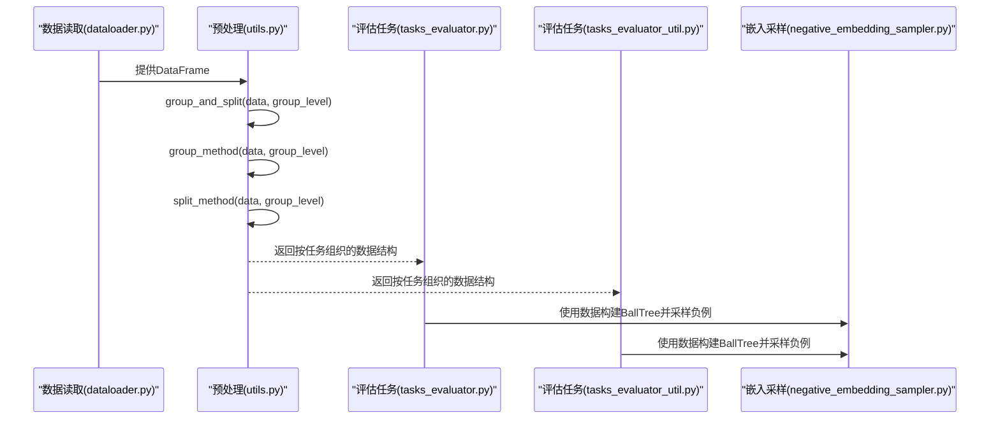
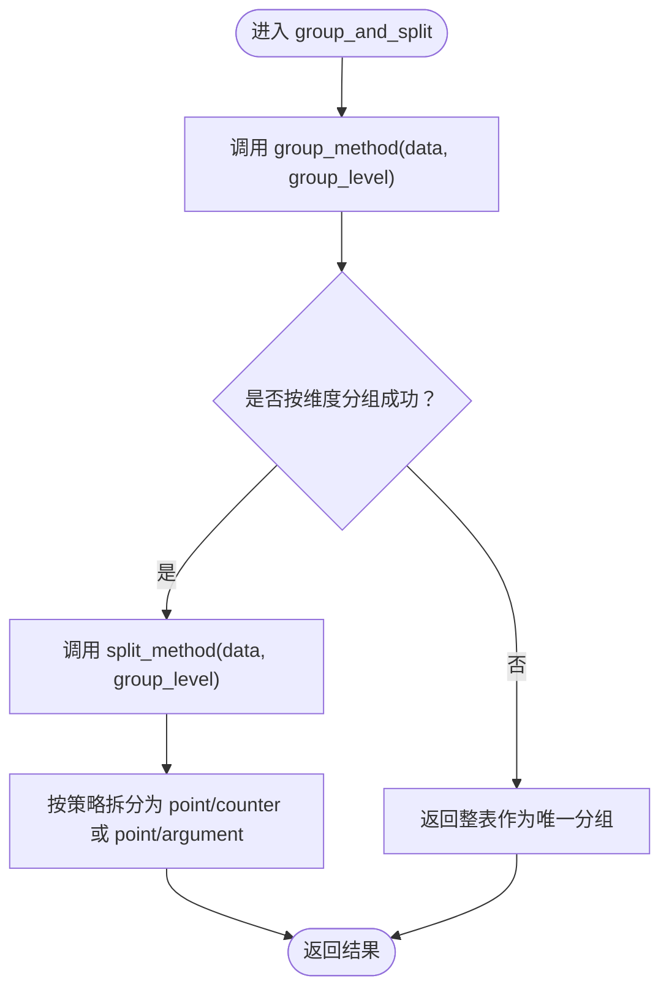
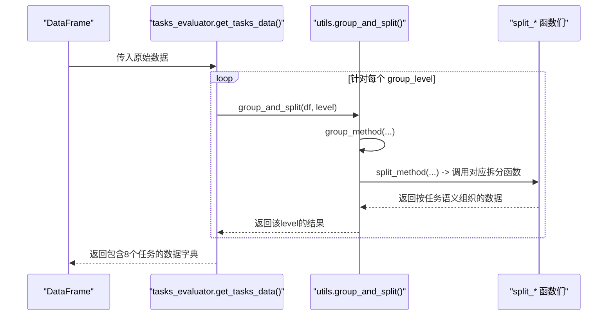
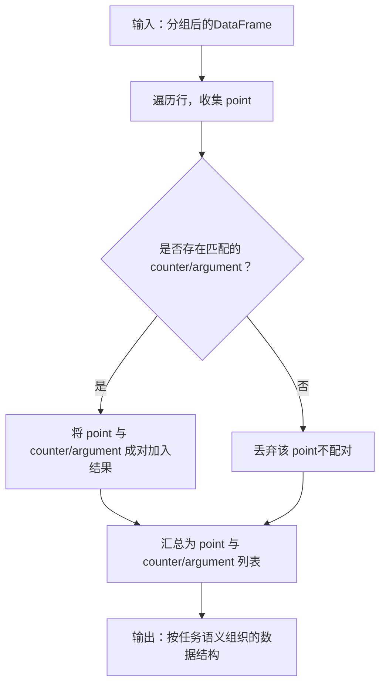
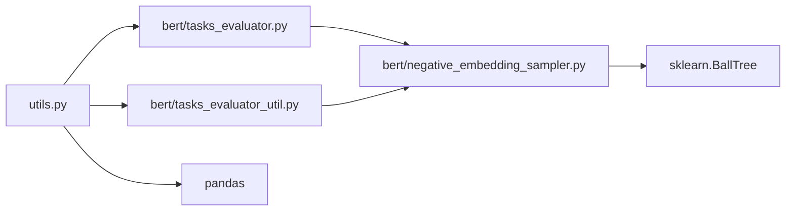

# 分组与拆分逻辑API

<cite>
**本文引用的文件**
- [utils.py](file://utils.py)
- [tasks_evaluator.py](file://bert/tasks_evaluator.py)
- [tasks_evaluator_util.py](file://bert/tasks_evaluator_util.py)
- [negative_embedding_sampler.py](file://bert/negative_embedding_sampler.py)
- [dataloader.py](file://dataloader.py)
- [config.py](file://config.py)
- [README.md](file://README.md)
</cite>

## 目录
1. [简介](#简介)
2. [项目结构](#项目结构)
3. [核心组件](#核心组件)
4. [架构总览](#架构总览)
5. [详细组件分析](#详细组件分析)
6. [依赖分析](#依赖分析)
7. [性能考虑](#性能考虑)
8. [故障排查指南](#故障排查指南)
9. [结论](#结论)
10. [附录](#附录)

## 简介
本文件聚焦于数据预处理的核心入口函数 group_and_split()，系统性说明其如何通过两级流程协调 group_method() 和 split_method() 实现“按维度分组 + 按任务策略拆分”的数据组织。文档将：
- 解释 group_level 参数（如 sdoc、sdoa、sdc、sda、stc、sta、epc、epa）如何映射到分组维度与拆分策略；
- 给出不同 group_level 下的输出结构差异与典型调用示例；
- 阐明该函数在构建评估任务中的关键作用以及与 tasks_evaluator 模块的集成方式。

## 项目结构
该项目围绕辩论论点数据的读取、分组与拆分展开，核心文件包括：
- 数据读取：dataloader.py
- 核心预处理：utils.py（含 group_and_split、group_method、split_method）
- 评估任务构建：bert/tasks_evaluator.py、bert/tasks_evaluator_util.py
- 嵌入采样与评估：bert/negative_embedding_sampler.py
- 配置与说明：config.py、README.md

图表来源
- [dataloader.py](file://dataloader.py#L1-L87)
- [config.py](file://config.py#L1-L11)
- [utils.py](file://utils.py#L259-L304)
- [tasks_evaluator.py](file://bert/tasks_evaluator.py#L1-L37)
- [tasks_evaluator_util.py](file://bert/tasks_evaluator_util.py#L1-L24)
- [negative_embedding_sampler.py](file://bert/negative_embedding_sampler.py#L1-L92)

章节来源
- [dataloader.py](file://dataloader.py#L1-L87)
- [config.py](file://config.py#L1-L11)
- [utils.py](file://utils.py#L259-L304)
- [tasks_evaluator.py](file://bert/tasks_evaluator.py#L1-L37)
- [tasks_evaluator_util.py](file://bert/tasks_evaluator_util.py#L1-L24)
- [negative_embedding_sampler.py](file://bert/negative_embedding_sampler.py#L1-L92)

## 核心组件
本节聚焦于 group_and_split() 及其协作函数，说明其职责、输入输出与行为。

- group_and_split(data, group_level)
  - 功能：先按 group_level 指定的维度进行分组，再根据 group_level 映射到对应的拆分策略，生成两级组织的数据结构。
  - 输入：data（pandas DataFrame 或可分组对象）、group_level（字符串标识维度与策略映射）。
  - 输出：列表或字典序列，每项包含按任务语义组织的子数据集合（如 point 与 counter/argument 的配对）。
  - 关键路径：[utils.py](file://utils.py#L292-L295)

- group_method(data, group_level)
  - 功能：依据 group_level 返回分组维度列表，对数据进行分组；若维度为空，则返回整表作为一个分组。
  - 关键路径：[utils.py](file://utils.py#L259-L274)

- split_method(data, group_level)
  - 功能：依据 group_level 将分组后的数据交给对应拆分函数，按任务语义切分为 point 与 counter/argument 等结构。
  - 关键路径：[utils.py](file://utils.py#L277-L289)

章节来源
- [utils.py](file://utils.py#L259-L304)

## 架构总览
下面的时序图展示了从原始数据到评估任务数据的整体流程，重点体现 group_and_split 在中间层的关键作用。

图表来源
- [dataloader.py](file://dataloader.py#L1-L87)
- [utils.py](file://utils.py#L259-L304)
- [tasks_evaluator.py](file://bert/tasks_evaluator.py#L1-L37)
- [tasks_evaluator_util.py](file://bert/tasks_evaluator_util.py#L1-L24)
- [negative_embedding_sampler.py](file://bert/negative_embedding_sampler.py#L1-L92)

## 详细组件分析

### group_and_split() 两级流程详解
- 协作关系
  - 先由 group_method() 按 group_level 指定的维度对数据进行分组，得到若干子数据集。
  - 再由 split_method() 根据 group_level 的映射选择拆分策略，将每个子数据集进一步拆分为 point 与 counter/argument 等结构。
- 控制流
  - group_method() 内部维护 group_level 到分组维度的映射表，若维度非空则按多列分组，否则将整表视为单一分组。
  - split_method() 内部维护 group_level 到拆分函数的映射表，调用相应拆分函数完成语义化拆分。
- 输出形态
  - 每个分组经拆分后通常返回包含 key（如 "point"、"counter" 或 "argument"）的字典列表，便于后续任务建模与评估。

图表来源
- [utils.py](file://utils.py#L259-L304)

章节来源
- [utils.py](file://utils.py#L259-L304)

### group_level 映射关系与输出结构差异
- 分组维度映射（group_method）
  - sdoc：按 domain、argumentation_title、stance 分组
  - sdoa：按 domain、argumentation_title 分组
  - sdc：按 domain、argumentation_title 分组
  - sda：按 domain、argumentation_title 分组
  - stc：按 domain 分组
  - sta：按 domain 分组
  - epc：无维度（整表为单一分组）
  - epa：无维度（整表为单一分组）
- 拆分策略映射（split_method）
  - sdoc：按对立辩论场景拆分 point 与 counter
  - sdoa：按对立论点-论据场景拆分 point 与 argument
  - sdc：按辩论场景拆分 point 与 counter
  - sda：按辩论场景拆分 point 与 argument
  - stc：按主题场景拆分 point 与 counter
  - sta：按主题场景拆分 point 与 argument
  - epc：按整站场景拆分 point 与 counter
  - epa：按整站场景拆分 point 与 argument
- 输出结构差异
  - 不同 group_level 会决定分组粒度与拆分后的 key 名称（如 "counter" vs "argument"），从而影响下游任务的数据形态与建模方式。

章节来源
- [utils.py](file://utils.py#L259-L289)

### 评估任务构建中的集成方式
- tasks_evaluator.py
  - 通过 get_tasks_data(df) 对同一 DataFrame 依次调用 group_and_split(df, level) 构建八种任务数据集，分别对应不同的 group_level。
  - 返回一个字典，键为任务标识（如 sdoc、sdoa 等），值为经两级组织后的数据结构。
- tasks_evaluator_util.py
  - 同样提供 get_tasks_data(df)，复用相同的分组与拆分逻辑，便于在不同评估流程中统一使用。

图表来源
- [tasks_evaluator.py](file://bert/tasks_evaluator.py#L1-L37)
- [tasks_evaluator_util.py](file://bert/tasks_evaluator_util.py#L1-L24)
- [utils.py](file://utils.py#L259-L304)

章节来源
- [tasks_evaluator.py](file://bert/tasks_evaluator.py#L1-L37)
- [tasks_evaluator_util.py](file://bert/tasks_evaluator_util.py#L1-L24)
- [utils.py](file://utils.py#L259-L304)

### 拆分函数族（按任务语义）
以下拆分函数均位于 utils.py 中，用于将分组后的数据按任务语义切分为 point 与 counter/argument：
- split_point_counter_for_opposing_debate
- split_point_opposing_argument_for_debate
- split_point_counter_for_debate
- split_point_argument_for_debate
- split_point_counter_for_theme
- split_point_argument_for_theme
- split_point_counter_for_entire_portal
- split_point_argument_for_entire_portal

它们的共同特点是：
- 遍历行，识别 utterence_type 为 point 的记录；
- 根据 stance、domain、argumentation_title 等字段匹配对应的 counter 或 argument；
- 将 point 与 counter/argument 成对组织，形成可用于下游任务的数据单元。

图表来源
- [utils.py](file://utils.py#L1-L255)

章节来源
- [utils.py](file://utils.py#L1-L255)

## 依赖分析
- 组件耦合
  - utils.py 的 group_and_split() 依赖 group_method() 与 split_method()，二者分别维护 group_level 到维度/策略的映射表，耦合度低、扩展性强。
  - tasks_evaluator.py 与 tasks_evaluator_util.py 仅依赖 utils.py 的 group_and_split()，形成清晰的接口契约。
  - negative_embedding_sampler.py 依赖外部评估流程提供的数据结构，但不直接依赖 utils.py。
- 外部依赖
  - pandas（分组与筛选）
  - sklearn BallTree（评估阶段的最近邻检索）

图表来源
- [utils.py](file://utils.py#L259-L304)
- [tasks_evaluator.py](file://bert/tasks_evaluator.py#L1-L37)
- [tasks_evaluator_util.py](file://bert/tasks_evaluator_util.py#L1-L24)
- [negative_embedding_sampler.py](file://bert/negative_embedding_sampler.py#L1-L92)

章节来源
- [utils.py](file://utils.py#L259-L304)
- [tasks_evaluator.py](file://bert/tasks_evaluator.py#L1-L37)
- [tasks_evaluator_util.py](file://bert/tasks_evaluator_util.py#L1-L24)
- [negative_embedding_sampler.py](file://bert/negative_embedding_sampler.py#L1-L92)

## 性能考虑
- 分组复杂度
  - group_method() 的分组操作基于 pandas groupby，时间复杂度与数据规模线性相关，建议在大规模数据前进行必要的过滤与清洗。
- 拆分复杂度
  - 拆分函数内部采用逐行扫描与条件筛选，复杂度与行数线性相关；当 group_level 为无维度（如 epc、epa）时，整表作为单一分组，拆分开销最小。
- 扩展性
  - 新增 group_level 时，只需在 group_method 与 split_method 的映射表中添加条目，无需修改核心流程，保持良好可扩展性。

## 故障排查指南
- 常见问题
  - group_level 未定义：若传入未知的 group_level，split_method() 将抛出键访问异常。请确保传入的 level 属于已支持集合。
  - 数据缺失字段：拆分函数依赖 stance、domain、argumentation_title、utterence_type、utterence_id 等字段，若缺失会导致配对失败或输出为空。请在读取数据后检查字段完整性。
  - 输出为空：若分组后某子数据集中无满足条件的 point/counter/argument，拆分结果可能为空。可通过日志或打印辅助定位。
- 定位方法
  - 在 tasks_evaluator.get_tasks_data() 中逐级打印各 level 的输出长度与关键字段分布，快速定位问题分组。
  - 在 utils.py 的 group_and_split() 前后插入调试信息，观察分组数量与拆分后结构。

章节来源
- [tasks_evaluator.py](file://bert/tasks_evaluator.py#L1-L37)
- [utils.py](file://utils.py#L259-L304)

## 结论
group_and_split() 作为数据预处理的核心入口，通过“按维度分组 + 按任务策略拆分”实现了对辩论论点数据的标准化组织。其与 tasks_evaluator 模块的紧密集成，使得同一套数据能够高效地支撑多种评估任务。通过明确的映射表与清晰的接口契约，该设计具备良好的可扩展性与可维护性。

## 附录
- 实际调用示例（路径参考）
  - 在评估任务中调用：参见 [tasks_evaluator.py](file://bert/tasks_evaluator.py#L27-L37)
  - 在工具模块中调用：参见 [tasks_evaluator_util.py](file://bert/tasks_evaluator_util.py#L14-L24)
- 数据读取与准备
  - 数据读取：参见 [dataloader.py](file://dataloader.py#L1-L87)
  - 目录配置：参见 [config.py](file://config.py#L1-L11)
- 项目背景
  - 项目说明：参见 [README.md](file://README.md#L1-L7)