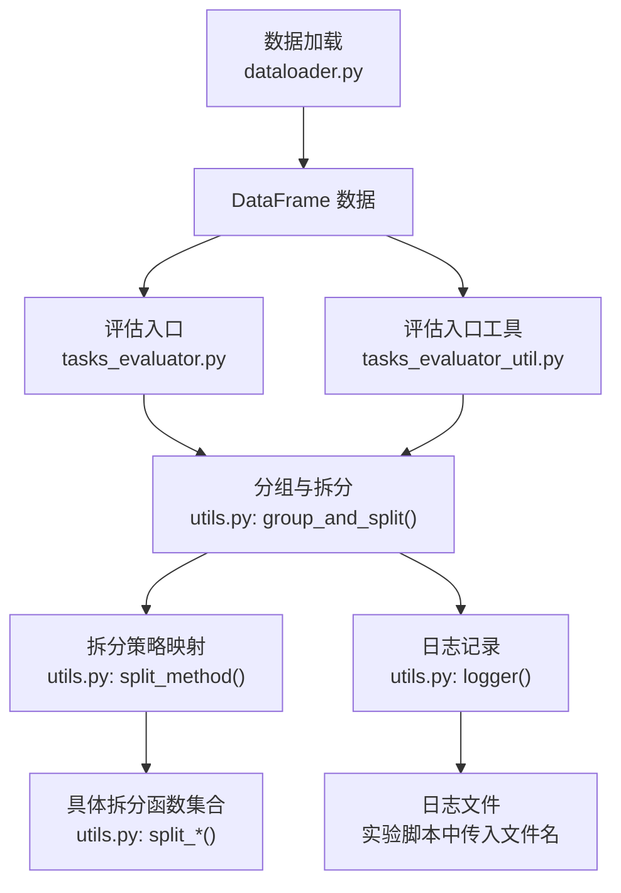
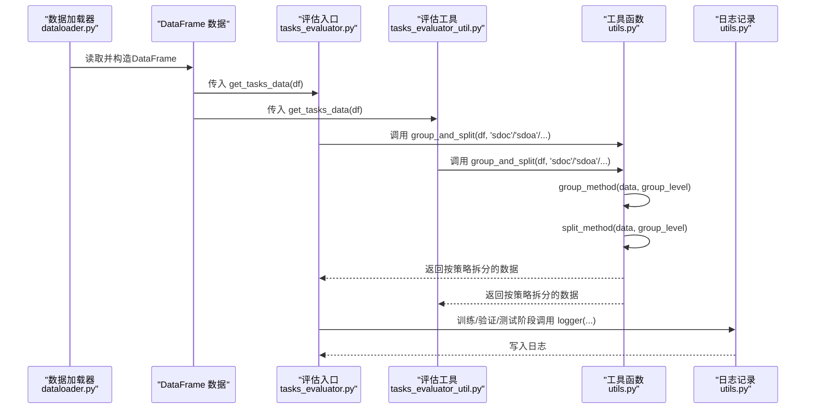
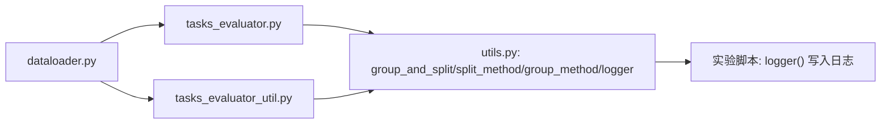

# 工具函数API

<cite>
**本文引用的文件**
- [utils.py](file://utils.py)
- [tasks_evaluator.py](file://bert/tasks_evaluator.py)
- [tasks_evaluator_util.py](file://bert/tasks_evaluator_util.py)
- [dataloader.py](file://dataloader.py)
- [biencoder_embedding_classification_concanated_together_random.py](file://bert/biencoder_firststage_experiment/biencoder_embedding_classification_concanated_together_random.py)
</cite>

## 目录
1. [简介](#简介)
2. [项目结构](#项目结构)
3. [核心组件](#核心组件)
4. [架构总览](#架构总览)
5. [详细组件分析](#详细组件分析)
6. [依赖关系分析](#依赖关系分析)
7. [性能考量](#性能考量)
8. [故障排查指南](#故障排查指南)
9. [结论](#结论)
10. [附录](#附录)

## 简介
本文件为通用工具函数模块的API文档，重点覆盖以下内容：
- group_and_split() 函数：通过 group_method() 和 split_method() 实现按 group_level 对数据进行分组与拆分，支持多种粒度（如 sdoc、sdoa、sdc、sda、stc、sta、epc、epa）。
- 所有 split_* 函数：包括 split_point_counter_for_opposing_debate、split_point_counter_for_debate、split_point_opposing_argument_for_debate、split_point_counter_for_theme、split_point_argument_for_theme、split_point_argument_for_debate、split_point_counter_for_entire_portal、split_point_argument_for_entire_portal。逐项说明其分组逻辑与输出结构（区分 point/counter 或 point/argument）。
- logger() 函数：记录日志信息到指定文件，采用追加写入模式，便于实验结果归档与可视化。

该工具模块在构建评估任务中扮演关键角色，为不同粒度的数据分组与拆分提供统一接口，并通过日志函数支撑实验过程的可追踪性。

## 项目结构
工具函数位于 utils.py；评估任务入口在 bert/tasks_evaluator.py 与 bert/tasks_evaluator_util.py 中调用 group_and_split()；数据加载在 dataloader.py 中完成，生成 DataFrame 后传入评估流程；日志记录在各实验脚本中通过 logger() 进行。

图表来源
- [dataloader.py](file://dataloader.py#L1-L87)
- [tasks_evaluator.py](file://bert/tasks_evaluator.py#L1-L37)
- [tasks_evaluator_util.py](file://bert/tasks_evaluator_util.py#L1-L24)
- [utils.py](file://utils.py#L258-L304)

章节来源
- [dataloader.py](file://dataloader.py#L1-L87)
- [tasks_evaluator.py](file://bert/tasks_evaluator.py#L1-L37)
- [tasks_evaluator_util.py](file://bert/tasks_evaluator_util.py#L1-L24)
- [utils.py](file://utils.py#L258-L304)

## 核心组件
- group_and_split(data, group_level)
  - 功能：先按 group_level 对输入数据进行分组，再按对应策略进行拆分。
  - 输入：data（DataFrame 列表或整体 DataFrame），group_level（字符串，如 'sdoc'、'sdoa' 等）。
  - 输出：按策略拆分后的数据列表，每项包含键 'point' 与 'counter' 或 'argument' 的字典。
  - 关键实现路径：[group_and_split](file://utils.py#L291-L296)

- group_method(data, group_level)
  - 功能：根据 group_level 返回分组键列表，对数据进行分组。
  - 支持粒度：'sdoc'、'sdoa'、'sdc'、'sda'、'stc'、'sta'、'epc'、'epa'。
  - 输出：分组后的数据列表。
  - 关键实现路径：[group_method](file://utils.py#L258-L275)

- split_method(data, group_level)
  - 功能：根据 group_level 将数据交给对应的拆分函数。
  - 输出：按策略拆分后的数据列表。
  - 关键实现路径：[split_method](file://utils.py#L277-L289)

- logger(loginfo, filename)
  - 功能：将日志信息追加写入指定文件。
  - 行为：以 'a+' 模式打开文件，写入一行后换行。
  - 关键实现路径：[logger](file://utils.py#L297-L301)

章节来源
- [utils.py](file://utils.py#L258-L304)

## 架构总览
下面的序列图展示了从数据加载到评估任务构建的整体流程，以及 group_and_split 在其中的作用。

图表来源
- [dataloader.py](file://dataloader.py#L1-L87)
- [tasks_evaluator.py](file://bert/tasks_evaluator.py#L1-L37)
- [tasks_evaluator_util.py](file://bert/tasks_evaluator_util.py#L1-L24)
- [utils.py](file://utils.py#L258-L304)

## 详细组件分析

### group_and_split() 与分组/拆分机制
- 调用链
  - group_and_split() 先调用 group_method() 完成分组，再调用 split_method() 完成拆分。
  - split_method() 根据 group_level 选择对应的拆分函数。
- 支持的 group_level 及对应拆分函数
  - 'sdoc' -> split_point_counter_for_opposing_debate
  - 'sdoa' -> split_point_opposing_argument_for_debate
  - 'sdc' -> split_point_counter_for_debate
  - 'sda' -> split_point_argument_for_debate
  - 'stc' -> split_point_counter_for_theme
  - 'sta' -> split_point_argument_for_theme
  - 'epc' -> split_point_counter_for_entire_portal
  - 'epa' -> split_point_argument_for_entire_portal
- 输出结构
  - 多数拆分函数返回包含 'point' 与 'counter' 的字典列表。
  - 部分拆分函数返回包含 'point' 与 'argument' 的字典列表。
- 典型使用场景
  - 在评估入口中，对同一 DataFrame 按不同粒度（如主题级、辩论级、门户级）分别构建任务数据集，便于对比不同粒度下的效果。

章节来源
- [utils.py](file://utils.py#L258-L296)

### 分组策略与拆分函数详解

#### split_point_counter_for_opposing_debate
- 分组逻辑
  - 针对对立辩论（pro/con）场景，按 utterance_id 匹配 point 与 counter，且 stance 必须一致。
  - 若找不到匹配的 counter，则丢弃该 point。
- 输出结构
  - 返回包含 'point' 与 'counter' 的字典列表。
- 典型使用场景
  - 构建对立立场下的 point-counter 对，用于评估反驳检索任务。

章节来源
- [utils.py](file://utils.py#L1-L22)

#### split_point_counter_for_debate
- 分组逻辑
  - 将数据按 stance 分为 pro 与 con 两组，分别匹配各自内部的 point 与 counter。
  - 最终将 pro 的 counter 与 con 的 point 组合，形成 argument。
- 输出结构
  - 返回包含 'point' 与 'counter' 的字典列表（两个方向）。
- 典型使用场景
  - 构建辩论级的 point-counter 对，考虑双方立场。

章节来源
- [utils.py](file://utils.py#L25-L60)

#### split_point_opposing_argument_for_debate
- 分组逻辑
  - 类似 split_point_counter_for_debate，但最终输出为 'point' 与 'argument'，其中 argument 由对方立场的 counter 与本方立场的 point 组成。
- 输出结构
  - 返回包含 'point' 与 'argument' 的字典列表（两个方向）。
- 典型使用场景
  - 构建基于对立立场的 argument 场景，便于评估反驳生成或检索。

章节来源
- [utils.py](file://utils.py#L63-L99)

#### split_point_counter_for_theme
- 分组逻辑
  - 在主题级别进行分组，要求 domain 与 argumentation_title 一致，同时 stance 一致。
  - 匹配 point 与 counter，若无匹配则丢弃该 point。
- 输出结构
  - 返回包含 'point' 与 'counter' 的字典列表（两个方向）。
- 典型使用场景
  - 构建主题级的 point-counter 对，适合跨立场对比。

章节来源
- [utils.py](file://utils.py#L102-L143)

#### split_point_argument_for_theme
- 分组逻辑
  - 在主题级别进行分组，匹配 point 与 counter，形成 argument（由 counter 与 point 组成）。
- 输出结构
  - 返回包含 'point' 与 'argument' 的字典列表。
- 典型使用场景
  - 主题级 argument 场景，便于评估反驳生成。

章节来源
- [utils.py](file://utils.py#L146-L166)

#### split_point_argument_for_debate
- 分组逻辑
  - 在辩论级别进行分组，匹配 point 与 counter，形成 argument（由 counter 与 point 组成）。
- 输出结构
  - 返回包含 'point' 与 'argument' 的字典列表。
- 典型使用场景
  - 辩论级 argument 场景，便于评估反驳生成。

章节来源
- [utils.py](file://utils.py#L170-L192)

#### split_point_counter_for_entire_portal
- 分组逻辑
  - 在门户级（整个数据源）进行分组，要求 domain 与 argumentation_title 一致，同时 stance 一致。
  - 匹配 point 与 counter，若无匹配则丢弃该 point。
- 输出结构
  - 返回包含 'point' 与 'counter' 的字典列表（两个方向）。
- 典型使用场景
  - 门户级 point-counter 对，适合全局评估。

章节来源
- [utils.py](file://utils.py#L195-L231)

#### split_point_argument_for_entire_portal
- 分组逻辑
  - 在门户级进行分组，匹配 point 与 counter，形成 argument（由 counter 与 point 组成）。
- 输出结构
  - 返回包含 'point' 与 'argument' 的字典列表。
- 典型使用场景
  - 门户级 argument 场景，便于全局评估反驳生成。

章节来源
- [utils.py](file://utils.py#L235-L255)

### 日志记录函数 logger()
- 参数
  - loginfo：要写入的日志文本。
  - filename：目标日志文件路径。
- 行为
  - 使用 'a+' 模式打开文件，写入 loginfo 并换行。
- 典型使用场景
  - 训练、验证、测试阶段记录准确率等指标，便于后续可视化与分析。

章节来源
- [utils.py](file://utils.py#L297-L301)
- [biencoder_embedding_classification_concanated_together_random.py](file://bert/biencoder_firststage_experiment/biencoder_embedding_classification_concanated_together_random.py#L210-L281)

## 依赖关系分析
- 评估入口依赖工具函数
  - tasks_evaluator.py 与 tasks_evaluator_util.py 均导入并调用 group_and_split(df, group_level)，用于构建多粒度的任务数据集。
- 数据来源
  - dataloader.py 提供 DataFrame 数据，作为 group_and_split 的输入。
- 日志依赖
  - 各实验脚本通过 logger() 将阶段性结果写入文件，便于后续提取与绘图。

图表来源
- [dataloader.py](file://dataloader.py#L1-L87)
- [tasks_evaluator.py](file://bert/tasks_evaluator.py#L1-L37)
- [tasks_evaluator_util.py](file://bert/tasks_evaluator_util.py#L1-L24)
- [utils.py](file://utils.py#L258-L304)

章节来源
- [dataloader.py](file://dataloader.py#L1-L87)
- [tasks_evaluator.py](file://bert/tasks_evaluator.py#L1-L37)
- [tasks_evaluator_util.py](file://bert/tasks_evaluator_util.py#L1-L24)
- [utils.py](file://utils.py#L258-L304)

## 性能考量
- 分组与拆分复杂度
  - group_method() 对 DataFrame 进行分组，时间复杂度与分组键数量相关，通常为 O(n log n) 到 O(n^2) 视分组键组合而定。
  - 各 split_* 函数内部对 DataFrame 进行迭代与条件筛选，整体复杂度约为 O(n) 到 O(n^2)，取决于匹配逻辑与数据规模。
- I/O 与日志
  - logger() 采用追加写入，频繁写入可能成为瓶颈；建议批量写入或合并日志后再写入。
- 建议
  - 在大规模数据上运行时，优先选择更细粒度的 group_level，减少单次处理的数据量。
  - 对 split_* 函数中的条件筛选进行索引优化（如预先建立 utt_id 索引）可显著提升性能。

## 故障排查指南
- 分组键缺失
  - 现象：group_level 不生效或返回空列表。
  - 排查：确认 DataFrame 是否包含 group_level 对应的列（如 domain、argumentation_title、stance）。
  - 参考路径：[group_method](file://utils.py#L258-L275)
- 匹配失败导致数据丢失
  - 现象：某些 point 未出现在输出中。
  - 排查：检查 split_* 函数中的匹配条件（如 stance、domain、argumentation_title、utterence_id）是否严格。
  - 参考路径：[split_point_counter_for_opposing_debate](file://utils.py#L1-L22)、[split_point_counter_for_debate](file://utils.py#L25-L60)、[split_point_counter_for_theme](file://utils.py#L102-L143)、[split_point_counter_for_entire_portal](file://utils.py#L195-L231)
- 日志无法写入
  - 现象：logger() 调用后文件未更新。
  - 排查：确认 filename 路径存在且具有写权限；检查 'a+' 模式是否被正确使用。
  - 参考路径：[logger](file://utils.py#L297-L301)
- 评估入口未生成预期结果
  - 现象：result 字典缺少某些 key。
  - 排查：确认 tasks_evaluator.py 与 tasks_evaluator_util.py 中 group_and_split(df, group_level) 的调用是否完整覆盖所有粒度。
  - 参考路径：[tasks_evaluator.py](file://bert/tasks_evaluator.py#L24-L37)、[tasks_evaluator_util.py](file://bert/tasks_evaluator_util.py#L13-L24)

章节来源
- [utils.py](file://utils.py#L1-L304)
- [tasks_evaluator.py](file://bert/tasks_evaluator.py#L24-L37)
- [tasks_evaluator_util.py](file://bert/tasks_evaluator_util.py#L13-L24)

## 结论
工具函数模块通过 group_and_split() 将分组与拆分逻辑抽象为统一接口，配合 split_* 系列函数实现多粒度的数据组织，满足从对立辩论到主题、门户等不同场景的评估需求。logger() 提供了简洁可靠的日志记录能力，便于实验过程的追踪与结果可视化。建议在实际使用中结合数据规模与性能需求，合理选择 group_level，并对 I/O 与匹配逻辑进行优化。

## 附录

### API 一览表
- group_and_split(data, group_level)
  - 功能：分组 + 拆分
  - 返回：按策略拆分后的数据列表
  - 参考路径：[group_and_split](file://utils.py#L291-L296)

- group_method(data, group_level)
  - 功能：按 group_level 分组
  - 返回：分组后的数据列表
  - 参考路径：[group_method](file://utils.py#L258-L275)

- split_method(data, group_level)
  - 功能：按 group_level 选择拆分策略
  - 返回：按策略拆分后的数据列表
  - 参考路径：[split_method](file://utils.py#L277-L289)

- split_point_counter_for_opposing_debate(data)
  - 输出：'point' 与 'counter'
  - 参考路径：[split_point_counter_for_opposing_debate](file://utils.py#L1-L22)

- split_point_counter_for_debate(data)
  - 输出：'point' 与 'counter'
  - 参考路径：[split_point_counter_for_debate](file://utils.py#L25-L60)

- split_point_opposing_argument_for_debate(data)
  - 输出：'point' 与 'argument'
  - 参考路径：[split_point_opposing_argument_for_debate](file://utils.py#L63-L99)

- split_point_counter_for_theme(data)
  - 输出：'point' 与 'counter'
  - 参考路径：[split_point_counter_for_theme](file://utils.py#L102-L143)

- split_point_argument_for_theme(data)
  - 输出：'point' 与 'argument'
  - 参考路径：[split_point_argument_for_theme](file://utils.py#L146-L166)

- split_point_argument_for_debate(data)
  - 输出：'point' 与 'argument'
  - 参考路径：[split_point_argument_for_debate](file://utils.py#L170-L192)

- split_point_counter_for_entire_portal(data)
  - 输出：'point' 与 'counter'
  - 参考路径：[split_point_counter_for_entire_portal](file://utils.py#L195-L231)

- split_point_argument_for_entire_portal(data)
  - 输出：'point' 与 'argument'
  - 参考路径：[split_point_argument_for_entire_portal](file://utils.py#L235-L255)

- logger(loginfo, filename)
  - 行为：追加写入日志
  - 参考路径：[logger](file://utils.py#L297-L301)

### 典型调用示例与场景
- 评估入口调用
  - 在 tasks_evaluator.py 与 tasks_evaluator_util.py 中，对同一 DataFrame 调用 group_and_split(df, 'sdoc'/'sdoa'/...)，构建多粒度任务数据集。
  - 参考路径：[tasks_evaluator.py](file://bert/tasks_evaluator.py#L24-L37)、[tasks_evaluator_util.py](file://bert/tasks_evaluator_util.py#L13-L24)
- 日志记录
  - 在实验脚本中，训练/验证/测试阶段分别调用 logger(...) 记录准确率等指标。
  - 参考路径：[biencoder_embedding_classification_concanated_together_random.py](file://bert/biencoder_firststage_experiment/biencoder_embedding_classification_concanated_together_random.py#L210-L281)