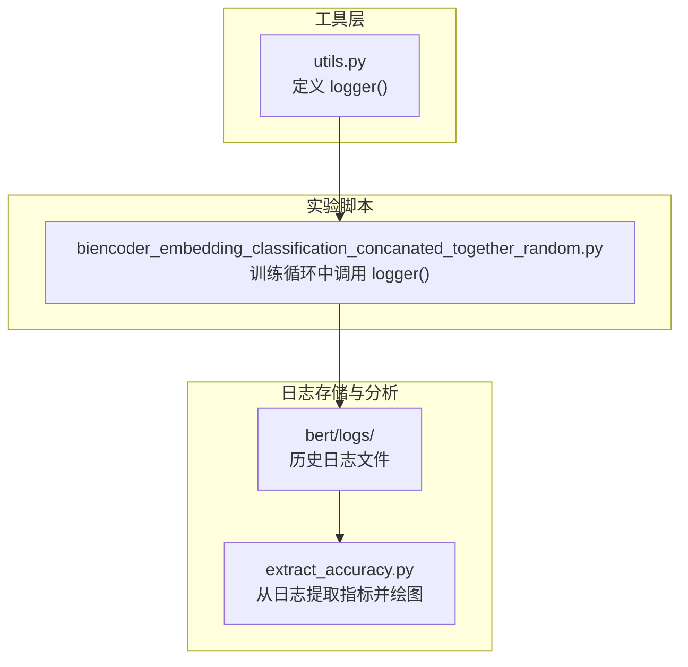
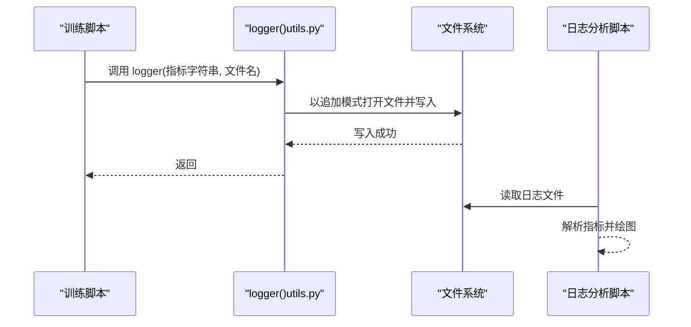
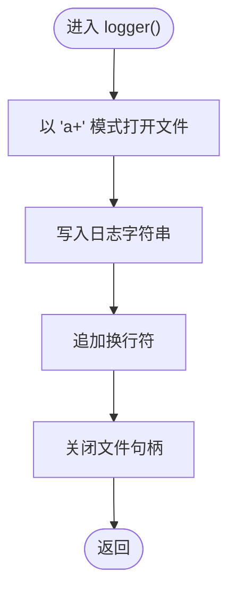
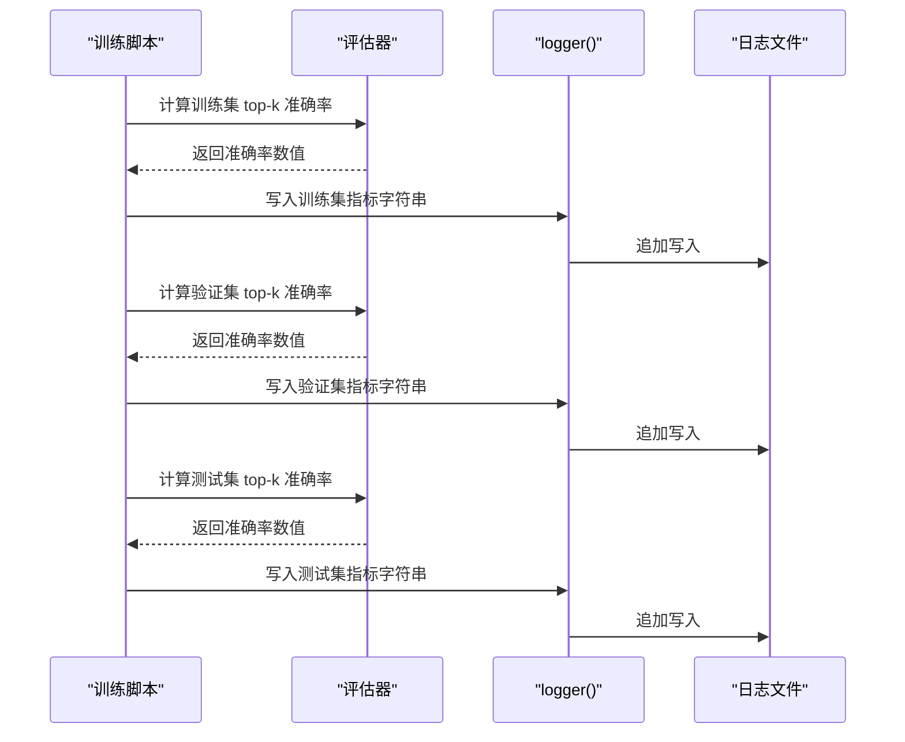
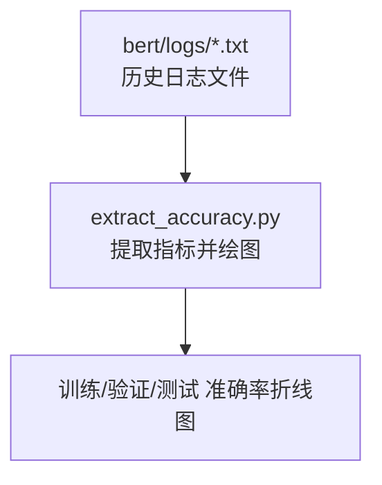

# 日志记录API

<cite>
**本文引用的文件**
- [utils.py](file://utils.py)
- [biencoder_embedding_classification_concanated_together_random.py](file://bert/biencoder_firststage_experiment/biencoder_embedding_classification_concanated_together_random.py)
- [extract_accuracy.py](file://bert/logs/extract_accuracy.py)
- [README.md](file://README.md)
</cite>

## 目录
1. [简介](#简介)
2. [项目结构](#项目结构)
3. [核心组件](#核心组件)
4. [架构总览](#架构总览)
5. [详细组件分析](#详细组件分析)
6. [依赖关系分析](#依赖关系分析)
7. [性能考量](#性能考量)
8. [故障排查指南](#故障排查指南)
9. [结论](#结论)
10. [附录](#附录)

## 简介
本文件系统性文档化项目中的日志记录API：logger() 函数。该函数提供轻量级的日志写入能力，支持将字符串形式的日志内容追加到指定文件末尾，确保历史日志不会被覆盖，便于在训练循环中持续记录损失值、准确率等关键指标，从而支撑实验结果的可追踪与复现。

## 项目结构
围绕日志记录API的关键位置如下：
- 工具函数定义：utils.py 中的 logger() 实现
- 训练脚本使用：多个实验脚本通过 logger() 输出训练/验证/测试阶段的指标
- 日志文件组织：bert/logs/ 下存放历史日志文本文件及可视化脚本
- 项目背景：README.md 提供项目背景与数据来源说明

**图表来源**
- [utils.py](file://utils.py#L296-L304)
- [biencoder_embedding_classification_concanated_together_random.py](file://bert/biencoder_firststage_experiment/biencoder_embedding_classification_concanated_together_random.py#L20-L285)
- [extract_accuracy.py](file://bert/logs/extract_accuracy.py#L1-L26)

**章节来源**
- [utils.py](file://utils.py#L296-L304)
- [biencoder_embedding_classification_concanated_together_random.py](file://bert/biencoder_firststage_experiment/biencoder_embedding_classification_concanated_together_random.py#L20-L285)
- [README.md](file://README.md#L1-L7)

## 核心组件
- logger(loginfo, filename)
  - 参数
    - loginfo: str，要写入的日志字符串内容
    - filename: str，目标日志文件的路径（建议使用相对路径）
  - 行为
    - 以追加模式打开文件（'a+'），写入一行日志后换行
    - 不会清空已有内容，保证历史日志持久化
  - 使用场景
    - 在训练循环中记录损失、准确率等指标
    - 在评估阶段记录训练集/验证集/测试集指标

**章节来源**
- [utils.py](file://utils.py#L296-L304)

## 架构总览
logger() 作为通用工具函数，被各实验脚本在训练/评估阶段调用，将指标写入 bert/logs/ 目录下的日志文件。后续可通过 extract_accuracy.py 等脚本从日志文件中解析指标，绘制训练曲线，辅助实验结果追踪与对比。

**图表来源**
- [utils.py](file://utils.py#L296-L304)
- [biencoder_embedding_classification_concanated_together_random.py](file://bert/biencoder_firststage_experiment/biencoder_embedding_classification_concanated_together_random.py#L20-L285)
- [extract_accuracy.py](file://bert/logs/extract_accuracy.py#L1-L26)

## 详细组件分析

### logger() 函数实现与行为
- 实现要点
  - 使用 with open(...) 上下文管理器，确保文件句柄正确关闭
  - 采用 'a+' 模式，既可读也可写，但写入总是追加到文件末尾
  - 写入 loginfo 后自动换行，便于后续解析
- 错误处理
  - 未显式捕获异常；如需增强健壮性，可在上层调用处增加 try/except 包裹
- 性能特征
  - 单次写入开销极低，适合高频调用（例如每步或每个 epoch）

**图表来源**
- [utils.py](file://utils.py#L296-L304)

**章节来源**
- [utils.py](file://utils.py#L296-L304)

### 在训练循环中的使用示例
- 典型流程
  - 训练阶段：在每个 epoch 结束后，计算训练集 top-k 准确率，调用 logger() 写入
  - 验证阶段：在每个 epoch 结束后，计算验证集 top-k 准确率，调用 logger() 写入
  - 测试阶段：在训练完成后，计算测试集 top-k 准确率，调用 logger() 写入
- 文件命名约定
  - 建议以“模型/实验名称.log”命名，便于区分不同配置
  - 日志文件通常放置于 bert/logs/ 目录下，便于统一管理与分析
- 参考路径
  - 训练脚本中对 logger() 的调用位置与日志文件名定义

**图表来源**
- [biencoder_embedding_classification_concanated_together_random.py](file://bert/biencoder_firststage_experiment/biencoder_embedding_classification_concanated_together_random.py#L20-L285)

**章节来源**
- [biencoder_embedding_classification_concanated_together_random.py](file://bert/biencoder_firststage_experiment/biencoder_embedding_classification_concanated_together_random.py#L20-L285)

### 日志文件与实验结果追踪
- 日志文件组织
  - bert/logs/ 目录下包含若干历史日志文本文件，以及用于提取指标并可视化的脚本
- 指标提取与可视化
  - extract_accuracy.py 从指定日志文件中按规则提取“训练集/验证集/测试集”的 top-k 准确率，并绘制折线图
- 实际作用
  - 为实验结果提供持久化记录，便于跨实验对比、趋势分析与报告生成

**图表来源**
- [extract_accuracy.py](file://bert/logs/extract_accuracy.py#L1-L26)

**章节来源**
- [extract_accuracy.py](file://bert/logs/extract_accuracy.py#L1-L26)

## 依赖关系分析
- 组件耦合
  - 训练脚本依赖 utils.logger() 完成日志写入
  - 日志分析脚本依赖 bert/logs/ 下的日志文件进行指标提取
- 外部依赖
  - Python 内置 open() 与文件系统
  - matplotlib/pandas（在日志分析脚本中使用）

**图表来源**
- [utils.py](file://utils.py#L296-L304)
- [biencoder_embedding_classification_concanated_together_random.py](file://bert/biencoder_firststage_experiment/biencoder_embedding_classification_concanated_together_random.py#L20-L285)
- [extract_accuracy.py](file://bert/logs/extract_accuracy.py#L1-L26)

**章节来源**
- [utils.py](file://utils.py#L296-L304)
- [biencoder_embedding_classification_concanated_together_random.py](file://bert/biencoder_firststage_experiment/biencoder_embedding_classification_concanated_together_random.py#L20-L285)
- [extract_accuracy.py](file://bert/logs/extract_accuracy.py#L1-L26)

## 性能考量
- 写入开销
  - 单次写入为 O(1)，对训练性能影响可忽略
- 文件大小
  - 采用追加模式，日志文件随训练轮数增长；建议定期归档或按实验分目录管理
- I/O 策略
  - 如需更高吞吐，可在上层批量收集后再统一写入，或使用异步写入（需自行封装）

## 故障排查指南
- 常见问题
  - 文件权限不足：确保目标路径存在且具备写权限
  - 路径错误：确认 filename 为有效相对/绝对路径
  - 编码问题：默认以文本模式写入，如需二进制内容请调整策略
- 建议
  - 在调用 logger() 前打印或记录日志文件名，便于定位
  - 对关键指标写入前后增加状态提示，便于调试

## 结论
logger() 函数以简洁稳定的接口实现了基于追加模式的日志写入，满足训练/评估阶段指标持久化的需求。结合 bert/logs/ 目录下的日志文件与 extract_accuracy.py 的指标提取能力，能够有效支撑实验结果的追踪与可视化分析。建议在团队内统一日志格式与文件命名规范，提升可维护性与可复用性。

## 附录
- 接口规范摘要
  - 函数名：logger
  - 参数：
    - loginfo: str（日志内容）
    - filename: str（目标文件路径）
  - 行为：以追加模式写入一行日志并换行
  - 注意：不负责清理历史内容，确保日志持久化