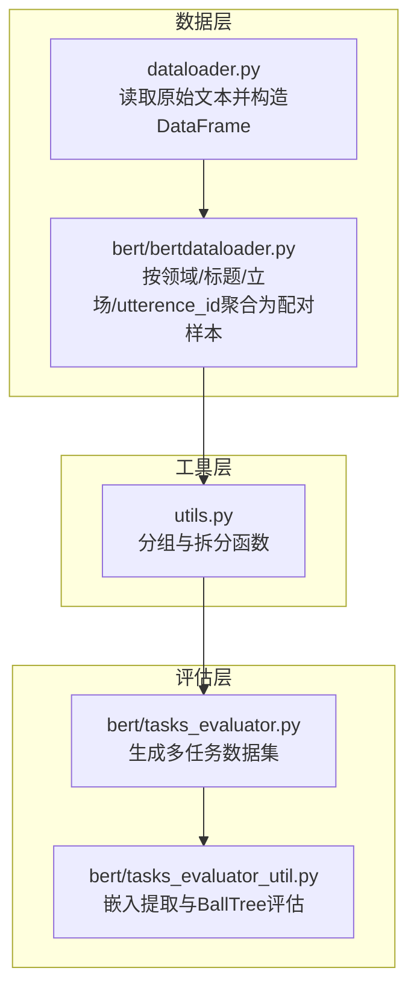
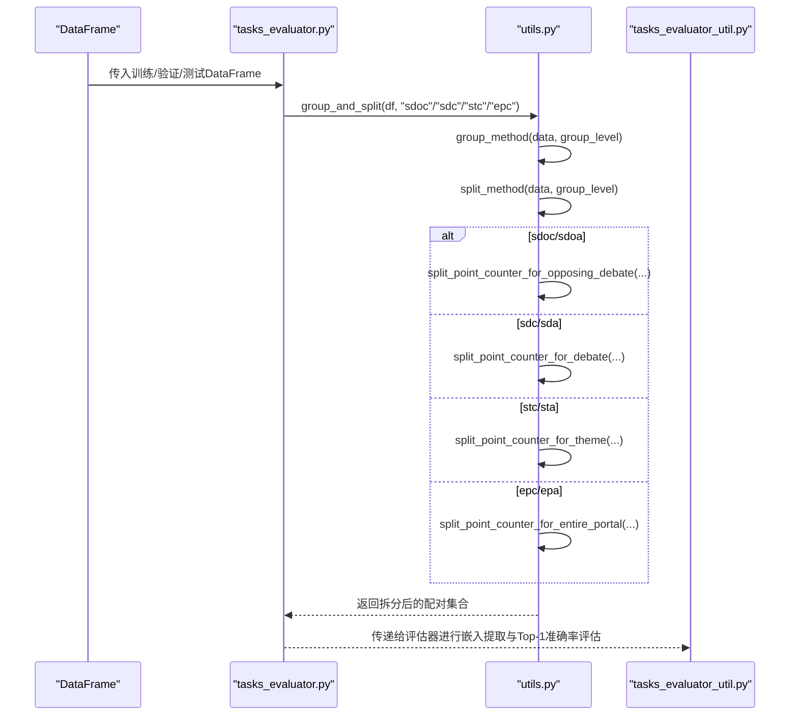
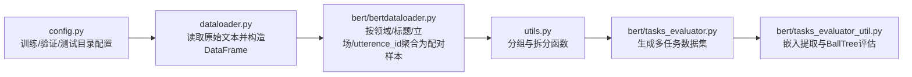

# 论点-反论点配对拆分API

<cite>
**本文引用的文件**
- [utils.py](file://utils.py)
- [dataloader.py](file://dataloader.py)
- [bert/bertdataloader.py](file://bert/bertdataloader.py)
- [bert/tasks_evaluator.py](file://bert/tasks_evaluator.py)
- [bert/tasks_evaluator_util.py](file://bert/tasks_evaluator_util.py)
- [config.py](file://config.py)
</cite>

## 目录
1. [简介](#简介)
2. [项目结构](#项目结构)
3. [核心组件](#核心组件)
4. [架构总览](#架构总览)
5. [详细组件分析](#详细组件分析)
6. [依赖关系分析](#依赖关系分析)
7. [性能考量](#性能考量)
8. [故障排查指南](#故障排查指南)
9. [结论](#结论)
10. [附录](#附录)

## 简介
本文件系统性文档化四个论点-反论点配对拆分函数：split_point_counter_for_opposing_debate、split_point_counter_for_debate、split_point_counter_for_theme、split_point_counter_for_entire_portal。它们分别针对不同语义边界（对立辩论、辩论内部、主题维度、门户整体）将数据划分为“正向论点”与“对应反论点”的配对集合，并在输出字典中以“point”和“counter”字段组织结果。文档还解释各函数的过滤条件、ID匹配逻辑、立场一致性要求，给出输入DataFrame样例与输出结构示例，并说明其在sdoc、sdc等评估任务中的应用。

## 项目结构
围绕论点-反论点配对拆分的核心代码位于utils.py；数据加载与预处理由dataloader.py与bert/bertdataloader.py负责；评估入口通过bert/tasks_evaluator.py与bert/tasks_evaluator_util.py调用group_and_split组合分组与拆分流程。

图表来源
- [dataloader.py](file://dataloader.py#L30-L75)
- [bert/bertdataloader.py](file://bert/bertdataloader.py#L12-L25)
- [utils.py](file://utils.py#L259-L296)
- [bert/tasks_evaluator.py](file://bert/tasks_evaluator.py#L24-L37)
- [bert/tasks_evaluator_util.py](file://bert/tasks_evaluator_util.py#L14-L24)

章节来源
- [dataloader.py](file://dataloader.py#L30-L75)
- [bert/bertdataloader.py](file://bert/bertdataloader.py#L12-L25)
- [utils.py](file://utils.py#L259-L296)
- [bert/tasks_evaluator.py](file://bert/tasks_evaluator.py#L24-L37)
- [bert/tasks_evaluator_util.py](file://bert/tasks_evaluator_util.py#L14-L24)

## 核心组件
- 分组与拆分入口：group_and_split(group_level) 将数据按指定粒度分组后调用对应拆分函数。
- 拆分函数族：
  - 对立辩论粒度：split_point_counter_for_opposing_debate
  - 辩论内部粒度：split_point_counter_for_debate
  - 主题粒度：split_point_counter_for_theme
  - 门户整体粒度：split_point_counter_for_entire_portal
- 输出结构：每个函数返回列表，元素为字典，包含“point”和“counter”两个键，分别存储配对后的论点与反论点序列。

章节来源
- [utils.py](file://utils.py#L259-L296)

## 架构总览
以下序列图展示从DataFrame到多任务评估数据的完整流程，包括分组与拆分步骤：

图表来源
- [bert/tasks_evaluator.py](file://bert/tasks_evaluator.py#L24-L37)
- [utils.py](file://utils.py#L259-L296)

## 详细组件分析

### 函数一：split_point_counter_for_opposing_debate
- 功能概述：按“对立辩论”粒度进行拆分，即在同一对话或辩论中寻找与某条论点立场一致且共享相同utterence_id的反论点进行配对。
- 输入：data为DataFrame列表，每个DataFrame代表一个辩论/对话。
- 过滤条件与匹配逻辑：
  - 遍历每条记录，当utterence_type为“point”时，记录该行。
  - 使用该行的utterence_id作为匹配键，查找同一DataFrame中类型为“counter”，立场与之相同的记录。
  - 若唯一匹配成功，则将该“counter”加入反论点集合；否则丢弃该“point”。
- 立场一致性要求：仅在“stance”完全一致的前提下进行匹配。
- 输出结构：返回列表，每个元素为字典，包含“point”和“counter”两个键，分别保存配对后的论点与反论点序列。
- 典型应用场景：sdoa（opposing debate + argument）任务，强调对立立场间的直接反驳。

章节来源
- [utils.py](file://utils.py#L3-L22)

### 函数二：split_point_counter_for_debate
- 功能概述：按“辩论内部”粒度进行拆分，将pro与con两类立场分别处理，再交叉合并反论点集合。
- 输入：data为DataFrame列表，每个DataFrame代表一个辩论/对话。
- 过滤条件与匹配逻辑：
  - 遍历每条记录，当utterence_type为“point”且stance为“pro”时，记录该行。
  - 使用该行的utterence_id作为匹配键，查找同一DataFrame中类型为“counter”，立场与之相同的记录。
  - 若唯一匹配成功，则将该“counter”加入pro_counter；否则丢弃该“point”。
  - 对stance为“con”的记录执行相同流程，得到con_counter。
  - 最终将pro_counter与con_counter拼接，形成交叉反论点集合，分别与各自立场的point配对。
- 立场一致性要求：仅在“stance”完全一致的前提下进行匹配。
- 输出结构：返回列表，每个元素为字典，包含“point”和“counter”两个键，分别保存配对后的论点与反论点序列。
- 典型应用场景：sdc（debate + counter）任务，强调同一立场内的反驳配对。

章节来源
- [utils.py](file://utils.py#L24-L60)

### 函数三：split_point_counter_for_theme
- 功能概述：按“主题”粒度进行拆分，要求匹配的“point”与“counter”不仅立场一致，还需共享相同的domain与argumentation_title。
- 输入：data为DataFrame列表，每个DataFrame代表一个辩论/对话。
- 过滤条件与匹配逻辑：
  - 遍历每条记录，当utterence_type为“point”且stance为“pro”时，记录该行。
  - 使用该行的utterence_id作为匹配键，查找同一DataFrame中类型为“counter”，立场与之相同，且domain与argumentation_title均相同的记录。
  - 若唯一匹配成功，则将该“counter”加入pro_counter；否则丢弃该“point”。
  - 对stance为“con”的记录执行相同流程，得到con_counter。
  - 最终将pro_counter与con_counter拼接，形成交叉反论点集合，分别与各自立场的point配对。
- 立场一致性要求：仅在“stance”完全一致的前提下进行匹配。
- 输出结构：返回列表，每个元素为字典，包含“point”和“counter”两个键，分别保存配对后的论点与反论点序列。
- 典型应用场景：stc（theme + counter）任务，强调同一主题下的反驳配对。

章节来源
- [utils.py](file://utils.py#L102-L143)

### 函数四：split_point_counter_for_entire_portal
- 功能概述：按“门户整体”粒度进行拆分，要求匹配的“point”与“counter”不仅立场一致，还需共享相同的domain与argumentation_title。
- 输入：data为DataFrame列表，每个DataFrame代表一个辩论/对话。
- 过滤条件与匹配逻辑：
  - 遍历每条记录，当utterence_type为“point”且stance为“pro”时，记录该行。
  - 使用该行的utterence_id作为匹配键，查找同一DataFrame中类型为“counter”，立场与之相同，且domain与argumentation_title均相同的记录。
  - 若唯一匹配成功，则将该“counter”加入pro_counter；否则丢弃该“point”。
  - 对stance为“con”的记录执行相同流程，得到con_counter。
  - 最终将pro_counter与con_counter拼接，形成交叉反论点集合，分别与各自立场的point配对。
- 立场一致性要求：仅在“stance”完全一致的前提下进行匹配。
- 输出结构：返回列表，每个元素为字典，包含“point”和“counter”两个键，分别保存配对后的论点与反论点序列。
- 典型应用场景：epc（entire portal + counter）任务，强调门户级的整体反驳配对。

章节来源
- [utils.py](file://utils.py#L195-L231)

### 统一入口与评估任务映射
- group_and_split(data, group_level)：根据group_level选择对应的拆分策略。
- 评估任务映射：
  - sdoc：opposing debate + counter
  - sdc：debate + counter
  - stc：theme + counter
  - epc：entire portal + counter
- 评估入口会调用group_and_split(df, level)生成多任务数据集，供后续嵌入提取与BallTree评估使用。

章节来源
- [utils.py](file://utils.py#L259-L296)
- [bert/tasks_evaluator.py](file://bert/tasks_evaluator.py#L24-L37)
- [bert/tasks_evaluator_util.py](file://bert/tasks_evaluator_util.py#L14-L24)

## 依赖关系分析
- 数据来源与预处理：
  - dataloader.py读取原始文本，构造包含domain、argumentation_title、stance、utterence_id、utterence_type、text等列的DataFrame。
  - bert/bertdataloader.py将上述DataFrame按domain、argumentation_title、utterence_id、stance分组，生成point_text与counter_text配对样本。
- 拆分函数依赖：
  - utils.py中的拆分函数依赖于DataFrame中已存在的列：utterence_type、stance、utterence_id、domain、argumentation_title。
- 评估链路：
  - tasks_evaluator.py与tasks_evaluator_util.py通过group_and_split(df, level)获取多任务数据集，并进行嵌入提取与Top-1准确率评估。

图表来源
- [config.py](file://config.py#L1-L11)
- [dataloader.py](file://dataloader.py#L30-L75)
- [bert/bertdataloader.py](file://bert/bertdataloader.py#L12-L25)
- [utils.py](file://utils.py#L259-L296)
- [bert/tasks_evaluator.py](file://bert/tasks_evaluator.py#L24-L37)
- [bert/tasks_evaluator_util.py](file://bert/tasks_evaluator_util.py#L14-L24)

章节来源
- [config.py](file://config.py#L1-L11)
- [dataloader.py](file://dataloader.py#L30-L75)
- [bert/bertdataloader.py](file://bert/bertdataloader.py#L12-L25)
- [utils.py](file://utils.py#L259-L296)
- [bert/tasks_evaluator.py](file://bert/tasks_evaluator.py#L24-L37)
- [bert/tasks_evaluator_util.py](file://bert/tasks_evaluator_util.py#L14-L24)

## 性能考量
- 时间复杂度：
  - 每个拆分函数对DataFrame进行一次遍历，筛选与匹配过程基于pandas布尔索引与loc查询，整体复杂度近似O(N)，其中N为DataFrame行数。
- 空间复杂度：
  - 输出为列表与字典，空间开销与保留的point与counter数量线性相关。
- 可优化方向：
  - 在大规模数据上，可考虑对utterence_id建立索引以加速匹配。
  - 对于重复的domain/argumentation_title组合，可预先分组以减少重复扫描。
- 实际运行建议：
  - 在评估阶段，确保DataFrame已按domain、argumentation_title、stance、utterence_id等关键列排序，有助于提升分组与匹配效率。

[本节为通用性能讨论，不直接分析具体文件]

## 故障排查指南
- 常见问题与定位：
  - 无匹配的反论点：当某条“point”找不到类型为“counter”且满足立场与边界条件的记录时，该“point”会被丢弃。检查utterence_type、stance、utterence_id及边界字段（domain、argumentation_title）是否正确。
  - 多个匹配：若存在多个满足条件的“counter”，当前实现仅接受唯一匹配；请检查数据是否重复或边界字段设置是否过宽。
  - 列缺失：确保DataFrame包含utterence_type、stance、utterence_id、domain、argumentation_title等列，否则拆分函数无法正常工作。
- 诊断步骤：
  - 在调用group_and_split前，打印DataFrame的关键列统计信息，确认各字段分布合理。
  - 对单个DataFrame进行单元测试，逐步验证拆分函数的过滤条件与匹配逻辑。
- 相关实现参考：
  - 拆分函数的过滤与匹配逻辑集中在utils.py中。
  - 评估入口与任务映射集中在bert/tasks_evaluator.py与bert/tasks_evaluator_util.py中。

章节来源
- [utils.py](file://utils.py#L3-L22)
- [utils.py](file://utils.py#L24-L60)
- [utils.py](file://utils.py#L102-L143)
- [utils.py](file://utils.py#L195-L231)
- [bert/tasks_evaluator.py](file://bert/tasks_evaluator.py#L24-L37)
- [bert/tasks_evaluator_util.py](file://bert/tasks_evaluator_util.py#L14-L24)

## 结论
四个拆分函数通过不同的语义边界（对立辩论、辩论内部、主题、门户整体）实现了论点与反论点的精确配对。它们在输出结构上保持一致（point与counter），并在评估任务中被统一入口group_and_split调度，最终服务于嵌入提取与Top-1准确率评估。理解各函数的过滤条件、ID匹配逻辑与立场一致性要求，有助于在实际数据中获得高质量的配对样本，从而提升下游模型的检索与分类性能。

[本节为总结性内容，不直接分析具体文件]

## 附录

### 输入DataFrame样例（概念性）
- 字段说明：
  - domain：领域标识
  - argumentation_title：主题标题
  - stance：立场（pro/con）
  - utterence_id：论点/反论点标识
  - utterence_type：类型（point/counter）
  - text：文本内容
- 示例行（概念性）：
  - {domain: "科技", argumentation_title: "AI伦理", stance: "pro", utterence_id: "1", utterence_type: "point", text: "AI应优先保障人类福祉"}
  - {domain: "科技", argumentation_title: "AI伦理", stance: "pro", utterence_id: "1", utterence_type: "counter", text: "AI也可能带来新的风险"}

章节来源
- [dataloader.py](file://dataloader.py#L61-L68)
- [bert/bertdataloader.py](file://bert/bertdataloader.py#L12-L25)

### 输出结构示例（概念性）
- 每个拆分函数返回列表，元素为字典：
  - { "point": [行1, 行2, ...], "counter": [行A, 行B, ...] }
- 不同粒度的任务映射：
  - sdoc/sdoa：opposing debate + argument
  - sdc/sda：debate + argument
  - stc/sta：theme + argument
  - epc/epa：entire portal + argument

章节来源
- [utils.py](file://utils.py#L259-L296)
- [bert/tasks_evaluator.py](file://bert/tasks_evaluator.py#L24-L37)