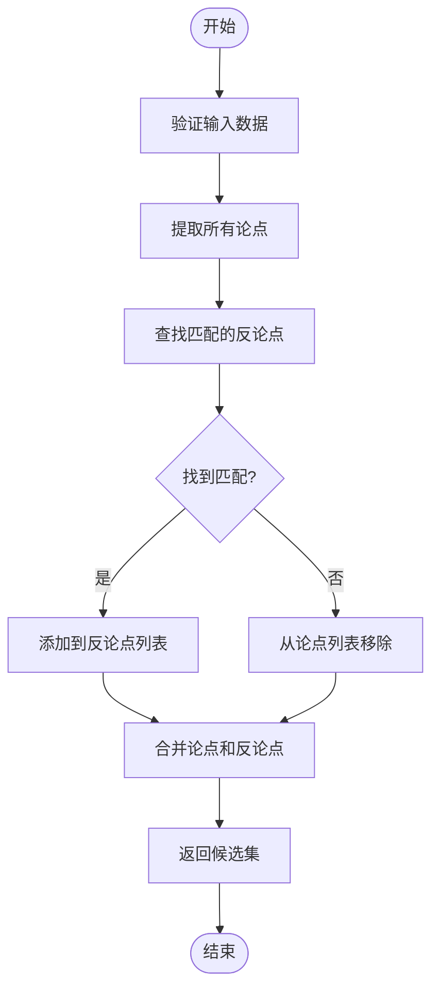

# 论点-论据集合拆分API

<cite>
**本文档引用的文件**
- [utils.py](file://utils.py#L147-L255)
- [dataloader.py](file://dataloader.py#L30-L69)
- [tasks_evaluator.py](file://bert/tasks_evaluator.py#L27-L36)
- [tasks_evaluator_util.py](file://bert/tasks_evaluator_util.py#L14-L24)
</cite>

## 目录
1. [引言](#引言)
2. [核心函数概述](#核心函数概述)
3. [split_point_argument_for_debate函数分析](#split_point_argument_for_debate函数分析)
4. [split_point_argument_for_theme函数分析](#split_point_argument_for_theme函数分析)
5. [split_point_argument_for_entire_portal函数分析](#split_point_argument_for_entire_portal函数分析)
6. [任务类型与负样本候选集构建机制](#任务类型与负样本候选集构建机制)
7. [数据完整性校验流程](#数据完整性校验流程)
8. [跨立场合并逻辑](#跨立场合并逻辑)
9. [结论](#结论)

## 引言
本项目旨在构建一个反论点检索系统，通过分析辩论数据中的论点（point）和反论点（counter）关系，为不同任务类型构建有效的负样本候选集。系统通过一系列数据处理函数，将原始数据拆分为结构化的检索池，支持多种检索任务的需求。这些函数不仅提取匹配的反论点，还将所有相关论点合并为统一的'argument'检索池，以支持更复杂的检索场景。

**Section sources**
- [README.md](file://README.md#L1-L7)

## 核心函数概述
系统提供了三个核心函数用于构建检索任务中的候选集：`split_point_argument_for_debate`、`split_point_argument_for_theme`和`split_point_argument_for_entire_portal`。这些函数均位于`utils.py`文件中，负责将原始数据按照不同的粒度和范围进行分组和拆分，从而构建适用于不同任务类型的负样本候选集。

**Diagram sources**
- [utils.py](file://utils.py#L147-L255)

**Section sources**
- [utils.py](file://utils.py#L147-L255)

## split_point_argument_for_debate函数分析
该函数用于在辩论级别构建候选集，其主要功能是将同一辩论中的论点和反论点进行匹配，并将所有相关论点合并为统一的检索池。函数首先遍历数据框中的每一行，识别出类型为'point'的论点，并尝试找到与其ID匹配的反论点。如果找到匹配的反论点，则将其加入counter列表；否则，将对应的论点从point列表中移除，确保数据完整性。

**Diagram sources**
- [utils.py](file://utils.py#L170-L192)

**Section sources**
- [utils.py](file://utils.py#L170-L192)

## split_point_argument_for_theme函数分析
该函数在主题级别构建候选集，其处理逻辑与`split_point_argument_for_debate`类似，但增加了对领域（domain）和论证标题（argumentation_title）的限制条件。这意味着反论点的匹配不仅需要ID匹配，还需要在同一主题范围内。这种设计确保了候选集的相关性和上下文一致性，适用于需要更精确匹配的任务场景。

**Diagram sources**
- [utils.py](file://utils.py#L147-L166)

**Section sources**
- [utils.py](file://utils.py#L147-L166)

## split_point_argument_for_entire_portal函数分析
该函数在整个门户级别构建候选集，其处理范围最广。与前两个函数相比，它增加了对领域和论证标题的双重限制，确保反论点的匹配在更严格的上下文条件下进行。这种设计适用于需要高度相关性的检索任务，能够有效减少噪声数据的影响。

**Diagram sources**
- [utils.py](file://utils.py#L235-L255)

**Section sources**
- [utils.py](file://utils.py#L235-L255)

## 任务类型与负样本候选集构建机制
系统支持多种任务类型，包括sda、sta、epa等，每种任务类型对应不同的分组和拆分策略。通过`group_and_split`函数，系统能够根据指定的任务级别对数据进行分组，并应用相应的拆分方法。这种机制确保了不同任务类型能够获得最适合其需求的候选集。

**Diagram sources**
- [utils.py](file://utils.py#L259-L295)

**Section sources**
- [utils.py](file://utils.py#L259-L295)

## 数据完整性校验流程
为了确保候选集的质量，系统在构建过程中实施了严格的数据完整性校验。每个函数在处理数据时都会检查论点和反论点的匹配情况，只有当存在确切匹配的反论点时，对应的论点才会被保留在最终的候选集中。这种校验机制有效避免了不完整或错误的数据对模型训练造成负面影响。

**Diagram sources**
- [utils.py](file://utils.py#L147-L255)

**Section sources**
- [utils.py](file://utils.py#L147-L255)

## 跨立场合并逻辑
系统采用跨立场合并逻辑，将不同立场的论点和反论点进行整合，构建统一的检索池。这种设计使得模型能够在更广泛的上下文中学习论点之间的关系，提高了检索的准确性和鲁棒性。通过将所有相关论点合并为'argument'检索池，系统能够支持更复杂的检索需求。

**Diagram sources**
- [utils.py](file://utils.py#L147-L255)

**Section sources**
- [utils.py](file://utils.py#L147-L255)

## 结论
通过对`split_point_argument_for_debate`、`split_point_argument_for_theme`和`split_point_argument_for_entire_portal`三个函数的分析，我们可以看到系统在构建检索任务候选集方面的精心设计。这些函数不仅能够提取匹配的反论点，还能将所有相关论点合并为统一的'argument'检索池，支持多种任务类型的需求。通过严格的分组策略、数据完整性校验和跨立场合并逻辑，系统确保了候选集的质量和相关性，为后续的模型训练和评估提供了可靠的基础。