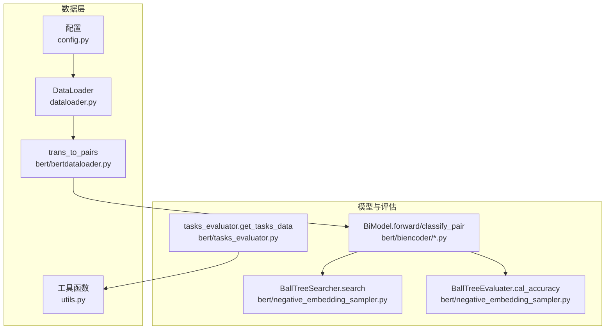
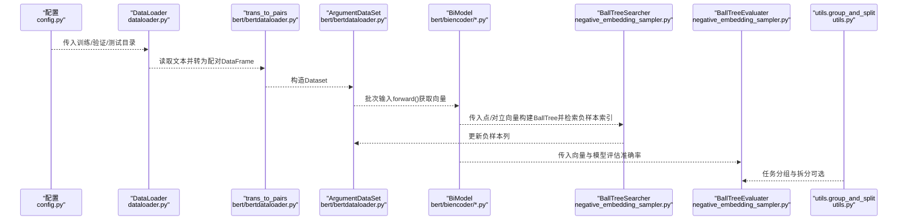
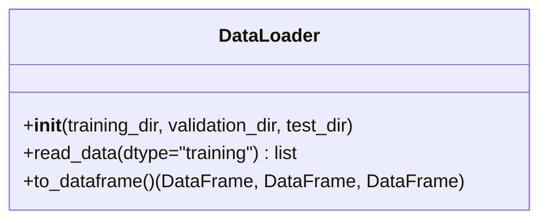
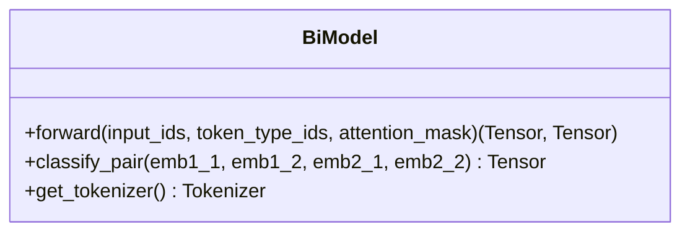
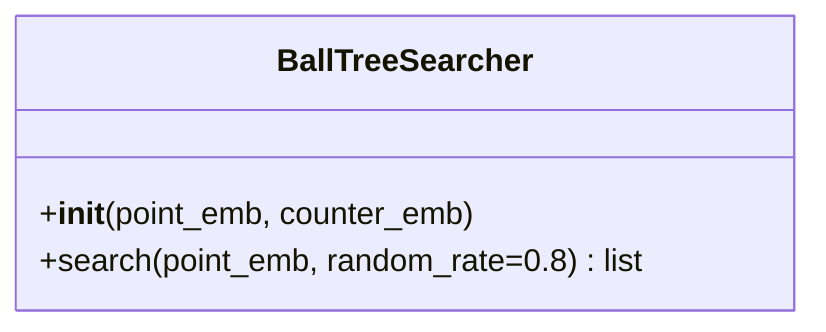
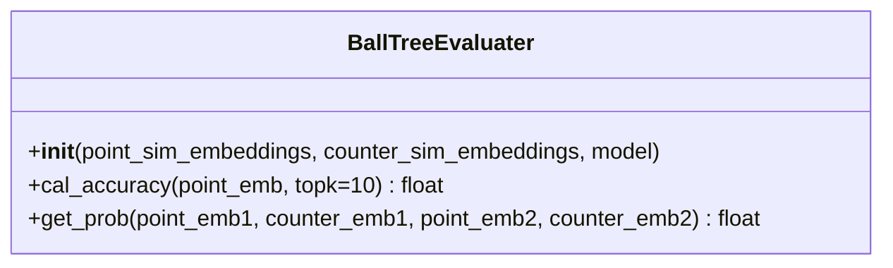
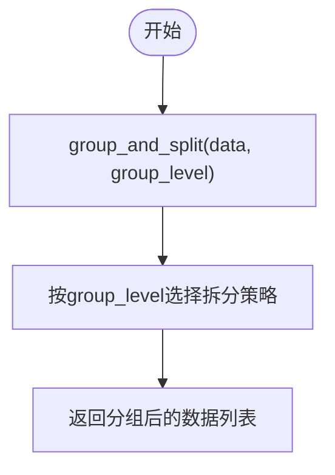
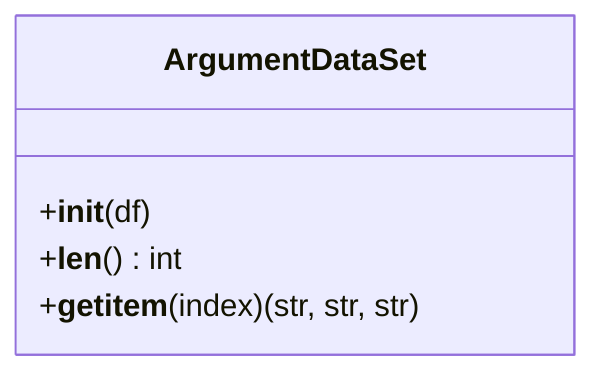
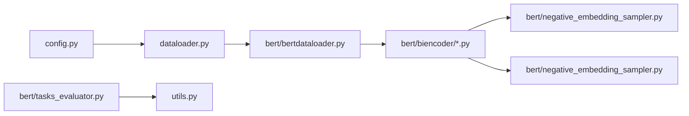

# 核心模块API

<cite>
**本文引用的文件**
- [dataloader.py](file://dataloader.py)
- [bert/negative_embedding_sampler.py](file://bert/negative_embedding_sampler.py)
- [bert/tasks_evaluator.py](file://bert/tasks_evaluator.py)
- [utils.py](file://utils.py)
- [bert/bertdataloader.py](file://bert/bertdataloader.py)
- [config.py](file://config.py)
- [README.md](file://README.md)
</cite>

## 目录
1. [简介](#简介)
2. [项目结构](#项目结构)
3. [核心组件](#核心组件)
4. [架构总览](#架构总览)
5. [详细组件分析](#详细组件分析)
6. [依赖分析](#依赖分析)
7. [性能考虑](#性能考虑)
8. [故障排查指南](#故障排查指南)
9. [结论](#结论)
10. [附录](#附录)

## 简介
本文件为项目核心模块的API参考文档，聚焦以下模块：
- DataLoader：数据加载与DataFrame转换
- BiModel（多文件定义）：双编码器模型，提供forward()、classify_pair()等接口
- BallTreeSearcher：基于BallTree的负样本检索器
- BallTreeEvaluater：基于BallTree的评估器
- utils.py：数据分组与配对工具函数
- bertdataloader.py：数据集封装与配对转换
- config.py：训练/验证/测试数据路径配置

文档将给出各模块的构造参数、方法签名、输入输出、典型调用示例与模块间依赖关系。

## 项目结构
项目采用按功能分层组织，核心模块分布如下：
- 数据加载与预处理：dataloader.py、bert/bertdataloader.py、utils.py、config.py
- 模型与评估：bert/biencoder/*.py（BiModel定义）、bert/negative_embedding_sampler.py（BallTreeSearcher/BallTreeEvaluater）、bert/tasks_evaluator.py
- 文档与配置：README.md、config.py

图表来源
- [dataloader.py](file://dataloader.py#L1-L87)
- [bert/bertdataloader.py](file://bert/bertdataloader.py#L1-L44)
- [bert/negative_embedding_sampler.py](file://bert/negative_embedding_sampler.py#L1-L92)
- [bert/tasks_evaluator.py](file://bert/tasks_evaluator.py#L1-L37)
- [utils.py](file://utils.py#L1-L304)
- [config.py](file://config.py#L1-L11)

章节来源
- [README.md](file://README.md#L1-L7)
- [config.py](file://config.py#L1-L11)

## 核心组件
本节对每个核心模块进行API级说明，包括构造参数、方法签名、输入输出与典型调用示例。

- DataLoader
  - 构造函数
    - 参数
      - training_dir: 训练集相对路径字符串
      - validation_dir: 验证集相对路径字符串
      - test_dir: 测试集相对路径字符串
    - 行为
      - 初始化时扫描指定目录，读取所有文本文件，构建训练/验证/测试数据列表
      - 自动过滤系统隐藏文件
  - 方法
    - read_data(dtype='training')
      - 输入：dtype ∈ {'training','validation','test'}
      - 输出：列表，元素为字典，包含领域、论题、立场、话语ID、话语类型、文本等字段
    - to_dataframe()
      - 输出：三个pandas DataFrame，分别对应训练/验证/测试集
  - 典型调用示例
    - 使用配置中的路径创建DataLoader实例，随后调用to_dataframe()获取DataFrame
    - 参考路径：[dataloader.py](file://dataloader.py#L1-L87)

- BiModel（在多个biencoder_*.py中定义）
  - 构造函数
    - 无显式参数；内部初始化BertModel、分词器、线性层等
  - 方法
    - forward(input_ids, token_type_ids, attention_mask)
      - 输入：张量或张量字典（如input_ids、token_type_ids、attention_mask）
      - 输出：元组(向量1, 向量2)，向量1用于相似度计算，向量2为序列输出
    - classify_pair(emb1_1, emb1_2, emb2_1, emb2_2)
      - 输入：四组向量，每组两个向量组成一对
      - 输出：分类得分（通常为二分类概率或logits）
    - get_tokenizer()
      - 输出：分词器对象
  - 典型调用示例
    - 将文本经分词器编码后传入forward()得到向量
    - 使用classify_pair()对正负样本对进行分类打分
    - 参考路径：[bert/biencoder/biencoder_embedding_classification_concanated_together.py](file://bert/biencoder/biencoder_embedding_classification_concanated_together.py#L48-L78)

- BallTreeSearcher
  - 构造函数
    - 参数
      - point_emb: 点向量集合
      - counter_emb: 对立向量集合
    - 行为
      - 基于point_emb与counter_emb分别构建BallTree索引
  - 方法
    - search(point_emb, random_rate=0.8)
      - 输入：point_emb为(index, embedding)形式，index用于避免检索到自身
      - 输出：负样本索引列表，元素为(类别, 索引)，类别0表示point，1表示counter
  - 典型调用示例
    - 传入训练批次的点向量与索引，调用search()获取负样本索引，用于替换训练数据中的负样本列
    - 参考路径：[bert/negative_embedding_sampler.py](file://bert/negative_embedding_sampler.py#L1-L92)

- BallTreeEvaluater
  - 构造函数
    - 参数
      - point_sim_embeddings: 正样本点向量集合
      - counter_sim_embeddings: 正样本对立向量集合
      - model: 已训练的BiModel实例
    - 行为
      - 将正样本向量拼接为统一嵌入空间，构建BallTree
  - 方法
    - cal_accuracy(point_emb, topk=10)
      - 输入：待评估的点向量集合
      - 输出：准确率（top-k内命中正样本的比例）
    - get_prob(point_emb1, counter_emb1, point_emb2, counter_emb2)
      - 输入：两对向量
      - 输出：正样本概率（通过model的classify_pair得到softmax后的正类概率）
  - 典型调用示例
    - 在训练/验证/测试阶段，先提取各批向量，构建Evaluater，再调用cal_accuracy评估
    - 参考路径：[bert/negative_embedding_sampler.py](file://bert/negative_embedding_sampler.py#L48-L92)

- utils.py
  - group_and_split(data, group_level)
    - 输入：DataFrame，group_level ∈ {'sdoc','sdoa','sdc','sda','stc','sta','epc','epa'}
    - 输出：分组并拆分后的数据列表（按不同粒度与规则）
  - trans_to_pairs(df)
    - 输入：DataFrame，包含point_text、counter_text等列
    - 输出：按话语ID聚合后的配对DataFrame
  - 其他工具函数
    - 提供多种按领域、主题、立场等维度的数据分组与拆分策略
  - 典型调用示例
    - 先用trans_to_pairs将原始数据转为配对格式，再用group_and_split按任务级别分组
    - 参考路径：[bert/bertdataloader.py](file://bert/bertdataloader.py#L12-L25)、[utils.py](file://utils.py#L257-L304)

- bertdataloader.py
  - trans_to_pairs(df)
    - 行为：按(domain, title, utterence_id, stance)分组，将同一ID下的point与counter合并为一行
  - ArgumentDataSet
    - 构造函数：接收DataFrame，保存point、counter、negative_text列
    - __getitem__(index)：返回(point_text, counter_text, negative_text)
  - 典型调用示例
    - 将DataLoader生成的DataFrame经trans_to_pairs转换后构造Dataset
    - 参考路径：[bert/bertdataloader.py](file://bert/bertdataloader.py#L1-L44)

- config.py
  - 定义训练/验证/测试数据目录常量
  - 典型调用示例
    - DataLoader构造时传入这些常量作为路径
    - 参考路径：[config.py](file://config.py#L1-L11)

章节来源
- [dataloader.py](file://dataloader.py#L1-L87)
- [bert/negative_embedding_sampler.py](file://bert/negative_embedding_sampler.py#L1-L92)
- [utils.py](file://utils.py#L257-L304)
- [bert/bertdataloader.py](file://bert/bertdataloader.py#L1-L44)
- [config.py](file://config.py#L1-L11)

## 架构总览
下图展示从数据加载到模型训练与评估的整体流程，以及各模块之间的依赖关系。

图表来源
- [config.py](file://config.py#L1-L11)
- [dataloader.py](file://dataloader.py#L1-L87)
- [bert/bertdataloader.py](file://bert/bertdataloader.py#L1-L44)
- [bert/negative_embedding_sampler.py](file://bert/negative_embedding_sampler.py#L1-L92)
- [utils.py](file://utils.py#L257-L304)

## 详细组件分析

### DataLoader 类
- 结构与职责
  - 负责扫描指定目录，读取文本文件，构建训练/验证/测试数据列表
  - 提供to_dataframe()将内部数据转换为pandas DataFrame
- 关键方法
  - read_data(dtype='training'): 返回字典列表，包含领域、论题、立场、话语ID、话语类型、文本等字段
  - to_dataframe(): 返回训练/验证/测试三个DataFrame
- 调用示例
  - 创建DataLoader实例，随后调用to_dataframe()获取DataFrame
  - 参考路径：[dataloader.py](file://dataloader.py#L1-L87)

图表来源
- [dataloader.py](file://dataloader.py#L1-L87)

章节来源
- [dataloader.py](file://dataloader.py#L1-L87)

### BiModel 类族（在多个biencoder_*.py中定义）
- 结构与职责
  - 双编码器模型，使用BERT作为编码器，提供forward()与classify_pair()等接口
  - forward()返回可用于相似度计算与序列输出的向量
  - classify_pair()对两对向量进行拼接与差异计算，输出分类结果
- 关键方法
  - forward(input_ids, token_type_ids, attention_mask)
    - 输入：张量或张量字典
    - 输出：(向量1, 向量2)
  - classify_pair(emb1_1, emb1_2, emb2_1, emb2_2)
    - 输入：四组向量
    - 输出：分类得分
  - get_tokenizer()
    - 输出：分词器对象
- 调用示例
  - 分词器编码文本后传入forward()获取向量
  - 使用classify_pair()对正负样本对进行分类打分
  - 参考路径：[bert/biencoder/biencoder_embedding_classification_concanated_together.py](file://bert/biencoder/biencoder_embedding_classification_concanated_together.py#L48-L78)

图表来源
- [bert/biencoder/biencoder_embedding_classification_concanated_together.py](file://bert/biencoder/biencoder_embedding_classification_concanated_together.py#L48-L78)

章节来源
- [bert/biencoder/biencoder_embedding_classification_concanated_together.py](file://bert/biencoder/biencoder_embedding_classification_concanated_together.py#L48-L78)

### BallTreeSearcher 类
- 结构与职责
  - 基于BallTree对点向量与对立向量进行检索，支持按比例随机采样
- 关键方法
  - search(point_emb, random_rate=0.8)
    - 输入：(index, embedding)形式的点向量
    - 输出：负样本索引列表，元素为(类别, 索引)
- 调用示例
  - 传入训练批次的点向量与索引，调用search()获取负样本索引，更新训练数据中的负样本列
  - 参考路径：[bert/negative_embedding_sampler.py](file://bert/negative_embedding_sampler.py#L1-L92)

图表来源
- [bert/negative_embedding_sampler.py](file://bert/negative_embedding_sampler.py#L1-L92)

章节来源
- [bert/negative_embedding_sampler.py](file://bert/negative_embedding_sampler.py#L1-L92)

### BallTreeEvaluater 类
- 结构与职责
  - 基于BallTree对向量进行检索，结合BiModel的分类接口计算正样本概率，评估准确率
- 关键方法
  - cal_accuracy(point_emb, topk=10)
    - 输入：待评估的点向量集合
    - 输出：准确率
  - get_prob(point_emb1, counter_emb1, point_emb2, counter_emb2)
    - 输入：两对向量
    - 输出：正样本概率
- 调用示例
  - 在训练/验证/测试阶段，先提取各批向量，构建Evaluater，再调用cal_accuracy评估
  - 参考路径：[bert/negative_embedding_sampler.py](file://bert/negative_embedding_sampler.py#L48-L92)

图表来源
- [bert/negative_embedding_sampler.py](file://bert/negative_embedding_sampler.py#L48-L92)

章节来源
- [bert/negative_embedding_sampler.py](file://bert/negative_embedding_sampler.py#L48-L92)

### utils.py 工具函数
- group_and_split(data, group_level)
  - 输入：DataFrame，group_level ∈ {'sdoc','sdoa','sdc','sda','stc','sta','epc','epa'}
  - 输出：分组并拆分后的数据列表
- trans_to_pairs(df)
  - 输入：DataFrame，包含point_text、counter_text等列
  - 输出：按话语ID聚合后的配对DataFrame
- 典型调用示例
  - 先用trans_to_pairs将原始数据转为配对格式，再用group_and_split按任务级别分组
  - 参考路径：[bert/bertdataloader.py](file://bert/bertdataloader.py#L12-L25)、[utils.py](file://utils.py#L257-L304)

图表来源
- [utils.py](file://utils.py#L257-L304)
- [bert/bertdataloader.py](file://bert/bertdataloader.py#L12-L25)

章节来源
- [utils.py](file://utils.py#L257-L304)
- [bert/bertdataloader.py](file://bert/bertdataloader.py#L12-L25)

### bertdataloader.py 数据集与配对转换
- trans_to_pairs(df)
  - 行为：按(domain, title, utterence_id, stance)分组，将同一ID下的point与counter合并为一行
- ArgumentDataSet
  - 构造函数：接收DataFrame，保存point、counter、negative_text列
  - __getitem__(index)：返回(point_text, counter_text, negative_text)
- 典型调用示例
  - 将DataLoader生成的DataFrame经trans_to_pairs转换后构造Dataset
  - 参考路径：[bert/bertdataloader.py](file://bert/bertdataloader.py#L1-L44)

图表来源
- [bert/bertdataloader.py](file://bert/bertdataloader.py#L30-L44)

章节来源
- [bert/bertdataloader.py](file://bert/bertdataloader.py#L1-L44)

## 依赖分析
- DataLoader 依赖 config.py 中的训练/验证/测试目录常量
- bert/bertdataloader.py 的 trans_to_pairs 依赖 pandas 进行分组与聚合
- BiModel 依赖 transformers.BertModel 与 BertTokenizer
- BallTreeSearcher/BallTreeEvaluater 依赖 scikit-learn 的 BallTree
- tasks_evaluator.py 依赖 utils.group_and_split 与 BertTokenizer

图表来源
- [config.py](file://config.py#L1-L11)
- [dataloader.py](file://dataloader.py#L1-L87)
- [bert/bertdataloader.py](file://bert/bertdataloader.py#L1-L44)
- [bert/negative_embedding_sampler.py](file://bert/negative_embedding_sampler.py#L1-L92)
- [bert/tasks_evaluator.py](file://bert/tasks_evaluator.py#L1-L37)
- [utils.py](file://utils.py#L257-L304)

章节来源
- [config.py](file://config.py#L1-L11)
- [dataloader.py](file://dataloader.py#L1-L87)
- [bert/bertdataloader.py](file://bert/bertdataloader.py#L1-L44)
- [bert/negative_embedding_sampler.py](file://bert/negative_embedding_sampler.py#L1-L92)
- [bert/tasks_evaluator.py](file://bert/tasks_evaluator.py#L1-L37)
- [utils.py](file://utils.py#L257-L304)

## 性能考虑
- DataLoader
  - 文件扫描与读取为O(N)操作，N为文件总数；建议确保数据目录结构规范，避免过多隐藏文件干扰
- BiModel
  - forward()与classify_pair()涉及大量张量运算，建议使用GPU加速；DataParallel可提升吞吐
- BallTreeSearcher/BallTreeEvaluater
  - BallTree查询复杂度近似O(log N)；大规模向量时建议合理设置leaf_size与k值
- utils.py
  - group_and_split依赖pandas分组与聚合，注意内存占用；对超大数据集可考虑分块处理

## 故障排查指南
- DataLoader
  - 若读取不到数据，请检查config.py中的目录路径是否正确，且目标目录存在
  - 若出现异常，检查文件夹中是否存在系统隐藏文件导致列表异常
- BiModel
  - forward()输入形状不匹配会导致报错；请确保分词器输出的input_ids、token_type_ids、attention_mask形状一致
  - classify_pair()输入维度需与模型定义一致
- BallTreeSearcher/BallTreeEvaluater
  - 若BallTree构建失败，检查point_emb与counter_emb是否为空或维度不一致
  - search()返回的负样本索引越界时，检查index与embedding长度是否一致
- utils.py
  - trans_to_pairs()可能因缺失列而报错；请确保DataFrame包含point_text、counter_text等列
  - group_and_split()的group_level必须在支持范围内

章节来源
- [dataloader.py](file://dataloader.py#L1-L87)
- [bert/negative_embedding_sampler.py](file://bert/negative_embedding_sampler.py#L1-L92)
- [utils.py](file://utils.py#L257-L304)

## 结论
本文档梳理了项目核心模块的API与调用方式，明确了DataLoader、BiModel、BallTreeSearcher、BallTreeEvaluater、utils.py、bertdataloader.py与config.py之间的依赖关系。通过遵循本文提供的参数、输入输出与典型调用示例，可以高效地完成数据加载、模型训练与评估工作。

## 附录
- 实际调用示例路径
  - DataLoader.to_dataframe()：[dataloader.py](file://dataloader.py#L71-L75)
  - BiModel.forward()/classify_pair()：[bert/biencoder/biencoder_embedding_classification_concanated_together.py](file://bert/biencoder/biencoder_embedding_classification_concanated_together.py#L59-L74)
  - BallTreeSearcher.search()：[bert/negative_embedding_sampler.py](file://bert/negative_embedding_sampler.py#L20-L46)
  - BallTreeEvaluater.cal_accuracy()/get_prob()：[bert/negative_embedding_sampler.py](file://bert/negative_embedding_sampler.py#L61-L91)
  - utils.group_and_split()/trans_to_pairs()：[utils.py](file://utils.py#L292-L295)、[bert/bertdataloader.py](file://bert/bertdataloader.py#L12-L25)