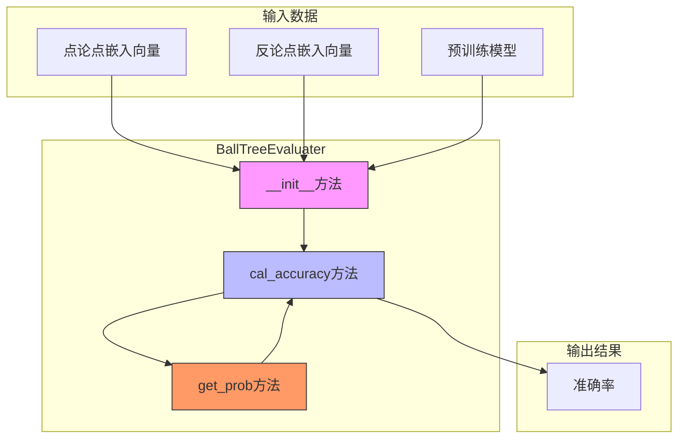
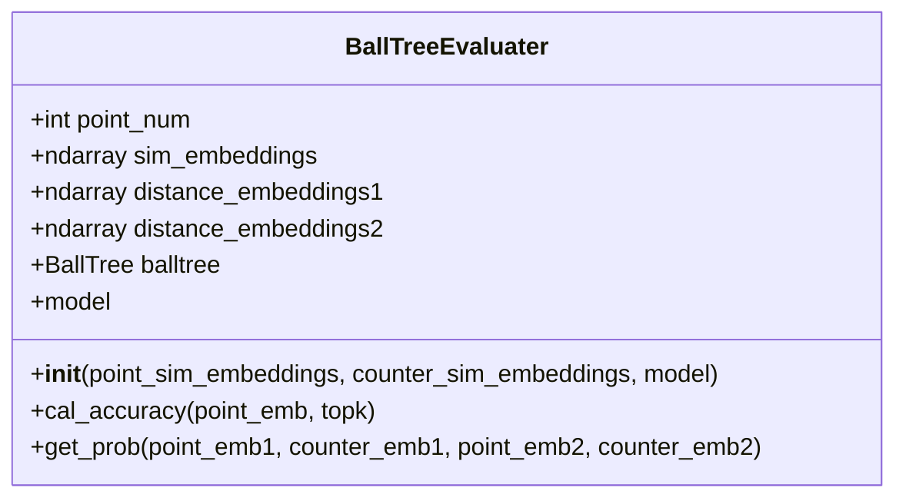
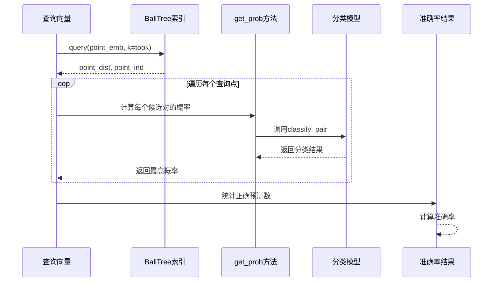
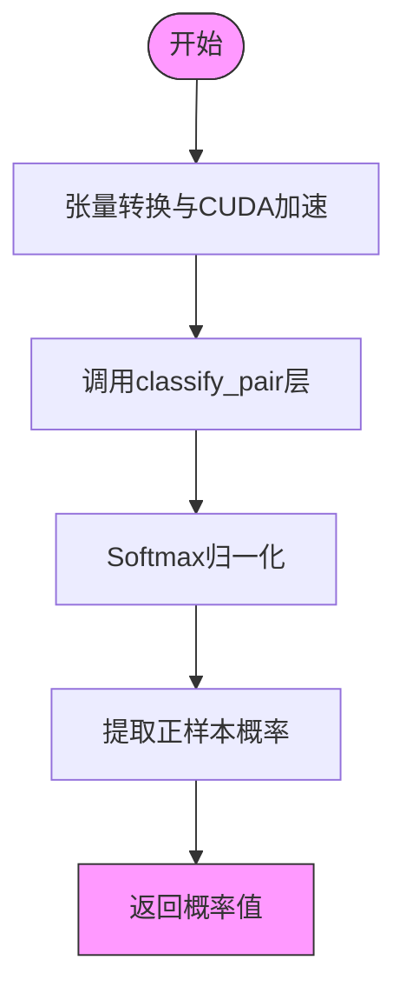
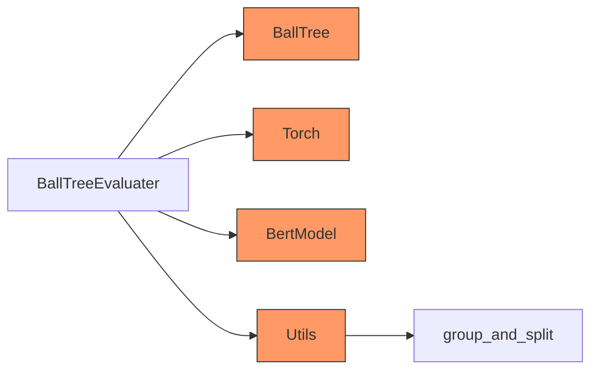

# BallTreeEvaluater API

<cite>
**本文档中引用的文件**  
- [negative_embedding_sampler.py](file://bert/negative_embedding_sampler.py)
- [tasks_evaluator_util.py](file://bert/tasks_evaluator_util.py)
- [biencoder_embedding_classification_concanated_together.py](file://bert/biencoder/biencoder_embedding_classification_concanated_together.py)
- [tasks_evaluator.py](file://bert/tasks_evaluator.py)
- [utils.py](file://utils.py)
</cite>

## 目录
1. [简介](#简介)
2. [核心组件](#核心组件)
3. [架构概述](#架构概述)
4. [详细组件分析](#详细组件分析)
5. [依赖分析](#依赖分析)
6. [性能考量](#性能考量)
7. [故障排除指南](#故障排除指南)
8. [结论](#结论)

## 简介
BallTreeEvaluater类是用于评估对抗性论点检索模型性能的核心组件。该类通过构建BallTree索引结构，实现高效的top-k相似性检索，并结合深度学习模型对候选样本对进行打分，最终计算准确率指标。本API文档详细说明了其初始化过程、核心方法的工作流程以及在多任务评估中的实际应用。

## 核心组件
BallTreeEvaluater类主要由三个核心方法构成：`__init__`用于初始化相似性搜索空间和BallTree索引；`cal_accuracy`用于执行top-k检索并计算准确率；`get_prob`利用模型的分类头对样本对进行匹配概率计算。这些组件共同构成了一个高效的评估框架，支持跨任务的准确率评估。

**Section sources**
- [negative_embedding_sampler.py](file://bert/negative_embedding_sampler.py#L48-L92)

## 架构概述
BallTreeEvaluater的架构设计融合了近似最近邻搜索与深度学习分类的优势。系统首先将点论点（point）和反论点（counter）的嵌入向量统一构建为BallTree索引，然后通过该索引快速检索top-k最相似的候选样本。随后，利用预训练模型的分类头（classify_pair）对检索到的样本对进行精细化打分，最终确定最可能的匹配项并计算准确率。

**Diagram sources**
- [negative_embedding_sampler.py](file://bert/negative_embedding_sampler.py#L48-L92)

## 详细组件分析

### 初始化方法分析
`__init__`方法接收三个关键参数：`point_sim_embeddings`、`counter_sim_embeddings`和`model`。它首先将点论点和反论点的嵌入向量沿第一轴拼接，构建统一的相似性搜索空间。然后使用该空间初始化BallTree索引，以支持高效的top-k检索。同时，该方法还构建了两组距离嵌入向量（`distance_embeddings1`和`distance_embeddings2`），用于后续的精细化匹配概率计算。

**Diagram sources**
- [negative_embedding_sampler.py](file://bert/negative_embedding_sampler.py#L48-L58)

### 准确率计算方法分析
`cal_accuracy`方法是评估系统的核心。它接收查询向量`point_emb`和top-k参数，通过BallTree索引执行top-k检索。对于每个查询点，系统遍历其k个最近邻候选，调用`get_prob`方法计算每个候选样本对的匹配概率。系统选择概率最高的候选作为预测结果，并与真实标签比较以统计准确率。该方法实现了检索与重排序的联合优化。

**Diagram sources**
- [negative_embedding_sampler.py](file://bert/negative_embedding_sampler.py#L61-L78)

### 概率计算方法分析
`get_prob`方法负责利用模型的分类头对样本对进行精细化打分。该方法接收四组嵌入向量（来自两组不同的编码层），将其转换为PyTorch张量并移至CUDA设备以加速计算。然后调用模型的`classify_pair`层进行前向传播，该层将四个嵌入向量拼接并计算差异特征。最后，通过Softmax函数归一化输出，并返回正样本的概率值。

**Diagram sources**
- [negative_embedding_sampler.py](file://bert/negative_embedding_sampler.py#L80-L91)

## 依赖分析
BallTreeEvaluater类依赖于多个关键组件：`sklearn.neighbors.BallTree`提供高效的近似最近邻搜索能力；`torch`框架支持张量操作和CUDA加速；`BertModel`及其变体提供深度语义表示能力。此外，该类还与`utils.py`中的数据分组函数紧密协作，支持多任务评估场景。

**Diagram sources**
- [go.mod](file://go.mod#L1-L20)
- [negative_embedding_sampler.py](file://bert/negative_embedding_sampler.py#L6)
- [utils.py](file://utils.py#L292-L295)

**Section sources**
- [negative_embedding_sampler.py](file://bert/negative_embedding_sampler.py#L6)
- [utils.py](file://utils.py#L292-L295)

## 性能考量
BallTreeEvaluater在设计上充分考虑了性能优化。BallTree索引的构建时间复杂度为O(n log n)，查询时间复杂度为O(log n)，确保了大规模数据集上的高效检索。`get_prob`方法通过批量张量操作和CUDA加速，显著提升了概率计算速度。然而，top-k参数的选择对性能有直接影响：较大的k值会增加计算负担，但可能提高准确率；较小的k值则相反。建议根据具体应用场景进行权衡。

## 故障排除指南
在使用BallTreeEvaluater时可能遇到的常见问题包括：CUDA内存不足、嵌入向量维度不匹配、BallTree查询异常等。建议检查模型是否正确加载到GPU，确保输入嵌入向量的形状一致，并验证BallTree索引的构建过程。对于多任务评估，需确认`group_and_split`函数正确划分了数据组。

**Section sources**
- [negative_embedding_sampler.py](file://bert/negative_embedding_sampler.py#L48-L92)
- [utils.py](file://utils.py#L292-L295)

## 结论
BallTreeEvaluater类提供了一个高效且灵活的框架，用于评估对抗性论点检索模型的性能。通过结合BallTree的快速检索能力和深度学习模型的精细化打分，该系统能够在大规模数据集上实现准确的top-k评估。其模块化设计支持多种任务场景，为模型优化提供了可靠的评估基准。