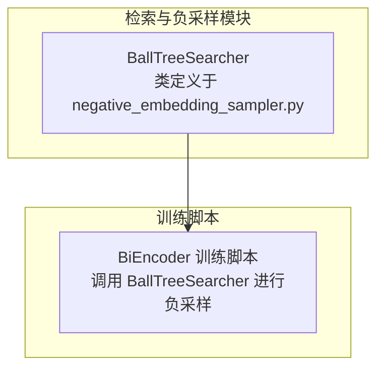
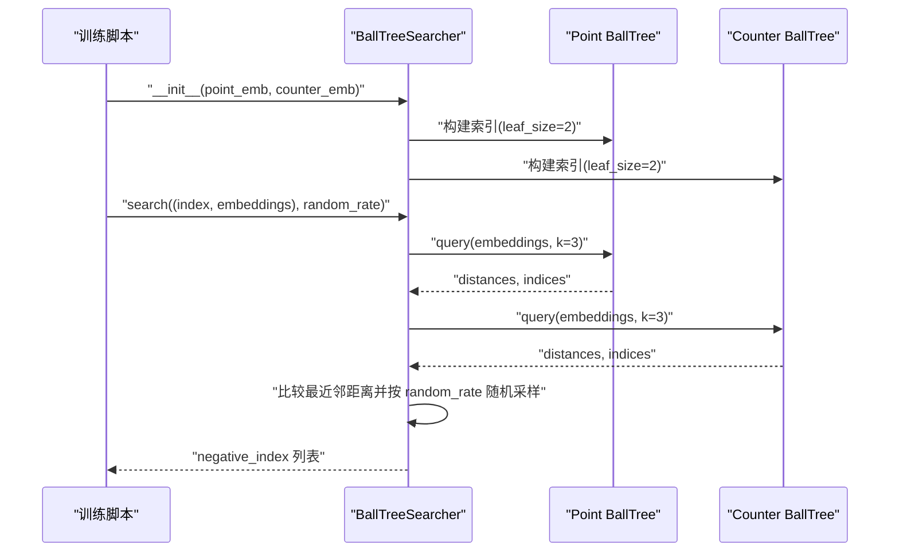
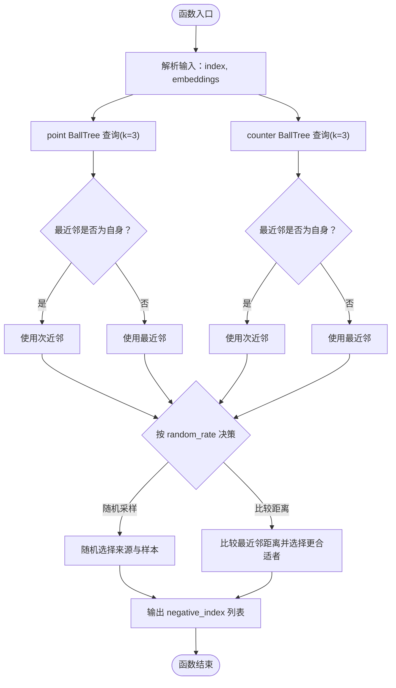
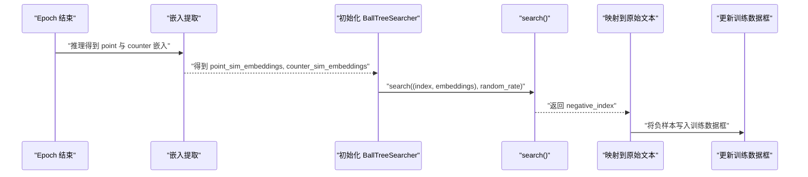
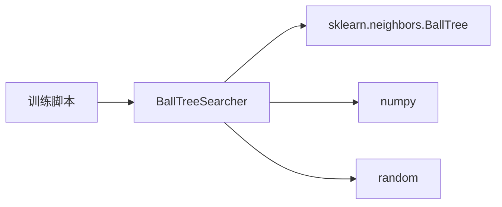

# BallTreeSearcher API

<cite>
**本文引用的文件**
- [negative_embedding_sampler.py](file://bert/negative_embedding_sampler.py)
- [biencoder_embedding_classification_concanated_together.py](file://bert/biencoder/biencoder_embedding_classification_concanated_together.py)
</cite>

## 目录
1. [简介](#简介)
2. [项目结构](#项目结构)
3. [核心组件](#核心组件)
4. [架构总览](#架构总览)
5. [详细组件分析](#详细组件分析)
6. [依赖关系分析](#依赖关系分析)
7. [性能考虑](#性能考虑)
8. [故障排查指南](#故障排查指南)
9. [结论](#结论)
10. [附录](#附录)

## 简介
本文件为 BallTreeSearcher 类提供详细的 API 文档，聚焦以下目标：
- 解释 __init__ 如何接收两个嵌入集合并构建两个 BallTree 索引，用于高效近邻搜索；
- 深入说明 search() 方法的输入输出、参数设计与混合采样策略；
- 给出在训练循环中动态更新负样本的使用示例，包括避免采样到自身样本的逻辑；
- 提供性能优化建议，特别是 leaf_size 参数对搜索效率的影响。

## 项目结构
BallTreeSearcher 位于检索与负采样模块中，配合 BiEncoder 训练流程使用。其直接依赖 sklearn.neighbors.BallTree 进行高效 k 近邻查询。

**图表来源**
- [negative_embedding_sampler.py](file://bert/negative_embedding_sampler.py#L12-L47)
- [biencoder_embedding_classification_concanated_together.py](file://bert/biencoder/biencoder_embedding_classification_concanated_together.py#L110-L204)

**章节来源**
- [negative_embedding_sampler.py](file://bert/negative_embedding_sampler.py#L1-L92)
- [biencoder_embedding_classification_concanated_together.py](file://bert/biencoder/biencoder_embedding_classification_concanated_together.py#L110-L204)

## 核心组件
BallTreeSearcher 是一个基于 BallTree 的近邻搜索器，支持从两个嵌入集合（point 与 counter）中为每个查询向量挑选合适的负样本。其关键点如下：
- 初始化：接收两个嵌入数组，分别构建 BallTree 索引，默认 leaf_size=2。
- 查询：对输入的查询向量进行 k 近邻搜索（k=3），结合“最近邻距离比较”与“随机采样”策略，返回负样本索引及来源类型。

**章节来源**
- [negative_embedding_sampler.py](file://bert/negative_embedding_sampler.py#L12-L47)

## 架构总览
BallTreeSearcher 在训练脚本中被调用，用于在每个 epoch 结束后重新抽取负样本，提升模型鲁棒性与泛化能力。

**图表来源**
- [negative_embedding_sampler.py](file://bert/negative_embedding_sampler.py#L12-L47)
- [biencoder_embedding_classification_concanated_together.py](file://bert/biencoder/biencoder_embedding_classification_concanated_together.py#L110-L204)

## 详细组件分析

### BallTreeSearcher.__init__
- 输入
  - point_emb：point 嵌入数组
  - counter_emb：counter 嵌入数组
- 行为
  - 将两个嵌入数组保存为实例属性
  - 分别以 leaf_size=2 构建 BallTree 索引，用于后续高效查询
- 复杂度
  - 构建时间复杂度与数据规模成正比，查询阶段使用 BallTree 近似 O(log n) 每查询

**章节来源**
- [negative_embedding_sampler.py](file://bert/negative_embedding_sampler.py#L12-L20)

### BallTreeSearcher.search
- 输入
  - point_emb：二元组 (index, embedding)，其中 index 用于避免采样到自身，embedding 用于查询
  - random_rate：随机采样比例，范围通常在 [0,1]，越大越倾向于随机采样
- 输出
  - negative_index：列表，元素为 (type, index) 元组
    - type=0：来自 point 集合的负样本
    - type=1：来自 counter 集合的负样本
- 逻辑要点
  - 对每个查询向量执行 k=3 的近邻搜索，得到 point 与 counter 的候选近邻
  - 避免采样到自身：若最近邻即为自身，则取次近邻（top1 时跳过）
  - 混合采样策略：
    - 以概率 random_rate 决定是否采用“最近邻距离比较”策略：比较 point 与 counter 的最近邻距离，选择更合适的负样本
    - 否则进行随机采样：随机选择来源（point 或 counter）与对应集合中的一个样本
- 返回值
  - 返回与输入同长度的 negative_index 列表，便于后续映射到原始文本或样本

**图表来源**
- [negative_embedding_sampler.py](file://bert/negative_embedding_sampler.py#L20-L46)

**章节来源**
- [negative_embedding_sampler.py](file://bert/negative_embedding_sampler.py#L20-L46)

### 训练循环中的使用示例
- 训练脚本在每个 epoch 结束后，会：
  - 从模型推理得到 point 与 counter 的嵌入表示
  - 将这些嵌入拼接为数组，作为新的 point_sim_embeddings 与 counter_sim_embeddings
  - 使用这些数组初始化 BallTreeSearcher
  - 调用 search() 获取负样本索引 negative_index
  - 将 negative_index 映射回原始文本列，更新训练数据框中的负样本列
- 动态更新策略
  - 通过在 search() 中传入随 epoch 递减的 random_rate，逐步降低随机性，提升稳定性
  - 示例路径：[训练脚本中初始化与调用 search() 的位置](file://bert/biencoder/biencoder_embedding_classification_concanated_together.py#L110-L204)

**图表来源**
- [biencoder_embedding_classification_concanated_together.py](file://bert/biencoder/biencoder_embedding_classification_concanated_together.py#L110-L204)

**章节来源**
- [biencoder_embedding_classification_concanated_together.py](file://bert/biencoder/biencoder_embedding_classification_concanated_together.py#L110-L204)

## 依赖关系分析
- 外部依赖
  - sklearn.neighbors.BallTree：用于构建与查询 BallTree
  - numpy：用于数组拼接与索引操作
  - random：用于按概率进行随机采样
- 内部耦合
  - BallTreeSearcher 仅依赖上述外部库，内部逻辑清晰，耦合度低
  - 与训练脚本之间通过函数调用解耦，便于替换或扩展

**图表来源**
- [negative_embedding_sampler.py](file://bert/negative_embedding_sampler.py#L1-L11)
- [biencoder_embedding_classification_concanated_together.py](file://bert/biencoder/biencoder_embedding_classification_concanated_together.py#L110-L204)

**章节来源**
- [negative_embedding_sampler.py](file://bert/negative_embedding_sampler.py#L1-L11)
- [biencoder_embedding_classification_concanated_together.py](file://bert/biencoder/biencoder_embedding_classification_concanated_together.py#L110-L204)

## 性能考虑
- leaf_size 参数
  - 默认值为 2，适合较小数据集或追求查询精度的场景
  - 较大的 leaf_size 可减少树深度，提高查询速度，但可能牺牲少量精度
  - 建议根据数据规模与内存预算进行权衡：数据量大且内存充足时可适当增大 leaf_size
- k 值
  - 当前固定为 3，兼顾了“最近邻距离比较”的可靠性与查询开销
  - 若对召回质量要求更高，可适度增大 k，但会增加查询时间
- 随机率 random_rate
  - 在训练过程中动态调整 random_rate 可平衡探索与利用
  - 初期较高有助于多样性，后期降低有助于稳定收敛

[本节为通用性能建议，不直接分析具体文件]

## 故障排查指南
- 采样到自身
  - 现有逻辑会在最近邻为自身时跳过，转而使用次近邻，确保不会采样到自身
  - 若出现异常，检查输入 index 是否与查询向量一一对应
- 随机性不足或过度
  - 若 random_rate 设置过高，可能导致负样本多样性不足；过低则可能影响模型鲁棒性
  - 建议在训练初期设置较高 random_rate，随后线性递减
- 数据规模与内存
  - BallTree 构建与查询的时间复杂度与数据规模相关
  - 若内存紧张，可考虑分批构建索引或降低 leaf_size 以减少内存占用
- 索引一致性
  - 更新负样本前需确保 point_sim_embeddings 与 counter_sim_embeddings 与当前模型参数一致
  - 参考训练脚本中的嵌入提取与拼接流程

**章节来源**
- [negative_embedding_sampler.py](file://bert/negative_embedding_sampler.py#L20-L46)
- [biencoder_embedding_classification_concanated_together.py](file://bert/biencoder/biencoder_embedding_classification_concanated_together.py#L170-L204)

## 结论
BallTreeSearcher 提供了高效的近邻搜索与混合采样机制，能够结合“最近邻距离比较”与“随机采样”，在保证负样本质量的同时引入必要的随机性，提升模型鲁棒性。通过在训练循环中动态更新负样本与调整随机率，可实现更好的训练效果。建议根据数据规模与资源情况合理设置 leaf_size 与 k 值，并在训练过程中动态调节 random_rate。

[本节为总结性内容，不直接分析具体文件]

## 附录
- API 概览
  - __init__(point_emb, counter_emb)
    - 作用：保存嵌入并构建 BallTree 索引
    - 参数：point_emb、counter_emb
  - search(point_emb, random_rate=0.8)
    - 作用：为每个查询向量选择负样本
    - 参数：point_emb=(index, embeddings)、random_rate
    - 返回：negative_index 列表，元素为 (type, index)

**章节来源**
- [negative_embedding_sampler.py](file://bert/negative_embedding_sampler.py#L12-L47)