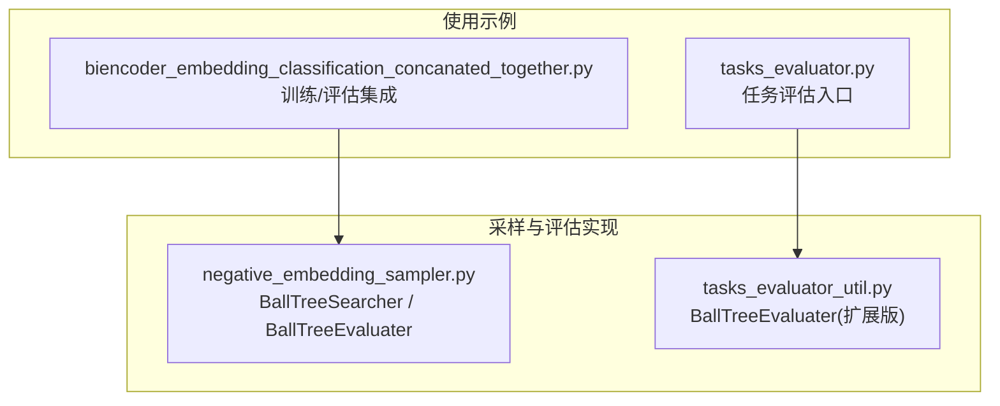
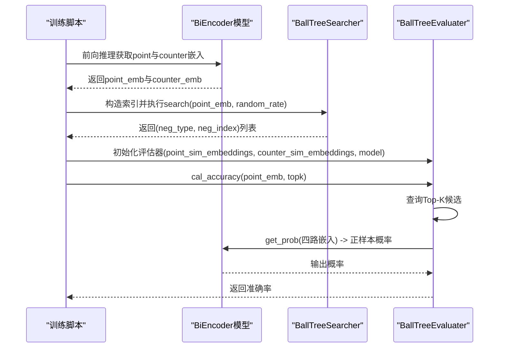
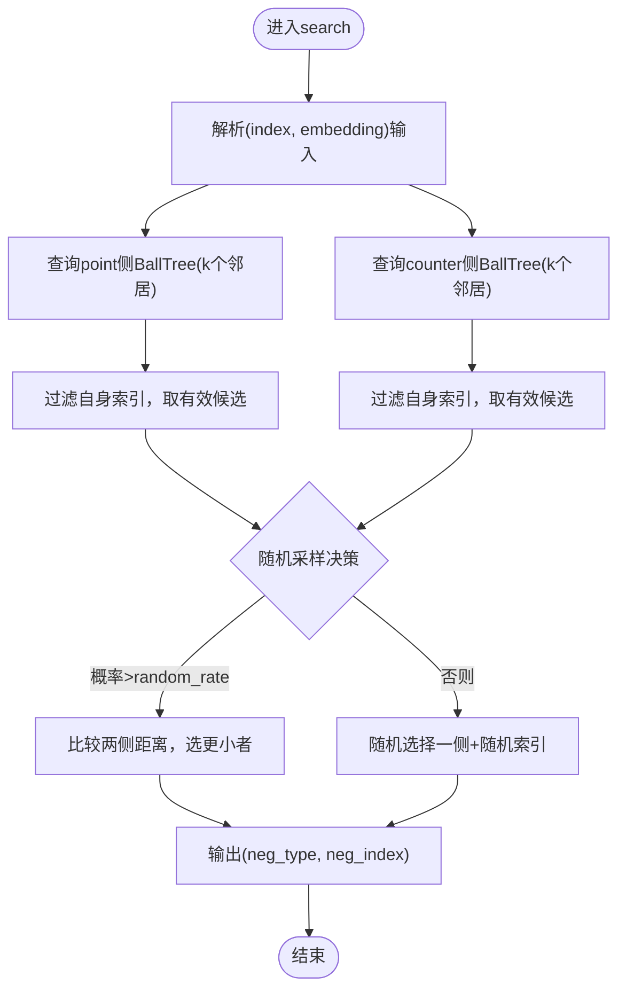
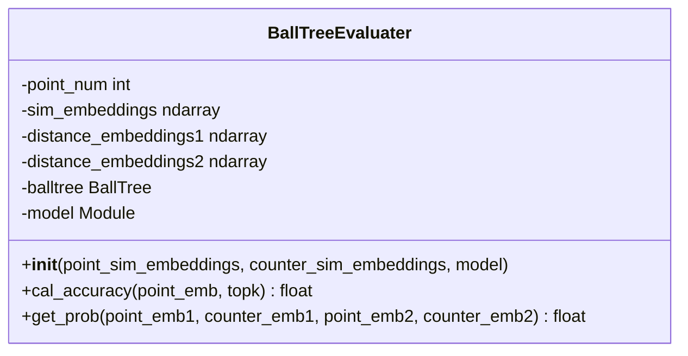
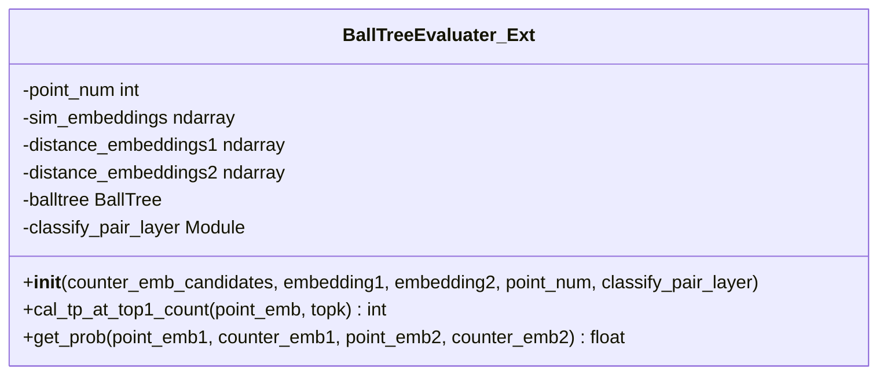
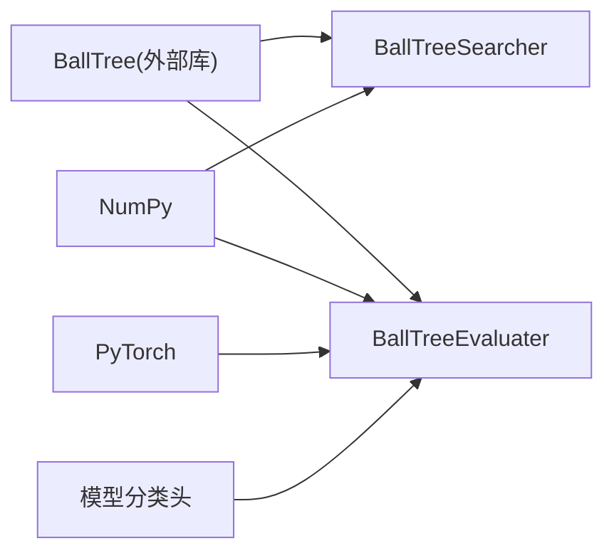

# 负样本采样器API

<cite>
**本文引用的文件**
- [negative_embedding_sampler.py](file://bert/negative_embedding_sampler.py)
- [tasks_evaluator_util.py](file://bert/tasks_evaluator_util.py)
- [biencoder_embedding_classification_concanated_together.py](file://bert/model_structure_with_different_random_rate/biencoder_embedding_classification_concanated_together.py)
- [tasks_evaluator.py](file://bert/tasks_evaluator.py)
</cite>

## 目录
1. [简介](#简介)
2. [项目结构](#项目结构)
3. [核心组件](#核心组件)
4. [架构总览](#架构总览)
5. [详细组件分析](#详细组件分析)
6. [依赖关系分析](#依赖关系分析)
7. [性能考量](#性能考量)
8. [故障排查指南](#故障排查指南)
9. [结论](#结论)
10. [附录](#附录)

## 简介
本文件面向“负样本采样与评估”相关的核心类，提供API级文档与使用说明。重点覆盖以下两个类：
- BallTreeSearcher：基于BallTree索引的混合负样本采样器，结合最近邻搜索与随机采样策略，输出负样本索引。
- BallTreeEvaluater：基于BallTree的评估器，用于计算模型在检索空间内的准确率，并通过模型分类头评估样本对的可能性。

文档将从接口定义、参数说明、返回值、内部流程、典型使用场景等方面进行系统化阐述，并辅以图示帮助理解。

## 项目结构
围绕负样本采样与评估的相关文件组织如下：
- 负样本采样与评估实现：bert/negative_embedding_sampler.py
- 评估器扩展实现（另一套实现）：bert/tasks_evaluator_util.py
- 使用示例与训练循环集成：bert/model_structure_with_different_random_rate/biencoder_embedding_classification_concanated_together.py
- 任务评估入口与辅助工具：bert/tasks_evaluator.py

图表来源
- [negative_embedding_sampler.py](file://bert/negative_embedding_sampler.py#L1-L92)
- [tasks_evaluator_util.py](file://bert/tasks_evaluator_util.py#L1-L101)
- [biencoder_embedding_classification_concanated_together.py](file://bert/model_structure_with_different_random_rate/biencoder_embedding_classification_concanated_together.py#L1-L284)
- [tasks_evaluator.py](file://bert/tasks_evaluator.py#L1-L37)

章节来源
- [negative_embedding_sampler.py](file://bert/negative_embedding_sampler.py#L1-L92)
- [tasks_evaluator_util.py](file://bert/tasks_evaluator_util.py#L1-L101)
- [biencoder_embedding_classification_concanated_together.py](file://bert/model_structure_with_different_random_rate/biencoder_embedding_classification_concanated_together.py#L1-L284)
- [tasks_evaluator.py](file://bert/tasks_evaluator.py#L1-L37)

## 核心组件
本节聚焦两个核心类的API与行为说明。

- BallTreeSearcher
  - 作用：基于BallTree索引，对每个样本点同时查询“point侧”和“counter侧”的最近邻，结合随机采样策略生成负样本索引。
  - 关键方法：
    - __init__(point_emb, counter_emb)：接收point与counter两类嵌入向量集合，分别构建BallTree索引。
    - search(point_emb, random_rate=0.8)：输入为(index, embedding)形式的样本，返回(neg_type, neg_index)列表；neg_type为0或1，分别对应point侧或counter侧；neg_index为对应的样本索引。
  - 混合策略要点：
    - 对每个样本，先查询各自BallTree的前k个邻居；
    - 若自身索引命中首位，则跳过自身取次位；
    - 以random_rate概率决定采用“距离更小的一侧”作为负样本，否则随机选择一侧并随机挑选一个样本索引。

- BallTreeEvaluater
  - 作用：在评估阶段，基于BallTree检索候选对，调用模型分类头计算正样本概率，统计Top-K内的准确率。
  - 关键方法：
    - __init__(point_sim_embeddings, counter_sim_embeddings, model)：初始化相似性嵌入与模型引用，构建BallTree索引。
    - cal_accuracy(point_emb, topk=10)：对输入样本查询Top-K候选，逐对调用get_prob()计算正样本概率，记录最佳匹配是否为自身，统计准确率。
    - get_prob(point_emb1, counter_emb1, point_emb2, counter_emb2)：将四路嵌入拼接后送入模型分类头，经Softmax得到正样本概率。

章节来源
- [negative_embedding_sampler.py](file://bert/negative_embedding_sampler.py#L12-L46)
- [negative_embedding_sampler.py](file://bert/negative_embedding_sampler.py#L48-L92)

## 架构总览
下图展示训练/评估流程中采样器与评估器的协作关系：

图表来源
- [negative_embedding_sampler.py](file://bert/negative_embedding_sampler.py#L12-L46)
- [negative_embedding_sampler.py](file://bert/negative_embedding_sampler.py#L48-L92)
- [biencoder_embedding_classification_concanated_together.py](file://bert/model_structure_with_different_random_rate/biencoder_embedding_classification_concanated_together.py#L90-L210)

## 详细组件分析

### BallTreeSearcher 类
- 接口定义
  - __init__(point_emb, counter_emb)
    - 参数
      - point_emb：point侧嵌入矩阵，形状通常为(N, D)，N为样本数，D为向量维度。
      - counter_emb：counter侧嵌入矩阵，形状通常为(M, D)。
    - 行为：分别为point_emb与counter_emb构建BallTree索引，用于后续快速查询。
  - search(point_emb, random_rate=0.8)
    - 参数
      - point_emb：输入样本为(index, embedding)二元组，其中index用于避免检索到自身，embedding用于查询最近邻。
      - random_rate：随机采样率，控制“随机采样”与“最近邻距离比较”之间的切换概率。
    - 返回
      - negative_index：列表，元素为(neg_type, neg_index)元组。neg_type为0或1，分别表示point侧或counter侧；neg_index为对应样本索引。
    - 内部流程
      - 对每个输入样本，查询point侧BallTree与counter侧BallTree的前k个邻居（k由实现确定）。
      - 若自身索引命中首位，则取次位作为候选，否则取首位。
      - 以random_rate概率决定：
        - 若大于阈值：比较两侧距离，选择距离较小的一侧作为负样本；
        - 否则：随机选择一侧与随机索引作为负样本。
    - 复杂度
      - 单样本查询复杂度约为O(log N)或O(log M)（取决于BallTree规模），整体复杂度约O(B log N + B log M)，B为批量大小。
    - 错误处理
      - 当输入embedding维度与索引不一致时，可能引发索引越界或形状不匹配错误；建议在调用前确保输入格式正确。
    - 性能优化
      - leaf_size可调，默认为2，可根据数据规模调整以平衡查询速度与内存占用。
      - k值可按需增大以提升召回，但会增加单次查询开销。

图表来源
- [negative_embedding_sampler.py](file://bert/negative_embedding_sampler.py#L20-L46)

章节来源
- [negative_embedding_sampler.py](file://bert/negative_embedding_sampler.py#L12-L46)

### BallTreeEvaluater 类
- 接口定义
  - __init__(point_sim_embeddings, counter_sim_embeddings, model)
    - 参数
      - point_sim_embeddings：point侧相似性嵌入序列，用于检索与后续概率计算。
      - counter_sim_embeddings：counter侧相似性嵌入序列，用于检索与后续概率计算。
      - model：包含分类头的模型实例，用于get_prob()计算正样本概率。
    - 行为：拼接point与counter嵌入，构建BallTree索引；保存模型引用。
  - cal_accuracy(point_emb, topk=10)
    - 参数
      - point_emb：输入样本嵌入，通常为(index, embedding)形式。
      - topk：检索Top-K候选。
    - 返回
      - 准确率：在Top-K范围内，最佳匹配是否为自身样本的比例。
    - 内部流程
      - 对每个样本查询Top-K候选；
      - 对每个候选对调用get_prob()计算正样本概率；
      - 记录最佳匹配是否为自身，统计准确率。
  - get_prob(point_emb1, counter_emb1, point_emb2, counter_emb2)
    - 参数
      - 四路嵌入：分别来自两个样本对的point与counter侧嵌入。
    - 返回
      - 正样本概率：模型分类头输出经Softmax后的第二类概率。
    - 行为
      - 将四路嵌入转为张量并送入模型分类头；
      - 经Softmax归一化后取正样本概率。

图表来源
- [negative_embedding_sampler.py](file://bert/negative_embedding_sampler.py#L48-L92)

章节来源
- [negative_embedding_sampler.py](file://bert/negative_embedding_sampler.py#L48-L92)

### 评估器扩展实现（tasks_evaluator_util.py）
该文件提供了BallTreeEvaluater的另一种实现，主要差异在于：
- 构造函数接受counter候选嵌入、两组embedding以及分类头层；
- 提供cal_tp_at_top1_count方法，统计Top-1命中数量（而非直接返回比例）；
- 其余get_prob逻辑与原实现一致。

图表来源
- [tasks_evaluator_util.py](file://bert/tasks_evaluator_util.py#L60-L101)

章节来源
- [tasks_evaluator_util.py](file://bert/tasks_evaluator_util.py#L60-L101)

## 依赖关系分析
- 组件耦合
  - BallTreeSearcher依赖sklearn.neighbors.BallTree进行高效最近邻查询。
  - BallTreeEvaluater依赖sklearn.neighbors.BallTree进行Top-K检索，并依赖模型的分类头模块进行概率计算。
- 外部依赖
  - numpy：用于数组拼接与转换。
  - torch：用于张量操作与Softmax归一化。
- 可能的循环依赖
  - 采样器与评估器均独立于模型主体，无直接循环依赖风险。

图表来源
- [negative_embedding_sampler.py](file://bert/negative_embedding_sampler.py#L12-L46)
- [negative_embedding_sampler.py](file://bert/negative_embedding_sampler.py#L48-L92)

章节来源
- [negative_embedding_sampler.py](file://bert/negative_embedding_sampler.py#L12-L46)
- [negative_embedding_sampler.py](file://bert/negative_embedding_sampler.py#L48-L92)

## 性能考量
- BallTree查询复杂度
  - 单次查询近似O(log N)，批量查询O(B log N)。合理设置leaf_size与k值可平衡速度与召回。
- 数据规模影响
  - 当point与counter嵌入规模较大时，BallTree构建与查询成本上升；建议在离线阶段预构建索引并在在线阶段复用。
- GPU加速
  - get_prob中涉及张量运算与Softmax，可在GPU上执行以提升吞吐；注意显存占用与批大小的权衡。
- 随机采样率
  - random_rate过高会降低最近邻引导效果，过低可能导致负样本多样性不足；建议在验证集上调参。

## 故障排查指南
- 输入格式不匹配
  - 现象：索引越界或形状不一致。
  - 排查：确认输入为(index, embedding)二元组，且index与embedding一一对应。
- 空候选或自身命中
  - 现象：返回的负样本为空或全部为自身。
  - 排查：检查k值是否足够大；确认BallTree索引构建成功且数据非空。
- 概率计算异常
  - 现象：get_prob返回NaN或概率分布异常。
  - 排查：检查输入嵌入维度与模型分类头期望维度一致；确认输入已移至GPU并张量化。
- 评估指标不稳定
  - 现象：cal_accuracy波动较大。
  - 排查：增大topk或重复多次评估取均值；检查模型是否处于eval模式。

章节来源
- [negative_embedding_sampler.py](file://bert/negative_embedding_sampler.py#L20-L46)
- [negative_embedding_sampler.py](file://bert/negative_embedding_sampler.py#L61-L92)

## 结论
BallTreeSearcher与BallTreeEvaluater为本项目提供了高效的负样本采样与评估能力：
- 采样器通过BallTree与随机采样相结合，兼顾检索效率与多样性；
- 评估器通过Top-K检索与模型分类头概率计算，提供可靠的准确率评估。
在实际训练中，二者常配合使用：先用采样器生成负样本，再用评估器监控模型在检索空间内的表现。

## 附录

### 实际使用场景示例
- 训练循环中的负样本检索
  - 在每个epoch开始前，使用模型推理获取point与counter嵌入，拼接后构建BallTreeSearcher并执行search，得到负样本索引，更新训练数据中的负样本列。
  - 示例路径参考：[biencoder_embedding_classification_concanated_together.py](file://bert/model_structure_with_different_random_rate/biencoder_embedding_classification_concanated_together.py#L90-L210)
- 模型评估
  - 在训练过程中定期使用BallTreeEvaluater.cal_accuracy评估模型在检索空间内的Top-K准确率；也可在测试集上进行最终评估。
  - 示例路径参考：[biencoder_embedding_classification_concanated_together.py](file://bert/model_structure_with_different_random_rate/biencoder_embedding_classification_concanated_together.py#L207-L281)
- 任务评估入口
  - 通过tasks_evaluator.py加载模型与分组数据，结合评估器进行多任务评估。
  - 示例路径参考：[tasks_evaluator.py](file://bert/tasks_evaluator.py#L1-L37)

章节来源
- [biencoder_embedding_classification_concanated_together.py](file://bert/model_structure_with_different_random_rate/biencoder_embedding_classification_concanated_together.py#L90-L210)
- [biencoder_embedding_classification_concanated_together.py](file://bert/model_structure_with_different_random_rate/biencoder_embedding_classification_concanated_together.py#L207-L281)
- [tasks_evaluator.py](file://bert/tasks_evaluator.py#L1-L37)