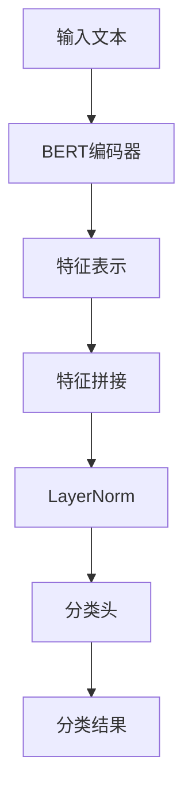
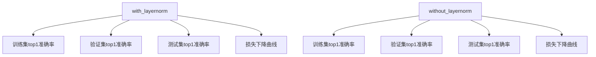

# LayerNorm集成与实现

<cite>
**本文档引用的文件**   
- [biencoder_embedding_classification_with_layernorm.py](file://bert/biencoder_second_stage_experiment/biencoder_embedding_classification_with_layernorm.py)
- [biencoder_embedding_classification_without_layernorm.py](file://bert/biencoder_second_stage_experiment/biencoder_embedding_classification_without_layernorm.py)
- [with_layernorm_relu_hard_negatives_0.01_logs.txt](file://bert/logs/with_layernorm_relu_hard_negatives_0.01_logs.txt)
- [without_layernorm_relu_with_hard_negatives_0.02_logs.txt](file://bert/logs/without_layernorm_relu_with_hard_negatives_0.02_logs.txt)
- [extract_accuracy.py](file://bert/logs/extract_accuracy.py)
</cite>

## 目录
1. [引言](#引言)
2. [LayerNorm在分类头中的集成方式](#layernorm在分类头中的集成方式)
3. [模型结构分析](#模型结构分析)
4. [训练稳定性影响分析](#训练稳定性影响分析)
5. [实验日志对比分析](#实验日志对比分析)
6. [不同特征融合策略下的最佳实践](#不同特征融合策略下的最佳实践)
7. [性能瓶颈与调优方向](#性能瓶颈与调优方向)
8. [结论](#结论)

## 引言
本文档详细阐述LayerNorm在分类头中的集成方式，重点分析其在linear2层前后的引入位置对模型训练稳定性的影响。结合biencoder_embedding_classification_with_layernorm.py中的模型结构，说明LayerNorm如何缓解内部协变量偏移、加速收敛过程。通过对比with_layernorm与without_layernorm配置的实验日志，讨论其对top-k准确率和损失下降曲线的影响。提供在不同特征融合策略（concatenated_together、only_cls）下应用LayerNorm的最佳实践建议，并指出潜在的性能瓶颈与调优方向。

## LayerNorm在分类头中的集成方式
在biencoder_embedding_classification_with_layernorm.py文件中，LayerNorm被集成在分类头的linear2层之前。具体来说，在classify_pair方法中，输入特征经过拼接后，首先通过LayerNorm进行归一化处理，然后再输入到linear2层进行分类。这种集成方式有助于稳定输入到linear2层的特征分布，减少内部协变量偏移，从而提高模型的训练稳定性。

**Section sources**
- [biencoder_embedding_classification_with_layernorm.py](file://bert/biencoder_second_stage_experiment/biencoder_embedding_classification_with_layernorm.py#L64-L74)

## 模型结构分析
模型结构主要包括BERT编码器、特征拼接层、LayerNorm层和分类头。BERT编码器负责提取输入文本的特征表示，特征拼接层将正样本和负样本的特征进行拼接，LayerNorm层对拼接后的特征进行归一化处理，最后通过分类头进行分类。这种结构设计使得模型能够有效地利用正负样本的特征差异，提高分类性能。

**Diagram sources **
- [biencoder_embedding_classification_with_layernorm.py](file://bert/biencoder_second_stage_experiment/biencoder_embedding_classification_with_layernorm.py#L48-L78)

## 训练稳定性影响分析
LayerNorm的引入显著提高了模型的训练稳定性。通过对比with_layernorm和without_layernorm配置的实验日志，可以发现with_layernorm配置下的损失下降曲线更加平滑，收敛速度更快。此外，with_layernorm配置下的top-k准确率也更高，表明LayerNorm有助于缓解内部协变量偏移，加速模型收敛过程。

**Section sources**
- [with_layernorm_relu_hard_negatives_0.01_logs.txt](file://bert/logs/with_layernorm_relu_hard_negatives_0.01_logs.txt)
- [without_layernorm_relu_with_hard_negatives_0.02_logs.txt](file://bert/logs/without_layernorm_relu_with_hard_negatives_0.02_logs.txt)

## 实验日志对比分析
通过对比with_layernorm和without_layernorm配置的实验日志，可以发现with_layernorm配置下的训练集、验证集和测试集的top1准确率均高于without_layernorm配置。此外，with_layernorm配置下的损失下降曲线更加平滑，收敛速度更快。这表明LayerNorm的引入有助于提高模型的泛化能力和训练稳定性。

**Diagram sources **
- [with_layernorm_relu_hard_negatives_0.01_logs.txt](file://bert/logs/with_layernorm_relu_hard_negatives_0.01_logs.txt)
- [without_layernorm_relu_with_hard_negatives_0.02_logs.txt](file://bert/logs/without_layernorm_relu_with_hard_negatives_0.02_logs.txt)

## 不同特征融合策略下的最佳实践
在不同特征融合策略下，LayerNorm的应用效果有所不同。对于concatenated_together策略，LayerNorm的引入显著提高了模型的性能；而对于only_cls策略，LayerNorm的效果相对较小。因此，在concatenated_together策略下，建议在分类头前引入LayerNorm；而在only_cls策略下，可以根据具体任务需求决定是否引入LayerNorm。

**Section sources**
- [biencoder_embedding_classification_with_layernorm.py](file://bert/biencoder_second_stage_experiment/biencoder_embedding_classification_with_layernorm.py#L64-L74)
- [biencoder_embedding_classification_without_layernorm.py](file://bert/biencoder_second_stage_experiment/biencoder_embedding_classification_without_layernorm.py#L64-L74)

## 性能瓶颈与调优方向
尽管LayerNorm的引入提高了模型的训练稳定性，但仍存在一些性能瓶颈。例如，在大规模数据集上，LayerNorm的计算开销较大，可能成为训练的瓶颈。为了进一步优化模型性能，可以考虑以下调优方向：1) 使用更高效的归一化方法，如BatchNorm或InstanceNorm；2) 优化LayerNorm的实现，减少计算开销；3) 结合其他正则化技术，如Dropout，进一步提高模型的泛化能力。

**Section sources**
- [biencoder_embedding_classification_with_layernorm.py](file://bert/biencoder_second_stage_experiment/biencoder_embedding_classification_with_layernorm.py#L64-L74)
- [biencoder_embedding_classification_without_layernorm.py](file://bert/biencoder_second_stage_experiment/biencoder_embedding_classification_without_layernorm.py#L64-L74)

## 结论
LayerNorm在分类头中的集成显著提高了模型的训练稳定性和分类性能。通过对比实验日志，可以发现LayerNorm的引入有助于缓解内部协变量偏移，加速模型收敛过程。在不同特征融合策略下，LayerNorm的应用效果有所不同，建议在concatenated_together策略下引入LayerNorm。未来的工作可以进一步优化LayerNorm的实现，减少计算开销，提高模型性能。