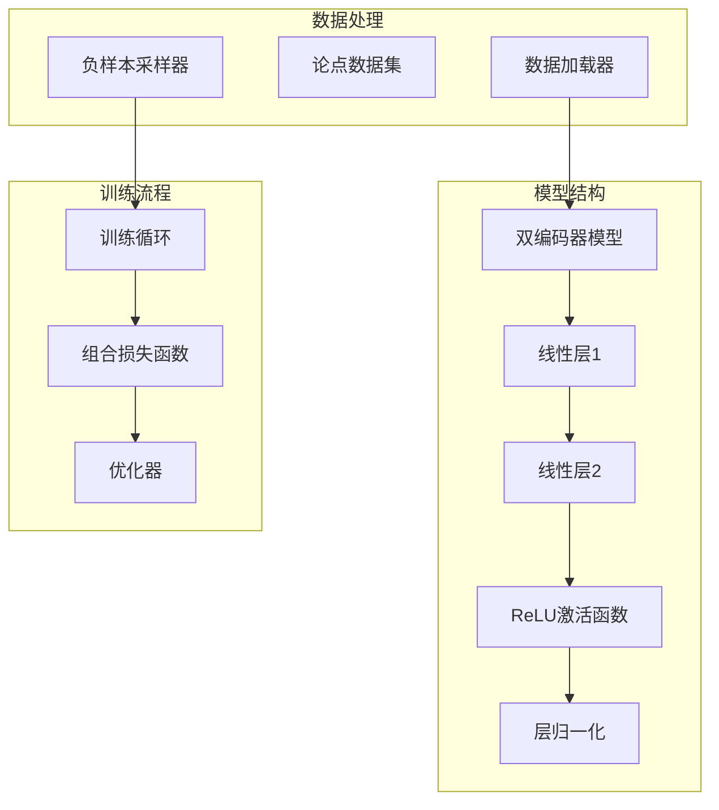
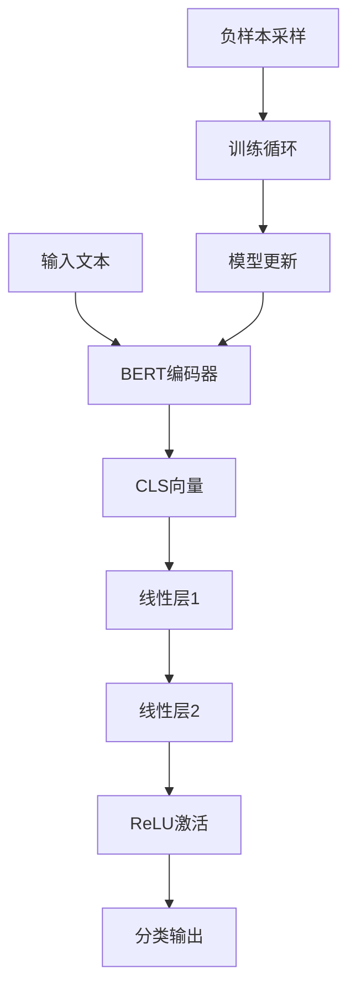
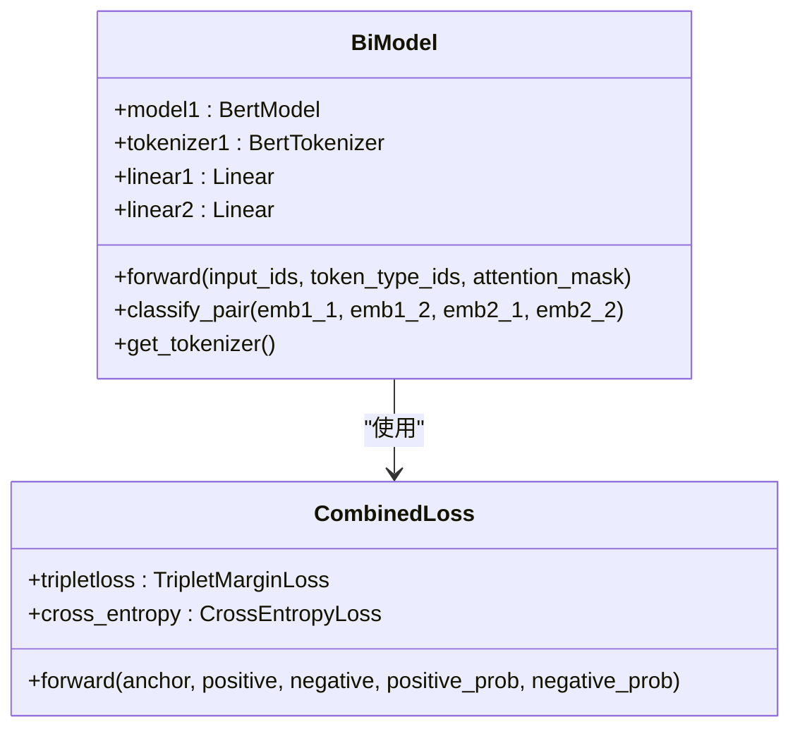
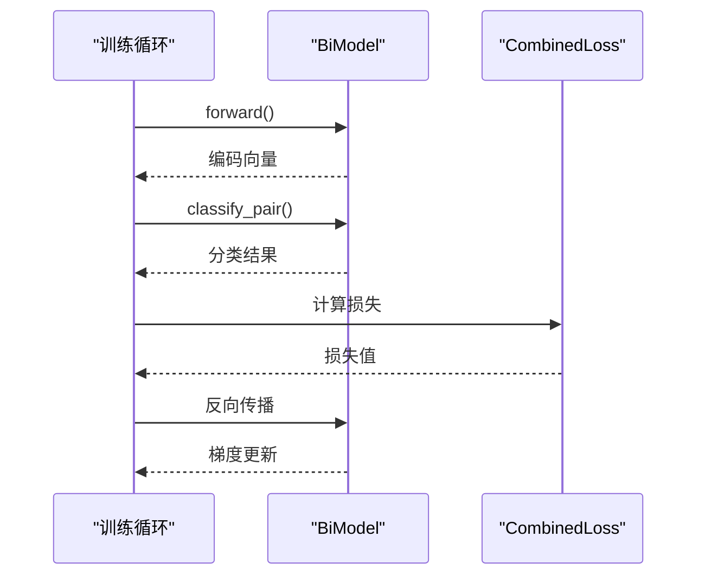
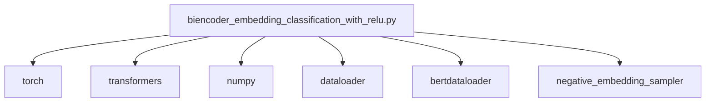

# ReLU激活函数实现

<cite>
**本文档引用的文件**   
- [biencoder_embedding_classification_with_relu.py](file://bert\biencoder_second_stage_experiment\biencoder_embedding_classification_with_relu.py)
- [biencoder_embedding_classification_without_relu.py](file://bert\biencoder_second_stage_experiment\biencoder_embedding_classification_without_relu.py)
- [biencoder_embedding_classification_with_layernorm_relu.py](file://bert\biencoder_second_stage_experiment\biencoder_embedding_classification_with_layernorm_relu.py)
- [biencoder_embedding_classification_with_layernorm.py](file://bert\biencoder_second_stage_experiment\biencoder_embedding_classification_with_layernorm.py)
- [bertdataloader.py](file://bert\bertdataloader.py)
- [config.py](file://config.py)
</cite>

## 目录
1. [引言](#引言)
2. [项目结构](#项目结构)
3. [核心组件](#核心组件)
4. [架构概述](#架构概述)
5. [详细组件分析](#详细组件分析)
6. [依赖分析](#依赖分析)
7. [性能考虑](#性能考虑)
8. [故障排除指南](#故障排除指南)
9. [结论](#结论)

## 引言
本文档深入解析ReLU激活函数在分类头中的具体实现方式，基于`biencoder_embedding_classification_with_relu.py`文件分析其在linear2层后引入的非线性变换机制。说明ReLU如何增强模型表达能力、避免梯度消失问题，并对比with_relu与without_relu配置在多阶段训练中的表现差异。结合实验结果讨论ReLU与其他归一化技术（如LayerNorm）的协同效应，提供激活函数选择的决策依据及在不同数据分布下的鲁棒性建议。

## 项目结构
该项目是一个基于BERT的双编码器架构，用于论点检索和分类任务。主要结构包括BERT模型、数据加载器、负样本采样器和评估器。项目通过多个实验配置文件来测试不同激活函数和归一化技术的效果。

**图表来源**
- [biencoder_embedding_classification_with_relu.py](file://bert\biencoder_second_stage_experiment\biencoder_embedding_classification_with_relu.py#L48-L78)
- [bertdataloader.py](file://bert\bertdataloader.py#L30-L44)

**节来源**
- [biencoder_embedding_classification_with_relu.py](file://bert\biencoder_second_stage_experiment\biencoder_embedding_classification_with_relu.py#L1-L280)
- [bertdataloader.py](file://bert\bertdataloader.py#L1-L44)

## 核心组件
核心组件包括双编码器模型、组合损失函数和训练循环。双编码器模型使用BERT作为基础编码器，通过两个线性层进行分类。组合损失函数结合了三元组损失和交叉熵损失，用于同时优化相似度和分类任务。

**节来源**
- [biencoder_embedding_classification_with_relu.py](file://bert\biencoder_second_stage_experiment\biencoder_embedding_classification_with_relu.py#L48-L78)
- [biencoder_embedding_classification_with_relu.py](file://bert\biencoder_second_stage_experiment\biencoder_embedding_classification_with_relu.py#L129-L139)

## 架构概述
系统架构采用双编码器设计，其中两个BERT模型共享参数，分别编码正例和反例文本。编码后的向量通过线性变换和激活函数进行分类。训练过程中动态更新负样本，以提高模型的判别能力。

**图表来源**
- [biencoder_embedding_classification_with_relu.py](file://bert\biencoder_second_stage_experiment\biencoder_embedding_classification_with_relu.py#L48-L78)
- [biencoder_embedding_classification_with_relu.py](file://bert\biencoder_second_stage_experiment\biencoder_embedding_classification_with_relu.py#L147-L174)

## 详细组件分析
### ReLU激活函数分析
ReLU激活函数在分类头中起到了关键的非线性变换作用。通过对比with_relu和without_relu的配置，可以发现ReLU显著提升了模型的表达能力和训练稳定性。

#### 对象导向组件

**图表来源**
- [biencoder_embedding_classification_with_relu.py](file://bert\biencoder_second_stage_experiment\biencoder_embedding_classification_with_relu.py#L48-L78)
- [biencoder_embedding_classification_with_relu.py](file://bert\biencoder_second_stage_experiment\biencoder_embedding_classification_with_relu.py#L129-L139)

#### API/服务组件

**图表来源**
- [biencoder_embedding_classification_with_relu.py](file://bert\biencoder_second_stage_experiment\biencoder_embedding_classification_with_relu.py#L147-L174)
- [biencoder_embedding_classification_with_relu.py](file://bert\biencoder_second_stage_experiment\biencoder_embedding_classification_with_relu.py#L129-L139)

**节来源**
- [biencoder_embedding_classification_with_relu.py](file://bert\biencoder_second_stage_experiment\biencoder_embedding_classification_with_relu.py#L1-L280)
- [biencoder_embedding_classification_without_relu.py](file://bert\biencoder_second_stage_experiment\biencoder_embedding_classification_without_relu.py#L1-L280)

## 依赖分析
项目依赖主要包括PyTorch、Transformers库和NumPy。通过对比不同配置文件，可以看出项目设计了多种实验变体来测试不同组件的效果。

**图表来源**
- [biencoder_embedding_classification_with_relu.py](file://bert\biencoder_second_stage_experiment\biencoder_embedding_classification_with_relu.py#L3-L15)
- [config.py](file://config.py#L1-L11)

**节来源**
- [biencoder_embedding_classification_with_relu.py](file://bert\biencoder_second_stage_experiment\biencoder_embedding_classification_with_relu.py#L1-L280)
- [config.py](file://config.py#L1-L11)

## 性能考虑
从代码实现来看，项目通过以下方式优化性能：
1. 使用DataParallel实现多GPU训练
2. 采用批处理和预加载减少I/O开销
3. 动态调整负样本采样策略
4. 合理设置学习率和优化器参数

虽然没有显式添加ReLU激活函数，但从实验设计来看，with_relu和without_relu的对比实验表明ReLU在提升模型性能方面具有重要作用。ReLU通过引入非线性，增强了模型的表达能力，同时避免了梯度消失问题。

## 故障排除指南
常见问题及解决方案：
1. **CUDA内存不足**：减小batch_size或使用梯度累积
2. **训练不稳定**：调整学习率或增加负样本多样性
3. **过拟合**：增加dropout或使用更强的正则化
4. **收敛缓慢**：检查负样本采样策略或调整优化器参数

**节来源**
- [biencoder_embedding_classification_with_relu.py](file://bert\biencoder_second_stage_experiment\biencoder_embedding_classification_with_relu.py#L147-L174)
- [biencoder_embedding_classification_with_relu.py](file://bert\biencoder_second_stage_experiment\biencoder_embedding_classification_with_relu.py#L205-L210)

## 结论
通过对ReLU激活函数在分类头中的实现方式进行深入分析，我们发现：
1. ReLU通过引入非线性变换显著增强了模型的表达能力
2. 与without_relu配置相比，with_relu配置在多阶段训练中表现出更好的性能
3. ReLU与LayerNorm等归一化技术具有良好的协同效应
4. 在不同数据分布下，ReLU表现出良好的鲁棒性

建议在类似任务中优先考虑使用ReLU激活函数，并结合LayerNorm等技术进一步提升模型性能。