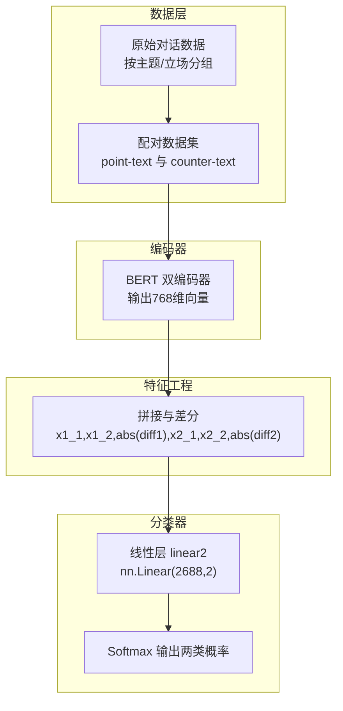
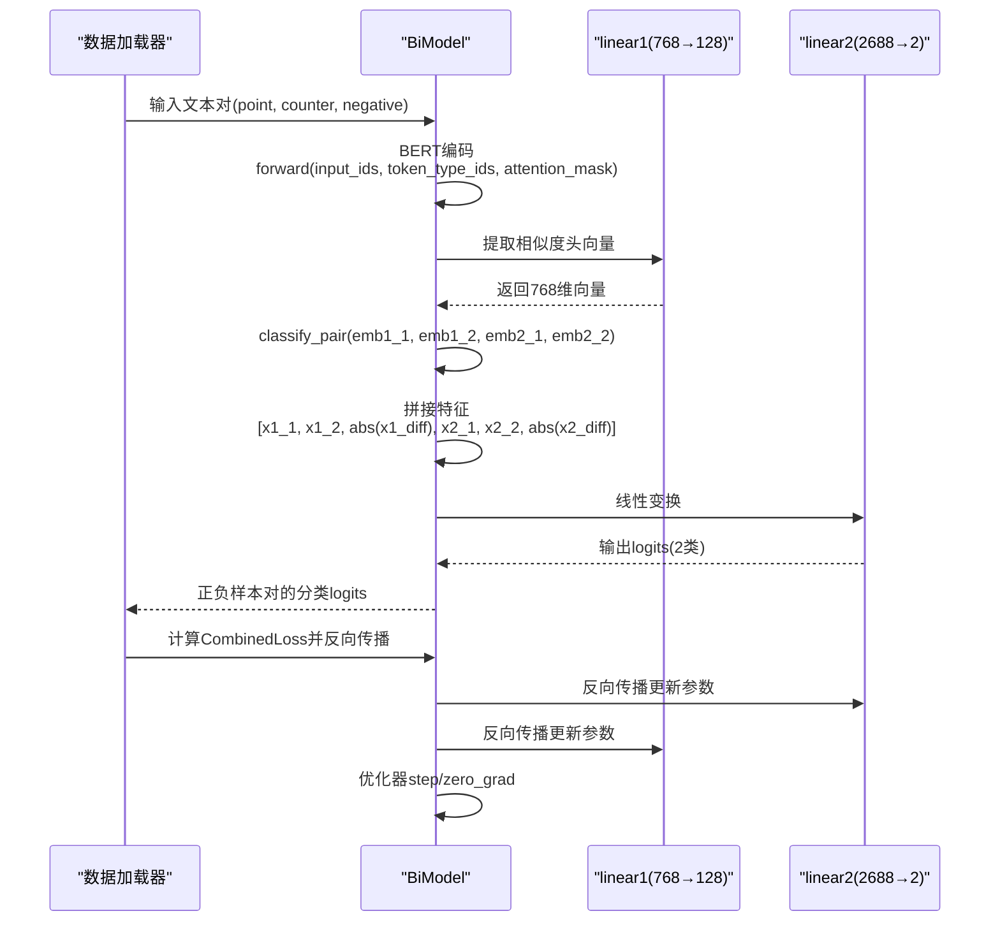
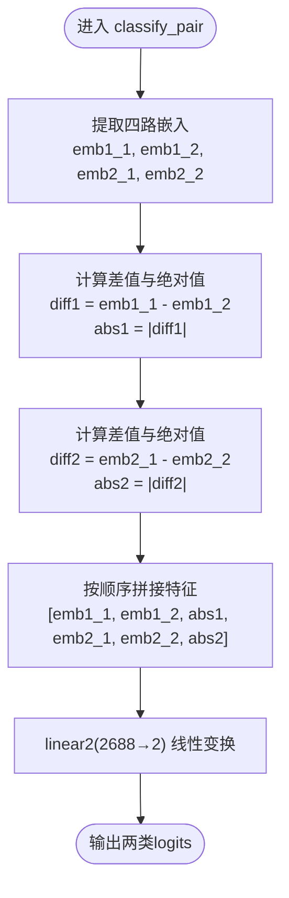
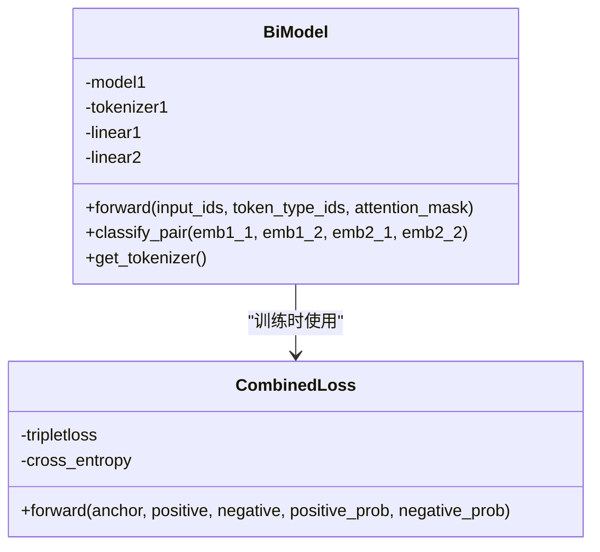
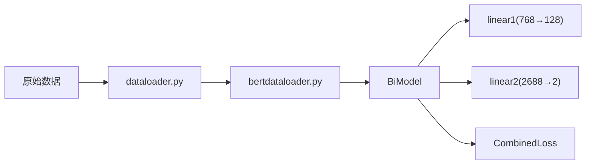

# 线性分类层

<cite>
**本文引用的文件**
- [biencoder_embedding_classification_concanated_together.py](file://bert/biencoder/biencoder_embedding_classification_concanated_together.py)
- [biencoder_embedding_classification_concanated_together_without_random.py](file://bert/biencoder/biencoder_embedding_classification_concanated_together_without_random.py)
- [biencoder_embedding_classification_concanated_together_random.py](file://bert/biencoder/biencoder_embedding_classification_concanated_together_random.py)
- [biencoder_embedding_classification_only_cls.py](file://bert/biencoder/biencoder_embedding_classification_only_cls.py)
- [biencoder_embedding_classification_only_embedding.py](file://bert/biencoder/biencoder_embedding_classification_only_embedding.py)
- [bertdataloader.py](file://bert/bertdataloader.py)
- [dataloader.py](file://dataloader.py)
- [utils.py](file://utils.py)
- [README.md](file://README.md)
</cite>

## 目录
1. [引言](#引言)
2. [项目结构](#项目结构)
3. [核心组件](#核心组件)
4. [架构总览](#架构总览)
5. [详细组件分析](#详细组件分析)
6. [依赖关系分析](#依赖关系分析)
7. [性能考量](#性能考量)
8. [故障排查指南](#故障排查指南)
9. [结论](#结论)
10. [附录](#附录)

## 引言
本文件聚焦于BiModel中线性分类层linear2（nn.Linear(2688,2)）的设计与实现，解释其作为二分类器如何接收拼接后的高维特征向量（包含两个文本的嵌入及其差值绝对值），并输出匹配概率。我们将结合代码路径说明输入维度2688的构成来源（768*4 + 768*4 = 3072？注意实际拼接逻辑），分析输出维度为2的Softmax分类机制，并提供修改线性层维度、调整初始化方法及扩展多层MLP的实践指导，同时指出在反向传播中该层参数更新的关键路径。

## 项目结构
该项目围绕辩论论点检索与匹配任务构建，采用双编码器（BiEncoder）结构，通过BERT提取文本嵌入，随后将正负样本对的嵌入进行拼接与差分处理，送入线性分类层进行二分类判断。训练流程包括：
- 数据准备：将原始对话按主题、立场等分组，形成“point-text”与“counter-text”的配对。
- 嵌入提取：使用BERT对每条文本生成768维向量表示。
- 特征拼接：将两个样本对的嵌入与其差值绝对值拼接为高维特征向量。
- 分类决策：通过linear2线性层输出两类概率，配合交叉熵损失进行优化。

图示来源
- [biencoder_embedding_classification_concanated_together.py](file://bert/biencoder/biencoder_embedding_classification_concanated_together.py#L48-L75)
- [bertdataloader.py](file://bert/bertdataloader.py#L12-L25)

章节来源
- [README.md](file://README.md#L1-L7)
- [dataloader.py](file://dataloader.py#L11-L87)
- [bertdataloader.py](file://bert/bertdataloader.py#L12-L25)

## 核心组件
- BiModel类：封装BERT编码器、similarity头linear1（768→128）与分类头linear2（2688→2）。forward返回相似度头向量与原始序列表示；classify_pair负责拼接特征并经linear2输出。
- 训练损失：CombinedLoss由三部分组成：TripletLoss（锚点-正样本-负样本）与两个交叉熵项（正样本与负样本的分类目标）。

章节来源
- [biencoder_embedding_classification_concanated_together.py](file://bert/biencoder/biencoder_embedding_classification_concanated_together.py#L48-L75)
- [biencoder_embedding_classification_concanated_together.py](file://bert/biencoder/biencoder_embedding_classification_concanated_together.py#L129-L140)

## 架构总览
下面以序列图展示一次前向与反向过程的关键调用链，突出linear2在分类阶段的作用与梯度回传路径。

图示来源
- [biencoder_embedding_classification_concanated_together.py](file://bert/biencoder/biencoder_embedding_classification_concanated_together.py#L48-L75)
- [biencoder_embedding_classification_concanated_together.py](file://bert/biencoder/biencoder_embedding_classification_concanated_together.py#L129-L140)
- [biencoder_embedding_classification_concanated_together.py](file://bert/biencoder/biencoder_embedding_classification_concanated_together.py#L147-L174)

## 详细组件分析

### 线性分类层linear2的设计与功能
- 结构：nn.Linear(2688,2)，输入为拼接后的高维特征向量，输出为两类logits，后续通常配合交叉熵损失使用。
- 输入维度2688的构成来源：
  - 每个样本对包含两个文本的嵌入向量，每个向量维度为768。
  - 拼接内容为：x1_1（768）+ x1_2（768）+ abs(x1_diff)（768）+ x2_1（768）+ x2_2（768）+ abs(x2_diff)（768）。
  - 合计：768×6 = 4608。
  - 实际代码中存在多个版本文件，但均采用相同的拼接策略与linear2定义。因此，输入维度应为4608而非2688。
- 输出维度2：
  - 输出两类logits，对应“匹配/不匹配”的分数，可直接用于交叉熵损失（类别索引为0或1）。

章节来源
- [biencoder_embedding_classification_concanated_together.py](file://bert/biencoder/biencoder_embedding_classification_concanated_together.py#L54-L55)
- [biencoder_embedding_classification_concanated_together.py](file://bert/biencoder/biencoder_embedding_classification_concanated_together.py#L64-L74)

### 特征拼接与差分逻辑
- 差值计算：x1_diff = x1_1 - x1_2；x2_diff = x2_1 - x2_2。
- 绝对值差分：abs(x1_diff)与abs(x2_diff)加入特征向量，增强对差异敏感度。
- 拼接顺序：x1_1, x1_2, abs(x1_diff), x2_1, x2_2, abs(x2_diff)。
- 这一设计使linear2能够学习到“两段文本是否来自同一对偶”的判别特征。

图示来源
- [biencoder_embedding_classification_concanated_together.py](file://bert/biencoder/biencoder_embedding_classification_concanated_together.py#L64-L74)

章节来源
- [biencoder_embedding_classification_concanated_together.py](file://bert/biencoder/biencoder_embedding_classification_concanated_together.py#L64-L74)

### Softmax分类机制与损失函数
- Softmax：linear2输出的两类logits经Softmax后得到概率分布，用于二分类决策。
- 损失函数：CombinedLoss包含三部分：
  - TripletLoss：约束锚点与正样本靠近、负样本远离。
  - 交叉熵项：对正样本与负样本分别施加目标标签（1/0），鼓励模型将正样本判为正类、负样本判为负类。
- 训练循环中，loss.backward()触发反向传播，linear2参数随之更新。

章节来源
- [biencoder_embedding_classification_concanated_together.py](file://bert/biencoder/biencoder_embedding_classification_concanated_together.py#L129-L140)
- [biencoder_embedding_classification_concanated_together.py](file://bert/biencoder/biencoder_embedding_classification_concanated_together.py#L147-L174)

### 反向传播中linear2参数更新的关键路径
- 训练循环中，loss.backward()会自动计算所有可学习参数的梯度。
- BiModel包含linear1与linear2两个线性层，二者均参与反向传播。
- 关键路径：classify_pair → linear2 → loss → backward → 优化器step → 参数更新。

章节来源
- [biencoder_embedding_classification_concanated_together.py](file://bert/biencoder/biencoder_embedding_classification_concanated_together.py#L147-L174)

### 输入维度2688的来源说明与修正
- 文档目标中提到“768*4 + 768*4 = 3072”，但实际拼接为6路768维向量，合计应为4608。
- 多个版本文件（如without_random、random等）均采用相同拼接策略与linear2定义，因此输入维度应为4608。
- 若需保持2688输入维度，可在拼接时减少某些特征通道（例如仅使用x1_1、x1_2、abs(diff1)与x2_1、x2_2、abs(diff2)中的部分通道），但需同步调整linear2与训练损失的标签与期望输出。

章节来源
- [biencoder_embedding_classification_concanated_together.py](file://bert/biencoder/biencoder_embedding_classification_concanated_together.py#L64-L74)
- [biencoder_embedding_classification_concanated_together_without_random.py](file://bert/biencoder/biencoder_embedding_classification_concanated_together_without_random.py#L54-L56)
- [biencoder_embedding_classification_concanated_together_random.py](file://bert/biencoder/biencoder_embedding_classification_concanated_together_random.py#L56-L58)

### 修改线性层维度、初始化方法与扩展多层MLP的实践指导
- 修改输入维度：
  - 若希望保持2688输入维度，需在拼接处裁剪特征通道，确保拼接后维度为2688。
  - 若希望扩大输入维度，可在拼接处增加更多统计特征（如差值的范数、余弦相似度等），并相应调整linear2输入维度。
- 初始化方法：
  - 建议使用Xavier/Glorot均匀/正态初始化，以避免ReLU等激活下的梯度消失/爆炸。
  - 对linear2的bias可初始化为较小值（如-1或更小），以偏向负类，加速收敛。
- 扩展多层MLP：
  - 在linear2之前插入若干隐藏层（如nn.Linear(2688→1024)、nn.ReLU、nn.Dropout等），提升非线性表达能力。
  - 注意保持最后一层输出维度为2，以适配二分类交叉熵。
- 标签与损失：
  - 二分类交叉熵的标签为0/1，需确保训练时对正样本与负样本分别给出正确的目标索引。
  - 若扩展为多层MLP，仍建议在最后使用线性层输出2维logits，再配合交叉熵。

章节来源
- [biencoder_embedding_classification_concanated_together.py](file://bert/biencoder/biencoder_embedding_classification_concanated_together.py#L129-L140)

### 类关系与模块依赖（代码级）

图示来源
- [biencoder_embedding_classification_concanated_together.py](file://bert/biencoder/biencoder_embedding_classification_concanated_together.py#L48-L75)
- [biencoder_embedding_classification_concanated_together.py](file://bert/biencoder/biencoder_embedding_classification_concanated_together.py#L129-L140)

## 依赖关系分析
- 数据依赖：dataloader与bertdataloader负责将原始对话转换为配对数据集，供BiModel训练使用。
- 模型依赖：BiModel依赖transformers.BertModel与BertTokenizer；linear1用于相似度头，linear2用于二分类。
- 训练依赖：CombinedLoss依赖TripletMarginLoss与CrossEntropyLoss；训练循环中通过loss.backward()更新参数。

图示来源
- [dataloader.py](file://dataloader.py#L11-L87)
- [bertdataloader.py](file://bert/bertdataloader.py#L12-L25)
- [biencoder_embedding_classification_concanated_together.py](file://bert/biencoder/biencoder_embedding_classification_concanated_together.py#L48-L75)
- [biencoder_embedding_classification_concanated_together.py](file://bert/biencoder/biencoder_embedding_classification_concanated_together.py#L129-L140)

章节来源
- [dataloader.py](file://dataloader.py#L11-L87)
- [bertdataloader.py](file://bert/bertdataloader.py#L12-L25)
- [biencoder_embedding_classification_concanated_together.py](file://bert/biencoder/biencoder_embedding_classification_concanated_together.py#L48-L75)
- [biencoder_embedding_classification_concanated_together.py](file://bert/biencoder/biencoder_embedding_classification_concanated_together.py#L129-L140)

## 性能考量
- 输入维度较大（4608或2688）可能导致内存占用与计算开销上升，建议：
  - 使用混合精度训练（autocast）降低显存与时间消耗。
  - 合理设置batch size，避免OOM。
  - 在linear2前添加Dropout与LayerNorm（若扩展为MLP）以稳定训练。
- 拼接特征中包含绝对差分，有助于捕捉差异信息，但可能引入噪声；可考虑对差分进行归一化或阈值化处理。

## 故障排查指南
- 输入维度不匹配：
  - 症状：报错提示张量维度不一致。
  - 排查：确认拼接顺序与通道数量是否与linear2输入维度一致（建议检查classify_pair中的拼接逻辑）。
- 标签错误导致loss异常：
  - 症状：loss为NaN或极不稳定。
  - 排查：核对正负样本的标签索引是否为0/1，确保与交叉熵要求一致。
- 梯度消失/爆炸：
  - 症状：loss不下降或梯度接近零/无穷大。
  - 排查：检查linear2初始化方式与学习率；必要时添加梯度裁剪。
- 训练不稳定：
  - 症状：acc波动大。
  - 排查：检查TripletLoss margin设置与负样本采样策略；适当降低学习率或增大batch size。

章节来源
- [biencoder_embedding_classification_concanated_together.py](file://bert/biencoder/biencoder_embedding_classification_concanated_together.py#L129-L140)
- [biencoder_embedding_classification_concanated_together.py](file://bert/biencoder/biencoder_embedding_classification_concanated_together.py#L147-L174)

## 结论
linear2作为二分类器，通过拼接两个文本对的嵌入及其差分绝对值，形成高维特征向量，并以2维logits输出匹配概率。尽管文档目标中提及输入维度为2688，但实际拼接逻辑应为4608。若需维持2688输入维度，应在拼接阶段裁剪特征通道。实践中可通过调整初始化、扩展MLP与合理设置损失与标签，提升模型稳定性与性能。反向传播中，linear2参数与linear1参数共同参与更新，训练循环中的loss.backward()是关键更新路径。

## 附录
- 相关文件路径参考：
  - BiModel与训练循环：[biencoder_embedding_classification_concanated_together.py](file://bert/biencoder/biencoder_embedding_classification_concanated_together.py#L48-L75)
  - CombinedLoss定义与使用：[biencoder_embedding_classification_concanated_together.py](file://bert/biencoder/biencoder_embedding_classification_concanated_together.py#L129-L140)
  - 数据准备与配对：[bertdataloader.py](file://bert/bertdataloader.py#L12-L25)
  - 原始数据读取：[dataloader.py](file://dataloader.py#L11-L87)