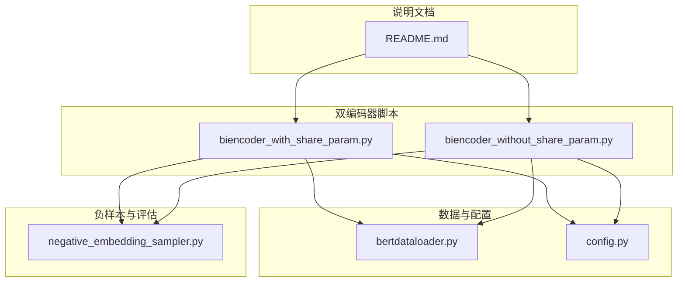
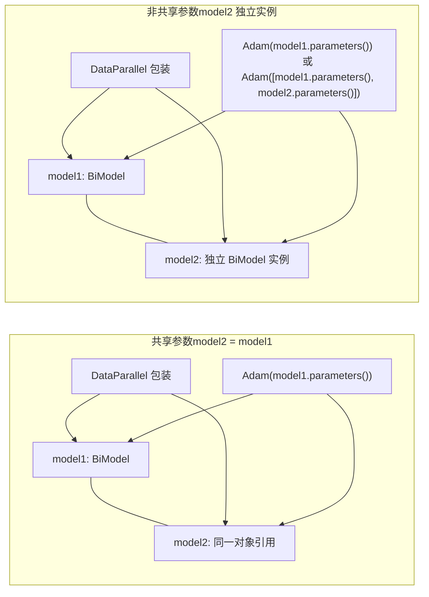
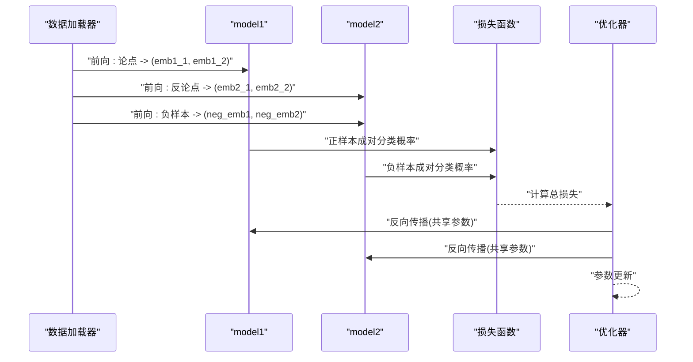
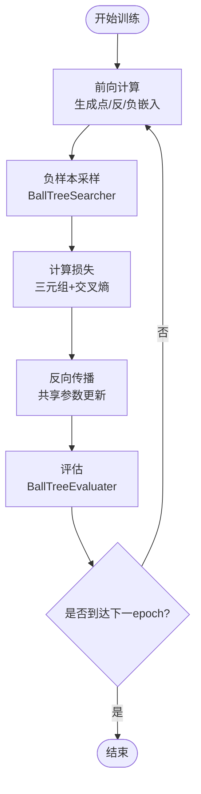
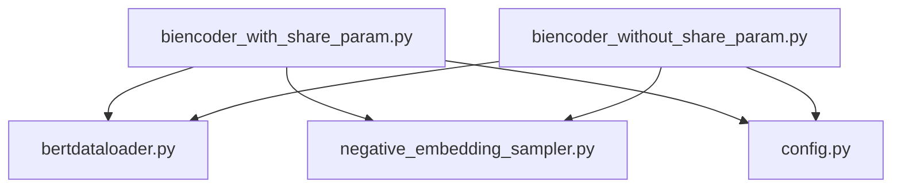

# 参数共享机制

<cite>
**本文引用的文件**
- [biencoder_with_share_param.py](file://bert/biencoder/biencoder_with_share_param.py)
- [biencoder_without_share_param.py](file://bert/biencoder/biencoder_without_share_param.py)
- [bertdataloader.py](file://bert/bertdataloader.py)
- [negative_embedding_sampler.py](file://bert/negative_embedding_sampler.py)
- [config.py](file://config.py)
- [README.md](file://README.md)
</cite>

## 目录
1. [引言](#引言)
2. [项目结构](#项目结构)
3. [核心组件](#核心组件)
4. [架构总览](#架构总览)
5. [详细组件分析](#详细组件分析)
6. [依赖关系分析](#依赖关系分析)
7. [性能考量](#性能考量)
8. [故障排查指南](#故障排查指南)
9. [结论](#结论)
10. [附录](#附录)

## 引言
本文件围绕“参数共享”与“非共享”的双编码器（BiEncoder）架构展开系统性比较，重点基于仓库中的两个脚本：biencoder_with_share_param.py 与 biencoder_without_share_param.py。前者通过将 model2 指向 model1 的方式实现参数共享，从而强制论点与反论点编码器共享同一组 BERT 参数，以期在减少参数量的同时提升语义一致性与泛化能力；后者展示了若采用独立模型实例可能带来的训练不稳定与过拟合风险，并讨论参数共享在反向传播过程中的梯度同步性及其对收敛速度的影响。最后给出在资源受限环境下的最佳实践建议。

## 项目结构
本项目采用按功能模块组织的结构，其中与参数共享直接相关的核心文件位于 bert/biencoder 目录下，配合数据加载、负样本采样与评估工具共同构成端到端的双编码器训练流程。

图表来源
- [biencoder_with_share_param.py](file://bert/biencoder/biencoder_with_share_param.py#L1-L278)
- [biencoder_without_share_param.py](file://bert/biencoder/biencoder_without_share_param.py#L1-L278)
- [bertdataloader.py](file://bert/bertdataloader.py#L1-L44)
- [negative_embedding_sampler.py](file://bert/negative_embedding_sampler.py#L1-L92)
- [config.py](file://config.py#L1-L11)
- [README.md](file://README.md#L1-L7)

章节来源
- [README.md](file://README.md#L1-L7)
- [config.py](file://config.py#L1-L11)
- [bertdataloader.py](file://bert/bertdataloader.py#L1-L44)
- [negative_embedding_sampler.py](file://bert/negative_embedding_sampler.py#L1-L92)

## 核心组件
- 双编码器模型类与前向逻辑：两个脚本均定义了 BiModel 类，包含一个 BERT 编码器与若干线性层，用于将输入文本编码为语义向量并进行成对分类。
- 训练主循环与损失函数：两者均使用三元组损失与交叉熵组合，分别对正样本与负样本进行判别。
- 数据准备与批处理：通过 ArgumentDataSet 将数据转换为点-反-负三元组，供训练与评估使用。
- 负样本采样与评估：使用 BallTreeSearcher 构建球树，基于嵌入相似度选择负样本；BallTreeEvaluater 评估检索精度。

章节来源
- [biencoder_with_share_param.py](file://bert/biencoder/biencoder_with_share_param.py#L46-L110)
- [biencoder_without_share_param.py](file://bert/biencoder/biencoder_without_share_param.py#L46-L110)
- [bertdataloader.py](file://bert/bertdataloader.py#L12-L44)
- [negative_embedding_sampler.py](file://bert/negative_embedding_sampler.py#L13-L47)

## 架构总览
参数共享与非共享两种实现的关键差异在于模型实例的创建与优化器参数集合：
- 共享参数版本：model2 = model1，优化器仅优化 model1 的参数，二者共享同一套 BERT 权重。
- 非共享版本：model2 独立创建，优化器可分别优化两者的参数，但脚本中仍以 model1 的参数作为优化对象。

图表来源
- [biencoder_with_share_param.py](file://bert/biencoder/biencoder_with_share_param.py#L79-L86)
- [biencoder_with_share_param.py](file://bert/biencoder/biencoder_with_share_param.py#L121-L124)
- [biencoder_without_share_param.py](file://bert/biencoder/biencoder_without_share_param.py#L79-L86)
- [biencoder_without_share_param.py](file://bert/biencoder/biencoder_without_share_param.py#L121-L124)

## 详细组件分析

### 参数共享实现与语义空间约束
- 共享参数的实现方式：在共享版本中，model2 直接赋值为 model1 的对象引用，随后通过 DataParallel 对 model1 进行多卡封装，使 model2 与 model1 指向同一内存地址，从而共享 BERT 参数。
- 语义空间一致性：由于两个输入分支（论点与反论点）共享同一 BERT 编码器，它们在相同的参数空间内生成嵌入，天然具备语义对齐的一致性，有利于后续相似度计算与分类任务。
- 参数量与泛化：共享参数显著减少可训练参数总量，降低过拟合风险，同时在有限数据场景下有助于提升泛化能力。

章节来源
- [biencoder_with_share_param.py](file://bert/biencoder/biencoder_with_share_param.py#L79-L86)
- [biencoder_with_share_param.py](file://bert/biencoder/biencoder_with_share_param.py#L81-L83)

### 非共享参数的风险与对比
- 独立实例的潜在问题：在非共享版本中，尽管脚本中仍以 model1 的参数作为优化对象，但若后续改为分别优化两者的参数，两个编码器将拥有独立的 BERT 权重，可能导致语义空间漂移，训练不稳定，且容易出现过拟合。
- 训练稳定性：当两个编码器参数不同步时，正负样本的嵌入分布可能不一致，导致三元组损失与分类损失之间的冲突增大，影响收敛稳定性。

章节来源
- [biencoder_without_share_param.py](file://bert/biencoder/biencoder_without_share_param.py#L79-L86)
- [biencoder_without_share_param.py](file://bert/biencoder/biencoder_without_share_param.py#L121-L124)

### 反向传播中的梯度同步与收敛影响
- 共享参数的梯度同步：由于 model2 与 model1 指向同一对象，反向传播时对共享参数的梯度更新完全一致，避免了参数漂移，提升了收敛稳定性。
- 收敛速度：参数同步减少了不必要的参数更新噪声，有助于更快稳定收敛；同时，较小的参数空间也降低了优化难度。
- 非共享的梯度异步：若两编码器参数不同步，反向传播会产生两套不同的梯度更新路径，可能相互抵消或产生震荡，导致收敛变慢甚至发散。

章节来源
- [biencoder_with_share_param.py](file://bert/biencoder/biencoder_with_share_param.py#L165-L171)
- [biencoder_without_share_param.py](file://bert/biencoder/biencoder_without_share_param.py#L165-L171)

### 训练流程与损失函数设计
- 数据准备：使用 ArgumentDataSet 将原始对话数据转换为点-反-负三元组，便于成对学习与负样本采样。
- 负样本采样：通过 BallTreeSearcher 基于嵌入相似度选择负样本，支持随机率控制，平衡确定性与多样性。
- 损失函数：组合三元组损失与交叉熵，分别对正负样本进行判别，确保正样本嵌入靠近、负样本远离。

图表来源
- [biencoder_with_share_param.py](file://bert/biencoder/biencoder_with_share_param.py#L145-L171)
- [biencoder_with_share_param.py](file://bert/biencoder/biencoder_with_share_param.py#L127-L138)
- [negative_embedding_sampler.py](file://bert/negative_embedding_sampler.py#L13-L47)

### 负样本采样与评估流程
- 负样本采样：在每个 epoch 结束后，使用 BallTreeSearcher 基于当前嵌入构建球树，选择与当前样本最相似但非自身的样本作为负样本，动态调整负样本质量。
- 评估：使用 BallTreeEvaluater 计算 Top-K 准确率，评估检索效果。

图表来源
- [biencoder_with_share_param.py](file://bert/biencoder/biencoder_with_share_param.py#L173-L202)
- [negative_embedding_sampler.py](file://bert/negative_embedding_sampler.py#L13-L47)
- [negative_embedding_sampler.py](file://bert/negative_embedding_sampler.py#L48-L92)

章节来源
- [biencoder_with_share_param.py](file://bert/biencoder/biencoder_with_share_param.py#L173-L202)
- [negative_embedding_sampler.py](file://bert/negative_embedding_sampler.py#L13-L47)
- [negative_embedding_sampler.py](file://bert/negative_embedding_sampler.py#L48-L92)

## 依赖关系分析
- 数据依赖：两个脚本均依赖 bertdataloader.py 提供的数据集与数据预处理函数。
- 负样本与评估：依赖 negative_embedding_sampler.py 提供的 BallTreeSearcher 与 BallTreeEvaluater。
- 配置依赖：依赖 config.py 中的数据目录配置。
- 外部库：使用 Transformers 的 BERT 模型、PyTorch 的优化器与数据加载器等。

图表来源
- [biencoder_with_share_param.py](file://bert/biencoder/biencoder_with_share_param.py#L1-L40)
- [biencoder_without_share_param.py](file://bert/biencoder/biencoder_without_share_param.py#L1-L40)
- [bertdataloader.py](file://bert/bertdataloader.py#L1-L44)
- [negative_embedding_sampler.py](file://bert/negative_embedding_sampler.py#L1-L92)
- [config.py](file://config.py#L1-L11)

章节来源
- [biencoder_with_share_param.py](file://bert/biencoder/biencoder_with_share_param.py#L1-L40)
- [biencoder_without_share_param.py](file://bert/biencoder/biencoder_without_share_param.py#L1-L40)
- [bertdataloader.py](file://bert/bertdataloader.py#L1-L44)
- [negative_embedding_sampler.py](file://bert/negative_embedding_sampler.py#L1-L92)
- [config.py](file://config.py#L1-L11)

## 性能考量
- 参数量与显存占用：共享参数显著减少可训练参数规模，降低显存占用，适合资源受限环境。
- 收敛稳定性：参数同步避免了编码器间的参数漂移，提高训练稳定性，减少震荡与发散风险。
- 泛化能力：共享语义空间有助于在有限数据上提升泛化，降低过拟合风险。
- 计算效率：共享参数在推理阶段可复用相同编码器，减少重复计算，提升整体效率。

## 故障排查指南
- 训练不稳定或发散：检查是否正确实现了 model2 = model1 并通过 DataParallel 统一管理；确认优化器仅优化共享参数。
- 负样本质量不佳：检查 BallTreeSearcher 的随机率设置与嵌入维度，适当调整以平衡确定性与多样性。
- 评估指标异常：确认 BallTreeEvaluater 的合并嵌入顺序与概率计算逻辑，确保正负样本判别正确。
- 数据加载错误：核对 ArgumentDataSet 的字段映射与 trans_to_pairs 的数据格式，确保三元组构造正确。

章节来源
- [biencoder_with_share_param.py](file://bert/biencoder/biencoder_with_share_param.py#L121-L171)
- [negative_embedding_sampler.py](file://bert/negative_embedding_sampler.py#L13-L47)
- [negative_embedding_sampler.py](file://bert/negative_embedding_sampler.py#L48-L92)
- [bertdataloader.py](file://bert/bertdataloader.py#L12-L44)

## 结论
参数共享通过强制论点与反论点编码器共享同一组 BERT 参数，有效约束了语义空间的一致性，减少了参数量并增强了泛化能力。在反向传播中，参数同步更新避免了编码器间漂移，提升了训练稳定性与收敛速度。相比之下，非共享实现若采用独立模型实例，可能带来训练不稳定与过拟合风险。在资源受限环境下，建议优先采用参数共享策略，并结合动态负样本采样与合理的评估指标进行迭代优化。

## 附录
- 最佳实践建议（适用于资源受限环境）
  - 明确实现：确保 model2 = model1，避免创建独立实例。
  - 优化器配置：仅优化共享参数，避免冗余更新。
  - 动态负样本：利用 BallTreeSearcher 在每个 epoch 更新负样本，提升样本质量。
  - 评估监控：定期使用 BallTreeEvaluater 监控 Top-K 准确率，及时调整训练策略。
  - 数据对齐：确保 ArgumentDataSet 的字段与 trans_to_pairs 的输出一致，保证三元组正确性。