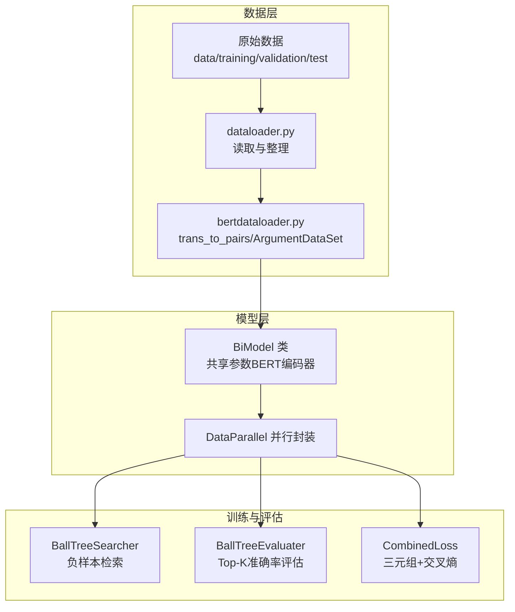
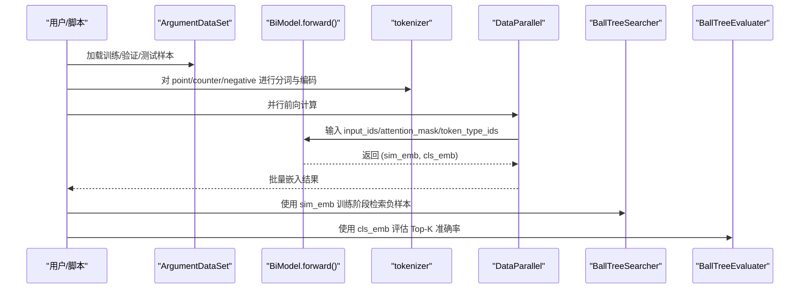
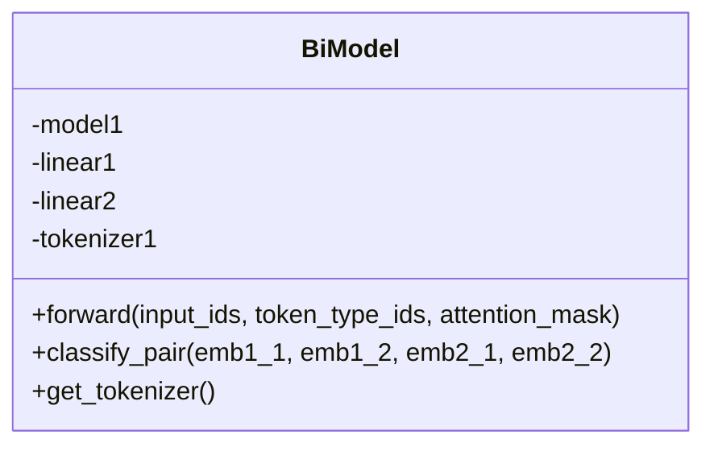
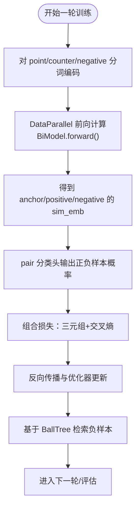
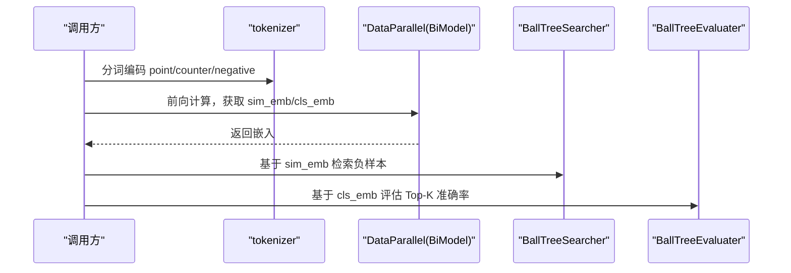
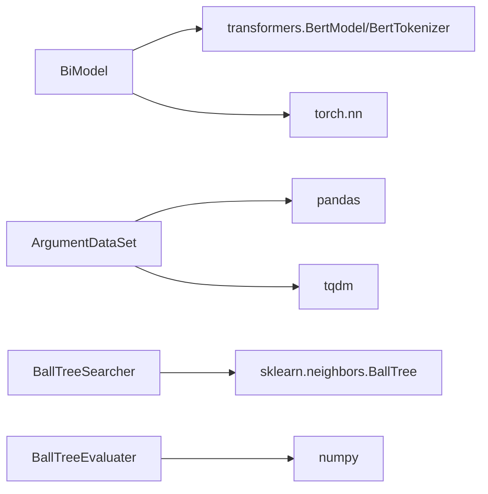

# 双编码器设计

<cite>
**本文引用的文件列表**
- [biencoder_with_share_param.py](file://bert/biencoder/biencoder_with_share_param.py)
- [biencoder_without_share_param.py](file://bert/biencoder/biencoder_without_share_param.py)
- [biencoder_embedding_concanated_together.py](file://bert/biencoder/biencoder_embedding_concanated_together.py)
- [biencoder_embedding_classification_only_cls.py](file://bert/biencoder/biencoder_embedding_classification_only_cls.py)
- [bertdataloader.py](file://bert/bertdataloader.py)
- [negative_embedding_sampler.py](file://bert/negative_embedding_sampler.py)
- [dataloader.py](file://dataloader.py)
- [config.py](file://config.py)
- [utils.py](file://utils.py)
- [README.md](file://README.md)
</cite>

## 目录
1. [引言](#引言)
2. [项目结构](#项目结构)
3. [核心组件](#核心组件)
4. [架构总览](#架构总览)
5. [详细组件分析](#详细组件分析)
6. [依赖关系分析](#依赖关系分析)
7. [性能考量](#性能考量)
8. [故障排查指南](#故障排查指南)
9. [结论](#结论)
10. [附录](#附录)

## 引言
本文件围绕双编码器（Bi-Encoder）在反论点检索任务中的设计与实现展开，重点解释双塔模型如何通过两个独立但共享参数的BERT编码器分别处理论点（point）与反论点（counter）文本，以及为何选择共享参数而非完全独立的编码器。文档还结合代码路径说明BiModel.forward()如何提取[CLS]向量并进行线性变换生成语义嵌入；对比双编码器与交叉编码器在推理效率与精度上的权衡；给出模型并行（DataParallel）配置方式及其对训练吞吐量的影响；并提供加载与调用编码器进行向量生成的实际操作建议。

## 项目结构
该项目以“双编码器”为核心模块，围绕数据准备、负样本采样、训练循环与评估流程组织代码。关键文件分布如下：
- 双编码器实现：位于 bert/biencoder 下，包含多种变体（如仅[CLS]分类、拼接嵌入等）
- 数据加载与预处理：bert/bertdataloader.py 将原始对话按主题/立场配对，形成 point-counter 样本
- 负样本采样与评估：bert/negative_embedding_sampler.py 基于BallTree进行负样本检索与Top-K准确率评估
- 主训练脚本：各 biencoder_xxx.py 文件内含完整的训练/验证/测试流程
- 配置与工具：config.py 定义数据路径；utils.py 提供数据分组与切分工具；dataloader.py 读取原始数据

图表来源
- [biencoder_with_share_param.py](file://bert/biencoder/biencoder_with_share_param.py#L46-L110)
- [bertdataloader.py](file://bert/bertdataloader.py#L12-L44)
- [negative_embedding_sampler.py](file://bert/negative_embedding_sampler.py#L13-L47)
- [dataloader.py](file://dataloader.py#L11-L75)

章节来源
- [README.md](file://README.md#L1-L7)
- [config.py](file://config.py#L1-L11)
- [dataloader.py](file://dataloader.py#L11-L75)
- [bertdataloader.py](file://bert/bertdataloader.py#L12-L44)

## 核心组件
- BiModel 类：封装共享参数的BERT编码器与线性映射层，负责将输入文本编码为128维语义向量，并提供 pair 分类接口
- ArgumentDataSet：将DataFrame转换为 point/counter/negative 三元组的数据集
- BallTreeSearcher/BallTreeEvaluater：基于BallTree的负样本检索与Top-K准确率评估
- CombinedLoss：三元组损失与二分类交叉熵的组合损失函数

章节来源
- [biencoder_with_share_param.py](file://bert/biencoder/biencoder_with_share_param.py#L46-L110)
- [bertdataloader.py](file://bert/bertdataloader.py#L30-L44)
- [negative_embedding_sampler.py](file://bert/negative_embedding_sampler.py#L13-L47)
- [negative_embedding_sampler.py](file://bert/negative_embedding_sampler.py#L48-L92)

## 架构总览
双编码器采用“双塔”结构：两个独立的BERT编码器（共享参数）分别对 point 与 counter 文本进行编码，输出128维语义向量；随后通过线性层将[CLS]向量映射到目标空间，用于相似度计算或进一步的pair分类。训练时，使用三元组损失约束正负样本的嵌入分布，同时用交叉熵对pair分类头进行监督。

图表来源
- [biencoder_with_share_param.py](file://bert/biencoder/biencoder_with_share_param.py#L140-L206)
- [bertdataloader.py](file://bert/bertdataloader.py#L30-L44)
- [negative_embedding_sampler.py](file://bert/negative_embedding_sampler.py#L13-L47)

## 详细组件分析

### BiModel 类与 forward() 方法
- 结构要点
  - 共享参数的BERT编码器：两个编码器共享同一套权重，减少参数量并提升推理效率
  - 线性映射层：将BERT输出的[CLS]向量从768维映射到128维，作为语义嵌入
  - pair 分类头：将两个样本的嵌入拼接与差分特征输入线性层，输出二分类概率
- forward() 行为
  - 接收 input_ids、token_type_ids、attention_mask
  - 调用BERT编码器得到输出，返回 (sim_emb, cls_emb)，其中 sim_emb 用于相似度计算，cls_emb 用于后续相似度/分类

图表来源
- [biencoder_with_share_param.py](file://bert/biencoder/biencoder_with_share_param.py#L46-L77)

章节来源
- [biencoder_with_share_param.py](file://bert/biencoder/biencoder_with_share_param.py#L46-L77)

### 训练流程与损失函数
- 训练循环
  - 每轮迭代对 point/counter/negative 分别进行编码，得到 anchor/positive/negative 的 sim_emb
  - 同时使用 pair 分类头对正负样本对进行二分类，得到正负样本的概率
  - 组合损失由三元组损失与交叉熵组成
- 负样本采样
  - 训练阶段：使用 BallTreeSearcher 基于 point 与 counter 的 sim_emb 检索负样本
  - 评估阶段：使用 BallTreeEvaluater 计算 Top-K 准确率

图表来源
- [biencoder_with_share_param.py](file://bert/biencoder/biencoder_with_share_param.py#L127-L173)
- [negative_embedding_sampler.py](file://bert/negative_embedding_sampler.py#L13-L47)

章节来源
- [biencoder_with_share_param.py](file://bert/biencoder/biencoder_with_share_param.py#L127-L173)
- [negative_embedding_sampler.py](file://bert/negative_embedding_sampler.py#L13-L47)

### 为什么选择共享参数而非独立编码器
- 参数共享的优势
  - 显著降低参数规模，减少内存占用与显存压力
  - 在推理阶段，两个塔共享参数意味着只需一次前向即可获得两类嵌入，提高效率
- 实现方式
  - 通过 DataParallel 将单个 BiModel 实例复制到多个GPU，实现并行推理
  - 训练时使用 optimizer 对共享参数进行更新，避免重复参数带来的梯度冲突

章节来源
- [biencoder_with_share_param.py](file://bert/biencoder/biencoder_with_share_param.py#L79-L86)
- [biencoder_without_share_param.py](file://bert/biencoder/biencoder_without_share_param.py#L79-L86)

### 与交叉编码器的对比
- 双编码器（Bi-Encoder）
  - 优点：推理速度快、可并行、参数少、易于扩展
  - 缺点：pair 分类头需要额外训练，且在某些复杂匹配场景可能不如交叉编码器精细
- 交叉编码器（Cross-Encoder）
  - 优点：对成对上下文建模更充分，通常在精度上有优势
  - 缺点：推理成本高、无法对全库进行向量检索，难以扩展到大规模召回

章节来源
- [biencoder_with_share_param.py](file://bert/biencoder/biencoder_with_share_param.py#L127-L173)

### 模型并行化（DataParallel）配置与影响
- 配置方式
  - 将单个 BiModel 放入 DataParallel，并指定 GPU 设备列表
  - 训练时通过 module.classify_pair 访问分类头，确保多卡一致性
- 对吞吐量的影响
  - 多GPU并行可显著提升批处理吞吐，缩短训练时间
  - 需注意数据搬运与梯度同步开销，合理设置 batch size

章节来源
- [biencoder_with_share_param.py](file://bert/biencoder/biencoder_with_share_param.py#L79-L86)
- [biencoder_without_share_param.py](file://bert/biencoder/biencoder_without_share_param.py#L79-L86)

### 向量生成与调用流程
- 加载与准备
  - 使用 BiModel.get_tokenizer() 获取分词器
  - 对输入文本进行 padding/truncation 编码
- 嵌入生成
  - 调用 DataParallel 包装后的 BiModel.forward()，得到 sim_emb 与 cls_emb
  - sim_emb 用于相似度计算与负样本检索；cls_emb 用于 pair 分类
- 评估与检索
  - 使用 BallTreeSearcher 检索负样本
  - 使用 BallTreeEvaluater 计算 Top-K 准确率

图表来源
- [biencoder_with_share_param.py](file://bert/biencoder/biencoder_with_share_param.py#L140-L206)
- [negative_embedding_sampler.py](file://bert/negative_embedding_sampler.py#L48-L92)

章节来源
- [biencoder_with_share_param.py](file://bert/biencoder/biencoder_with_share_param.py#L140-L206)
- [negative_embedding_sampler.py](file://bert/negative_embedding_sampler.py#L48-L92)

## 依赖关系分析
- 组件耦合
  - BiModel 依赖 transformers.BertModel 与 BertTokenizer
  - 训练脚本依赖自定义数据集 ArgumentDataSet 与分词器
  - 评估与负样本采样依赖 BallTreeSearcher/BallTreeEvaluater
- 外部依赖
  - PyTorch、transformers、sklearn.neighbors.BallTree
  - pandas、tqdm、numpy

图表来源
- [biencoder_with_share_param.py](file://bert/biencoder/biencoder_with_share_param.py#L46-L77)
- [bertdataloader.py](file://bert/bertdataloader.py#L12-L44)
- [negative_embedding_sampler.py](file://bert/negative_embedding_sampler.py#L13-L47)

章节来源
- [biencoder_with_share_param.py](file://bert/biencoder/biencoder_with_share_param.py#L46-L77)
- [bertdataloader.py](file://bert/bertdataloader.py#L12-L44)
- [negative_embedding_sampler.py](file://bert/negative_embedding_sampler.py#L13-L47)

## 性能考量
- 推理效率
  - 双塔共享参数与 DataParallel 并行可显著提升吞吐；但在极大规模检索场景下仍不及交叉编码器
- 训练稳定性
  - 三元组损失与交叉熵组合有助于稳定收敛；需合理设置 margin 与学习率
- 负样本质量
  - BallTree 检索的负样本质量直接影响训练效果；可通过随机率与 k 值调节

[本节为通用性能讨论，无需列出具体文件来源]

## 故障排查指南
- 分词与编码问题
  - 确保输入文本经过 padding/truncation，避免维度不一致
- GPU 内存不足
  - 适当减小 batch size 或关闭不必要的并行分支
- 评估指标异常
  - 检查 BallTreeSearcher 的 k 值与随机率设置是否合理
- 训练不收敛
  - 检查 CombinedLoss 的权重与 optimizer 设置；逐步增大学习率观察变化

章节来源
- [biencoder_with_share_param.py](file://bert/biencoder/biencoder_with_share_param.py#L140-L206)
- [negative_embedding_sampler.py](file://bert/negative_embedding_sampler.py#L13-L47)

## 结论
双编码器通过共享参数的双塔结构，在保证推理效率的同时兼顾了可扩展性。BiModel.forward() 将[CLS]向量映射到128维语义空间，配合 pair 分类头与三元组损失，实现了对反论点检索的有效建模。相比交叉编码器，双编码器在推理速度与可扩展性上更具优势；而在复杂语义匹配上可能需要更强的分类头或更精细的负样本策略。通过 DataParallel 并行化与 BallTree 负样本采样，可在大规模数据上取得良好效果。

[本节为总结性内容，无需列出具体文件来源]

## 附录
- 数据准备与配对
  - 使用 utils.split_* 系列函数与 bertdataloader.trans_to_pairs 将原始对话按主题/立场配对
- 训练与评估脚本
  - 各 biencoder_xxx.py 文件内含完整的训练/验证/测试流程，可直接运行

章节来源
- [utils.py](file://utils.py#L1-L304)
- [bertdataloader.py](file://bert/bertdataloader.py#L12-L25)
- [biencoder_embedding_concanated_together.py](file://bert/biencoder/biencoder_embedding_concanated_together.py#L1-L280)
- [biencoder_embedding_classification_only_cls.py](file://bert/biencoder/biencoder_embedding_classification_only_cls.py#L1-L280)