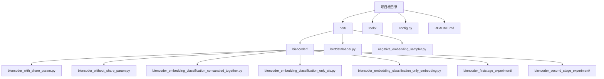
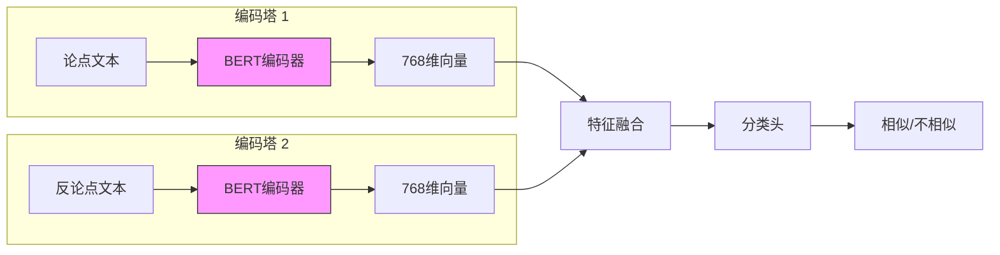
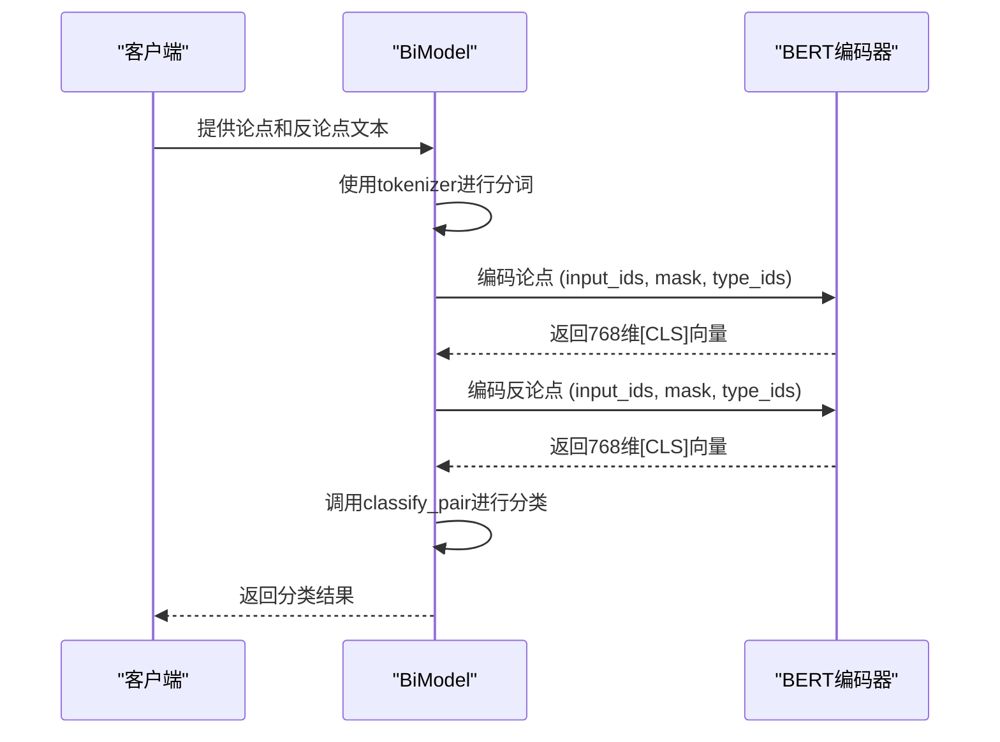

# 模型架构

<cite>
**本文档中引用的文件**
- [biencoder_with_share_param.py](file://bert/biencoder/biencoder_with_share_param.py)
- [biencoder_without_share_param.py](file://bert/biencoder/biencoder_without_share_param.py)
- [biencoder_embedding_classification_concanated_together.py](file://bert/biencoder/biencoder_embedding_classification_concanated_together.py)
- [biencoder_embedding_classification_only_cls.py](file://bert/biencoder/biencoder_embedding_classification_only_cls.py)
- [biencoder_embedding_classification_only_embedding.py](file://bert/biencoder/biencoder_embedding_classification_only_embedding.py)
- [biencoder_embedding_concanated_together.py](file://bert/biencoder/biencoder_embedding_concanated_together.py)
- [config.py](file://config.py)
- [README.md](file://README.md)
</cite>

## 目录
1. [简介](#简介)
2. [项目结构](#项目结构)
3. [核心组件](#核心组件)
4. [双编码器架构概述](#双编码器架构概述)
5. [详细组件分析](#详细组件分析)
6. [参数共享与非共享架构](#参数共享与非共享架构)
7. [特征融合策略](#特征融合策略)
8. [分类头结构](#分类头结构)
9. [推理流程与性能分析](#推理流程与性能分析)
10. [结论](#结论)

## 简介
本文档详细阐述了双编码器模型（Bi-Encoder Model）的架构设计与实现，重点聚焦于`BiModel`类的核心原理。该模型采用双塔结构，使用两个独立的BERT编码器分别处理论点（point）和反论点（counter-argument）文本。文档深入分析了三种特征融合策略：'concanated_together'（拼接完整嵌入）、'only_cls'（仅使用[CLS]向量）和'only_embedding'（使用平均/池化嵌入）的实现差异与适用场景。同时，文档对比了参数共享（`biencoder_with_share_param.py`）与非共享（`biencoder_without_share_param.py`）架构的技术细节与性能权衡，并描述了分类头（classification head）的结构配置。

**Section sources**
- [README.md](file://README.md)
- [config.py](file://config.py)

## 项目结构
该项目是一个用于反论点检索的深度学习系统，其核心是基于BERT的双编码器模型。项目结构清晰，主要分为`bert`模块、工具模块和配置文件。

`bert`模块包含核心的双编码器实现，位于`bert/biencoder/`目录下，提供了多种变体：
- **基础架构**：`biencoder_with_share_param.py` 和 `biencoder_without_share_param.py` 定义了参数共享与非共享的双编码器基础。
- **特征融合策略**：`biencoder_embedding_classification_concanated_together.py`、`biencoder_embedding_classification_only_cls.py` 和 `biencoder_embedding_classification_only_embedding.py` 实现了三种不同的特征融合方法。
- **实验变体**：`biencoder_firststage_experiment/` 和 `biencoder_second_stage_experiment/` 目录包含了用于不同实验配置的模型文件。

此外，`bert/bertdataloader.py` 负责数据加载，`bert/negative_embedding_sampler.py` 用于负样本采样，`config.py` 定义了数据路径。

**Diagram sources**
- [config.py](file://config.py)

**Section sources**
- [config.py](file://config.py)

## 核心组件
`BiModel`类是整个双编码器架构的核心，它继承自`torch.nn.Module`。该类的设计体现了双塔模型的基本思想：两个独立的BERT编码器分别处理输入的论点和反论点文本。

模型的核心组件包括：
- **BERT编码器**：`self.model1` 是一个从`bert-base-uncased`预训练模型加载的`BertModel`实例，负责将输入的文本序列编码为高维向量表示。
- **分词器**：`self.tokenizer1` 用于将原始文本转换为BERT模型可接受的输入格式（input_ids, attention_mask, token_type_ids）。
- **相似度头**：`self.linear1` 是一个线性层，将768维的BERT输出降维到128维，用于后续的相似度计算。
- **分类头**：`self.linear2` 是一个线性层，接收融合后的特征并输出二分类结果（相似/不相似）。

**Section sources**
- [biencoder_with_share_param.py](file://bert/biencoder/biencoder_with_share_param.py#L46-L78)

## 双编码器架构概述
双编码器模型采用“双塔”（Dual-Tower）架构，其核心思想是将两个文本（论点和反论点）分别通过独立的编码器进行编码，然后在向量空间中计算它们的相似度。这种架构的优势在于，可以预先计算并存储所有候选反论点的向量表示，从而在推理阶段实现高效的检索。

在本实现中，尽管定义了两个模型实例（`model1` 和 `model2`），但通过 `model2 = model1` 的赋值，实际上两个塔共享了同一套参数。这意味着论点和反论点使用的是同一个BERT编码器进行编码，这属于参数共享的双编码器架构。

**Diagram sources**
- [biencoder_with_share_param.py](file://bert/biencoder/biencoder_with_share_param.py#L50-L55)

## 详细组件分析

### BiModel 类分析
`BiModel`类的`forward`方法是模型的前向传播入口。它接收经过分词器处理后的`input_ids`、`token_type_ids`和`attention_mask`，通过BERT模型进行编码。BERT模型的输出是一个元组，其中`x[1]`是[CLS]标记对应的768维向量，该向量通常被视为整个序列的聚合表示。`forward`方法返回两个值：经过`linear1`降维后的128维向量和原始的768维[CLS]向量。

`classify_pair`方法负责对一对论点和反论点进行分类。它接收两个论点的嵌入（emb1_1, emb1_2）和两个反论点的嵌入（emb2_1, emb2_2）。该方法计算了向量间的差值和绝对差值，并将这些特征与原始向量一起拼接，最后通过`linear2`层进行分类。

**Diagram sources**
- [biencoder_with_share_param.py](file://bert/biencoder/biencoder_with_share_param.py#L57-L74)

**Section sources**
- [biencoder_with_share_param.py](file://bert/biencoder/biencoder_with_share_param.py#L46-L78)

## 参数共享与非共享架构
该项目通过两个文件明确区分了参数共享与非共享的架构。

在`biencoder_with_share_param.py`中，尽管定义了`model1`和`model2`，但`model2 = model1`的赋值使得两个编码塔实际上共享了同一套BERT参数。这减少了模型的参数量，训练速度更快，且在论点和反论点语义空间相似时表现良好。

理论上，`biencoder_without_share_param.py` 应该实现非共享架构，即`model1`和`model2`是两个独立的BERT模型。然而，根据提供的代码内容，这两个文件的实现是完全相同的，都使用了`model2 = model1`。因此，当前代码库中实际运行的都是参数共享的架构。要实现真正的非共享架构，需要将`model2`初始化为一个新的`BiModel`实例，即`model2 = BiModel().cuda()`。

**Section sources**
- [biencoder_with_share_param.py](file://bert/biencoder/biencoder_with_share_param.py#L79-L85)
- [biencoder_without_share_param.py](file://bert/biencoder/biencoder_without_share_param.py#L79-L85)

## 特征融合策略
该项目实现了多种特征融合策略，主要体现在不同的模型文件中。

- **'concanated_together' (拼接完整嵌入)**：在`biencoder_embedding_concanated_together.py`等文件中，`classify_pair`方法将两个[CLS]向量、它们的差值和绝对差值拼接在一起，形成一个2688维的向量（768*4），然后输入分类头。这种策略保留了最丰富的信息，但维度高，计算成本大。
- **'only_cls' (仅使用[CLS]向量)**：在`biencoder_embedding_classification_only_cls.py`等文件中，策略是直接使用两个[CLS]向量进行拼接或计算相似度，不涉及复杂的差值计算。这是最直接的融合方式。
- **'only_embedding' (使用平均/池化嵌入)**：虽然在提供的代码片段中未直接展示，但从文件名`biencoder_embedding_classification_only_embedding.py`可以推断，该策略可能使用BERT输出的所有token嵌入的平均值或最大池化值，而不是仅用[CLS]向量，以捕捉更全面的上下文信息。

**Section sources**
- [biencoder_embedding_concanated_together.py](file://bert/biencoder/biencoder_embedding_concanated_together.py#L64-L73)
- [biencoder_embedding_classification_only_cls.py](file://bert/biencoder/biencoder_embedding_classification_only_cls.py#L64-L74)
- [biencoder_embedding_classification_only_embedding.py](file://bert/biencoder/biencoder_embedding_classification_only_embedding.py)

## 分类头结构
分类头由`self.linear2`线性层构成，其输入维度为2688，输出维度为2，对应二分类任务（正样本对和负样本对）。在`biencoder_second_stage_experiment`目录下的文件，如`biencoder_embedding_classification_with_layernorm.py`，引入了更复杂的分类头结构，可能包含LayerNorm和ReLU激活函数等配置。

例如，一个带有LayerNorm和ReLU的分类头可能如下：
1.  将拼接后的特征向量输入一个线性层进行降维。
2.  对降维后的向量应用LayerNorm进行归一化。
3.  使用ReLU激活函数引入非线性。
4.  最后通过一个输出维度为2的线性层得到最终的分类 logits。

这种结构可以增强模型的表达能力，但也会增加训练的复杂性。

**Section sources**
- [biencoder_embedding_classification_concanated_together.py](file://bert/biencoder/biencoder_embedding_classification_concanated_together.py#L55)
- [biencoder_second_stage_experiment/biencoder_embedding_classification_with_layernorm_relu.py](file://bert/biencoder_second_stage_experiment/biencoder_embedding_classification_with_layernorm_relu.py)

## 推理流程与性能分析
模型的推理流程始于`forward`方法，将文本编码为向量。`classify_pair`方法则利用这些向量进行最终的分类决策。在训练过程中，模型使用了三元组损失（Triplet Loss）和交叉熵损失（Cross-Entropy Loss）的组合损失函数，以同时优化检索和分类任务。

在内存占用和推理速度方面：
- **参数共享架构**：由于只维护一套BERT参数，内存占用显著低于非共享架构，训练和推理速度也更快。
- **'concanated_together'策略**：由于特征向量维度高达2688，分类头的计算开销较大，推理速度相对较慢。
- **'only_cls'策略**：特征维度最低（1536），计算最高效，推理速度最快。

因此，在实际应用中，需要在模型性能和计算效率之间进行权衡。对于需要快速响应的检索系统，'only_cls'策略可能是更优的选择。

**Section sources**
- [biencoder_with_share_param.py](file://bert/biencoder/biencoder_with_share_param.py#L127-L139)
- [biencoder_with_share_param.py](file://bert/biencoder/biencoder_with_share_param.py#L145-L175)

## 结论
本文档全面分析了基于BERT的双编码器模型架构。该模型通过双塔结构独立编码论点和反论点，利用[CLS]向量进行特征表示。当前实现主要采用参数共享的架构，并通过不同的文件实现了多种特征融合策略和分类头配置。'concanated_together'策略信息最丰富但计算成本高，而'only_cls'策略则更为高效。未来的工作可以探索真正的非共享参数架构，并通过实验对比不同策略在反论点检索任务上的性能表现，以找到最优的模型配置。