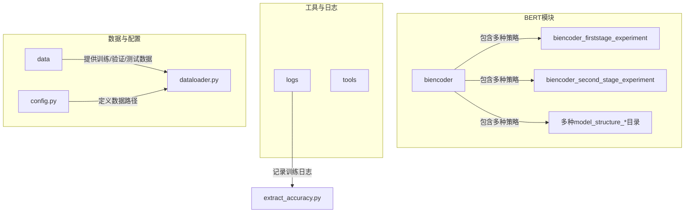
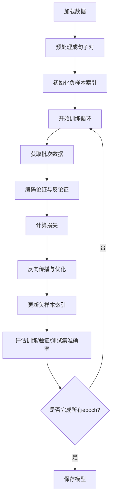
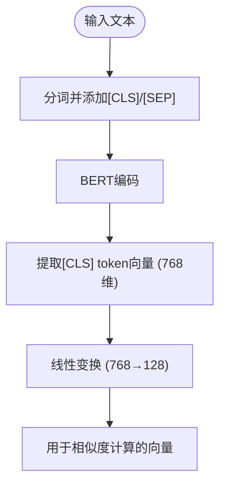
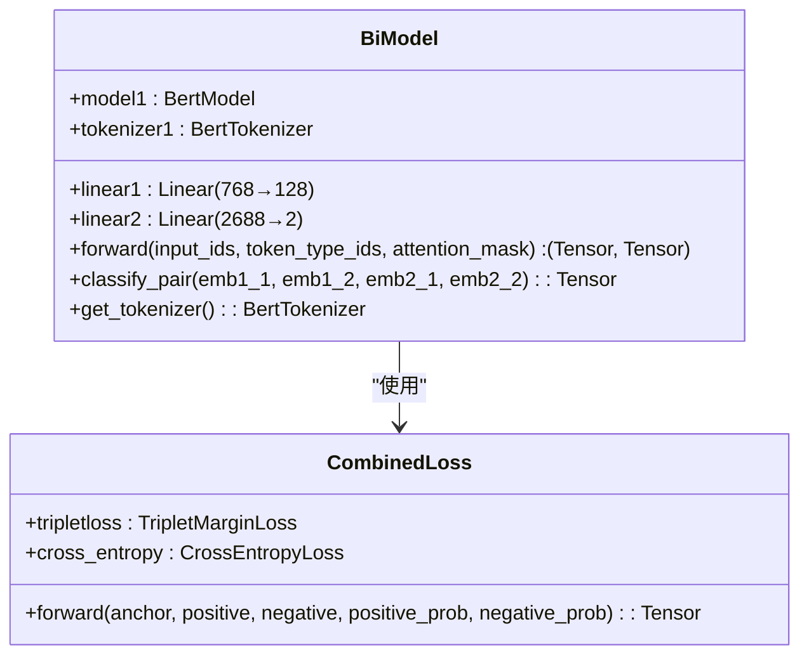
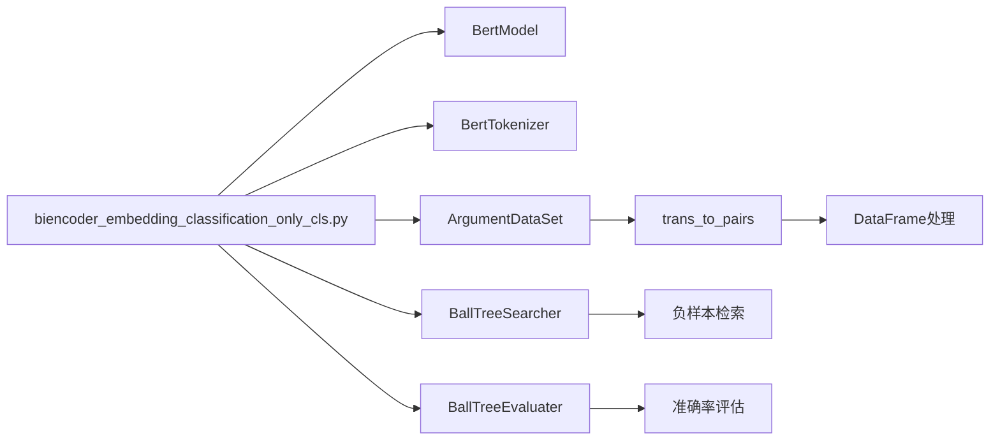

# 仅使用[CLS]向量（Only CLS）

<cite>
**本文档引用的文件**  
- [biencoder_embedding_classification_only_cls.py](file://bert/biencoder/biencoder_embedding_classification_only_cls.py)
- [biencoder_embedding_classification_only_cls_random.py](file://bert/biencoder/biencoder_embedding_classification_only_cls_random.py)
- [biencoder_embedding_classification_only_cls_without_random.py](file://bert/biencoder/biencoder_embedding_classification_only_cls_without_random.py)
- [biencoder_embedding_classification_concanated_together.py](file://bert/biencoder/biencoder_embedding_classification_concanated_together.py)
- [biencoder_embedding_classification_only_embedding.py](file://bert/biencoder/biencoder_embedding_classification_only_embedding.py)
- [bertdataloader.py](file://bert/bertdataloader.py)
- [config.py](file://config.py)
- [extract_accuracy.py](file://bert/logs/extract_accuracy.py)
- [without_layernorm_relu_with_hard_negatives_0.02_logs.txt](file://bert/logs/without_layernorm_relu_with_hard_negatives_0.02_logs.txt)
</cite>

## 目录
1. [引言](#引言)
2. [项目结构](#项目结构)
3. [核心组件](#核心组件)
4. [架构概述](#架构概述)
5. [详细组件分析](#详细组件分析)
6. [依赖分析](#依赖分析)
7. [性能考量](#性能考量)
8. [故障排除指南](#故障排除指南)
9. [结论](#结论)

## 引言
本文档详细阐述了'only_cls'特征融合策略的设计原理与实现方式。该策略基于`biencoder_embedding_classification_only_cls.py`文件，通过仅提取BERT输出中的[CLS] token向量作为句子表征，并用于后续分类任务。文档将讨论该方法在模型简洁性和推理效率上的优势，同时分析其在长文本或复杂语义场景下可能存在的表征能力不足问题。结合实际训练结果对比说明该方法在不同实验设置下的性能表现，并解释其输入维度显著低于其他策略的原因。

## 项目结构
本项目主要围绕论证检索与反论证生成任务构建，采用双编码器（Bi-Encoder）架构进行句子对匹配和分类。项目结构清晰地划分为多个实验变体，包括不同的特征融合策略、随机负采样设置以及归一化激活函数组合。

**图源**  
- [biencoder](file://bert/biencoder)
- [config.py](file://config.py)
- [dataloader.py](file://dataloader.py)

**本节来源**  
- [config.py](file://config.py#L3-L5)
- [bertdataloader.py](file://bert/bertdataloader.py#L2-L5)

## 核心组件
'only_cls'策略的核心在于从BERT模型的输出中仅提取[CLS] token的隐藏状态作为整个输入序列的固定长度向量表示。在`biencoder_embedding_classification_only_cls.py`中，BERT模型输出的`x[1]`即为[CLS] token的嵌入向量（768维），该向量随后被传递给一个线性层进行降维（128维）以用于相似度计算。

该策略通过`forward`方法实现，其中BERT模型处理输入ID、注意力掩码和token类型ID，并返回经过线性变换的[CLS]向量及其原始形式。分类任务则通过`classify_pair`方法完成，该方法接收两个句子对的嵌入向量并计算它们之间的差异特征。

**本节来源**  
- [biencoder_embedding_classification_only_cls.py](file://bert/biencoder/biencoder_embedding_classification_only_cls.py#L59-L63)
- [biencoder_embedding_classification_only_cls.py](file://bert/biencoder/biencoder_embedding_classification_only_cls.py#L64-L74)

## 架构概述
系统采用双编码器架构，两个BERT模型共享参数，分别编码论证（point）和反论证（counter）文本。训练流程包括初始化负样本索引、多轮训练迭代、动态更新负样本以及在训练集、验证集和测试集上评估top-1准确率。

**图源**  
- [biencoder_embedding_classification_only_cls.py](file://bert/biencoder/biencoder_embedding_classification_only_cls.py#L147-L282)

**本节来源**  
- [biencoder_embedding_classification_only_cls.py](file://bert/biencoder/biencoder_embedding_classification_only_cls.py#L147-L282)

## 详细组件分析

### only_cls策略分析
'only_cls'策略通过仅使用[CLS] token向量实现了极简的句子表征方式。这种设计充分利用了BERT预训练过程中[CLS] token被训练为聚合整个序列信息的特性。

#### 特征提取流程

**图源**  
- [biencoder_embedding_classification_only_cls.py](file://bert/biencoder/biencoder_embedding_classification_only_cls.py#L61)

**本节来源**  
- [biencoder_embedding_classification_only_cls.py](file://bert/biencoder/biencoder_embedding_classification_only_cls.py#L59-L63)

### 对比策略分析
为了评估'only_cls'策略的有效性，项目中实现了多种对比策略：

#### Concatenated Together策略
该策略将两个句子的所有token嵌入拼接在一起，形成更丰富的上下文表示，但显著增加了输入维度。

#### Only Embedding策略
此策略使用所有token嵌入的池化结果（如平均池化或最大池化）作为句子表征，试图捕捉更多局部语义信息。

**图源**  
- [biencoder_embedding_classification_only_cls.py](file://bert/biencoder/biencoder_embedding_classification_only_cls.py#L48-L78)
- [biencoder_embedding_classification_only_cls.py](file://bert/biencoder/biencoder_embedding_classification_only_cls.py#L129-L140)

**本节来源**  
- [biencoder_embedding_classification_concanated_together.py](file://bert/biencoder/biencoder_embedding_classification_concanated_together.py)
- [biencoder_embedding_classification_only_embedding.py](file://bert/biencoder/biencoder_embedding_classification_only_embedding.py)

## 依赖分析
系统依赖于多个关键组件协同工作：

**图源**  
- [biencoder_embedding_classification_only_cls.py](file://bert/biencoder/biencoder_embedding_classification_only_cls.py)
- [bertdataloader.py](file://bert/bertdataloader.py)

**本节来源**  
- [biencoder_embedding_classification_only_cls.py](file://bert/biencoder/biencoder_embedding_classification_only_cls.py#L5-L13)
- [bertdataloader.py](file://bert/bertdataloader.py#L1-L44)

## 性能考量
'only_cls'策略在模型简洁性和推理效率方面具有明显优势：
- **输入维度小**：仅使用768维的[CLS]向量，远低于拼接所有token嵌入的策略。
- **计算效率高**：减少了后续分类器的参数量和计算复杂度。
- **内存占用少**：适合部署在资源受限的环境中。

然而，在长文本或复杂语义场景下可能存在表征能力不足的问题：
- [CLS] token可能无法充分捕捉长文本中的所有关键信息。
- 对于需要关注多个局部语义片段的任务，单一向量表示可能不够。

根据日志文件`without_layernorm_relu_with_hard_negatives_0.02_logs.txt`中的训练记录，该策略在训练集、验证集和测试集上均表现出稳定的top-1准确率增长趋势。通过`extract_accuracy.py`脚本可将日志中的准确率数据可视化，便于分析模型收敛情况。

**本节来源**  
- [biencoder_embedding_classification_only_cls.py](file://bert/biencoder/biencoder_embedding_classification_only_cls.py#L207-L277)
- [extract_accuracy.py](file://bert/logs/extract_accuracy.py)
- [without_layernorm_relu_with_hard_negatives_0.02_logs.txt](file://bert/logs/without_layernorm_relu_with_hard_negatives_0.02_logs.txt)

## 故障排除指南
当使用'only_cls'策略遇到性能瓶颈时，可考虑以下解决方案：
- 检查BERT模型是否已正确加载预训练权重。
- 确认[CLS] token的提取逻辑是否正确（应为`outputs[1]`或`outputs.pooler_output`）。
- 验证负样本生成过程是否正常工作。
- 检查学习率设置是否合理，避免训练不稳定。
- 确保数据预处理流程（如截断、填充）一致且正确。

**本节来源**  
- [biencoder_embedding_classification_only_cls.py](file://bert/biencoder/biencoder_embedding_classification_only_cls.py#L167-L173)
- [biencoder_embedding_classification_only_cls.py](file://bert/biencoder/biencoder_embedding_classification_only_cls.py#L199-L201)

## 结论
'only_cls'特征融合策略通过仅提取BERT输出中的[CLS] token向量作为句子表征，实现了高效且简洁的文本分类方法。该策略在保持较高准确率的同时，显著降低了模型复杂度和推理成本。尽管在处理长文本或复杂语义时可能存在表征能力局限，但其在大多数标准任务中仍表现出良好的性能。通过与其他策略（如拼接所有嵌入或使用池化操作）的对比实验，可以更好地理解其适用场景和优化方向。