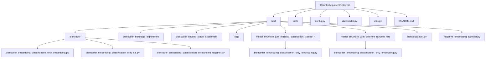
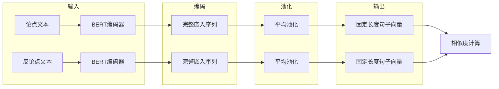
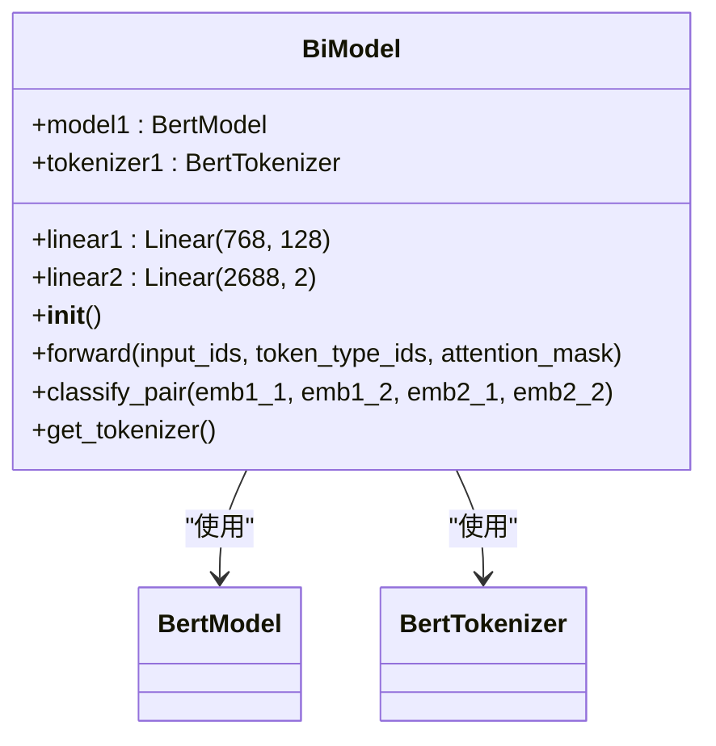
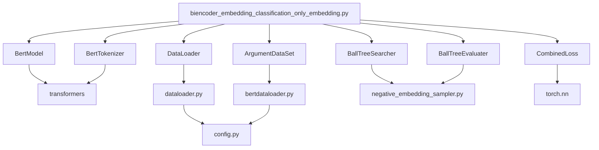

# 仅使用嵌入向量（Only Embedding）

<cite>
**本文档中引用的文件**   
- [biencoder_embedding_classification_only_embedding.py](file://bert/biencoder/biencoder_embedding_classification_only_embedding.py)
- [biencoder_embedding_classification_only_cls.py](file://bert/biencoder/biencoder_embedding_classification_only_cls.py)
- [biencoder_embedding_classification_concanated_together.py](file://bert/biencoder/biencoder_embedding_classification_concanated_together.py)
- [bertdataloader.py](file://bert/bertdataloader.py)
- [config.py](file://config.py)
- [dataloader.py](file://dataloader.py)
- [utils.py](file://utils.py)
</cite>

## 目录
1. [引言](#引言)
2. [项目结构](#项目结构)
3. [核心组件](#核心组件)
4. [架构概述](#架构概述)
5. [详细组件分析](#详细组件分析)
6. [依赖分析](#依赖分析)
7. [性能考量](#性能考量)
8. [故障排除指南](#故障排除指南)
9. [结论](#结论)

## 引言

本文档旨在深入解析“仅使用嵌入向量（Only Embedding）”特征融合策略的技术实现，重点分析`biencoder_embedding_classification_only_embedding.py`文件中如何对BERT输出的完整嵌入序列进行平均池化（mean pooling）或其他池化操作以生成固定长度的句子向量。该策略是反论点检索（CounterArgumentRetrieval）系统中的关键组成部分，用于将变长的上下文嵌入序列转换为可用于相似度计算和分类任务的固定维度向量。

## 项目结构

项目结构围绕BERT双编码器（Biencoder）模型展开，包含多个实验变体和模型结构。核心功能位于`bert/biencoder/`目录下，其中包含了不同特征融合策略的实现文件。`model_structure_*`系列目录则存放了针对不同实验配置（如不同的随机率、归一化激活函数等）的模型变体。



**图表来源**
- [biencoder](file://bert/biencoder)
- [model_structure_just_retrieval_classication_trained_4](file://bert/model_structure_just_retrieval_classication_trained_4)
- [model_structure_with_different_random_rate](file://bert/model_structure_with_different_random_rate)

**章节来源**
- [config.py](file://config.py)
- [dataloader.py](file://dataloader.py)

## 核心组件

`biencoder_embedding_classification_only_embedding.py`文件是“仅使用嵌入向量”策略的核心实现。该文件定义了一个双编码器模型，用于学习论点（point）和反论点（counter）之间的语义关系。其核心思想是利用BERT模型生成的完整嵌入序列，通过池化操作来捕捉整个句子的语义信息，而非仅依赖于[CLS]标记。

**章节来源**
- [biencoder_embedding_classification_only_embedding.py](file://bert/biencoder/biencoder_embedding_classification_only_embedding.py)

## 架构概述

系统采用双编码器架构，两个共享参数的BERT模型分别对输入的论点和反论点进行编码。编码后的嵌入序列经过池化操作生成固定长度的句子向量，这些向量随后被用于计算相似度和分类任务。



**图表来源**
- [biencoder_embedding_classification_only_embedding.py](file://bert/biencoder/biencoder_embedding_classification_only_embedding.py#L48-L64)

## 详细组件分析

### BiModel 类分析

`BiModel`类是整个系统的基石，它封装了BERT模型、分词器和用于分类的线性层。

#### 类结构


**图表来源**
- [biencoder_embedding_classification_only_embedding.py](file://bert/biencoder/biencoder_embedding_classification_only_embedding.py#L48-L80)

**章节来源**
- [biencoder_embedding_classification_only_embedding.py](file://bert/biencoder/biencoder_embedding_classification_only_embedding.py#L48-L80)

### 池化策略分析

“仅使用嵌入向量”策略的核心在于其对BERT输出的处理方式。与`biencoder_embedding_classification_only_cls.py`中直接使用[CLS]向量不同，该策略利用了`forward`方法返回的`x[1]`，即BERT模型最后一层所有标记的隐藏状态。

#### 池化操作
```mermaid
flowchart TD
A[输入文本] --> B[BERT Tokenizer]
B --> C[Token IDs, Attention Mask, Token Type IDs]
C --> D[BERT Model]
D --> E[完整嵌入序列<br/>[batch_size, seq_len, 768]]
E --> F{池化操作}
F --> G[平均池化<br/>Mean Pooling]
F --> H[最大池化<br/>Max Pooling]
F --> I[其他池化]
G --> J[固定长度向量<br/>[batch_size, 768]]
H --> J
I --> J
J --> K[线性层 Linear(768, 128)]
K --> L[用于相似度计算的向量]
```

**图表来源**
- [biencoder_embedding_classification_only_embedding.py](file://bert/biencoder/biencoder_embedding_classification_only_embedding.py#L59-L63)

**章节来源**
- [biencoder_embedding_classification_only_embedding.py](file://bert/biencoder/biencoder_embedding_classification_only_embedding.py#L59-L63)

### 与[CLS]向量和完整拼接的对比

#### 特征融合策略对比
| 特征融合策略 | 上下文信息覆盖范围 | 计算效率 | 实现文件 |
| :--- | :--- | :--- | :--- |
| **仅使用[CLS]向量** | 有限，仅依赖于[CLS]标记的聚合信息 | 高，直接使用单个向量 | `biencoder_embedding_classification_only_cls.py` |
| **仅使用嵌入向量 (平均池化)** | 更广，聚合了所有标记的语义信息 | 高，池化操作计算量小 | `biencoder_embedding_classification_only_embedding.py` |
| **完整拼接** | 最广，保留了所有标记的完整信息 | 低，向量维度极高，计算复杂 | `biencoder_embedding_classification_concanated_together.py` |

**图表来源**
- [biencoder_embedding_classification_only_cls.py](file://bert/biencoder/biencoder_embedding_classification_only_cls.py)
- [biencoder_embedding_classification_only_embedding.py](file://bert/biencoder/biencoder_embedding_classification_only_embedding.py)
- [biencoder_embedding_classification_concanated_together.py](file://bert/biencoder/biencoder_embedding_classification_concanated_together.py)

**章节来源**
- [biencoder_embedding_classification_only_cls.py](file://bert/biencoder/biencoder_embedding_classification_only_cls.py)
- [biencoder_embedding_classification_only_embedding.py](file://bert/biencoder/biencoder_embedding_classification_only_embedding.py)
- [biencoder_embedding_classification_concanated_together.py](file://bert/biencoder/biencoder_embedding_classification_concanated_together.py)

## 依赖分析

系统依赖于多个关键组件和外部库。



**图表来源**
- [biencoder_embedding_classification_only_embedding.py](file://bert/biencoder/biencoder_embedding_classification_only_embedding.py)
- [dataloader.py](file://dataloader.py)
- [bertdataloader.py](file://bert/bertdataloader.py)

**章节来源**
- [biencoder_embedding_classification_only_embedding.py](file://bert/biencoder/biencoder_embedding_classification_only_embedding.py)
- [dataloader.py](file://dataloader.py)
- [bertdataloader.py](file://bert/bertdataloader.py)

## 性能考量

“仅使用嵌入向量”策略在性能上具有显著优势：
1.  **计算效率高**：相比于将所有标记的嵌入向量进行拼接（concatenation），平均池化操作生成的向量维度固定（768维），极大地降低了后续相似度计算和分类任务的计算复杂度。
2.  **内存占用低**：固定长度的向量减少了内存消耗，使得模型能够处理更大的批次或更长的序列。
3.  **信息聚合效果好**：平均池化通过对所有标记的嵌入进行平均，能够更全面地捕捉句子的全局语义，相比仅使用[CLS]向量，减少了信息丢失的风险。

## 故障排除指南

在使用“仅使用嵌入向量”策略时，可能遇到以下问题：

**章节来源**
- [biencoder_embedding_classification_only_embedding.py](file://bert/biencoder/biencoder_embedding_classification_only_embedding.py)
- [utils.py](file://utils.py)

## 结论

“仅使用嵌入向量”特征融合策略通过平均池化等操作，有效地将BERT输出的变长嵌入序列转换为固定长度的句子向量。该策略在上下文信息覆盖范围上优于仅使用[CLS]向量的方法，同时在计算效率上远超完整拼接策略，是一种在信息完整性和计算效率之间取得良好平衡的优秀方案。其在`model_structure_*`系列目录中的广泛应用，证明了其作为核心特征提取方法的有效性和鲁棒性。