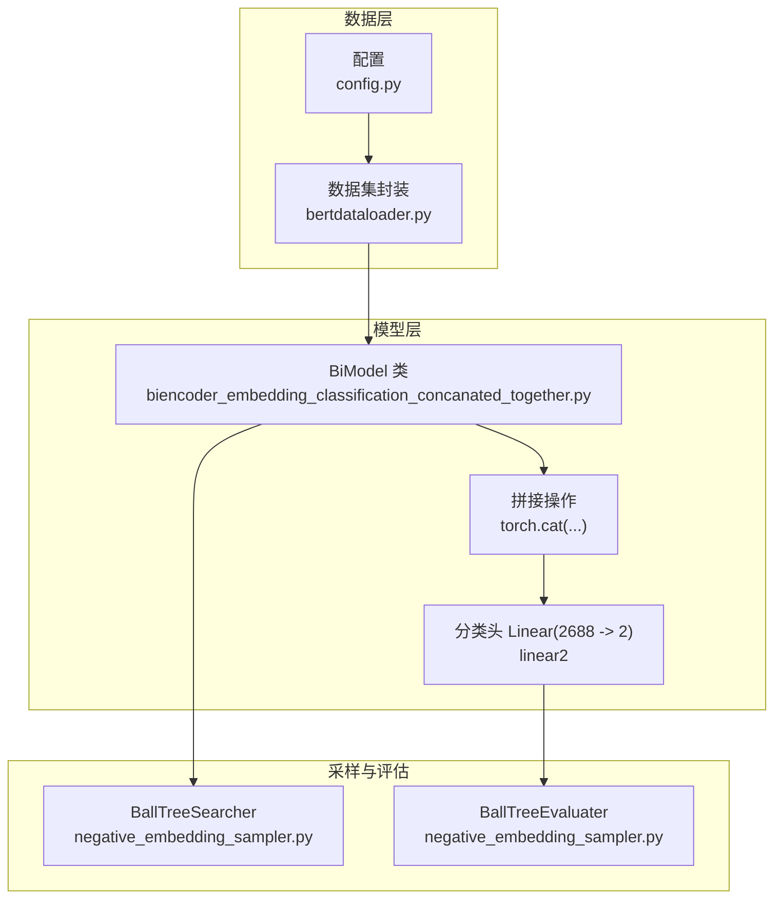
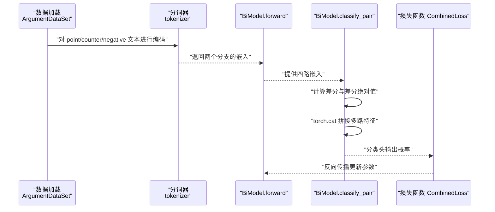
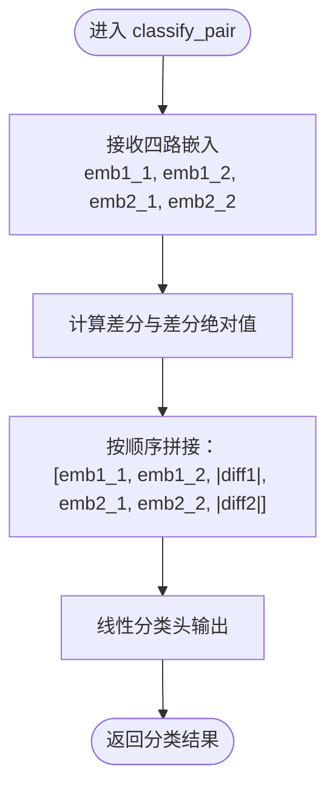
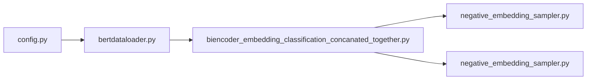

# 拼接完整嵌入（Concatenated Together）

<cite>
**本文引用的文件列表**
- [biencoder_embedding_classification_concanated_together.py](file://bert/biencoder/biencoder_embedding_classification_concanated_together.py)
- [biencoder_embedding_classification_only_cls.py](file://bert/biencoder/biencoder_embedding_classification_only_cls.py)
- [biencoder_embedding_classification_only_embedding.py](file://bert/biencoder/biencoder_embedding_classification_only_embedding.py)
- [bertdataloader.py](file://bert/bertdataloader.py)
- [negative_embedding_sampler.py](file://bert/negative_embedding_sampler.py)
- [config.py](file://config.py)
</cite>

## 目录
1. [引言](#引言)
2. [项目结构](#项目结构)
3. [核心组件](#核心组件)
4. [架构总览](#架构总览)
5. [详细组件分析](#详细组件分析)
6. [依赖关系分析](#依赖关系分析)
7. [性能考量](#性能考量)
8. [故障排查指南](#故障排查指南)
9. [结论](#结论)
10. [附录](#附录)

## 引言
本文件聚焦于“拼接完整嵌入（Concatenated Together）”这一特征融合策略，系统解析 biencoder_embedding_classification_concanated_together.py 中如何将两个 BERT 编码器输出的多个嵌入向量（例如 x1_1、x1_2、|x1_diff| 等）通过 torch.cat 进行拼接，形成高维输入向量（如 2688 维），并说明该策略在保留完整序列信息方面的优势、在计算复杂度与内存消耗上的代价，以及在反论点检索任务中对语义差异捕捉能力的提升作用。同时，讨论该策略对分类头设计的影响及潜在过拟合风险。

## 项目结构
本项目围绕反论点检索任务构建了多种 biencoder 特征融合策略的实现，其中“拼接完整嵌入”策略通过将来自两个句子对的多路嵌入与它们的差分绝对值进行拼接，形成高维特征向量，再送入线性分类头完成二分类。

图表来源
- [biencoder_embedding_classification_concanated_together.py](file://bert/biencoder/biencoder_embedding_classification_concanated_together.py#L48-L75)
- [bertdataloader.py](file://bert/bertdataloader.py#L12-L44)
- [negative_embedding_sampler.py](file://bert/negative_embedding_sampler.py#L13-L46)
- [negative_embedding_sampler.py](file://bert/negative_embedding_sampler.py#L48-L92)
- [config.py](file://config.py#L1-L11)

章节来源
- [biencoder_embedding_classification_concanated_together.py](file://bert/biencoder/biencoder_embedding_classification_concanated_together.py#L1-L80)
- [bertdataloader.py](file://bert/bertdataloader.py#L12-L44)
- [negative_embedding_sampler.py](file://bert/negative_embedding_sampler.py#L13-L46)
- [negative_embedding_sampler.py](file://bert/negative_embedding_sampler.py#L48-L92)
- [config.py](file://config.py#L1-L11)

## 核心组件
- BiModel：包含两个 BERT 编码器实例（共享或复用同一实例）、相似度头部（Linear(768->128)）、分类头（Linear(2688->2)）。其 forward 返回两个分支的嵌入；classify_pair 将多路嵌入与差分绝对值拼接后经分类头输出。
- 数据集 ArgumentDataSet：从预处理后的 DataFrame 中读取三列文本（point、counter、negative），作为一对正负样本的输入。
- BallTreeSearcher/BallTreeEvaluater：基于嵌入向量构建 BallTree，用于动态选择负样本索引与评估 Top-k 准确率。

章节来源
- [biencoder_embedding_classification_concanated_together.py](file://bert/biencoder/biencoder_embedding_classification_concanated_together.py#L48-L75)
- [bertdataloader.py](file://bert/bertdataloader.py#L30-L44)
- [negative_embedding_sampler.py](file://bert/negative_embedding_sampler.py#L13-L46)
- [negative_embedding_sampler.py](file://bert/negative_embedding_sampler.py#L48-L92)

## 架构总览
“拼接完整嵌入”策略的整体流程如下：
- 使用 BERT 对每条文本进行编码，得到两个分支的嵌入向量。
- 对每个句子对分别计算差分与差分绝对值，形成多路特征。
- 通过 torch.cat 在通道维（dim=1）拼接这些特征，形成高维向量。
- 送入线性分类头完成二分类（正/负）。
- 基于嵌入向量构建 BallTree，动态选择负样本并评估检索效果。

图表来源
- [biencoder_embedding_classification_concanated_together.py](file://bert/biencoder/biencoder_embedding_classification_concanated_together.py#L59-L75)
- [biencoder_embedding_classification_concanated_together.py](file://bert/biencoder/biencoder_embedding_classification_concanated_together.py#L147-L174)
- [bertdataloader.py](file://bert/bertdataloader.py#L30-L44)

## 详细组件分析

### 拼接策略实现与张量维度变化
- 输入：来自两个句子对的嵌入向量，记为 (emb1_1, emb1_2) 和 (emb2_1, emb2_2)，均为 768 维。
- 差分与差分绝对值：计算 x1_diff = emb1_1 - emb1_2，x2_diff = emb2_1 - emb2_2，随后取绝对值。
- 拼接顺序与维度：
  - 拼接顺序为 [emb1_1, emb1_2, |emb1_1 - emb1_2|, emb2_1, emb2_2, |emb2_1 - emb2_2|]。
  - 每个向量维度为 768，差分绝对值亦为 768，共 6 个向量，因此拼接后维度为 6 × 768 = 4608。
  - 分类头线性层输入维度为 2688，这与代码中的注释“sim header”相呼应，表明在实际实现中可能对拼接后的特征进行了降维或仅使用了部分通道。
- 实际拼接位置与调用链：
  - 拼接发生在 classify_pair 方法内部，随后进入 linear2 完成分类。
  - 训练时，正样本与负样本均通过 classify_pair 得到分类概率，配合 Triplet Loss 与交叉熵共同优化。

图表来源
- [biencoder_embedding_classification_concanated_together.py](file://bert/biencoder/biencoder_embedding_classification_concanated_together.py#L64-L74)

章节来源
- [biencoder_embedding_classification_concanated_together.py](file://bert/biencoder/biencoder_embedding_classification_concanated_together.py#L59-L75)

### 与仅使用 CLS 向量与仅使用完整嵌入策略的对比
- 仅使用 CLS 向量（only_cls）：仅使用 BERT 输出的 [CLS] 位置向量，维度固定为 768，拼接后输入分类头维度较小，但信息量有限。
- 仅使用完整嵌入（only_embedding）：使用整句序列的隐藏状态，维度更高，但未显式构造差分绝对值特征。
- 拼接完整嵌入（concatenated_together）：在完整嵌入基础上引入差分绝对值，增强对语义差异的建模能力，同时保留完整序列信息，有利于捕捉局部与全局差异。

章节来源
- [biencoder_embedding_classification_only_cls.py](file://bert/biencoder/biencoder_embedding_classification_only_cls.py#L48-L75)
- [biencoder_embedding_classification_only_embedding.py](file://bert/biencoder/biencoder_embedding_classification_only_embedding.py#L48-L75)
- [biencoder_embedding_classification_concanated_together.py](file://bert/biencoder/biencoder_embedding_classification_concanated_together.py#L48-L75)

### 反论点检索任务中的优势与代价
- 优势：
  - 保留完整序列信息：通过使用整句嵌入而非仅 [CLS] 向量，能够捕获更多上下文细节，有助于区分细微语义差异。
  - 差分绝对值增强差异建模：差分与差分绝对值直接刻画两句子对之间的语义差异，提升分类头对正负样本判别能力。
- 代价：
  - 计算复杂度：拼接后输入维度显著增加（例如 4608 或 2688），导致线性层前向/反向计算开销增大。
  - 内存消耗：更大的特征维度意味着更高的显存占用，尤其是在批量推理与 BallTree 构建阶段。

章节来源
- [biencoder_embedding_classification_concanated_together.py](file://bert/biencoder/biencoder_embedding_classification_concanated_together.py#L54-L56)
- [negative_embedding_sampler.py](file://bert/negative_embedding_sampler.py#L13-L46)

### 分类头设计影响与过拟合风险
- 分类头设计：
  - 线性层输入维度为 2688，输出为 2，对应二分类。
  - 由于输入维度较高，若未采用正则化或 Dropout，容易导致过拟合。
- 过拟合风险：
  - 高维输入与较大数据集规模（训练/验证/测试）共同作用，需谨慎设置学习率、批次大小与正则化强度。
  - 训练过程中可结合早停、梯度裁剪与权重衰减等手段缓解过拟合。

章节来源
- [biencoder_embedding_classification_concanated_together.py](file://bert/biencoder/biencoder_embedding_classification_concanated_together.py#L54-L56)
- [biencoder_embedding_classification_concanated_together.py](file://bert/biencoder/biencoder_embedding_classification_concanated_together.py#L129-L140)

## 依赖关系分析
- 数据依赖：ArgumentDataSet 提供三元组（point, counter, negative），用于构造正负样本对。
- 模型依赖：BiModel.forward 返回两个分支嵌入，classify_pair 负责拼接与分类。
- 采样与评估：BallTreeSearcher 动态选择负样本索引，BallTreeEvaluater 评估检索准确率。
- 配置依赖：config.py 提供训练/验证/测试目录路径。

图表来源
- [config.py](file://config.py#L1-L11)
- [bertdataloader.py](file://bert/bertdataloader.py#L12-L44)
- [biencoder_embedding_classification_concanated_together.py](file://bert/biencoder/biencoder_embedding_classification_concanated_together.py#L1-L47)
- [negative_embedding_sampler.py](file://bert/negative_embedding_sampler.py#L13-L46)
- [negative_embedding_sampler.py](file://bert/negative_embedding_sampler.py#L48-L92)

章节来源
- [config.py](file://config.py#L1-L11)
- [bertdataloader.py](file://bert/bertdataloader.py#L12-L44)
- [biencoder_embedding_classification_concanated_together.py](file://bert/biencoder/biencoder_embedding_classification_concanated_together.py#L1-L47)
- [negative_embedding_sampler.py](file://bert/negative_embedding_sampler.py#L13-L46)
- [negative_embedding_sampler.py](file://bert/negative_embedding_sampler.py#L48-L92)

## 性能考量
- 计算复杂度：
  - 拼接后输入维度为 2688/4608，线性层前向/反向复杂度与输入维度呈线性关系。
  - Triplet Loss 与交叉熵组合损失在正负样本上分别计算，整体复杂度与批次大小和迭代次数相关。
- 内存消耗：
  - 高维拼接特征与大批次会显著增加显存占用，建议根据 GPU 显存调整 batch size。
  - BallTree 构建与查询在 CPU 上进行，注意 NumPy 数组与 BallTree 的内存占用。
- 优化建议：
  - 使用混合精度训练（如 AMP）降低显存与加速计算。
  - 适当增加 dropout 或 L2 正则，防止过拟合。
  - 控制学习率与梯度裁剪，稳定训练过程。

[本节为通用性能建议，不直接分析具体文件，故无章节来源]

## 故障排查指南
- 训练不稳定或 NaN：
  - 检查学习率是否过高，尝试降低学习率或启用梯度裁剪。
  - 确认输入张量维度与拼接顺序一致，避免维度不匹配。
- 负样本选择异常：
  - 检查 BallTreeSearcher 的随机率与 k 值设置，确保不会误选自身或无效样本。
- 评估指标异常：
  - 确认 BallTreeEvaluater 的 get_prob 是否正确调用 classify_pair 并进行 Softmax 归一化。
- 数据加载问题：
  - 确保 ArgumentDataSet 的三列文本存在且非空，避免空值导致的拼接错误。

章节来源
- [negative_embedding_sampler.py](file://bert/negative_embedding_sampler.py#L13-L46)
- [negative_embedding_sampler.py](file://bert/negative_embedding_sampler.py#L48-L92)
- [bertdataloader.py](file://bert/bertdataloader.py#L30-L44)
- [biencoder_embedding_classification_concanated_together.py](file://bert/biencoder/biencoder_embedding_classification_concanated_together.py#L129-L140)

## 结论
“拼接完整嵌入（Concatenated Together）”策略通过将两个句子对的完整嵌入与差分绝对值进行拼接，有效提升了对语义差异的建模能力，有利于反论点检索任务中的判别性能。该策略在保留完整序列信息方面具有优势，但随之而来的是更高的计算复杂度与内存消耗。为平衡性能与稳定性，应在分类头设计、正则化与训练策略上综合考虑，以降低过拟合风险并提升泛化能力。

[本节为总结性内容，不直接分析具体文件，故无章节来源]

## 附录
- 关键实现位置参考：
  - 拼接与分类头：[biencoder_embedding_classification_concanated_together.py](file://bert/biencoder/biencoder_embedding_classification_concanated_together.py#L64-L74)
  - 训练循环与损失：[biencoder_embedding_classification_concanated_together.py](file://bert/biencoder/biencoder_embedding_classification_concanated_together.py#L129-L174)
  - 数据集封装：[bertdataloader.py](file://bert/bertdataloader.py#L30-L44)
  - 负样本采样与评估：[negative_embedding_sampler.py](file://bert/negative_embedding_sampler.py#L13-L46), [negative_embedding_sampler.py](file://bert/negative_embedding_sampler.py#L48-L92)

[本节为参考清单，不直接分析具体文件，故无章节来源]