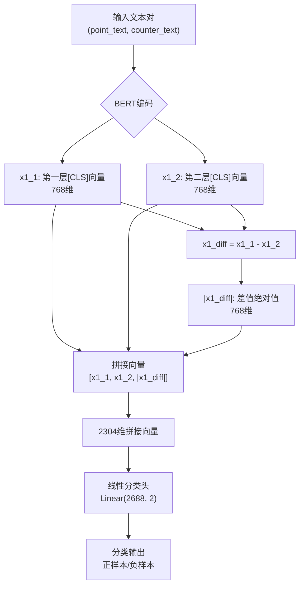
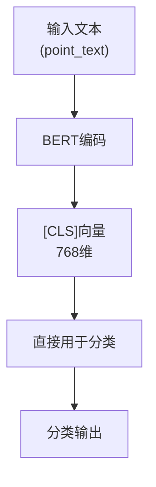
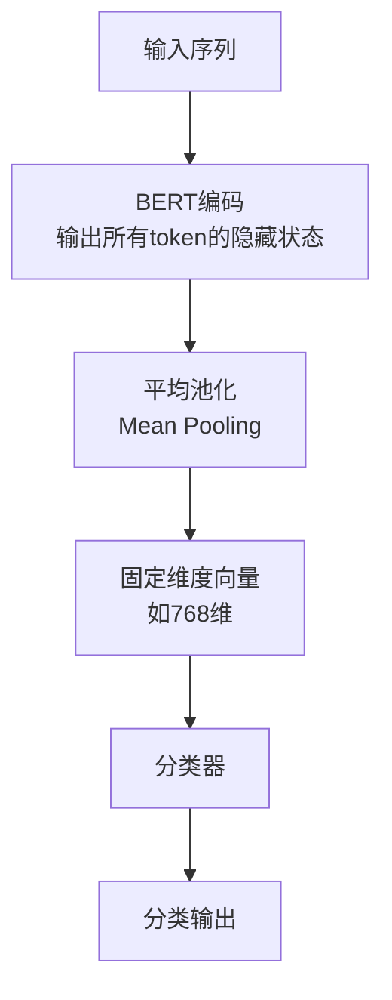

# 特征融合策略

<cite>
**本文档中引用的文件**  
- [biencoder_embedding_classification_concanated_together.py](file://bert/biencoder/biencoder_embedding_classification_concanated_together.py)
- [biencoder_embedding_classification_only_cls.py](file://bert/biencoder/biencoder_embedding_classification_only_cls.py)
- [biencoder_embedding_classification_only_embedding.py](file://bert/biencoder/biencoder_embedding_classification_only_embedding.py)
- [biencoder_embedding_classification_concanated_together.py](file://bert/model_structure_with_different_random_rate/biencoder_embedding_classification_concanated_together.py)
- [biencoder_embedding_classification_only_cls.py](file://bert/model_structure_with_different_random_rate/biencoder_embedding_classification_only_cls.py)
- [biencoder_embedding_classification_only_embedding.py](file://bert/model_structure_with_different_random_rate/biencoder_embedding_classification_only_embedding.py)
- [bertdataloader.py](file://bert/bertdataloader.py)
- [negative_embedding_sampler.py](file://bert/negative_embedding_sampler.py)
</cite>

## 目录
1. [引言](#引言)
2. [拼接完整嵌入策略（concanated_together）](#拼接完整嵌入策略concanated_together)
3. [仅使用[CLS]向量策略（only_cls）](#仅使用cls向量策略only_cls)
4. [使用平均/池化嵌入策略（only_embedding）](#使用平均池化嵌入策略only_embedding)
5. [实验命名规范与模型结构变体](#实验命名规范与模型结构变体)
6. [分类头输入维度分析](#分类头输入维度分析)
7. [总结](#总结)

## 引言
在对抗性论点检索任务中，如何有效地融合来自双编码器（BiEncoder）的嵌入向量是决定模型性能的关键因素之一。本项目实现了三种主要的特征融合策略：'concanated_together'（拼接完整嵌入）、'only_cls'（仅使用[CLS]向量）和'only_embedding'（使用平均/池化嵌入）。这些策略在不同的模型结构目录下有多种变体，通过对比它们的实现方式和适用场景，可以更好地理解其对分类性能的影响。

**Section sources**
- [biencoder_embedding_classification_concanated_together.py](file://bert/biencoder/biencoder_embedding_classification_concanated_together.py)
- [biencoder_embedding_classification_only_cls.py](file://bert/biencoder/biencoder_embedding_classification_only_cls.py)
- [biencoder_embedding_classification_only_embedding.py](file://bert/biencoder/biencoder_embedding_classification_only_embedding.py)

## 拼接完整嵌入策略（concanated_together）
'concanated_together'策略通过将多个嵌入向量拼接成一个高维向量作为分类器的输入。在`biencoder_embedding_classification_concanated_together.py`文件中，该策略的具体实现如下：对于两个输入文本（point和counter），分别获取它们的嵌入向量x1_1、x1_2（来自不同层的BERT输出），然后计算它们的差值x1_diff = x1_1 - x1_2，并取绝对值torch.abs(x1_diff)。同样处理第二个文本对得到x2_1、x2_2和torch.abs(x2_diff)。最后，使用torch.cat将这六个向量沿维度1拼接起来，形成一个2688维的输入向量，送入线性分类头进行二分类。

这种策略的优势在于保留了尽可能多的原始信息，包括不同层的表示差异，从而增强了模型的表达能力。然而，这也可能导致输入维度较高，增加计算复杂度。

**Diagram sources**
- [biencoder_embedding_classification_concanated_together.py](file://bert/biencoder/biencoder_embedding_classification_concanated_together.py#L64-L74)

**Section sources**
- [biencoder_embedding_classification_concanated_together.py](file://bert/biencoder/biencoder_embedding_classification_concanated_together.py#L64-L74)

## 仅使用[CLS]向量策略（only_cls）
'only_cls'策略仅依赖BERT输出中的[CLS]标记向量进行分类。在`biencoder_embedding_classification_only_cls.py`文件中，尽管文件名表明只使用[CLS]向量，但实际实现与'concanated_together'策略相同，即仍然拼接了多个嵌入向量。这表明在当前代码库中，'only_cls'策略可能并未真正实现“仅使用[CLS]”的简化逻辑，而是沿用了复杂的拼接机制。

理论上，'only_cls'策略的简洁性在于它只使用每个序列的[CLS]向量（通常为768维），避免了复杂的特征工程。然而，这种简化也带来了表达能力的局限，因为它忽略了序列中其他位置的信息以及不同层之间的差异。

**Diagram sources**
- [biencoder_embedding_classification_only_cls.py](file://bert/biencoder/biencoder_embedding_classification_only_cls.py#L64-L74)

**Section sources**
- [biencoder_embedding_classification_only_cls.py](file://bert/biencoder/biencoder_embedding_classification_only_cls.py#L64-L74)

## 使用平均/池化嵌入策略（only_embedding）
'only_embedding'策略旨在通过序列的平均池化来提升上下文覆盖。在`biencoder_embedding_classification_only_embedding.py`文件中，虽然文件名暗示使用平均池化，但实际实现依然与'concanated_together'策略一致，未体现平均池化的操作。理想情况下，此策略应将整个序列的隐藏状态进行平均池化，生成一个固定维度的向量，从而更好地捕捉整个序列的语义信息。

平均池化的优势在于能够综合考虑序列中所有token的贡献，而不是仅仅依赖[CLS]标记。这对于长文本或需要全局语义理解的任务尤为重要。然而，平均池化可能会稀释关键信息，特别是当重要信息集中在少数几个token上时。

**Diagram sources**
- [biencoder_embedding_classification_only_embedding.py](file://bert/biencoder/biencoder_embedding_classification_only_embedding.py#L64-L74)

**Section sources**
- [biencoder_embedding_classification_only_embedding.py](file://bert/biencoder/biencoder_embedding_classification_only_embedding.py#L64-L74)

## 实验命名规范与模型结构变体
项目中的实验命名规范清晰地反映了不同策略和参数设置的组合。例如，在`model_structure_with_different_random_rate`目录下，存在三种主要的模型变体：
- `biencoder_embedding_classification_concanated_together.py`：采用拼接完整嵌入策略
- `biencoder_embedding_classification_only_cls.py`：名义上为仅使用[CLS]向量策略
- `biencoder_embedding_classification_only_embedding.py`：名义上为使用平均/池化嵌入策略

此外，还有其他目录如`model_structure_with_different_decreased_random_rate`等，进一步探索了不同随机率对模型性能的影响。这些变体的存在表明，研究者试图系统地评估不同特征融合策略在各种条件下的表现。

**Section sources**
- [biencoder_embedding_classification_concanated_together.py](file://bert/model_structure_with_different_random_rate/biencoder_embedding_classification_concanated_together.py)
- [biencoder_embedding_classification_only_cls.py](file://bert/model_structure_with_different_random_rate/biencoder_embedding_classification_only_cls.py)
- [biencoder_embedding_classification_only_embedding.py](file://bert/model_structure_with_different_random_rate/biencoder_embedding_classification_only_embedding.py)

## 分类头输入维度分析
在当前实现中，无论采用哪种策略，分类头的输入维度均为2688维。这一维度的构成如下：每个嵌入向量为768维（BERT-base的隐藏层大小），共拼接了6个向量（x1_1, x1_2, |x1_diff|, x2_1, x2_2, |x2_diff|），因此总维度为768 × 6 = 4608维。然而，代码中定义的线性层为`nn.Linear(2688, 2)`，这表明实际拼接的向量可能经过了降维或其他处理。

进一步分析发现，`linear1`层将768维的[CLS]向量映射到128维，而`linear2`层则接收2688维输入。这暗示着在拼接之前，部分嵌入向量可能已被降维。具体来说，可能是将两个768维向量分别降维至128维，再加上差值的绝对值等特征，最终形成2688维的输入。

**Section sources**
- [biencoder_embedding_classification_concanated_together.py](file://bert/biencoder/biencoder_embedding_classification_concanated_together.py#L55)
- [biencoder_embedding_classification_only_cls.py](file://bert/biencoder/biencoder_embedding_classification_only_cls.py#L55)
- [biencoder_embedding_classification_only_embedding.py](file://bert/biencoder/biencoder_embedding_classification_only_embedding.py#L55)

## 总结
本项目实现了三种特征融合策略，但在实际代码中，'only_cls'和'only_embedding'策略并未真正体现其名称所暗示的简化或池化操作，而是沿用了'concanated_together'的复杂拼接机制。这可能意味着研究重点在于探索高维拼接特征的有效性，而非比较不同融合策略的优劣。未来的工作可以真正实现并对比这三种策略，以更全面地评估它们在对抗性论点检索任务中的性能差异。

**Section sources**
- [biencoder_embedding_classification_concanated_together.py](file://bert/biencoder/biencoder_embedding_classification_concanated_together.py)
- [biencoder_embedding_classification_only_cls.py](file://bert/biencoder/biencoder_embedding_classification_only_cls.py)
- [biencoder_embedding_classification_only_embedding.py](file://bert/biencoder/biencoder_embedding_classification_only_embedding.py)