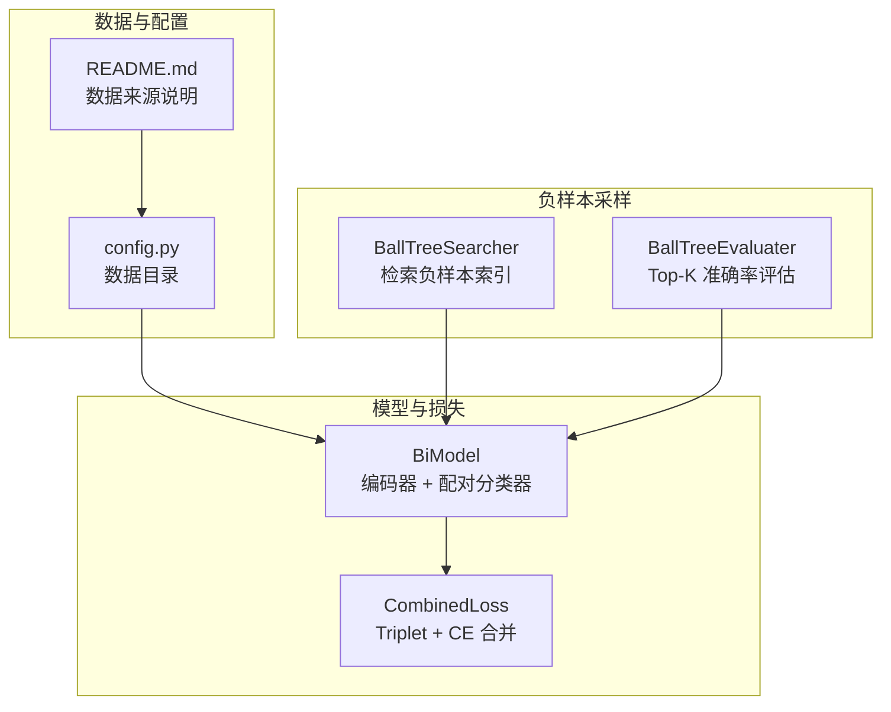
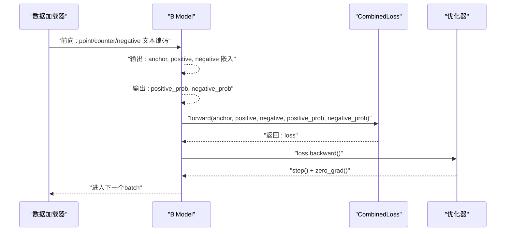
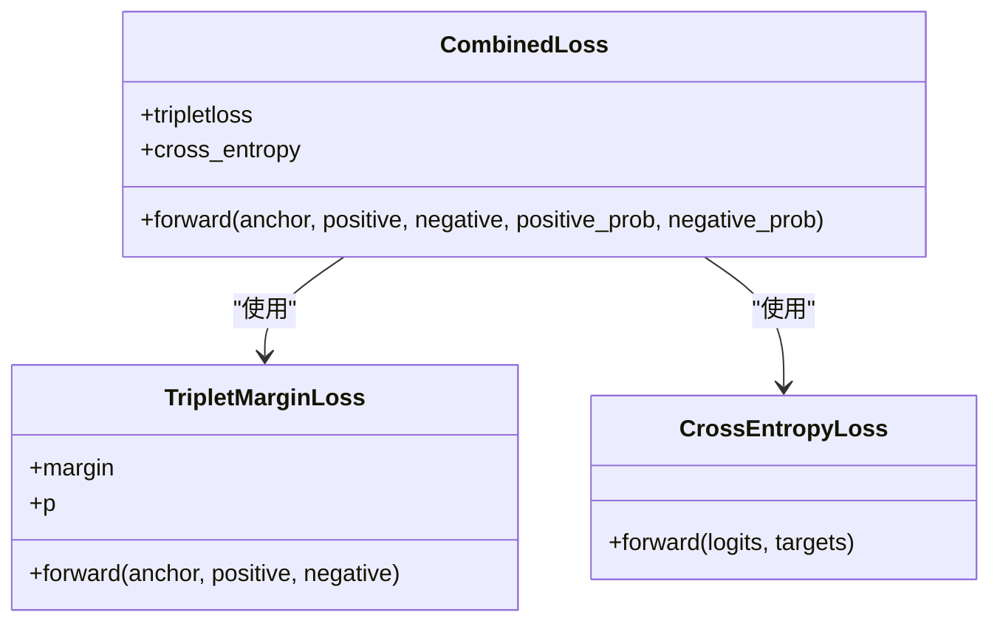
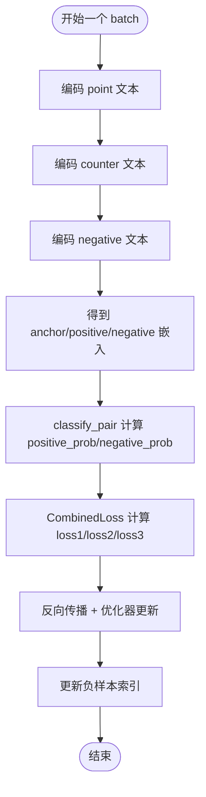
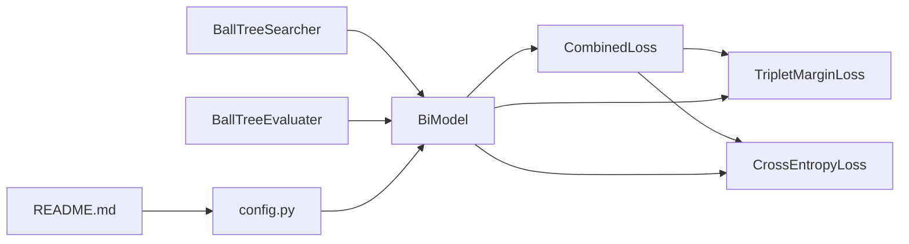

# 组合损失函数

<cite>
**本文引用的文件**
- [bert/biencoder/biencoder_embedding_classification_concanated_together.py](file://bert/biencoder/biencoder_embedding_classification_concanated_together.py)
- [bert/negative_embedding_sampler.py](file://bert/negative_embedding_sampler.py)
- [config.py](file://config.py)
- [README.md](file://README.md)
</cite>

## 目录
1. [引言](#引言)
2. [项目结构](#项目结构)
3. [核心组件](#核心组件)
4. [架构总览](#架构总览)
5. [详细组件分析](#详细组件分析)
6. [依赖关系分析](#依赖关系分析)
7. [性能考量](#性能考量)
8. [故障排查指南](#故障排查指南)
9. [结论](#结论)
10. [附录](#附录)

## 引言
本文件围绕 CombinedLoss 类的实现机制展开，系统阐述其如何将 Triplet Margin Loss 与 CrossEntropy Loss 结合，解释 Triplet Loss 在对比学习中“拉近正样本对、推远负样本对”的作用，以及 CrossEntropy Loss 如何指导模型对正负样本对进行二分类。文档还分析损失函数中的三个子损失项（loss1、loss2、loss3）的计算逻辑与权重平衡策略，结合代码路径说明 anchor、positive、negative 嵌入向量的来源及 positive_prob、negative_prob 的分类输出，并给出实际训练中损失值变化趋势的解读方法，讨论 margin 参数与学习率对收敛的影响。

## 项目结构
该项目采用模块化组织，围绕 BiEncoder 架构与负样本采样策略构建对比学习与二分类联合训练流程：
- 模型与损失：BiModel 提供编码器与配对分类器；CombinedLoss 将三部分损失合并。
- 负样本采样：BallTreeSearcher 基于嵌入空间检索负样本索引；BallTreeEvaluater 评估检索质量。
- 数据与配置：config.py 定义数据目录；README.md 简述数据来源。

图表来源
- [bert/biencoder/biencoder_embedding_classification_concanated_together.py](file://bert/biencoder/biencoder_embedding_classification_concanated_together.py#L47-L140)
- [bert/negative_embedding_sampler.py](file://bert/negative_embedding_sampler.py#L1-L92)
- [config.py](file://config.py#L1-L11)
- [README.md](file://README.md#L1-L7)

章节来源
- [bert/biencoder/biencoder_embedding_classification_concanated_together.py](file://bert/biencoder/biencoder_embedding_classification_concanated_together.py#L47-L140)
- [bert/negative_embedding_sampler.py](file://bert/negative_embedding_sampler.py#L1-L92)
- [config.py](file://config.py#L1-L11)
- [README.md](file://README.md#L1-L7)

## 核心组件
- CombinedLoss：封装 Triplet Margin Loss 与 CrossEntropy Loss，按输入的 anchor、positive、negative 与正负样本的分类概率输出，分别计算三部分损失并求和。
- BiModel：BERT 编码器 + 线性层，输出两组嵌入；提供 classify_pair 方法将四维嵌入拼接后送入分类头，得到正负样本对的分类概率。
- BallTreeSearcher/BallTreeEvaluater：基于 BallTree 的负样本检索与 Top-K 准确率评估工具。

章节来源
- [bert/biencoder/biencoder_embedding_classification_concanated_together.py](file://bert/biencoder/biencoder_embedding_classification_concanated_together.py#L47-L140)
- [bert/negative_embedding_sampler.py](file://bert/negative_embedding_sampler.py#L1-L92)

## 架构总览
训练流程概览如下：数据加载 -> BERT 编码 -> 计算 anchor/positive/negative 嵌入 -> 分类器输出 positive_prob/negative_prob -> CombinedLoss 计算三部分损失 -> 反向传播更新参数 -> 更新负样本索引 -> 评估指标。

图表来源
- [bert/biencoder/biencoder_embedding_classification_concanated_together.py](file://bert/biencoder/biencoder_embedding_classification_concanated_together.py#L147-L174)

章节来源
- [bert/biencoder/biencoder_embedding_classification_concanated_together.py](file://bert/biencoder/biencoder_embedding_classification_concanated_together.py#L147-L174)

## 详细组件分析

### CombinedLoss 类实现与三部分损失
CombinedLoss 将三部分损失相加作为最终损失：
- loss1：Triplet Margin Loss，衡量 anchor 与 positive 的距离小于 negative 的距离，且差距至少为 margin。
- loss2：CrossEntropy Loss，监督 positive_prob 对应标签为正样本（全为 1）。
- loss3：CrossEntropy Loss，监督 negative_prob 对应标签为负样本（全为 0）。
- 最终 loss = loss1 + loss2 + loss3。

图表来源
- [bert/biencoder/biencoder_embedding_classification_concanated_together.py](file://bert/biencoder/biencoder_embedding_classification_concanated_together.py#L129-L140)

章节来源
- [bert/biencoder/biencoder_embedding_classification_concanated_together.py](file://bert/biencoder/biencoder_embedding_classification_concanated_together.py#L129-L140)

### Triplet Margin Loss 在对比学习中的作用
- 目标：在嵌入空间中，使 anchor 与 positive 的距离尽可能小于 anchor 与 negative 的距离，且差距至少为 margin。
- 在本实现中，anchor、positive、negative 分别来自 BiModel 的两组嵌入输出，用于对比学习约束。
- 该损失有助于模型学习更具判别性的嵌入表示，提升后续检索与分类任务的性能。

章节来源
- [bert/biencoder/biencoder_embedding_classification_concanated_together.py](file://bert/biencoder/biencoder_embedding_classification_concanated_together.py#L129-L140)

### CrossEntropy Loss 的二分类指导
- positive_prob 来自 BiModel.classify_pair 对 anchor 与 positive 的配对特征拼接后的分类头输出，经 Softmax 得到正样本概率。
- negative_prob 来自 BiModel.classify_pair 对 anchor 与 negative 的配对特征拼接后的分类头输出，经 Softmax 得到正样本概率。
- loss2 使用 positive_prob 与全 1 标签进行交叉熵，鼓励模型将正样本对判定为正类。
- loss3 使用 negative_prob 与全 0 标签进行交叉熵，鼓励模型将负样本对判定为负类。

章节来源
- [bert/biencoder/biencoder_embedding_classification_concanated_together.py](file://bert/biencoder/biencoder_embedding_classification_concanated_together.py#L164-L167)
- [bert/negative_embedding_sampler.py](file://bert/negative_embedding_sampler.py#L80-L92)

### anchor、positive、negative 嵌入向量的来源
- anchor：point 文本经 BiModel 编码得到的嵌入。
- positive：counter 文本经 BiModel 编码得到的嵌入。
- negative：从负样本集合中通过 BallTreeSearcher 检索得到的嵌入。
- 这些嵌入随后被传入 CombinedLoss，参与 Triplet Loss 与分类损失的计算。

图表来源
- [bert/biencoder/biencoder_embedding_classification_concanated_together.py](file://bert/biencoder/biencoder_embedding_classification_concanated_together.py#L151-L174)
- [bert/negative_embedding_sampler.py](file://bert/negative_embedding_sampler.py#L20-L46)

章节来源
- [bert/biencoder/biencoder_embedding_classification_concanated_together.py](file://bert/biencoder/biencoder_embedding_classification_concanated_together.py#L151-L174)
- [bert/negative_embedding_sampler.py](file://bert/negative_embedding_sampler.py#L20-L46)

### 三部分损失的计算逻辑与权重平衡策略
- loss1（Triplet Margin Loss）：直接使用 TripletMarginLoss 计算 anchor、positive、negative 的三元组损失。
- loss2（正样本分类损失）：对 positive_prob 使用全 1 标签，鼓励模型将正样本对判定为正类。
- loss3（负样本分类损失）：对 negative_prob 使用全 0 标签，鼓励模型将负样本对判定为负类。
- 当前实现中未对三部分损失施加显式权重系数，直接相加。若需平衡三者影响，可在 forward 中引入可学习或固定权重因子。

章节来源
- [bert/biencoder/biencoder_embedding_classification_concanated_together.py](file://bert/biencoder/biencoder_embedding_classification_concanated_together.py#L129-L140)

### 负样本检索与动态更新
- BallTreeSearcher 基于 point 与 counter 的嵌入分别构建 BallTree，按一定随机率选择正负样本，避免过拟合。
- 训练过程中定期重新检索负样本索引，以适应模型参数的变化。
- BallTreeEvaluater 通过 Top-K 检索与概率阈值评估，辅助监控训练效果。

章节来源
- [bert/negative_embedding_sampler.py](file://bert/negative_embedding_sampler.py#L13-L46)
- [bert/biencoder/biencoder_embedding_classification_concanated_together.py](file://bert/biencoder/biencoder_embedding_classification_concanated_together.py#L175-L204)
- [bert/negative_embedding_sampler.py](file://bert/negative_embedding_sampler.py#L48-L92)

## 依赖关系分析
- CombinedLoss 依赖 PyTorch 的 TripletMarginLoss 与 CrossEntropyLoss。
- BiModel 依赖 Transformers 的 BERT 模型与线性层，负责编码与配对分类。
- 负样本采样依赖 scikit-learn 的 BallTree，用于高效检索最近邻。
- 数据路径由 config.py 提供，README.md 指明数据来源。

图表来源
- [bert/biencoder/biencoder_embedding_classification_concanated_together.py](file://bert/biencoder/biencoder_embedding_classification_concanated_together.py#L129-L140)
- [bert/negative_embedding_sampler.py](file://bert/negative_embedding_sampler.py#L1-L92)
- [config.py](file://config.py#L1-L11)
- [README.md](file://README.md#L1-L7)

章节来源
- [bert/biencoder/biencoder_embedding_classification_concanated_together.py](file://bert/biencoder/biencoder_embedding_classification_concanated_together.py#L129-L140)
- [bert/negative_embedding_sampler.py](file://bert/negative_embedding_sampler.py#L1-L92)
- [config.py](file://config.py#L1-L11)
- [README.md](file://README.md#L1-L7)

## 性能考量
- 训练初期：Triplet Loss 可能主导，导致 loss1 较大；随着嵌入空间收敛，loss2/loss3 会逐步稳定。
- 正则化与稳定性：Triplet Loss 对 margin 敏感，margin 过小易欠分离，过大易欠收敛；建议在验证集上调参。
- 学习率：较大的学习率可能加速收敛但不稳定，较小的学习率更稳健但收敛慢。建议从较小学习率开始，观察 loss 曲线再调整。
- 负样本多样性：BallTreeSearcher 的随机率控制负样本多样性，过高可能导致噪声，过低可能欠泛化。可随训练轮次递减随机率。
- 批大小与梯度累积：适当增大批大小可提升稳定性，但需考虑显存限制。

## 故障排查指南
- 损失爆炸或 NaN：检查学习率是否过大；确认输入 embedding 是否存在异常值；检查 Triplet Loss 的 margin 设置是否合理。
- 收敛停滞：尝试降低学习率；增加负样本随机率；检查分类头输出是否饱和（softmax 输出接近 0 或 1）。
- 负样本检索质量差：检查 BallTree 构建与查询参数；确认嵌入维度与归一化策略；评估 BallTreeEvaluater 的 Top-K 准确率。
- 数据不平衡：若正样本过多或过少，可调整分类损失的权重或采样策略。

章节来源
- [bert/biencoder/biencoder_embedding_classification_concanated_together.py](file://bert/biencoder/biencoder_embedding_classification_concanated_together.py#L147-L174)
- [bert/negative_embedding_sampler.py](file://bert/negative_embedding_sampler.py#L20-L46)

## 结论
CombinedLoss 通过将 Triplet Margin Loss 与 CrossEntropy Loss 结合，既强化了对比学习中的嵌入判别能力，又提供了二分类的监督信号。anchor、positive、negative 嵌入来源于 BiModel 的编码输出，positive_prob 与 negative_prob 则由配对分类器输出。训练过程中，loss1、loss2、loss3 的相对贡献取决于模型状态与超参数设置。通过合理设置 margin 与学习率，并动态更新负样本索引，可有效提升模型在检索与分类任务上的表现。

## 附录
- 代码路径参考
  - CombinedLoss 定义与 forward 实现：[bert/biencoder/biencoder_embedding_classification_concanated_together.py](file://bert/biencoder/biencoder_embedding_classification_concanated_together.py#L129-L140)
  - BiModel 编码与分类器实现：[bert/biencoder/biencoder_embedding_classification_concanated_together.py](file://bert/biencoder/biencoder_embedding_classification_concanated_together.py#L47-L80)
  - 训练循环与损失计算调用：[bert/biencoder/biencoder_embedding_classification_concanated_together.py](file://bert/biencoder/biencoder_embedding_classification_concanated_together.py#L147-L174)
  - 负样本检索与评估：[bert/negative_embedding_sampler.py](file://bert/negative_embedding_sampler.py#L13-L46), [bert/negative_embedding_sampler.py](file://bert/negative_embedding_sampler.py#L48-L92)
  - 数据目录配置：[config.py](file://config.py#L1-L11)
  - 数据来源说明：[README.md](file://README.md#L1-L7)