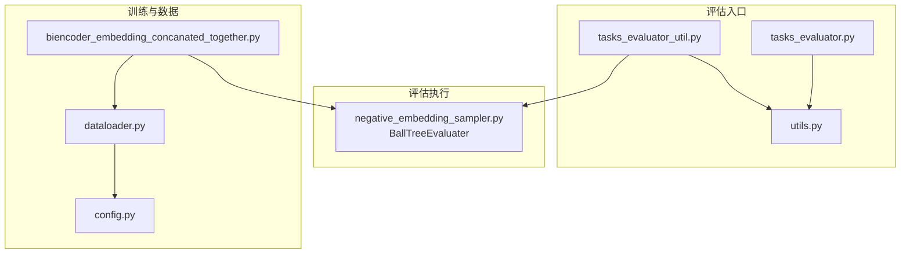
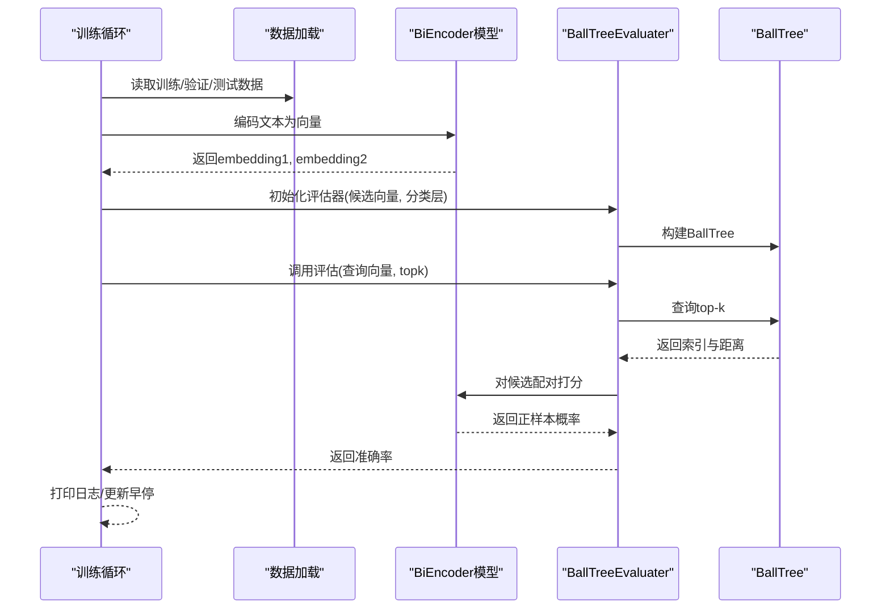
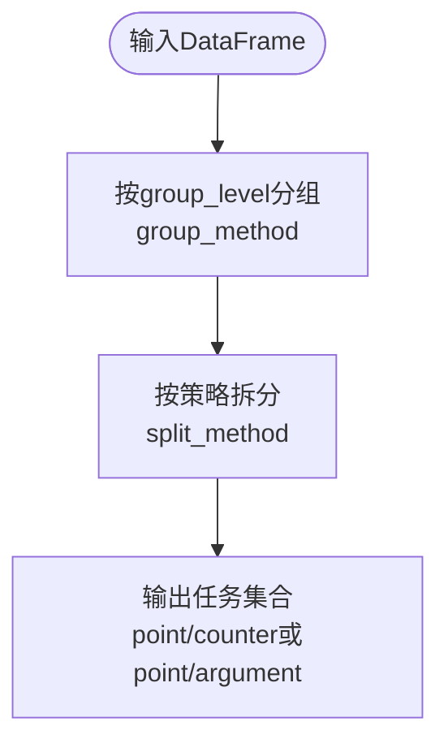
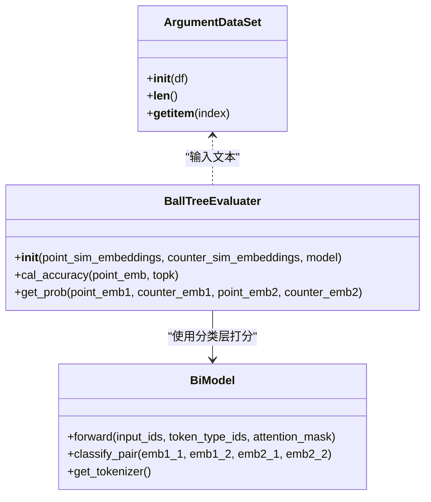
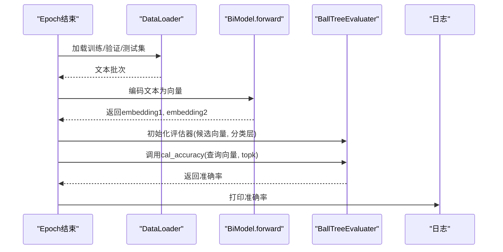
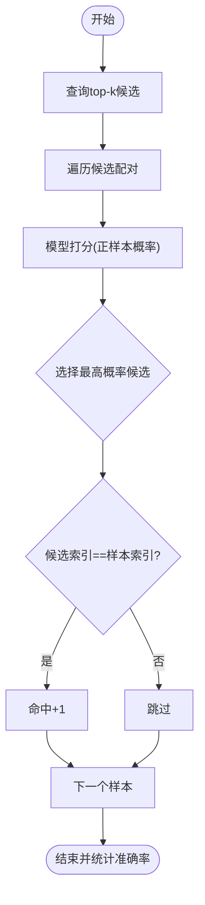
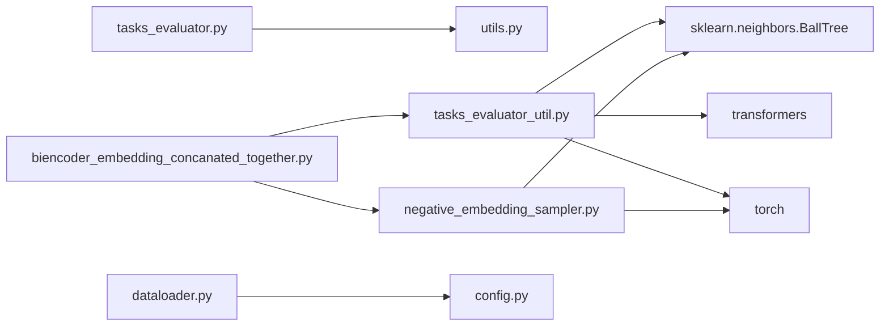

# 多任务评估集成

<cite>
**本文引用的文件**
- [bert/tasks_evaluator.py](file://bert/tasks_evaluator.py)
- [bert/tasks_evaluator_util.py](file://bert/tasks_evaluator_util.py)
- [bert/negative_embedding_sampler.py](file://bert/negative_embedding_sampler.py)
- [utils.py](file://utils.py)
- [dataloader.py](file://dataloader.py)
- [config.py](file://config.py)
- [bert/biencoder/biencoder_embedding_concanated_together.py](file://bert/biencoder/biencoder_embedding_concanated_together.py)
</cite>

## 目录
1. [引言](#引言)
2. [项目结构](#项目结构)
3. [核心组件](#核心组件)
4. [架构总览](#架构总览)
5. [详细组件分析](#详细组件分析)
6. [依赖关系分析](#依赖关系分析)
7. [性能考量](#性能考量)
8. [故障排查指南](#故障排查指南)
9. [结论](#结论)
10. [附录](#附录)

## 引言
本文件系统性阐述训练过程中多任务评估的集成方式，重点解析 tasks_evaluator.py 如何在训练间隙调用 BallTreeEvaluater 对模型进行性能验证；说明评估任务的分组逻辑（sdoc、sdoa、sdc、sda、stc、sta、epc、epa）；解释如何基于向量相似度计算 top-k 检索准确率；描述评估结果如何反馈至训练流程以判断模型收敛或触发早停；并结合实际代码展示评估数据集的加载、向量编码、BallTree 构建与查询的完整流程。最后给出评估结果日志格式说明与性能瓶颈分析方法（如高维向量检索的耗时优化建议）。

## 项目结构
该项目围绕“论点反驳检索”任务构建，包含数据加载、模型训练、负样本采样与评估等模块。与多任务评估直接相关的关键文件如下：
- 评估入口与分组：bert/tasks_evaluator.py、bert/tasks_evaluator_util.py、utils.py
- 评估执行器：bert/negative_embedding_sampler.py 中的 BallTreeEvaluater
- 训练与评估集成：bert/biencoder/biencoder_embedding_concanated_together.py
- 数据加载：dataloader.py、config.py

图表来源
- [bert/tasks_evaluator.py](file://bert/tasks_evaluator.py#L1-L37)
- [bert/tasks_evaluator_util.py](file://bert/tasks_evaluator_util.py#L1-L101)
- [bert/negative_embedding_sampler.py](file://bert/negative_embedding_sampler.py#L48-L92)
- [bert/biencoder/biencoder_embedding_concanated_together.py](file://bert/biencoder/biencoder_embedding_concanated_together.py#L1-L280)
- [dataloader.py](file://dataloader.py#L1-L87)
- [config.py](file://config.py#L1-L11)

章节来源
- [bert/tasks_evaluator.py](file://bert/tasks_evaluator.py#L1-L37)
- [bert/tasks_evaluator_util.py](file://bert/tasks_evaluator_util.py#L1-L101)
- [bert/negative_embedding_sampler.py](file://bert/negative_embedding_sampler.py#L1-L92)
- [bert/biencoder/biencoder_embedding_concanated_together.py](file://bert/biencoder/biencoder_embedding_concanated_together.py#L1-L280)
- [dataloader.py](file://dataloader.py#L1-L87)
- [config.py](file://config.py#L1-L11)

## 核心组件
- 评估入口与分组
  - tasks_evaluator.py：定义分组函数 get_tasks_data，按 sdoc、sdoa、sdc、sda、stc、sta、epc、epa 八类任务对 DataFrame 进行分组与拆分。
  - tasks_evaluator_util.py：提供 ArgumentDataSet、extract_embedding、BallTreeEvaluater 的实现，支撑向量化与评估。
  - utils.py：提供 group_and_split 及多种分组/拆分策略（opposing debate、debate、theme、entire portal 等），用于生成不同粒度的任务集合。
- 评估执行器
  - negative_embedding_sampler.py 中的 BallTreeEvaluater：封装 BallTree 构建、查询与排序打分，计算 top-k 检索准确率。
- 训练与评估集成
  - biencoder_embedding_concanated_together.py：在每个 epoch 结束后，对训练集、验证集、测试集分别抽取向量，构建 BallTree 并调用评估器计算准确率，打印日志。

章节来源
- [bert/tasks_evaluator.py](file://bert/tasks_evaluator.py#L1-L37)
- [bert/tasks_evaluator_util.py](file://bert/tasks_evaluator_util.py#L1-L101)
- [utils.py](file://utils.py#L259-L304)
- [bert/negative_embedding_sampler.py](file://bert/negative_embedding_sampler.py#L48-L92)
- [bert/biencoder/biencoder_embedding_concanated_together.py](file://bert/biencoder/biencoder_embedding_concanated_together.py#L147-L280)

## 架构总览
多任务评估在训练间隙执行，流程如下：
- 数据准备：从训练/验证/测试数据集中读取文本，使用模型编码为向量。
- 向量组织：将正样本与反样本向量拼接，构建统一的候选集合。
- BallTree 构建：对候选集合建立 BallTree，用于高效 top-k 查询。
- 评估计算：对每个样本，查询其 top-k 候选，通过分类层打分，选择概率最高的配对作为检索结果，统计命中率。
- 结果输出：打印准确率日志，供训练流程监控收敛与早停。

图表来源
- [bert/biencoder/biencoder_embedding_concanated_together.py](file://bert/biencoder/biencoder_embedding_concanated_together.py#L147-L280)
- [bert/negative_embedding_sampler.py](file://bert/negative_embedding_sampler.py#L48-L92)

## 详细组件分析

### 评估任务分组逻辑（sdoc、sdoa、sdc、sda、stc、sta、epc、epa）
- 分组与拆分
  - group_and_split：根据 group_level 选择分组键（如 domain、argumentation_title、stance 等），再调用对应拆分策略，生成 point 与 counter 或 argument 的配对集合。
  - 支持的分组键包括：
    - sdoc：按 domain、argumentation_title、stance 分组
    - sdoa：按 domain、argumentation_title 分组
    - sdc：按 domain、argumentation_title 分组
    - sda：按 domain、argumentation_title 分组
    - stc：按 domain 分组
    - sta：按 domain 分组
    - epc：无分组键（全数据）
    - epa：无分组键（全数据）
- 拆分策略
  - opposing debate、debate、theme、entire portal 等策略确保同一 utterence_id 下的 point 与 counter 匹配，或在同一主题/立场下的 argument 配对，从而形成多任务评估样本。

图表来源
- [utils.py](file://utils.py#L259-L304)

章节来源
- [utils.py](file://utils.py#L259-L304)

### 评估数据集加载、向量编码、BallTree 构建与查询
- 数据加载
  - dataloader.py 读取训练/验证/测试目录，解析文件路径中的领域、主题、立场、轮次类型等元信息，构造 DataFrame。
- 向量编码
  - tasks_evaluator_util.py 提供 extract_embedding：将 DataFrame 文本批量编码为 embedding1 与 embedding2，并写回 DataFrame。
- BallTree 构建与查询
  - negative_embedding_sampler.py 中的 BallTreeEvaluater：
    - 构造函数：合并候选向量与待评估向量，构建 BallTree。
    - cal_accuracy：对每个样本查询 top-k 候选，通过模型分类层打分，选择概率最高的候选作为检索结果，统计命中率。
    - get_prob：对候选配对进行打分，返回正样本概率。

图表来源
- [bert/tasks_evaluator_util.py](file://bert/tasks_evaluator_util.py#L26-L56)
- [bert/negative_embedding_sampler.py](file://bert/negative_embedding_sampler.py#L48-L92)
- [bert/biencoder/biencoder_embedding_concanated_together.py](file://bert/biencoder/biencoder_embedding_concanated_together.py#L48-L80)

章节来源
- [dataloader.py](file://dataloader.py#L1-L87)
- [bert/tasks_evaluator_util.py](file://bert/tasks_evaluator_util.py#L26-L56)
- [bert/negative_embedding_sampler.py](file://bert/negative_embedding_sampler.py#L48-L92)
- [bert/biencoder/biencoder_embedding_concanated_together.py](file://bert/biencoder/biencoder_embedding_concanated_together.py#L48-L80)

### 在训练间隙调用评估器（tasks_evaluator.py 与 biencoder 集成）
- tasks_evaluator.py
  - 定义 get_tasks_data：对 DataFrame 按 sdoc、sdoa、sdc、sda、stc、sta、epc、epa 八类进行分组与拆分，返回任务字典。
- 训练集成（biencoder_embedding_concanated_together.py）
  - 每个 epoch 结束后：
    - 使用 DataLoader 加载训练/验证/测试集，对每条样本调用模型编码得到 embedding1 与 embedding2。
    - 将所有样本向量拼接为 point_sim_embeddings 与 counter_sim_embeddings。
    - 构造 BallTreeEvaluater，调用 cal_accuracy 计算 top-k 准确率。
    - 打印准确率日志，用于监控收敛与早停。

图表来源
- [bert/tasks_evaluator.py](file://bert/tasks_evaluator.py#L24-L37)
- [bert/biencoder/biencoder_embedding_concanated_together.py](file://bert/biencoder/biencoder_embedding_concanated_together.py#L147-L280)
- [bert/negative_embedding_sampler.py](file://bert/negative_embedding_sampler.py#L48-L92)

章节来源
- [bert/tasks_evaluator.py](file://bert/tasks_evaluator.py#L24-L37)
- [bert/biencoder/biencoder_embedding_concanated_together.py](file://bert/biencoder/biencoder_embedding_concanated_together.py#L147-L280)
- [bert/negative_embedding_sampler.py](file://bert/negative_embedding_sampler.py#L48-L92)

### 基于向量相似度的 top-k 检索准确率计算
- top-k 查询：对每个样本，使用 BallTree 查询其 top-k 最近邻候选。
- 排序打分：对候选配对调用模型的 classify_pair 层，得到正样本概率。
- 命中判定：选择概率最高的候选，若索引等于样本自身，则计为正确命中。
- 准确率统计：正确命中数除以总样本数。

图表来源
- [bert/negative_embedding_sampler.py](file://bert/negative_embedding_sampler.py#L61-L91)

章节来源
- [bert/negative_embedding_sampler.py](file://bert/negative_embedding_sampler.py#L61-L91)

### 评估结果反馈至训练流程（收敛判断与早停）
- 日志输出：训练脚本在每个 epoch 结束后打印“训练集/验证集/测试集 top-k 准确率”，便于观察模型性能变化。
- 收敛判断：当验证集准确率连续若干轮未提升时，可视为收敛，停止训练。
- 早停策略：可设置最大等待轮数，若超过阈值则提前终止，保存最佳模型参数。

章节来源
- [bert/biencoder/biencoder_embedding_concanated_together.py](file://bert/biencoder/biencoder_embedding_concanated_together.py#L205-L208)
- [bert/biencoder/biencoder_embedding_concanated_together.py](file://bert/biencoder/biencoder_embedding_concanated_together.py#L236-L242)
- [bert/biencoder/biencoder_embedding_concanated_together.py](file://bert/biencoder/biencoder_embedding_concanated_together.py#L271-L277)

## 依赖关系分析
- 组件耦合
  - tasks_evaluator.py 依赖 utils.group_and_split 实现任务分组。
  - tasks_evaluator_util.py 依赖 transformers 与 sklearn 的 BallTree，负责向量化与评估。
  - negative_embedding_sampler.py 的 BallTreeEvaluater 依赖模型的 classify_pair 层进行打分。
  - 训练脚本 biencoder_embedding_concanated_together.py 串联数据加载、模型编码与评估器调用。
- 外部依赖
  - transformers：BERT 分词与编码。
  - scikit-learn：BallTree 构建与查询。
  - torch：模型前向与打分。

图表来源
- [bert/tasks_evaluator.py](file://bert/tasks_evaluator.py#L1-L37)
- [bert/tasks_evaluator_util.py](file://bert/tasks_evaluator_util.py#L1-L101)
- [bert/negative_embedding_sampler.py](file://bert/negative_embedding_sampler.py#L1-L92)
- [bert/biencoder/biencoder_embedding_concanated_together.py](file://bert/biencoder/biencoder_embedding_concanated_together.py#L1-L280)
- [dataloader.py](file://dataloader.py#L1-L87)
- [config.py](file://config.py#L1-L11)

章节来源
- [bert/tasks_evaluator.py](file://bert/tasks_evaluator.py#L1-L37)
- [bert/tasks_evaluator_util.py](file://bert/tasks_evaluator_util.py#L1-L101)
- [bert/negative_embedding_sampler.py](file://bert/negative_embedding_sampler.py#L1-L92)
- [bert/biencoder/biencoder_embedding_concanated_together.py](file://bert/biencoder/biencoder_embedding_concanated_together.py#L1-L280)
- [dataloader.py](file://dataloader.py#L1-L87)
- [config.py](file://config.py#L1-L11)

## 性能考量
- 向量维度与检索效率
  - 高维向量会增加 BallTree 查询与距离计算的开销。建议在编码阶段进行降维（如线性投影至 128 维）或采用更高效的索引（如 FAISS）替代 BallTree。
- 批处理与 GPU 利用
  - 向量化过程应使用 DataLoader 批量处理，充分利用 GPU 并减少 CPU-GPU 数据传输开销。
- top-k 设置
  - top-k 过大将显著增加打分次数。可在保证召回的前提下适当降低 top-k，或采用近似最近邻搜索。
- 评估频率
  - 在训练初期可降低评估频率（如每 N 个 epoch 评估一次），以平衡评估成本与监控效果。
- 内存占用
  - 合并候选向量与待评估向量时注意内存峰值，必要时分批评估或使用稀疏存储。

[本节为通用性能建议，无需具体文件来源]

## 故障排查指南
- 评估准确率为 0 或异常低
  - 检查向量编码是否成功（确认 embedding1、embedding2 是否为空）。
  - 检查 BallTree 构建时的候选集合是否包含有效向量。
  - 检查 classify_pair 层的输入维度与设备（GPU/CPU）一致性。
- 训练脚本无法加载数据
  - 确认 config.py 中的数据目录路径正确，且 dataloader.py 能读取到文件。
- 评估日志缺失
  - 确认训练脚本在每个 epoch 结束后确实调用了评估器并打印了准确率。

章节来源
- [bert/biencoder/biencoder_embedding_concanated_together.py](file://bert/biencoder/biencoder_embedding_concanated_together.py#L147-L280)
- [dataloader.py](file://dataloader.py#L1-L87)
- [config.py](file://config.py#L1-L11)

## 结论
本项目通过 tasks_evaluator.py 与 tasks_evaluator_util.py 实现多任务评估的分组与执行，借助 negative_embedding_sampler.py 的 BallTreeEvaluater 在训练间隙对模型进行 top-k 检索准确率评估。评估流程涵盖数据加载、向量编码、BallTree 构建与查询、打分与命中统计，并将结果以日志形式反馈到训练流程，用于监控收敛与早停。通过合理设置评估频率、优化向量维度与索引策略，可有效提升评估效率与稳定性。

[本节为总结性内容，无需具体文件来源]

## 附录
- 评估结果日志格式
  - 训练集/验证集/测试集的“Top-k 准确率”数值，例如“训练集 top-k 准确率为 X.XX%”。该格式便于对比不同任务与不同 epoch 的性能变化。
- 评估数据集加载与向量编码步骤
  - 读取数据：使用 dataloader.py 读取训练/验证/测试目录，构造 DataFrame。
  - 编码向量：使用 extract_embedding 对文本进行批量编码，得到 embedding1 与 embedding2。
  - 构建与查询：使用 BallTreeEvaluater 构建 BallTree，查询 top-k 候选并打分，统计命中率。

章节来源
- [bert/biencoder/biencoder_embedding_concanated_together.py](file://bert/biencoder/biencoder_embedding_concanated_together.py#L147-L280)
- [bert/tasks_evaluator_util.py](file://bert/tasks_evaluator_util.py#L26-L56)
- [dataloader.py](file://dataloader.py#L1-L87)